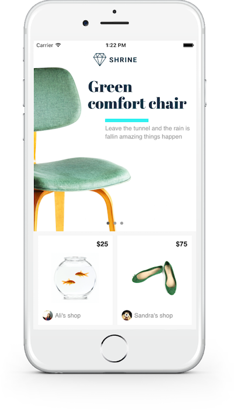

# Material Components for iOS



[](https://travis-ci.org/material-components/material-components-ios)
[](https://codecov.io/gh/material-components/material-components-ios/branch/develop)
[](https://discord.gg/material-components)

Material Components for iOS (MDC-iOS) helps developers execute [Material Design](https://material.io). Developed by a core team of engineers and UX designers at Google, these components enable a reliable development workflow to build beautiful and functional iOS apps. Learn more about how Material Components for iOS supports design and usability best practices across platforms in the  [Material Design Platform Adaptation guidelines](https://material.io/guidelines/platforms/platform-adaptation.html).

Material Components for iOS are written in Objective-C and support Swift and Interface Builder.

## Useful Links

- [How To Use MDC-iOS](docs/)
- [All Components](components/)
- [Demo Apps](demos/)
- [Contributing](contributing/)
- [MDC-iOS on Stack Overflow](https://www.stackoverflow.com/questions/tagged/material-components+ios) (external site)
- [Material.io](https://material.io) (external site)
- [Material Design Guidelines](https://material.io/guidelines) (external site)
- [Checklist status spreadsheet](https://docs.google.com/spreadsheets/d/e/2PACX-1vRQLFMuo0Q3xsJp1_TdWvImtfdc8dU0lqX2DTct5pOPAEUIrN9OsuPquvv4aKRAwKK_KItpGs7c4Fok/pubhtml)
- [Discord Chat Room](https://discord.gg/material-components)


## Trying out Material Components

Our [catalog](catalog/) showcases Material Components. You can use the `pod try` command from anywhere on your machine to try the components, even if you haven't checked out the repo yet:

```bash
pod try MaterialComponents
```

In case you have already checked out the repo, run the following command:

```bash
pod install --project-directory=catalog/
```

If you want to take a look at the implementation of the components, you can find the code inside the `Development Pods` folder.
Use `cmd-1` to open the project navigator within Xcode. Peal open the `Pods` project and inside the `Development Pods` folder you will find the component source code.

## Installation

### Requirements

- Xcode 8.0 or higher.
- Minimum iOS deployment target of 8.0 or higher
- Cocoapods

### Getting Started with a New Project

Check out our [tutorial](docs/tutorial) for a step-by-step guide to setting up a new project using Material Components.

### Adding Material Components to an Existing Project

[CocoaPods](https://cocoapods.org/) is the easiest way to get started (if you're new to CocoaPods,
check out their [getting started documentation](https://guides.cocoapods.org/using/getting-started.html).)

To install CocoaPods, run the following commands:

```bash
sudo gem install cocoapods
```

To integrate Material Components in your existing application, first create a new Podfile:

```bash
cd your-project-directory
pod init
```

Next, add the
[Material Components for iOS pod](https://cocoapods.org/pods/MaterialComponents)
to your target in your Podfile:

```ruby
target "MyApp" do
  ...
  pod 'MaterialComponents'
end
```

If you are using Swift, don’t forget to uncomment the `use_frameworks!` line
at the top of your Podfile.

Then run the command:

```bash
pod install
```

Now you're ready to get started in Xcode. Don't forget to open the workspace Cocoapods created for you instead of the original project:

```bash
open your-project.xcworkspace
```

### Usage

The components are built upon familiar UIKit classes and can be added to a view with just a couple of lines. Simply import the Material Components header for the component you're interested in, and add it to your view.

#### Swift

```swift
import MaterialComponents.MaterialButtons

class ViewController: UIViewController {

    override func viewDidLoad() {
        super.viewDidLoad()
        let raisedButton = MDCRaisedButton()
        raisedButton.setTitle("Raised Button", for: .normal)
        raisedButton.sizeToFit()
        raisedButton.addTarget(self, action: #selector(tapped), for: .touchUpInside)
        view.addSubview(raisedButton)
    }

    @objc func tapped(sender: UIButton){
        print("Button was tapped!")
    }

}
```

#### Objective-C

```objc
#import "MaterialButtons.h"

@implementation ViewController

- (void)viewDidLoad {
  [super viewDidLoad];

  MDCRaisedButton *raisedButton = [[MDCRaisedButton alloc] init];
  [raisedButton setTitle:@"Raised Button" forState:UIControlStateNormal];
  [raisedButton sizeToFit];
  [raisedButton addTarget:self
                   action:@selector(tapped:)
         forControlEvents:UIControlEventTouchUpInside];

  [self.view addSubview:raisedButton];
}

- (void)tapped:(id)sender {
  NSLog(@"Button was tapped!");
}

@end
```

## Attributions

Material Components for iOS uses
[Material Design icons](https://github.com/google/material-design-icons),
copyright Google Inc. and licensed under
[CC BY 4.0](https://creativecommons.org/licenses/by/4.0/).

Several components use
[MDFTextAccessibility](https://github.com/material-foundation/material-text-accessibility-ios),
copyright Google Inc. and licensed under
[Apache 2.0](https://github.com/material-foundation/material-text-accessibility-ios/blob/master/LICENSE)
without a NOTICE file.

MDCCatalog uses the
[Roboto font](https://github.com/google/fonts/tree/master/apache/roboto),
copyright 2011 Google Inc. and licensed under
[Apache 2.0](https://github.com/google/fonts/blob/master/apache/roboto/LICENSE.txt)
without a NOTICE file.
