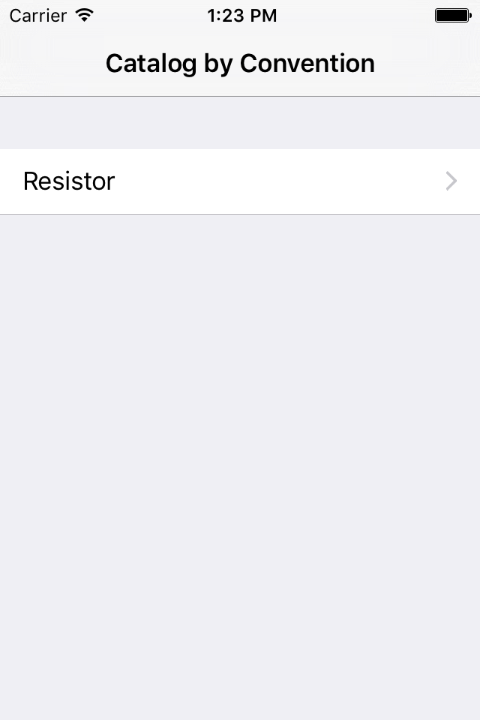
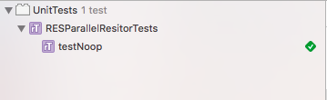
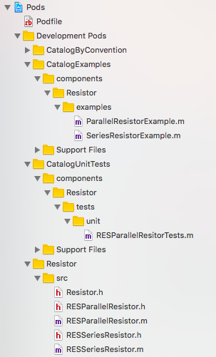

# Catalog by Convention

Catalog by Convention is a set of runtime tools and conventions designed for the development of a
collection of Objective-C and Swift "components".

## Overview

If your team works on many components simultaneously then you may find that building examples and
unit tests involves some non-trivial overhead:

- Each component likely has its own Xcode target.
- Each component will ideally have at least one example and testing target.
- Cost of switching between projects/targets/workspaces.

One solution to this problem is to create what's called a "Catalog" app. The Catalog's purpose is to
demonstrate the usage of a collection of components. A Catalog application reduces the number of
distinct Xcode targets your team has to interact with.

Your team still has to manually manage your Catalog's Xcode project, adding and updating files as
necessary. What if this could be automated?

Catalog by Convention minimizes the engineering overhead of creating **examples** and **unit tests**
via a combination of conventions and CocoaPods. Simply run `pod install` and your Catalog will
include all examples and unit tests in two easy to access targets.

The only remaining engineering burden is to actually write the example and test.

### An example

An example Catalog is located within the `example/` directory. Run pod install to set it up:

    pod install --project-directory=example/catalog/

    open example/catalog/Catalog.xcworkspace

Open the project and you'll find two targets: Catalog and UnitTests. Run the Catalog.

Our example project has just one component: Resistor. You can navigate through to this component's
examples in the application.

Now try running the unit tests. You'll see the one Resistor test appear in the unit test output.

Try adding a new example to the Resistor component.

    open example/components/Resistor/examples/

Create a new .m file and give the view controller a unique name. Run `pod install` again for your
catalog and restart the app. Your example should now be listed under Resistor.

## Setup guide

This guide will walk you through how to create a Catalog project that uses the CatalogByConvention
library.

### Step 1: Create a Catalog Xcode project

Create a typical "Single view UIKit application" with the Main storyboard deleted. The only code
you'll have in your Catalog app is your AppDelegate.

In Swift:

    import UIKit
    import CatalogByConvention

    @UIApplicationMain
    class AppDelegate: UIResponder, UIApplicationDelegate {

      var window: UIWindow?

      func application(application: UIApplication, didFinishLaunchingWithOptions launchOptions: [NSObject: AnyObject]?) -> Bool {
        self.window = UIWindow(frame: UIScreen.mainScreen().bounds)

        let rootViewController = CBCNodeListViewController(node: CBCCreateNavigationTree())
        rootViewController.title = "Catalog by Convention"

        let navController = UINavigationController(rootViewController: rootViewController)
        self.window?.rootViewController = navController

        self.window!.makeKeyAndVisible()
        return true
      }
    }

Note that our root view controller is a CBCNodeListViewController. This view controller expects a
node argument which we can initialize with `CBCCreateNavigationTree()`.

### Step 2: Plan out your component conventions

One recommendation is provided in the `example/` directory of this project.

    components/
      ComponentNameCamelCased/
        examples/
        src/
          Resistor.h
        tests/
          ui/
          unit/

### Step 3: Create the convention podspecs

Create two `podspec` files that will live alongside your components and catalog directories, like
so:

    catalog/
    components/
    CatalogExamples.podspec
    CatalogUnitTests.podspec

Place the following within `CatalogExamples.podspec`:

    Pod::Spec.new do |s|
      s.name         = "CatalogExamples"
      s.version      = "1.0.0"
      s.summary      = "Convention for catalog examples."
      s.homepage     = "https://github.com/google/catalog-by-convention"
      s.authors      = "Catalog"
      s.license      = 'Apache 2.0'
      s.source       = { :git => "https://github.com/google/catalog-by-convention.git", :tag => s.version.to_s }
      s.requires_arc = true

      # Conventions
      s.source_files = 'components/*/examples/*.{h,m,swift}'
      s.public_header_files = 'components/*/examples/*.h'
      s.resources = ['components/*/examples/resources/*']
    end

And the following within `CatalogUnitTests.podspec`:

    Pod::Spec.new do |s|
      s.name         = "CatalogUnitTests"
      s.version      = "1.0.0"
      s.summary      = "Convention specification for the catalog examples."
      s.homepage     = "https://github.com/google/catalog-by-convention"
      s.authors      = "Catalog"
      s.license      = 'Apache 2.0'
      s.source       = { :git => "https://github.com/google/catalog-by-convention.git", :tag => s.version.to_s }
      s.requires_arc = true

      # The conventions
      s.source_files = 'components/*/tests/unit/*.{h,m,swift}'
      s.resources = ['components/*/tests/unit/resources/*']
      s.framework = 'XCTest'
    end

### Step 4: Create a Podfile for your catalog

Create a `Podfile` alongside your Catalog's `xcworkspace`. You can use the following as a template,
updating the names of targets, paths, and dependencies where applicable.

    workspace 'Catalog.xcworkspace'
    project 'Catalog.xcodeproj'

    target "Catalog" do
      project 'Catalog.xcodeproj'
      # Our catalog is written in Swift, so we must import dependencies as frameworks
      use_frameworks!

      # Runtime library for loading examples
      pod 'CatalogByConvention', :path => '../../'

      # Conventions
      pod 'CatalogExamples', :path => '../'

      # Component dependencies
      pod 'Resistor', :path => '../components/Resistor'
    end

    target "UnitTests" do
      project 'UnitTests.xcodeproj'
      # Our tests may be written in Swift, so we must import dependencies as frameworks
      use_frameworks!

      # Conventions
      pod 'CatalogUnitTests', :path => '../'

      # Component dependencies
      pod 'Resistor', :path => '../components/Resistor'
    end

### Step 5: Run pod install

Run `pod install` for your Catalog. Open your Catalog's workspace.

All of your examples, unit tests, and component source code will be found within the Pods project
in your workspace.

### Step 6: Build!

From this point forward you simply need to create new example and unit test source files and they'll
be picked up on a subsequent pod install.
