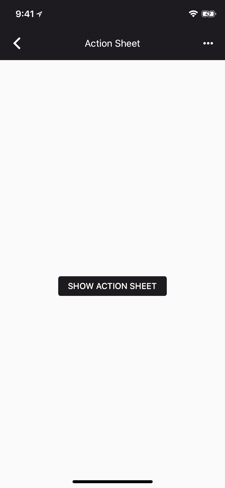
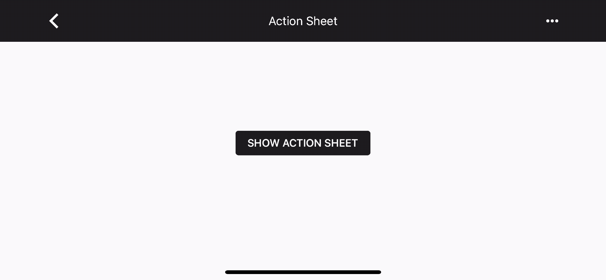

# Action Sheet

<!-- badges -->

Material design action sheets should be used as an overflow menu. An Action Sheet comes up from the bottom of
the screen and displays actions a user can take.

 

<!-- design-and-api -->

<!-- toc -->

- - -

## Overview

`MDCActionSheetController` is a material design implementation of UIAlertControllerStyleActionSheet.

Action Sheet is currently a [beta component](../../../contributing/beta_components.md). Therefore, clients that
wish to use Action Sheet in their app will need to manually clone the repo and add the code to their project. 

## Installation

- [Typical installation](../../../docs/component-installation.md)

## Usage

- [Typical use](typical-use.md)

## MDCActionSheetController vs. UIAlertControllerStyleActionSheet

MDCActionSheetController is intended to mirror a [UIAlertController](https://developer.apple.com/documentation/uikit/uialertcontroller?language=objc)
with the [UIAlertControllerStyleActionSheet](https://developer.apple.com/documentation/uikit/uialertcontrollerstyle/uialertcontrollerstyleactionsheet) style.  

#### Similarities

1. Both classes are presented from the bottom of the screen on an iPhone and have a list of actions.

2. Both classes support optional title and message properties.

#### Differences

1. UIAlertControllerActionSheetStyle requires that you set the popoverPresentationController on larger devices, 
MDCActionSheetController doesn't support popoverPresentationController but instead always comes up from the 
bottom of the screen.

2. UIAlertControllerStyleActionSheet is a style of UIAlertController and not its own class. If you need a
Material UIAlertController please see the `MDCAlertController` class. 

3. MDCActionSheetController does not support text fields.

4. MDCActionSheetController does not have a preferredAction.

- [Customization](customization.md)

## Extensions

- [Theming](theming.md)

- [Accessibility](accessibility.md)

## Unsupported

- [Color Theming](color-theming.md)
- [Typography Theming](typography-theming.md)
