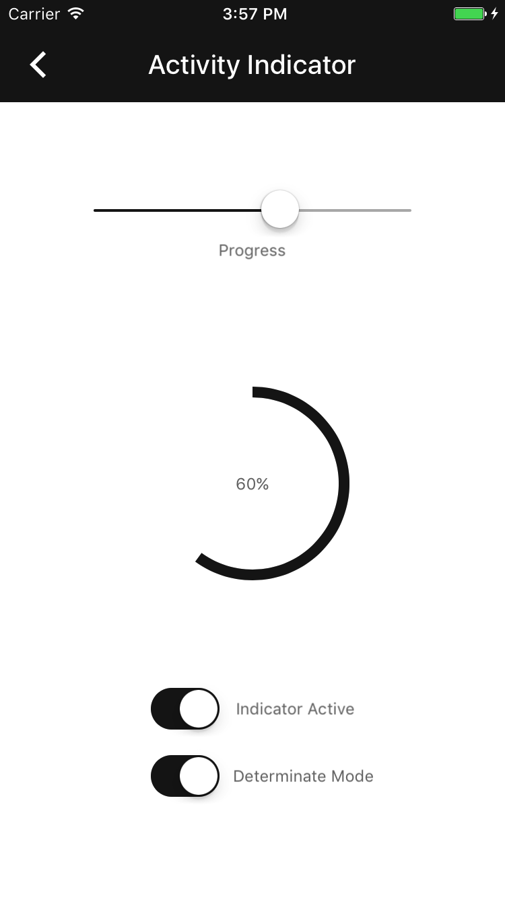

<!--docs:
title:  "Activity Indicator"
layout: detail
section: components
excerpt: "Progress and activity indicators are visual indications of an app loading content."
iconId: progress_activity
-->

# Activity Indicator

<!---->

  

<!--

  <video src="docs/assets/activity_indicator.mp4" autoplay loop></video>

-->

Activity indicators are visual indications of an app loading content. The Activity Indicator is a circular indicator that either rotates clockwise or fills to completion clockwise when displaying progress.
<!--{: .article__intro }-->

## Design & API Documentation

<ul class="icon-list">
  <li class="icon-spec"><a href="https://material.google.com/components/progress-activity.html">Progress & activity</a></li>
</ul>

- - -

## Activity Indicator Modes

### Indeterminate indicators
When indicators are indeterminate they request that the user wait while something finishes when it's not necessary to indicate how long it will take.

### Determinate indicators
When indicators are determinate they indicate how long an operation will take when the percentage complete is detectable.

- - -

## Installation

### Requirements

- Xcode 7.0 or higher.
- iOS SDK version 7.0 or higher.

### Installation with CocoaPods

To add this component to your Xcode project using CocoaPods, add the following to your `Podfile`:

~~~ bash
pod 'MaterialComponents/ActivityIndicator'
~~~

Then, run the following command:

~~~ bash
pod install
~~~

- - -

## Overview

Progress and activity indicators are visual indications of an app loading content.

- - -

## Usage

### Importing

Before using Activity Indicator, you'll need to import it:

<!--
-->
#### Swift
~~~ swift
import MaterialComponents
~~~

#### Objective-C

~~~ objc
#import "MaterialActivityIndicator.h"
~~~
<!--
-->

### Indeterminate indicators
Indeterminate indicators visualize an unspecified wait time.

### Determinate indicators
Determinate indicators display how long an operation will take.

- - -

## Examples

### Indeterminate indicators
When indicators are indeterminate they request that the user wait while something finishes when it's not necessary to indicate how long it will take. This is the default mode and no additional parameters need to be set.

<!--
-->
#### Swift
~~~ swift
let activityIndicator = MDCActivityIndicator(frame: CGRect(x: 0, y: 0, width: 32, height: 32))
view.addSubview(activityIndicator)

// Start animation
activityIndicator.startAnimating()
...
// Stop animation
activityIndicator.stopAnimating()
~~~

#### Objective-C

~~~ objc
MDCActivityIndicator *activityIndicator =
    [[MDCActivityIndicator alloc] initWithFrame:CGRectMake(0, 0, 32, 32)];
[view addSubview:activityIndicator];

// Start animation
[activityIndicator startAnimating];
...
// Stop animation
[activityIndicator stopAnimating];
~~~
<!--
-->

### Determinate indicators
When indicators are determinate they indicate how long an operation will take when the percentage complete is detectable. The indicator mode must be set to determinate and a progress amount must be provided as a float in the range [0,1].

<!--
-->
#### Swift
~~~ swift
let activityIndicator = MDCActivityIndicator(frame: CGRect(x: 0, y: 0, width: 32, height: 32))
activityIndicator.indicatorMode = .determinate
activityIndicator.progress = 0.5
view.addSubview(activityIndicator)

// Start animation
activityIndicator.startAnimating()
...
// Stop animation
activityIndicator.stopAnimating()
~~~

#### Objective-C

~~~ objc
MDCActivityIndicator *activityIndicator =
    [[MDCActivityIndicator alloc] initWithFrame:CGRectMake(0, 0, 32, 32)];
activityIndicator.indicatorMode = MDCActivityIndicatorModeDeterminate;
activityIndicator.progress = 0.5;
[view addSubview:activityIndicator];

// Start animation
[activityIndicator startAnimating];
...
// Stop animation
[activityIndicator stopAnimating];
~~~
<!--
-->
