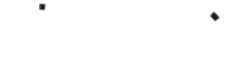

<!--docs:
title: "Circular progress & activity indicator"
layout: detail
section: components
excerpt: "Material Design progress indicators display the length of a process or express an unspecified wait time."
iconId: progress_activity
path: /catalog/progress-indicators/activity-indicators/
api_doc_root: true
-->

<!-- This file was auto-generated using ./scripts/generate_readme ActivityIndicator -->

# Circular progress & activity indicator

[](https://github.com/material-components/material-components-ios/issues?q=is%3Aopen+is%3Aissue+label%3Atype%3ABug+label%3A%5BActivityIndicator%5D)

Material Design progress indicators display the length of a process or express an unspecified wait
time. There are two styles of progress indicators: linear and circular.

This component only provides the circular implementation. See
[Progress View](../ProgressView) for the linear implementation.



## Design & API documentation

<ul class="icon-list">
  <li class="icon-list-item icon-list-item--spec"><a href="https://material.io/go/design-progress-indicators">Material Design guidelines: Progress & activity</a></li>
  <li class="icon-list-item icon-list-item--link">Class: <a href="https://material.io/components/ios/catalog/progress-indicators/activity-indicators/api-docs/Classes/MDCActivityIndicator.html">MDCActivityIndicator</a></li>
  <li class="icon-list-item icon-list-item--link">Class: <a href="https://material.io/components/ios/catalog/progress-indicators/activity-indicators/api-docs/Classes/MDCActivityIndicatorTransition.html">MDCActivityIndicatorTransition</a></li>
  <li class="icon-list-item icon-list-item--link">Protocol: <a href="https://material.io/components/ios/catalog/progress-indicators/activity-indicators/api-docs/Protocols/MDCActivityIndicatorDelegate.html">MDCActivityIndicatorDelegate</a></li>
  <li class="icon-list-item icon-list-item--link">Enumeration: <a href="https://material.io/components/ios/catalog/progress-indicators/activity-indicators/api-docs/Enums.html">Enumerations</a></li>
  <li class="icon-list-item icon-list-item--link">Enumeration: <a href="https://material.io/components/ios/catalog/progress-indicators/activity-indicators/api-docs/Enums/MDCActivityIndicatorMode.html">MDCActivityIndicatorMode</a></li>
</ul>

## Related components

<ul class="icon-list">
  <li class="icon-list-item icon-list-item--link"><a href="../ProgressView">ProgressView</a></li>
</ul>

## Table of contents

- [Overview](#overview)
- [Installation](#installation)
  - [Installation with CocoaPods](#installation-with-cocoapods)
  - [Importing](#importing)
- [Usage](#usage)
  - [Typical use: Indeterminate](#typical-use-indeterminate)
  - [Typical use: Determinate](#typical-use-determinate)
  - [Showing multiple indeterminate colors](#showing-multiple-indeterminate-colors)
- [Extensions](#extensions)
  - [Color Theming](#color-theming)

- - -

## Overview

`MDCActivityIndicator` is a view that has two modes: indeterminate and determinate. Indeterminate
indicators express an unspecified wait time, while determinate indicators represent the length of a
process. Activity indicators are indeterminate by default.

## Installation

<!-- Extracted from docs/../../../docs/component-installation.md -->

### Installation with CocoaPods

Add the following to your `Podfile`:

```bash
pod 'MaterialComponents/ActivityIndicator'
```
<!--{: .code-renderer.code-renderer--install }-->

Then, run the following command:

```bash
pod install
```

### Importing

To import the component:

<!--<div class="material-code-render" markdown="1">-->
#### Swift
```swift
import MaterialComponents.MaterialActivityIndicator
```

#### Objective-C

```objc
#import "MaterialActivityIndicator.h"
```
<!--</div>-->


## Usage

<!-- Extracted from docs/typical-use-indeterminate.md -->

### Typical use: Indeterminate

MDCActivityIndicator instances are indeterminate by default.

<!--<div class="material-code-render" markdown="1">-->
#### Swift
```swift
let activityIndicator = MDCActivityIndicator()
activityIndicator.sizeToFit()
view.addSubview(activityIndicator)

// To make the activity indicator appear:
activityIndicator.startAnimating()

// To make the activity indicator disappear:
activityIndicator.stopAnimating()
```

#### Objective-C

```objc
MDCActivityIndicator *activityIndicator = [[MDCActivityIndicator alloc] init];
[activityIndicator sizeToFit];
[view addSubview:activityIndicator];

// To make the activity indicator appear:
[activityIndicator startAnimating];

// To make the activity indicator disappear:
[activityIndicator stopAnimating];
```
<!--</div>-->


<!-- Extracted from docs/typical-use-determinate.md -->

### Typical use: Determinate

MDCActivityIndicator instances can be shown as determinate by modifying the `indicatorMode`
property and setting a percentage progress with `progress`. `progress` must be set to a floating
point number between 0 and 1. Values beyond this range will be capped within the range.

Note: Activity indicators are hidden unless they are animating, even if the indicator is determinate
progress.

<!--<div class="material-code-render" markdown="1">-->
#### Swift
```swift
let activityIndicator = MDCActivityIndicator()
activityIndicator.sizeToFit()
activityIndicator.indicatorMode = .determinate
activityIndicator.progress = 0.5
view.addSubview(activityIndicator)

// To make the activity indicator appear:
activityIndicator.startAnimating()

// To make the activity indicator disappear:
activityIndicator.stopAnimating()
```

#### Objective-C

```objc
MDCActivityIndicator *activityIndicator = [[MDCActivityIndicator alloc] init];
[activityIndicator sizeToFit];
activityIndicator.indicatorMode = MDCActivityIndicatorModeDeterminate;
activityIndicator.progress = 0.5;
[view addSubview:activityIndicator];

// To make the activity indicator appear:
[activityIndicator startAnimating];

// To make the activity indicator disappear:
[activityIndicator stopAnimating];
```
<!--</div>-->

<!-- Extracted from docs/multiple-colors.md -->

### Showing multiple indeterminate colors

Indeterminate activity indicators support showing multiple colors via the `cycleColors` API.
Consider using this property if your brand consists of more than one primary color.

<!--<div class="material-code-render" markdown="1">-->
#### Swift
```swift
let activityIndicator = MDCActivityIndicator()
activityIndicator.cycleColors = [.blue, .red, .green, .yellow]
```

#### Objective-C

```objc
MDCActivityIndicator *activityIndicator = [[MDCActivityIndicator alloc] init];
activityIndicator.cycleColors =  @[ UIColor.blueColor,
                                    UIColor.redColor,
                                    UIColor.greenColor,
                                    UIColor.yellowColor ];
```
<!--</div>-->


## Extensions

<!-- Extracted from docs/color-theming.md -->

### Color Theming

You can theme an activity indicator with your app's color scheme using the ColorThemer extension.

You must first add the Color Themer extension to your project:

```bash
pod 'MaterialComponents/ActivityIndicator+ColorThemer'
```

Run `pod install` again.

<!--<div class="material-code-render" markdown="1">-->
#### Swift
```swift
// Step 1: Import the ColorThemer extension
import MaterialComponents.MaterialActivityIndicator_ColorThemer

// Step 2: Create or get a color scheme
let colorScheme = MDCSemanticColorScheme()

// Step 3: Apply the color scheme to your component
MDCActivityIndicatorColorThemer.applySemanticColorScheme(colorScheme, to: activityIndicator)
```

#### Objective-C

```objc
// Step 1: Import the ColorThemer extension
#import "MaterialActivityIndicator+ColorThemer.h"

// Step 2: Create or get a color scheme
id<MDCColorScheming> colorScheme = [[MDCSemanticColorScheme alloc] initWithDefaults:MDCColorSchemeDefaultsMaterial201804];

// Step 3: Apply the color scheme to your component
[MDCActivityIndicatorColorThemer applySemanticColorScheme:colorScheme
     toActivityIndicator:activityIndicator];
```
<!--</div>-->

