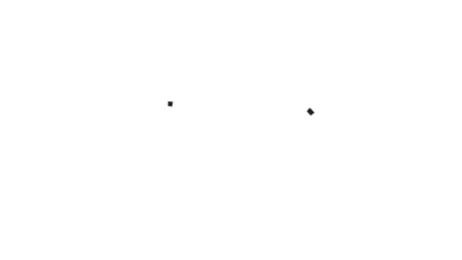

# Circular progress & activity indicator

<!-- badges -->

Material Design progress indicators display the length of a process or express an unspecified wait
time. There are two styles of progress indicators: linear and circular.

This component only provides the circular implementation. See
[Progress View](../../ProgressView) for the linear implementation.

<!-- design-and-api -->

## Related components

* [ProgressView](../../ProgressView)

<!-- toc -->

- - -

## Overview

`MDCActivityIndicator` is a view that has two modes: indeterminate and determinate. Indeterminate
indicators express an unspecified wait time, while determinate indicators represent the length of a
process. Activity indicators are indeterminate by default.

## Installation

- [Typical installation](../../../docs/component-installation.md)

## Usage

- [Typical use: Indeterminate](typical-use-indeterminate.md)
- [Typical use: Determinate](typical-use-determinate.md)
- [Showing multiple indeterminate colors](multiple-colors.md)

## Extensions

- [Color Theming](color-theming.md)
