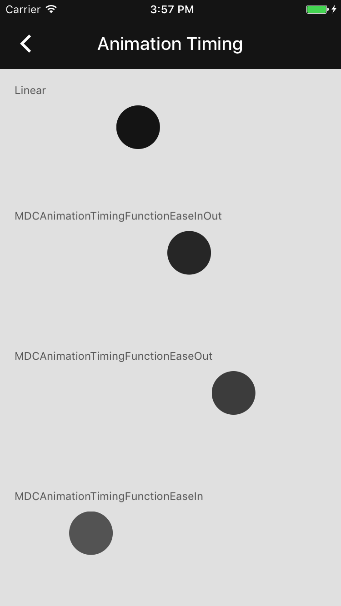

<!--docs:
title: "Animation Timing"
layout: detail
section: components
excerpt: "Material Design animation timing curves."
iconId: animation
path: /catalog/animation-timing/
-->

# Animation Timing

<div class="article__asset article__asset--screenshot">
  
</div>

Animation timing easing curves create smooth and consistent motion. Easing curves allow elements to
move between positions or states. These easing curves affect an object's speed, opacity, and scale.
These animation curves allow acceleration and deceleration changes to be smooth across the duration
of an animation so that movement doesn't appear mechanical.

## Design & API Documentation

<ul class="icon-list">
  <li class="icon-list-item icon-list-item--spec"><a href="https://material.io/guidelines/motion/duration-easing.html">Duration & easing</a></li>
</ul>

## Installation

### Requirements

- Xcode 7.0 or higher.
- iOS SDK version 7.0 or higher.

### Installation with CocoaPods

To add this component to your Xcode project using CocoaPods, add the following to your `Podfile`:

```
pod 'MaterialComponents/AnimationTiming'
```
<!--{: .code-renderer.code-renderer--install }-->

Then, run the following command:

``` bash
pod install
```

- - -

## Usage

### Importing

Before using animation timing, you'll need to import it:

<!--<div class="material-code-render" markdown="1">-->
#### Swift

``` swift
import MaterialComponents
```

#### Objective-C

``` objc
#import "MaterialAnimationTiming.h"
```
<!--</div>-->

## Examples

### Using Animation Timing

To use an animation timing curve select an appropriate a predefined MDCAnimationTimingFunction enum
value. Use this value to look up an animation curve's timing function. The timing function can then
be used in an animation.

<!--<div class="material-code-render" markdown="1">-->
#### Swift

``` swift
let materialCurve = MDCAnimationTimingFunction.easeOut
let timingFunction = CAMediaTimingFunction.mdc_function(withType: materialCurve)

let animation = CABasicAnimation(keyPath:"transform.translation.x")
animation.timingFunction = timingFunction
```

#### Objc

``` objc
MDCAnimationTimingFunction materialCurve = MDCAnimationTimingFunctionEaseOut;
CAMediaTimingFunction *timingFunction = [CAMediaTimingFunction mdc_functionWithType:materialCurve];

CABasicAnimation *animation = [CABasicAnimation animationWithKeyPath:@"transform.translation.x"];
animation.timingFunction = timingFunction;
```
<!--</div>-->
