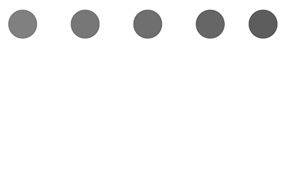

<!--docs:
title: "Animation timing"
layout: detail
section: components
excerpt: "Material Design animation timing curves."
iconId: animation
path: /catalog/animation-timing/
-->

# Animation timing

Like color and typography, motion can play a role in defining your app's style and brand. The
animation timing component provides implementations of the Material Motion easing curve types for
iOS.



## Design & API Documentation

<ul class="icon-list">
  <li class="icon-list-item icon-list-item--spec"><a href="https://material.io/go/design-easing">Material Design guidelines: Easing</a></li>
</ul>

## Installation

### Installation with CocoaPods

To add this component to your Xcode project using CocoaPods, add the following to your `Podfile`:

```
pod 'MaterialComponents/AnimationTiming'
```
<!--{: .code-renderer.code-renderer--install }-->

Then, run the following command:

```bash
pod install
```

- - -

## Usage

### Importing

Before using animation timing, you'll need to import it:

<!--<div class="material-code-render" markdown="1">-->
#### Swift

```swift
import MaterialComponents
```

#### Objective-C

```objc
#import "MaterialAnimationTiming.h"
```
<!--</div>-->

## Examples

### Using Animation Timing

To use an animation timing curve select an appropriate a predefined MDCAnimationTimingFunction enum
value. Use this value to look up an animation curve's timing function. The timing function can then
be used in an animation.

<!--<div class="material-code-render" markdown="1">-->
#### Swift

```swift
let materialCurve = MDCAnimationTimingFunction.deceleration
let timingFunction = CAMediaTimingFunction.mdc_function(withType: materialCurve)

let animation = CABasicAnimation(keyPath:"transform.translation.x")
animation.timingFunction = timingFunction
```

#### Objc

```objc
MDCAnimationTimingFunction materialCurve = MDCAnimationTimingFunctionDeceleration;
CAMediaTimingFunction *timingFunction = [CAMediaTimingFunction mdc_functionWithType:materialCurve];

CABasicAnimation *animation = [CABasicAnimation animationWithKeyPath:@"transform.translation.x"];
animation.timingFunction = timingFunction;
```
<!--</div>-->
