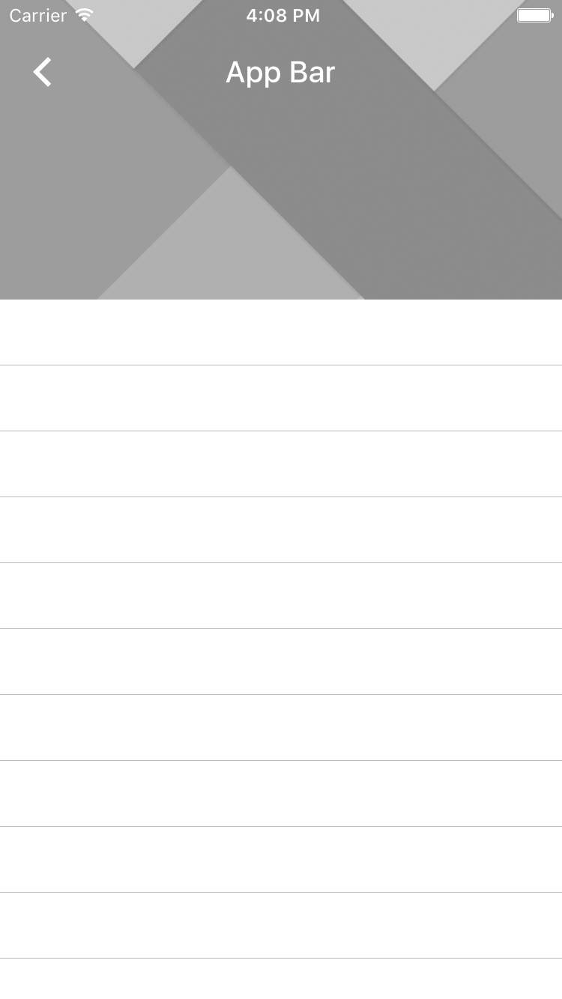

<!--docs:
title: "App Bars"
layout: detail
section: components
excerpt: "The App Bar is a flexible navigation bar designed to provide a typical Material Design navigation experience."
iconId: toolbar
path: /catalog/app-bars/
api_doc_root: true
-->

# App Bars

<div class="article__asset article__asset--screenshot">
  
</div>

The App Bar is a flexible navigation bar designed to provide a typical Material Design
navigation experience.

## Design & API Documentation

<ul class="icon-list">
  <li class="icon-list-item icon-list-item--spec"><a href="https://material.io/guidelines/layout/structure.html#structure-app-bar">Material Design guidelines: App Bar Structure</a></li>
  <li class="icon-list-item icon-list-item--spec"><a href="https://material.io/guidelines/patterns/scrolling-techniques.html">Material Design guidelines: Scrolling Techniques</a></li>
  <li class="icon-list-item icon-list-item--link"><a href="https://material.io/components/ios/catalog/app-bars/api-docs/Classes/MDCAppBar.html">API: MDCAppBar</a></li>
  <li class="icon-list-item icon-list-item--link"><a href="https://material.io/components/ios/catalog/app-bars/api-docs/Classes/MDCAppBarContainerViewController.html">API: MDCAppBarContainerViewController</a></li>
</ul>

- - -

## Installation

### Requirements

- Xcode 7.0 or higher.
- iOS SDK version 7.0 or higher.

### Installation with CocoaPods

To add this component to your Xcode project using CocoaPods, add the following to your `Podfile`:

``` bash
pod 'MaterialComponents/AppBar'
```
<!--{: .code-renderer.code-renderer--install }-->

Then, run the following command:

``` bash
pod install
```

- - -

## Overview

The App Bar is a composite component that initializes and provides access to instances of the
following components:

- [Flexible Header](../FlexibleHeader/)
- [Header Stack View](../HeaderStackView/)
- [Navigation Bar](../NavigationBar/)

The provided view hierarchy looks like so:

    <MDCFlexibleHeaderView>
       | <CALayer>
       |    | <MDCShadowLayer>
       | <UIView> <- headerView.contentView
       |    | <MDCHeaderStackView>
       |    |    | <MDCNavigationBar>

This view hierarchy will be added to your view controller hierarchy using the convenience methods
outlined in the Usage docs below.

Note that it is possible to create each of the above components yourself, though we only encourage
doing so if the App Bar is limiting your ability to build something. In such a case we recommend
also [filing an issue](https://github.com/material-components/material-components-ios/issues/new) so that we can
identify whether your use case is something we can directly support.


- - -

## Usage

### Importing

Before using App Bar, you'll need to import it:

<!--<div class="material-code-render" markdown="1">-->
#### Swift
``` swift
import MaterialComponents
```

#### Objective-C

``` objc
#import "MaterialAppBar.h"
```
<!--</div>-->

### Add the App Bar to a view controller

Each view controller in your app that intends to use an App Bar will follow these instructions.
You'll typically add the App Bar to the same view controllers that you'd push onto a
UINavigationController, hiding the UINavigationController's `navigationBar` accordingly.

The result of following these steps will be that:

1. an App Bar is registered as a child view controller of your view controller,
2. you have access to the App Bar's Flexible Header view via the headerViewController property, and
   that
3. you have access to the Navigation Bar and Header Stack View views via the corresponding
   properties.

Step 1: **Create an instance of MDCAppBar**.

You must also add the `headerViewController` as a child view controller.

<!--<div class="material-code-render" markdown="1">-->
#### Swift
``` swift
let appBar = MDCAppBar()

override init(nibName nibNameOrNil: String?, bundle nibBundleOrNil: Bundle?) {
  super.init(nibName: nibNameOrNil, bundle: nibBundleOrNil)

  self.addChildViewController(appBar.headerViewController)
}
```

#### Objective-C

``` objc
@interface ObjcViewController ()
@property(nonatomic, strong, nonnull) MDCAppBar *appBar;
@end

@implementation ObjcViewController

- (id)initWithNibName:(NSString *)nibNameOrNil bundle:(NSBundle *)nibBundleOrNil {
  self = [super initWithNibName:nibNameOrNil bundle:nibBundleOrNil];
  if (self) {
    _appBar = [[MDCAppBar alloc] init];

    [self addChildViewController:_appBar.headerViewController];
  }
  return self;
}

@end
```
<!--</div>-->

Step 2: **Inform the App Bar that your view controller's view has loaded**.

Ideally you will do this after all views have been added to your controller's view in order to
ensure that the App Bar's Flexible Header is in front of all other views.

<!--<div class="material-code-render" markdown="1">-->
#### Swift
``` swift
override func viewDidLoad() {
  super.viewDidLoad()

  // After all other views have been registered.
  appBar.addSubviewsToParent()
}
```

#### Objective-C
``` objc
- (void)viewDidLoad {
  [super viewDidLoad];

  ...

  // After all other views have been registered.
  [self.appBar addSubviewsToParent];
}
```
<!--</div>-->

### Tracking a scroll view

The App Bar's flexible nature is made possible due to the Flexible Header's ability to respond to
interactions with a scroll view. Learn how to set up this scroll view tracking by reading the
Flexible Header section on [Tracking a scroll view](../FlexibleHeader/#tracking-a-scroll-view).

### App Bar & UINavigationController

A view controller with an App Bar pushed onto a UINavigationController will look odd due to the
presence of two navigation bars: one provided by App Bar and another provided by
UINavigationController. The Flexible Header section on
[interacting with UINavigationController](../FlexibleHeader/#interacting-with-uinavigationcontroller)
provides recommendations for hiding the navigation bar appropriately in this situation.

### Status bar style

The Flexible Header component provides facilities for inferring the status bar style based on the
Flexible Header view's background color. Learn more by reading the section on
[Status bar style](../FlexibleHeader/#status-bar-style).

### UINavigationItem and the App Bar

The App Bar begins mirroring the state of your view controller's `navigationItem` in the provided
`navigationBar` once you call `addSubviewsToParent`.

Learn more by reading the Navigation Bar section on
[Observing UINavigationItem instances](../NavigationBar/#observing-uinavigationitem-instances).
Notably: read the section on "Exceptions" to understand which UINavigationItem are **not**
supported.

### Background images

Showcase photography and imagery in your App Bar by adding image views to the App Bar's Flexible
Header.

Learn more by reading the Flexible Header section on
[Background images](../FlexibleHeader/#background-images).

### Touch forwarding

The App Bar enables touch forwarding for the headerStackView and the navigationBar instances. Touch
events made to those views (not their subviews) will be forwarded to the tracking scroll view.

Learn more by reading the Flexible Header section on
[Touch forwarding](../FlexibleHeader/#touch-forwarding).

### Interacting with background views

Scenario: you've added a background image to your App Bar and you'd now like to be able to tap the
background image.

This is not trivial to do with the App Bar APIs due to considerations being discussed in
[Issue #184](https://github.com/material-components/material-components-ios/issues/184).

The heart of the limitation is that we're using a view (`headerStackView`) to lay out the Navigation
Bar. If you add a background view behind the `headerStackView` instance then `headerStackView` will
end up eating all of your touch events.

Until [Issue #184](https://github.com/material-components/material-components-ios/issues/184) is resolved, our
recommendation for building interactive background views is the following:

1. Do not use the App Bar component.
2. Create your own Flexible Header. Learn more by reading the Flexible Header
   [Usage](../FlexibleHeader/#usage) docs.
3. Add your views to this flexible header instance.
4. Create a Navigation Bar if you need one. Treat it like any other custom view.
