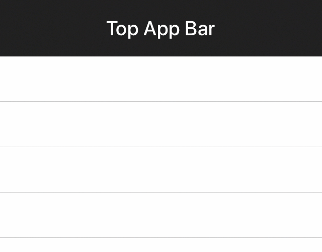

<!--docs:
title: "App bars: top"
layout: detail
section: components
excerpt: "The Material Design top app bar displays information and actions relating to the current view."
iconId: toolbar
path: /catalog/app-bars/
api_doc_root: true
-->

<!-- This file was auto-generated using ./scripts/generate_readme AppBar -->

# App bars: top

[](https://github.com/material-components/material-components-ios/issues?q=is%3Aopen+is%3Aissue+label%3Atype%3ABug+label%3A%5BAppBar%5D)

The Material Design top app bar displays information and actions relating to the current view.

<div class="article__asset article__asset--screenshot">
  
</div>

## Design & API documentation

<ul class="icon-list">
  <li class="icon-list-item icon-list-item--spec"><a href="https://material.io/go/design-app-bar-top">Material Design guidelines: App bars: top</a></li>
  <li class="icon-list-item icon-list-item--link">Class: <a href="https://material.io/components/ios/catalog/app-bars/api-docs/Classes/MDCAppBar.html">MDCAppBar</a></li>
  <li class="icon-list-item icon-list-item--link">Class: <a href="https://material.io/components/ios/catalog/app-bars/api-docs/Classes/MDCAppBarContainerViewController.html">MDCAppBarContainerViewController</a></li>
  <li class="icon-list-item icon-list-item--link">Class: <a href="https://material.io/components/ios/catalog/app-bars/api-docs/Classes/MDCAppBarTextColorAccessibilityMutator.html">MDCAppBarTextColorAccessibilityMutator</a></li>
</ul>

## Related components

<ul class="icon-list">
  <li class="icon-list-item icon-list-item--link"><a href="../FlexibleHeader">FlexibleHeader</a></li>
</ul>

## Table of contents

- [Overview](#overview)
  - [UINavigationItem and the App Bar](#uinavigationitem-and-the-app-bar)
  - [Interacting with background views](#interacting-with-background-views)
- [Installation](#installation)
  - [Installation with CocoaPods](#installation-with-cocoapods)
  - [Importing](#importing)
- [Usage](#usage)
  - [Typical use: Adding an app bar to your app](#typical-use-adding-an-app-bar-to-your-app)
- [Extensions](#extensions)
  - [Color Theming](#color-theming)
  - [Typography Theming](#typography-theming)
- [Example code](#example-code)

- - -

## Overview

The top app bar is implemented on iOS in the AppBar component. This component's main API is
`MDCAppBar`, a compose API that initializes and provides access to instances of the
following components:

<ul class="icon-list">
  <li class="icon-list-item icon-list-item--link"><a href="../FlexibleHeader">Flexible Header</a></li>
  <li class="icon-list-item icon-list-item--link"><a href="../HeaderStackView">Header Stack View</a></li>
  <li class="icon-list-item icon-list-item--link"><a href="../NavigationBar">Navigation Bar</a></li>
</ul>

The provided view hierarchy looks like so:

    <MDCFlexibleHeaderView>
       | <CALayer>
       |    | <MDCShadowLayer>
       | <UIView> <- headerView.contentView
       |    | <MDCHeaderStackView>
       |    |    | <MDCNavigationBar>

This view hierarchy will be added to your view controller hierarchy using the convenience methods
outlined in the Usage docs below.

Note that it is possible to create each of the above components yourself, though we only encourage
doing so if the App Bar is limiting your ability to build something. In such a case we recommend
also [filing an issue](https://github.com/material-components/material-components-ios/issues/new) so that we can
identify whether your use case is something we can directly support.

### UINavigationItem and the App Bar

The App Bar begins mirroring the state of your view controller's `navigationItem` in the provided
`navigationBar` once you call `addSubviewsToParent`.

Learn more by reading the Navigation Bar section on
[Observing UINavigationItem instances](../NavigationBar/#observing-uinavigationitem-instances).
Notably: read the section on "Exceptions" to understand which UINavigationItem are **not**
supported.

### Interacting with background views

Scenario: you've added a background image to your App Bar and you'd now like to be able to tap the
background image.

This is not trivial to do with the App Bar APIs due to considerations being discussed in
[Issue #184](https://github.com/material-components/material-components-ios/issues/184).

The heart of the limitation is that we're using a view (`headerStackView`) to lay out the Navigation
Bar. If you add a background view behind the `headerStackView` instance then `headerStackView` will
end up eating all of your touch events.

Until [Issue #184](https://github.com/material-components/material-components-ios/issues/184) is resolved, our
recommendation for building interactive background views is the following:

1. Do not use the App Bar component.
2. Create your own Flexible Header. Learn more by reading the Flexible Header
   [Usage](../FlexibleHeader/#usage) docs.
3. Add your views to this flexible header instance.
4. Create a Navigation Bar if you need one. Treat it like any other custom view.

## Installation

<!-- Extracted from docs/../../../docs/component-installation.md -->

### Installation with CocoaPods

Add the following to your `Podfile`:

```bash
pod 'MaterialComponents/AppBar'
```
<!--{: .code-renderer.code-renderer--install }-->

Then, run the following command:

```bash
pod install
```

### Importing

To import the component:

<!--<div class="material-code-render" markdown="1">-->
#### Swift
```swift
import MaterialComponents.MaterialAppBar
```

#### Objective-C

```objc
#import "MaterialAppBar.h"
```
<!--</div>-->


## Usage

<!-- Extracted from docs/typical-use-adding-an-app-bar.md -->

### Typical use: Adding an app bar to your app

Each view controller in your app that intends to use an App Bar will follow these instructions.
You'll typically add the App Bar to the same view controllers that you'd push onto a
UINavigationController, hiding the UINavigationController's `navigationBar` accordingly.

The result of following these steps will be that:

1. an App Bar is registered as a child view controller of your view controller,
2. you have access to the App Bar's Flexible Header view via the headerViewController property, and
   that
3. you have access to the Navigation Bar and Header Stack View views via the corresponding
   properties.

Step 1: **Create an instance of MDCAppBar**.

You must also add the `headerViewController` as a child view controller.

<!--<div class="material-code-render" markdown="1">-->
#### Swift
```swift
let appBar = MDCAppBar()

override init(nibName nibNameOrNil: String?, bundle nibBundleOrNil: Bundle?) {
  super.init(nibName: nibNameOrNil, bundle: nibBundleOrNil)

  self.addChildViewController(appBar.headerViewController)
}
```

#### Objective-C

```objc
@interface ObjcViewController ()
@property(nonatomic, strong, nonnull) MDCAppBar *appBar;
@end

@implementation ObjcViewController

- (id)initWithNibName:(NSString *)nibNameOrNil bundle:(NSBundle *)nibBundleOrNil {
  self = [super initWithNibName:nibNameOrNil bundle:nibBundleOrNil];
  if (self) {
    _appBar = [[MDCAppBar alloc] init];

    [self addChildViewController:_appBar.headerViewController];
  }
  return self;
}

@end
```
<!--</div>-->

Step 2: **Inform the App Bar that your view controller's view has loaded**.

Ideally you will do this after all views have been added to your controller's view in order to
ensure that the App Bar's Flexible Header is in front of all other views.

<!--<div class="material-code-render" markdown="1">-->
#### Swift
```swift
override func viewDidLoad() {
  super.viewDidLoad()

  // After all other views have been registered.
  appBar.addSubviewsToParent()
}
```

#### Objective-C
```objc
- (void)viewDidLoad {
  [super viewDidLoad];

  ...

  // After all other views have been registered.
  [self.appBar addSubviewsToParent];
}
```
<!--</div>-->


See the [FlexibleHeader](../FlexibleHeader) documentation for additional usage guides.

## Extensions

<!-- Extracted from docs/color-theming.md -->

### Color Theming

You can theme an app bar with your app's color scheme using the ColorThemer extension.

You must first add the Color Themer extension to your project:

```bash
pod 'MaterialComponents/AppBar+ColorThemer'
```

<!--<div class="material-code-render" markdown="1">-->
#### Swift
```swift
// Step 1: Import the ColorThemer extension
import MaterialComponents.MaterialAppBar_ColorThemer

// Step 2: Create or get a color scheme
let colorScheme = MDCSemanticColorScheme()

// Step 3: Apply the color scheme to your component
MDCAppBarColorThemer.applySemanticColorScheme(colorScheme, to: component)
```

#### Objective-C

```objc
// Step 1: Import the ColorThemer extension
#import "MaterialAppBar+ColorThemer.h"

// Step 2: Create or get a color scheme
id<MDCColorScheming> colorScheme = [[MDCSemanticColorScheme alloc] init];

// Step 3: Apply the color scheme to your component
[MDCAppBarColorThemer applySemanticColorScheme:colorScheme
     toAppBar:component];
```
<!--</div>-->

<!-- Extracted from docs/typography-theming.md -->

### Typography Theming

You can theme an app bar with your app's typography scheme using the TypographyThemer extension.

You must first add the Typography Themer extension to your project:

```bash
pod 'MaterialComponents/AppBar+TypographyThemer'
```

## Example code

<!--<div class="material-code-render" markdown="1">-->
#### Swift
```swift
// Step 1: Import the TypographyThemer extension
import MaterialComponents.MaterialAppBar_TypographyThemer

// Step 2: Create or get a typography scheme
let typographyScheme = MDCTypographyScheme()

// Step 3: Apply the typography scheme to your component
MDCAppBarTypographyThemer.applyTypographyScheme(typographyScheme, to: component)
```

#### Objective-C

```objc
// Step 1: Import the TypographyThemer extension
#import "MaterialAppBar+TypographyThemer.h"

// Step 2: Create or get a typography scheme
id<MDCTypographyScheming> typographyScheme = [[MDCTypographyScheme alloc] init];

// Step 3: Apply the typography scheme to your component
[MDCAppBarTypographyThemer applyTypographyScheme:colorScheme
     toAppBar:component];
```
<!--</div>-->

