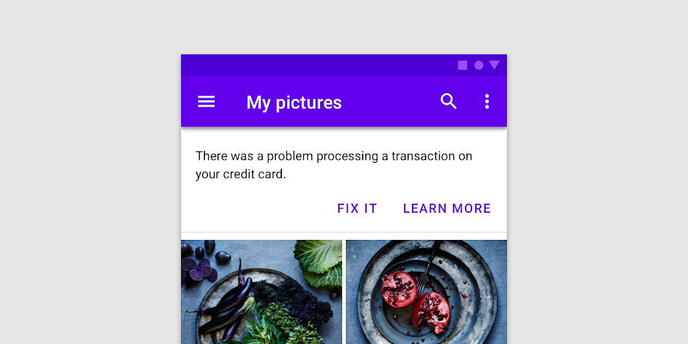
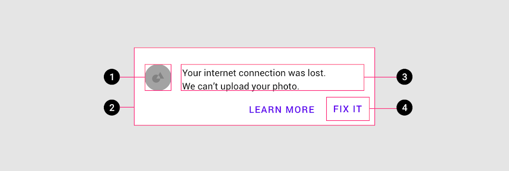
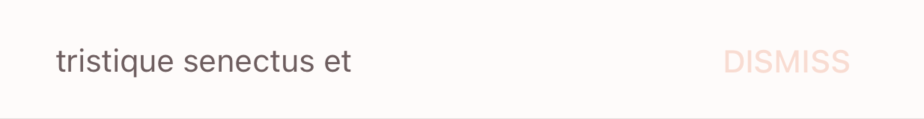

<!--docs:
title: "Material Banners"
layout: detail
section: components
excerpt: "A banner displays a prominent message and related optional actions."
iconId: 
path: /catalog/material-banners/
-->

# Banner

[](https://github.com/material-components/material-components-ios/issues?q=is%3Aopen+is%3Aissue+label%3Atype%3ABug+label%3A%5BBanner%5D)

A [banner](https://material.io/components/banners) displays a prominent message and related optional actions.



## Contents

* [Using banners](#using-banners)
* [Installing banners](#installing-banners)
* [Making banners accessible](#making-banners-accessible)
* [Banners example](#banners-example)
* [Theming banners](#theming-banners)

## Using banners

A banner displays an important, succinct message, and provides actions for users to address (or dismiss the banner). It requires a user action to be dismissed.

Banners should be displayed at the top of the screen, below a top app bar. They’re persistent and nonmodal, allowing the user to either ignore them or interact with them at any time. Only one banner should be shown at a time.

By default, `MDCBannerView` is configured to display an image view, a text label and two buttons. To hide the image view on `MDCBannerView`, users can set the `hidden` property on `imageView` to be true. Similarly, users can hide a button on the banner view by setting the `hidden` property on `trailingButton` to be true.

By default, `MDCBannerView` is configured to display items with black text and white background with a gray divider at the bottom of the view. To customize the color and style of the text, image view and buttons displayed on `MDCBannerView`, directly set the relevant properties, such as `tintColor`, on `textView`, `imageView`, `leadingButton` and `trailingButton`. `showsDivider` and `dividerColor` can be used to control the divider's visibility and color.

`MDCBannerView` layouts are configurable through the `bannerViewLayoutStyle` property. This property can be set to either `MDCBannerViewLayoutStyleAutomatic`, `MDCBannerViewLayoutStyleSingleRow`, `MDCBannerViewLayoutStyleMultiRowStackedButton`, or `MDCBannerViewLayoutStyleMultiRowAlignedButton`.	

`MDCBannerView` uses `layoutMargins` to manage the margins for elements on the banner view.

## Installing banners

### Installation with CocoaPods

Add the following to your `Podfile`:

```bash
pod 'MaterialComponents/Banner'
```
<!--{: .code-renderer.code-renderer--install }-->

Then, run the following command:

```bash
pod install
```

### Importing

To use the `MDCBannerView` in your code, import the MaterialBanner umbrella header (Objective-C) or MaterialComponents module (Swift).

<!--<div class="material-code-render" markdown="1">-->
#### Swift

```swift
import MaterialComponents.MaterialBanner
```

#### Objective-C

```objc
#import "MaterialBanner.h"
```

<!--</div>-->

### Making banners accessible

The system will set `accessibilityLabel` for the elements in the banner that contain text. As always, you are free to change these labels if it leads to a better VoiceOver expoerience. Consider setting an `accessibilityLabel` on the image view.

The only non-standard accessibiility API exposed on `MDCBannerView` is `mdc_adjustsFontForContentSizeCategory`, which is an alternative to `adjustsFontForContentSizeCategory` that is specific to the MDC iOS library. Eventually we will deprecate and delete `mdc_adjustsFontForContentSizeCategory`.

## Anatomy and key properties



Banners consist of the following:

1. Image view (optional)
2. Container
3. Text
4. Buttons

### Image view attributes

&nbsp;               | Attribute                | Related method(s) | Default value
-------------------- | ------------------------ | ----------------- | -------------
**Image view**       | `imageView`              | `-[MDCBannerView imageView]` | N/A
**Image**            | `imageView.image`        | `-[UIImageview setImage:]` <br/> `-[UIImageview image]` | N/A

### Container attributes	

&nbsp;                  | Attribute                         | Related method(s)                               | Default value
----------------------- | --------------------------------- | ----------------------------------------------- | -------------
**Color**               | `backgroundColor`  | `-[MDCBannerView setBackgroundColor:]` <br/> `-[MDCBannerView backgroundColor]` | White

### Text attributes

&nbsp;               | Attribute                | Related method(s) | Default value
-------------------- | ------------------------ | ----------------- | -------------
**Text**             | `textView.text`          | `-[UITextView setText:]` <br/> `-[UITextView text]` | `nil`
**Color**            | `textView.text`          | `-[UITextView setTextColor:]` <br/> `-[UITextView textColor]` | Black
**Typography**       | `textView.font`          | `-[UITextView setFont:]` <br/> `-[UITextView font]`  | Body 2 font

### Button attributes

&nbsp;               | Attribute                  | Related method(s)    | Default value
-------------------- | -------------------------- | -------------------- | -------------
**Leading button**   | `leadingButton`            | `-[MDCBannerVieiw leadingButton]` | N/A
**Trailing button**  | `trailingButton`            | `-[MDCBannerVieiw trailingButton]` | N/A

## Banners example


<!--<div class="material-code-render" markdown="1">-->
#### Swift

```swift
let bannerView = MDCBannerView()
bannerView.textView.text = "Banner text"
bannerView.mdc_adjustsFontForContentSizeCategory = true

let button = bannerView.leadingButton
button.setTitle("Dismiss", for: .normal)
bannerView.trailingButton.hidden = true
bannerView.imageView.hidden = true
bannerView.showsDivider = true

addSubview(bannerView)
```

#### Objective-C

```objc
MDCBannerView *bannerView = [[MDCBannerView alloc] init];
bannerView.textView.text = @"Banner text";
bannerView.mdc_adjustsFontForContentSizeCategory = YES;

MDCButton *button = bannerView.leadingButton;
[button setTitle:@"Dismiss" forState:UIControlStateNormal];
bannerView.trailingButton.hidden = YES;
bannerView.imageView.hidden = YES;
bannerView.showsDivider = YES;

[self addBannerView:bannerView];
```
<!--</div>-->

## Theming banners

`MDCBannerView` supports Material Theming using a container scheme.

Here is an example of a Banner with the Shrine theme applied to it.



<!--<div class="material-code-render" markdown="1">-->
#### Swift

```swift
// Import the Banner theming module
import MaterialComponents.MaterialBanner_MaterialTheming
...
// Create or use your app's Container Scheme
let containerScheme = MDCContainerScheme()
// Theme the banner with either default theme
banner.applyTheme(withScheme: containerScheme)
```

#### Objective-C

```objc
// Import the Tabs Theming Extensions header
#import <MaterialComponents/MaterialBanner+MaterialTheming.h>
...
 // Create or use your app's Container Scheme
MDCContainerScheme *containerScheme = [[MDCContainerScheme alloc] init];
 // Theme the banner with either default theme
[self.bannerView applyThemeWithScheme:containerScheme];
```
<!--</div>-->