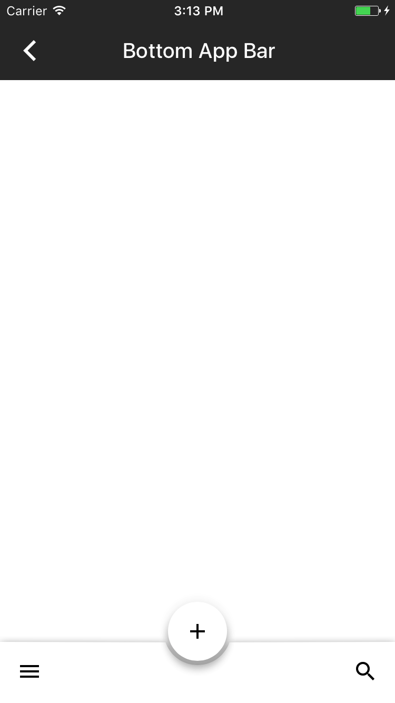

<!--docs:
title: "App bars: bottom"
layout: detail
section: components
excerpt: "A bottom app bar displays navigation and key actions at the bottom of the screen."
iconId: bottom_app_bar
path: /catalog/bottomappbar/
api_doc_root: true
-->

<!-- This file was auto-generated using ./scripts/generate_readme BottomAppBar -->

# App bars: bottom

[](https://github.com/material-components/material-components-ios/issues?q=is%3Aopen+is%3Aissue+label%3Atype%3ABug+label%3A%5BBottomAppBar%5D)

A bottom app bar displays navigation and key actions at the bottom of the screen. Bottom app bars
work like [navigation bars](../NavigationBar), but with the additional option to show a
[floating action button](../Buttons).

<div class="article__asset article__asset--screenshot">
  
</div>

## Design & API documentation

<ul class="icon-list">
  <li class="icon-list-item icon-list-item--spec"><a href="https://material.io/go/design-app-bar-bottom">Material Design guidelines: App bars: bottom</a></li>
  <li class="icon-list-item icon-list-item--link">Class: <a href="https://material.io/components/ios/catalog/bottomappbar/api-docs/Classes/MDCBottomAppBarView.html">MDCBottomAppBarView</a></li>
  <li class="icon-list-item icon-list-item--link">Enumeration: <a href="https://material.io/components/ios/catalog/bottomappbar/api-docs/Enums.html">Enumerations</a></li>
  <li class="icon-list-item icon-list-item--link">Enumeration: <a href="https://material.io/components/ios/catalog/bottomappbar/api-docs/Enums/MDCBottomAppBarFloatingButtonElevation.html">MDCBottomAppBarFloatingButtonElevation</a></li>
  <li class="icon-list-item icon-list-item--link">Enumeration: <a href="https://material.io/components/ios/catalog/bottomappbar/api-docs/Enums/MDCBottomAppBarFloatingButtonPosition.html">MDCBottomAppBarFloatingButtonPosition</a></li>
</ul>

## Table of contents

- [Overview](#overview)
- [Installation](#installation)
  - [Installation with CocoaPods](#installation-with-cocoapods)
  - [Importing](#importing)
- [Usage](#usage)
  - [Typical use](#typical-use)
- [Extensions](#extensions)
  - [Color Theming](#color-theming)
- [Accessibility](#accessibility)
  - [Set `-accessibilityLabel`](#set-`-accessibilitylabel`)
  - [Set `-accessibilityHint`](#set-`-accessibilityhint`)

- - -

## Overview

Bottom app bars follow a recommended Material Design interaction design pattern for providing primary and secondary actions that are easily accessible. With a bottom app bar users are more easily able to use single-handed touch interaction with an application since actions are displayed close to the bottom of the screen within easy reach of a user's thumb.

The bottom app bar includes a <a href="https://material.io/components/ios/catalog/buttons/api-docs/Classes/MDCFloatingButton.html">floating action button</a> that is intended to provide users with a primary action. Secondary actions are available on a <a href="https://material.io/components/ios/catalog/flexible-headers/navigation-bars/">navigation bar</a> that can be customized with several buttons on the left and right sides of the navigation bar. The primary action floating action button is centered on the bottom app bar by default.

MDCBottomAppBarView should be attached to the bottom of the screen or used in conjunction with an expandable bottom drawer. The MDCBottomAppBarView API includes properties that allow changes to the elevation, position and visibility of the embedded floating action button.

UIBarButtonItems can be added to the navigation bar of the MDCBottomAppBarView. Leading and trailing navigation items will be shown and hidden based on the position of the floating action button.

Transitions between floating action button position, elevation and visibility states are animated by default, but can be disabled if desired.

## Installation

<!-- Extracted from docs/../../../docs/component-installation.md -->

### Installation with CocoaPods

Add the following to your `Podfile`:

```bash
pod 'MaterialComponents/BottomAppBar'
```
<!--{: .code-renderer.code-renderer--install }-->

Then, run the following command:

```bash
pod install
```

### Importing

To import the component:

<!--<div class="material-code-render" markdown="1">-->
#### Swift
```swift
import MaterialComponents.MaterialBottomAppBar
```

#### Objective-C

```objc
#import "MaterialBottomAppBar.h"
```
<!--</div>-->


## Usage

<!-- Extracted from docs/typical-use.md -->

### Typical use

MDCBottomAppBarView can be added to a view hierarchy like any UIView. Material Design guidelines
recommend always placing the bottom app bar at the bottom of the screen.


## Extensions

<!-- Extracted from docs/color-theming.md -->

### Color Theming

MDCBottomAppBarView does not yet have a Material Design color system theming extension. Please
indicate interest by commenting on https://github.com/material-components/material-components-ios/issues/7172.

## Accessibility

<!-- Extracted from docs/accessibility.md -->

To help ensure your bottom app bar is accessible to as many users as possible, please be sure to review the
following recommendations:

### Set `-accessibilityLabel`

Set an appropriate
[`accessibilityLabel`](https://developer.apple.com/documentation/uikit/uiaccessibilityelement/1619577-accessibilitylabel)
to all buttons within the bottom app bar.

<!--<div class="material-code-render" markdown="1">-->
#### Swift

```swift
bottomAppBar.floatingButton.accessibilityLabel = "Compose"
let trailingButton = UIBarButtonItem()
trailingButton.accessibilityLabel = "Buy"
bottomAppBar.trailingBarButtonItems = [ trailingButton ]
```

#### Objective-C

```objc
bottomAppBar.floatingButton.accessibilityLabel = @"Compose";
UIBarButtonItem *trailingButton = 
    [[UIBarButtonItem alloc] initWithTitle:nil
                                     style:UIBarButtonItemStylePlain
                                    target:self
                                    action:@selector(didTapTrailing:)];
trailingButton.accessibilityLabel = @"Buy";
[bottomAppBar setTrailingBarButtonItems:@[ trailingButton ]];
```
<!--</div>-->

### Set `-accessibilityHint`

Set an appropriate
[`accessibilityHint`](https://developer.apple.com/documentation/objectivec/nsobject/1615093-accessibilityhint)
to all buttons within the bottom app bar.

<!--<div class="material-code-render" markdown="1">-->
#### Swift

```swift
bottomAppBar.floatingButton.accessibilityHint = "Create new email"
let trailingButton = UIBarButtonItem()
trailingButton.accessibilityHint = "Purchase the item"
bottomAppBar.trailingBarButtonItems = [ trailingButton ]
```

#### Objective-C

```objc
bottomAppBar.floatingButton.accessibilityHint = @"Create new email";
UIBarButtonItem *trailingButton = 
    [[UIBarButtonItem alloc] initWithTitle:nil
                                     style:UIBarButtonItemStylePlain
                                    target:self
                                    action:@selector(didTapTrailing:)];
trailingButton.accessibilityHint = @"Purchase the item";
[bottomAppBar setTrailingBarButtonItems:@[ trailingButton ]];
```
<!--</div>-->

