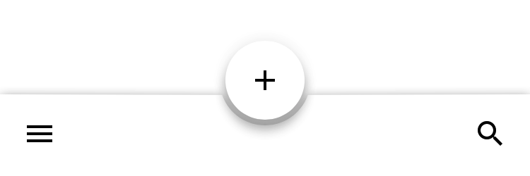

<!--docs:
title: "Bottom App Bar"
layout: detail
section: components
excerpt: "Bottom app bar provides a bar at the bottom of the screen with primary action and navigation buttons."
iconId: bottom_app_bar
path: /catalog/bottomappbar/
api_doc_root: true
-->

<!-- This file was auto-generated using ./scripts/generate_readme BottomAppBar -->

# Bottom App Bar

<div class="article__asset article__asset--screenshot">
  
</div>

A bottom app bar provides a docked bar at the bottom of the screen for common application actions. The bottom app bar includes a <a href="https://material.io/components/ios/catalog/buttons/api-docs/Classes/MDCFloatingButton.html">floating button</a> for a primary action and a <a href="https://material.io/components/ios/catalog/flexible-headers/navigation-bars/">navigation bar</a> area for secondary actions. Transition animations are provided when the floating button shifts left or right, based on the application navigation state, and when the floating action button changes elevation or is hidden.

## Design & API documentation

<ul class="icon-list">
  <li class="icon-list-item icon-list-item--spec"><a href="https://material.io/go/design-app-bar-bottom">Material Design guidelines: Bottom App Bar</a></li>
  <li class="icon-list-item icon-list-item--link">Class: <a href="https://material.io/components/ios/catalog/bottomappbar/api-docs/Classes/MDCBottomAppBarView.html">MDCBottomAppBarView</a></li>
  <li class="icon-list-item icon-list-item--link">Enumeration: <a href="https://material.io/components/ios/catalog/bottomappbar/api-docs/Enums/MDCBottomAppBarFloatingButtonElevation.html">MDCBottomAppBarFloatingButtonElevation</a></li>
  <li class="icon-list-item icon-list-item--link">Enumeration: <a href="https://material.io/components/ios/catalog/bottomappbar/api-docs/Enums/MDCBottomAppBarFloatingButtonPosition.html">MDCBottomAppBarFloatingButtonPosition</a></li>
</ul>

## Table of contents

- [Overview](#overview)
- [Installation](#installation)
  - [Installation with CocoaPods](#installation-with-cocoapods)
  - [Importing](#importing)
- [Usage](#usage)
  - [Typical use](#typical-use)
- [Extensions](#extensions)
  - [Color Theming](#color-theming)

- - -

## Overview

Bottom app bars follow a recommended Material Design interaction design pattern for providing primary and secondary actions that are easily accessible. With a bottom app bar users are more easily able to use single-handed touch interaction with an application since actions are displayed close to the bottom of the screen within easy reach of a user's thumb.

The bottom app bar includes a <a href="https://material.io/components/ios/catalog/buttons/api-docs/Classes/MDCFloatingButton.html">floating action button</a> that is intended to provide users with a primary action. Secondary actions are available on a <a href="https://material.io/components/ios/catalog/flexible-headers/navigation-bars/">navigation bar</a> that can be customized with several buttons on the left and right sides of the navigation bar. The primary action floating action button is centered on the bottom app bar by default.

MDCBottomAppBarView should be attached to the bottom of the screen or used in conjunction with an expandable bottom drawer. The MDCBottomAppBarView API includes properties that allow changes to the elevation, position and visibility of the embedded floating action button.

UIBarButtonItems can be added to the navigation bar of the MDCBottomAppBarView. Leading and trailing navigation items will be shown and hidden based on the position of the floating action button.

Transitions between floating action button position, elevation and visibility states are animated by default, but can be disabled if desired.

## Installation

<!-- Extracted from docs/../../../docs/component-installation.md -->

### Installation with CocoaPods

Add the following to your `Podfile`:

```bash
pod 'MaterialComponents/BottomAppBar'
```
<!--{: .code-renderer.code-renderer--install }-->

Then, run the following command:

```bash
pod install
```

### Importing

To import the component:

<!--<div class="material-code-render" markdown="1">-->
#### Swift
```swift
import MaterialComponents.MaterialBottomAppBar
```

#### Objective-C

```objc
#import "MaterialBottomAppBar.h"
```
<!--</div>-->


## Usage

<!-- Extracted from docs/typical-use.md -->

### Typical use

MDCBottomAppBarView can be added to a view hierarchy like any UIView. Material Design guidelines
recommend always placing the bottom app bar at the bottom of the screen.


## Extensions

<!-- Extracted from docs/color-theming.md -->

### Color Theming

Bottom App Bar does not yet have a Material Design color system themer. The following tasks are
tracking its development:

- Task: [Implement a color themer](https://www.pivotaltracker.com/story/show/157095394)
- Task: [Impement a surface variant themer](https://www.pivotaltracker.com/story/show/156933141)

