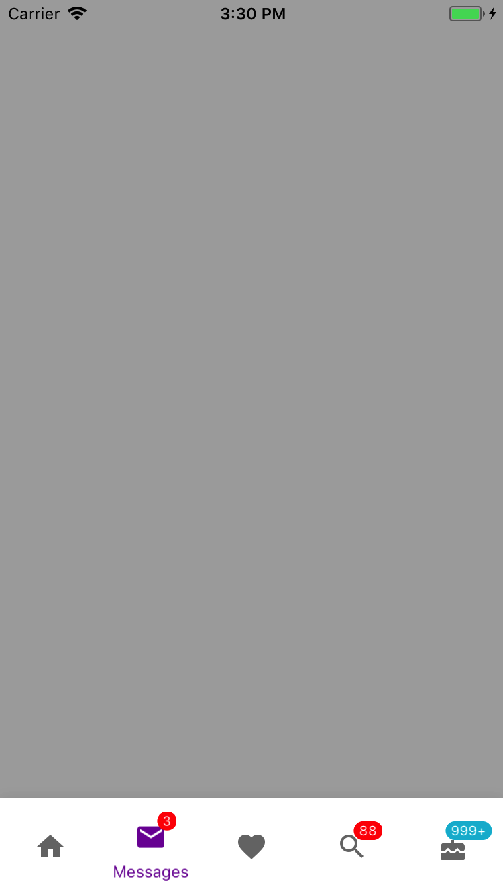

<!--docs:
title: "Bottom Navigation"
layout: detail
section: components
excerpt: "Bottom navigation provides a bar at the bottom of the screen with items to navigate between different views."
icon_id: bottom_navigation
path: /catalog/bottomnavigation/
api_doc_root: true
-->

# Bottom Navigation

<div class="article__asset article__asset--screenshot">
  
</div>

[Bottom navigation](https://material.io/guidelines/components/bottom-navigation.html) makes it easy to explore and switch between top-level views in a single tap. Tapping on a bottom navigation icon takes you directly to the associated view or refreshes the currently active view.

Bottom navigation should be used for top-level destinations in an app of similar importance or destinations requiring direct access from anywhere in the app. 

Be cautious when combining bottom navigation with similar navigation placed at the bottom of the screen (e.g. a bottom tab bar), as the combination may cause confusion when navigating an app. For example, tapping across both bottom tabs and bottom navigation could display a mixture of different transitions across the same content.

## Installation

### Requirements

- Xcode 8.0 or higher.
- iOS SDK version 8.0 or higher.

### Installation with CocoaPods

To add this component to your Xcode project using CocoaPods, add the following to your `Podfile`:

~~~
pod 'MaterialComponents/BottomNavigation'
~~~

To add this component along with its themer and other related extensions, please add the following instead:
``` bash
pod 'MaterialComponents/BottomNavigation+Extensions'
```

Then run the following command:

~~~ bash
pod install
~~~

- - -

## Usage

MDCBottomNavigationBar can be added to a view hierarchy like any UIView. Material Design guidelines recommend always placing bottom navigation at the bottom of the screen.

MDCBottomNavigationBar works much like a UITabBar and both are populated with an array of UITabBarItems. However, MDCBottomNavigationBar is built with Material Design in mind and should be used with other Material Design components where possible to provide a consistent look and feel in an app. Additionally, while MDCBottomNavigationBar has similar features to MDCTabBar, MDCTabBar is chiefly intended for top navigation, whereas MDCBottomNavigationBar -- as the name indicates -- in intended for bottom navigation.

It is recommended that three to five items are used to populate the content of the bottom navigation bar. If there are fewer than three destinations, consider using tabs instead. If your top-level navigation has more than six destinations, provide access to destinations not covered in bottom navigation through alternative locations, such as a navigation drawer.

Title visibility can be configured in three ways: only show the title of the *selected* item, always show title regardless of any item's selection state, and never show title regardless of any item's selection state. The default behavior of bottom navigation is to only show the title for an item that is selected.

In landscape orientation, items can be configured to be justified or compactly clustered together. When items are justified the bottom navigation bar is fitted to the width of the device. Justified items can have their titles shown below their respective icons or adjacent to their respective icons.

### Importing

Before using Bottom Navigation, you'll need to import it:

<!--<div class="material-code-render" markdown="1">-->
#### Swift

``` swift
import MaterialComponents.MaterialBottomNavigation
```

#### Objective-C

``` objc
#import "MaterialBottomNavigation.h"
```
<!--</div>-->

<!--<div class="material-code-render" markdown="1">-->
#### Swift

Define a MDCBottomNavigationBar.

``` swift
// Create a bottom navigation bar to add to a view.
let bottomNavBar = MDCBottomNavigationBar()
```
Add the bottom navigation to the parent view and populate its contents.

```
view.addSubview(bottomNavBar)

// Set the item title visibility (optional).
bottomNavBar.titleVisibility = .always

// Set the alignment of items (optional).
bottomNavBar.alignment = .centered

// Add items to the bottom navigation bar.
let tabBarItem1 =
  UITabBarItem(title: "Home", image: UIImage.init(named: "Home"), tag: 0)
let tabBarItem2 =
  UITabBarItem(title: "Messages", image: UIImage.init(named: "Messages"), tag: 0)
let tabBarItem3 =
  UITabBarItem(title: "Favorites", image: UIImage.init(named: "Favorites"), tag: 0)

bottomNavBar.items = [ tabBarItem1, tabBarItem2, tabBarItem3 ]

// Select an item (optional).
bottomNavBar.selectedItem = tabBarItem2;
```
When layoutSubviews (UIView) or viewWillLayoutSubviews (UIViewController) is called make sure the frame of the bottom navigation bar is set correctly within the parent view.

```
override func viewWillLayoutSubviews() {
  let size = bottomNavBar.sizeThatFits(view.bounds.size)
  let bottomNavBarFrame = CGRect(x: 0,
                                 y: view.bounds.size.height - size.height,
                                 width: size.width,
                                 height: size.height)
  bottomNavBar.frame = bottomNavBarFrame
}
```

#### Objective-C
Define a MDCBottomNavigationBar.

``` objc
@property(nonatomic, strong) MDCBottomNavigationBar *bottomNavBar;
```
Add the bottom navigation to the parent view and populate its contents.

```
// Create a bottom navigation bar to add to a view.
self.bottomNavBar = [[MDCBottomNavigationBar alloc] initWithFrame:CGRectZero];
[self.view addSubview:bottomNavBar];

// Set the item title visibility (optional).
self.bottomNavBar.titleVisibility = MDCBottomNavigationBarTitleVisibilitySelected;

// Set the alignment of items (optional).
self.bottomNavBar.alignment = MDCBottomNavigatioBarAlignmentJustified;

UITabBarItem *tabBarItem1 =
    [[UITabBarItem alloc] initWithTitle:@"Home"
                                  image:[UIImage imageNamed:@"Home"]
                                    tag:0];
UITabBarItem *tabBarItem2 =
    [[UITabBarItem alloc] initWithTitle:@"Messages"
                                  image:[UIImage imageNamed:@"Email"]
                                    tag:0];
UITabBarItem *tabBarItem3 =
    [[UITabBarItem alloc] initWithTitle:@"Favorites"
                                  image:[UIImage imageNamed:@"Favorite"]
                                    tag:0];

self.bottomNavBar.items = @[ tabBarItem1, tabBarItem2, tabBarItem3 ];

// Select an item (optional).
self.bottomNavBar.selectedItem = tabBarItem2;
```
When layoutSubviews (UIView) or viewWillLayoutSubviews (UIViewController) is called make sure the frame of the bottom navigation bar is set correctly within the parent view.

```
override func viewWillLayoutSubviews() {
  CGSize size = [self.bottomNavBar sizeThatFits:self.view.bounds.size];
  CGRect bottomNavBarFrame =
      CGRectMake(0,
                 CGRectGetHeight(self.view.bounds) - size.height,
                 size.width,
                 size.height);
  self.bottomNavBar.frame = bottomNavBarFrame;
}
```

<!--</div>-->

