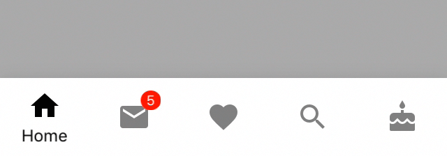

<!--docs:
title: "Bottom navigation"
layout: detail
section: components
excerpt: "Bottom navigation bars allow movement between primary destinations in an app."
iconId: bottom_navigation
path: /catalog/bottomnavigation/
api_doc_root: true
-->

<!-- This file was auto-generated using ./scripts/generate_readme BottomNavigation -->

# Bottom navigation

[](https://github.com/material-components/material-components-ios/issues?q=is%3Aopen+is%3Aissue+label%3Atype%3ABug+label%3A%5BBottomNavigation%5D)

Bottom navigation bars allow movement between primary destinations in an app. Tapping on a bottom
navigation icon takes you directly to the associated view or refreshes the currently active view.

<div class="article__asset article__asset--screenshot">
  
</div>

## Design & API documentation

<ul class="icon-list">
  <li class="icon-list-item icon-list-item--spec"><a href="https://material.io/go/design-bottom-navigation">Material Design guidelines: Bottom navigation</a></li>
  <li class="icon-list-item icon-list-item--link">Class: <a href="https://material.io/components/ios/catalog/bottomnavigation/api-docs/Classes/MDCBottomNavigationBar.html">MDCBottomNavigationBar</a></li>
  <li class="icon-list-item icon-list-item--link">Protocol: <a href="https://material.io/components/ios/catalog/bottomnavigation/api-docs/Protocols/MDCBottomNavigationBarDelegate.html">MDCBottomNavigationBarDelegate</a></li>
  <li class="icon-list-item icon-list-item--link">Enumeration: <a href="https://material.io/components/ios/catalog/bottomnavigation/api-docs/Enums.html">Enumerations</a></li>
  <li class="icon-list-item icon-list-item--link">Enumeration: <a href="https://material.io/components/ios/catalog/bottomnavigation/api-docs/Enums/MDCBottomNavigationBarAlignment.html">MDCBottomNavigationBarAlignment</a></li>
  <li class="icon-list-item icon-list-item--link">Enumeration: <a href="https://material.io/components/ios/catalog/bottomnavigation/api-docs/Enums/MDCBottomNavigationBarTitleVisibility.html">MDCBottomNavigationBarTitleVisibility</a></li>
</ul>

## Table of contents

- [Overview](#overview)
  - [Guidance](#guidance)
- [Deprecations](#deprecations)
  - [`sizeThatFitsIncludesSafeArea`](#`sizethatfitsincludessafearea`)
- [Installation](#installation)
  - [Installation with CocoaPods](#installation-with-cocoapods)
  - [Importing](#importing)
- [Extensions](#extensions)
  - [Theming](#theming)
- [Accessibility](#accessibility)
  - [Minimum touch size](#minimum-touch-size)

- - -

## Overview

MDCBottomNavigationBar can be added to a view hierarchy like any UIView. Material Design guidelines recommend always placing bottom navigation at the bottom of the screen.

MDCBottomNavigationBar works much like a UITabBar and both are populated with an array of UITabBarItems. However, MDCBottomNavigationBar is built with Material Design in mind and should be used with other Material Design components where possible to provide a consistent look and feel in an app. Additionally, while MDCBottomNavigationBar has similar features to MDCTabBar, MDCTabBar is chiefly intended for top navigation, whereas MDCBottomNavigationBar — as the name indicates — in intended for bottom navigation.

It is recommended that three to five items are used to populate the content of the bottom navigation bar. If there are fewer than three destinations, consider using tabs instead. If your top-level navigation has more than six destinations, provide access to destinations not covered in bottom navigation through alternative locations, such as a navigation drawer.

Title visibility can be configured in three ways: only show the title of the *selected* item, always show title regardless of any item's selection state, and never show title regardless of any item's selection state. The default behavior of bottom navigation is to only show the title for an item that is selected.

In landscape orientation, items can be configured to be justified or compactly clustered together. When items are justified the bottom navigation bar is fitted to the width of the device. Justified items can have their titles shown below their respective icons or adjacent to their respective icons.

### Guidance

Bottom navigation should be used for top-level destinations in an app of similar importance or destinations requiring direct access from anywhere in the app. 

Be cautious when combining bottom navigation with similar navigation placed at the bottom of the screen (e.g. a bottom tab bar), as the combination may cause confusion when navigating an app. For example, tapping across both bottom tabs and bottom navigation could display a mixture of different transitions across the same content.

## Deprecations

<!-- Extracted from docs/deprecations.md -->

### `sizeThatFitsIncludesSafeArea`

The current implementation of `-[MDCBottomNavigationBar sizeThatFits:]` incorrectly uses
`safeAreaInsets` to increase the desired size. Instead, the superview or view controller should be
extending the height of the `MDCBottomNavigationBar` so that it extends out of the safe area and to
the bottom edge of the screen.

Code that currently relies on this behavior must migrate to correct view management. To stop
`MDCBottomNavigationBar` from including `safeAreaInsets` in its calculations, set
`sizeThatFitsIncludesSafeArea = NO`.  At that point, you will likely need to update your layout
code.  If you are using constraints-based layout, `intrinsicContentSize` will not have this error.
However, manually-computing frames and positioning views will likely require an update.

<!--<div class="material-code-render" markdown="1">-->
#### Swift
```swift
let bottomNavBar = MDCBottomNavigationBar()

override func viewDidLoad() {
  super.viewDidLoad()

  // Disable inclusion of safe area in size calculations.
  bottomNavBar.sizeThatFitsIncludesSafeArea = false
}

func layoutBottomNavBar() {
  let size = bottomNavBar.sizeThatFits(view.bounds.size)
  var bottomNavBarFrame = CGRect(x: 0,
                                 y: view.bounds.height - size.height,
                                 width: size.width,
                                 height: size.height)
  // Extend the Bottom Navigation to the bottom of the screen.
  if #available(iOS 11.0, *) {
    bottomNavBarFrame.size.height += view.safeAreaInsets.bottom
    bottomNavBarFrame.origin.y -= view.safeAreaInsets.bottom
  }
  bottomNavBar.frame = bottomNavBarFrame
}
```

#### Objective-C

```objc
- (void)viewDidLoad {
  [super viewDidLoad];

  self.bottomNavBar = [[MDCBottomNavigationBar alloc] init];
  
  // Disable inclusion of safe area in size calculations.
  self.bottomNavBar.sizeThatFitsIncludesSafeArea = NO;
}

- (void)layoutBottomNavBar {
  CGRect viewBounds = CGRectStandardize(self.view.bounds);
  CGSize size = [self.bottomNavBar sizeThatFits:viewBounds.size];
  UIEdgeInsets safeAreaInsets = UIEdgeInsetsZero;
  // Extend the Bottom Navigation to the bottom of the screen.
  if (@available(iOS 11.0, *)){
    safeAreaInsets = self.view.safeAreaInsets;
  }
  CGRect bottomNavBarFrame = 
      CGRectMake(0, viewBounds.size.height - size.height - safeAreaInsets.bottom, size.width, 
                 size.height + safeAreaInsets.bottom);
  self.bottomNavBar.frame = bottomNavBarFrame;
}
```
<!--</div>-->


## Installation

<!-- Extracted from docs/../../../docs/component-installation.md -->

### Installation with CocoaPods

Add the following to your `Podfile`:

```bash
pod 'MaterialComponents/BottomNavigation'
```
<!--{: .code-renderer.code-renderer--install }-->

Then, run the following command:

```bash
pod install
```

### Importing

To import the component:

<!--<div class="material-code-render" markdown="1">-->
#### Swift
```swift
import MaterialComponents.MaterialBottomNavigation
```

#### Objective-C

```objc
#import "MaterialBottomNavigation.h"
```
<!--</div>-->


## Extensions

<!-- Extracted from docs/theming.md -->

### Theming

`MDCBottomNavigation` supports Material Theming using a Container Scheme.
There are two variants for Material Theming of a BottomNavigation.  The Surface Variant colors the App Bar
background to be `surfaceColor` and the Primary Variant colors the App Bar background to be
`primaryColor`.

<!--<div class="material-code-render" markdown="1">-->

#### Swift

```swift
// Import the BottomNavigation Theming Extensions module
import MaterialComponents.MaterialBottomNavigation_Theming

...

// Apply your app's Container Scheme to the App Bar controller
let containerScheme = MDCContainerScheme()

// Either Primary Theme
bottomNavigation.applyPrimaryTheme(withScheme: containerScheme)

// Or Surface Theme
bottomNavigation.applySurfaceTheme(withScheme: containerScheme)
```

#### Objective-C

```objc
// Import the BottomNavigation Theming Extensions header
#import "MaterialBottomNavigation+Theming.h"

...

// Apply your app's Container Scheme to the App Bar controller
MDCContainerScheme *containerScheme = [[MDCContainerScheme alloc] init];

// Either Primary Theme
[self.bottomNavigation applyPrimaryThemeWithScheme:containerScheme];

// Or Surface Theme
[self.bottomNavigation applySurfaceThemeWithScheme:containerScheme];
```

<!--</div>-->


<!-- Extracted from docs/accessibility.md -->

## Accessibility

To help ensure your bottom navigation item is accessible to as many users as possible, please
be sure to review the following recommendations:

 `-accessibilityLabel` The label will be the title of the UITabBarItem. Currently you can't set this to a custom value.

`-accessibilityValue`  Set an appropriate `accessibilityValue` value if your item has a badge value.
For example, an item with an inbox icon with a badge value for how many emails are unread. You should explicitly
set the `accessibilityValue` when the badge value doesn't provide enough context. For example, in an inbox
example simply having the value "10" doesn't provide enough context, instead the accessibility value should explain
what the badge value symbolizes. The default value if there is a badge value and you haven't set any
`accessibilityValue` will be that the `accessibilityValue` is the `badgeValue`.

#### Swift
```swift
tabBarItem.accessibilityValue = "10 unread emails"
```

#### Objective-C
```objc
tabBarItem.accessibilityValue = @"10 unread emails";
```

### Minimum touch size

Make sure that your bottom navigation bar respects the minimum touch area. The Material spec calls for
[touch areas that should be least 48 points high and 48 wide](https://material.io/design/layout/spacing-methods.html#touch-click-targets).

#### Swift
```swift
override func viewWillLayoutSubviews() {
super.viewWillLayoutSubviews()
let size = bottomNavBar.sizeThatFits(view.bounds.size)
let bottomNavBarFrame = CGRect(x: 0,
y: view.bounds.height - size.height,
width: size.width,
height: size.height)
bottomNavBar.frame = bottomNavBarFrame
}

```

#### Objective-C
```objc
- (void)viewWillLayoutSubviews {
  [super viewWillLayoutSubviews];
  CGSize size = [_bottomNavigationBar sizeThatFits:self.view.bounds.size];
  CGRect bottomNavBarFrame = CGRectMake(0,
                                        CGRectGetHeight(self.view.bounds) - size.height,
                                        size.width,
                                        size.height);
  _bottomNavigationBar.frame = bottomNavBarFrame;
}

```

