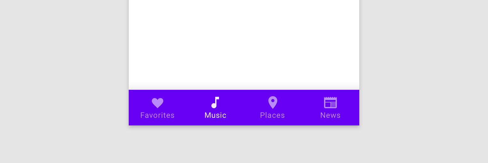
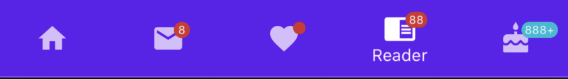
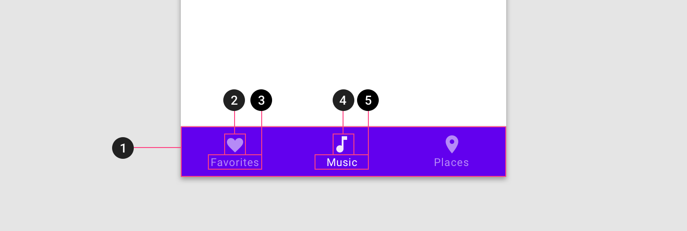
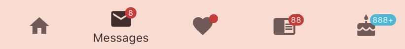

<!--docs:
title: "Bottom navigation"
layout: detail
section: components
excerpt: "Bottom navigation bars allow movement between primary destinations in an app."
iconId: bottom_navigation
path: /catalog/bottomnavigation/
api_doc_root: true
-->

# Bottom navigation

[](https://github.com/material-components/material-components-ios/issues?q=is%3Aopen+is%3Aissue+label%3Atype%3ABug+label%3A%5BBottomNavigation%5D)

Bottom navigation bars allow movement between primary destinations in an app. Tapping on a bottom
navigation icon takes you directly to the associated view or refreshes the currently active view.



## Contents

* [Using bottom navigation](#using-bottom-navigation)
* [Installing bottom navigation](#installing-bottom-navigation)
* [Making bottom navigation accessible](#making-bottom-navigation-accessible)
* [Theming bottom navigation](#theming-bottom-navigation)

- - -

## Using bottom navigation

MDCBottomNavigationBar can be added to a view hierarchy like any UIView. Material Design guidelines recommend always placing bottom navigation at the bottom of the screen.

MDCBottomNavigationBar works much like a UITabBar and both are populated with an array of UITabBarItems. However, MDCBottomNavigationBar is built with Material Design in mind and should be used with other Material Design components where possible to provide a consistent look and feel in an app. Additionally, while MDCBottomNavigationBar has similar features to MDCTabBar, MDCTabBar is chiefly intended for top navigation, whereas MDCBottomNavigationBar — as the name indicates — in intended for bottom navigation.

It is recommended that three to five items are used to populate the content of the bottom navigation bar. If there are fewer than three destinations, consider using tabs instead. If your top-level navigation has more than six destinations, provide access to destinations not covered in bottom navigation through alternative locations, such as a navigation drawer.

Title visibility can be configured in three ways: only show the title of the *selected* item, always show title regardless of any item's selection state, and never show title regardless of any item's selection state. The default behavior of bottom navigation is to only show the title for an item that is selected.

In landscape orientation, items can be configured to be justified or compactly clustered together. When items are justified the bottom navigation bar is fitted to the width of the device. Justified items can have their titles shown below their respective icons or adjacent to their respective icons.

### Deprecations

#### `sizeThatFitsIncludesSafeArea`

The current implementation of `-[MDCBottomNavigationBar sizeThatFits:]` incorrectly uses
`safeAreaInsets` to increase the desired size. Instead, the superview or view controller should be
extending the height of the `MDCBottomNavigationBar` so that it extends out of the safe area and to
the bottom edge of the screen.

Code that currently relies on this behavior must migrate to correct view management. To stop
`MDCBottomNavigationBar` from including `safeAreaInsets` in its calculations, set
`sizeThatFitsIncludesSafeArea = NO`.  At that point, you will likely need to update your layout
code.  If you are using constraints-based layout, `intrinsicContentSize` will not have this error.
However, manually-computing frames and positioning views will likely require an update.

<!--<div class="material-code-render" markdown="1">-->
#### Swift
```swift
let bottomNavBar = MDCBottomNavigationBar()

override func viewDidLoad() {
  super.viewDidLoad()

  // Disable inclusion of safe area in size calculations.
  bottomNavBar.sizeThatFitsIncludesSafeArea = false
}

func layoutBottomNavBar() {
  let size = bottomNavBar.sizeThatFits(view.bounds.size)
  var bottomNavBarFrame = CGRect(x: 0,
                                 y: view.bounds.height - size.height,
                                 width: size.width,
                                 height: size.height)
  // Extend the Bottom Navigation to the bottom of the screen.
  if #available(iOS 11.0, *) {
    bottomNavBarFrame.size.height += view.safeAreaInsets.bottom
    bottomNavBarFrame.origin.y -= view.safeAreaInsets.bottom
  }
  bottomNavBar.frame = bottomNavBarFrame
}
```

#### Objective-C

```objc
- (void)viewDidLoad {
  [super viewDidLoad];

  self.bottomNavBar = [[MDCBottomNavigationBar alloc] init];
  
  // Disable inclusion of safe area in size calculations.
  self.bottomNavBar.sizeThatFitsIncludesSafeArea = NO;
}

- (void)layoutBottomNavBar {
  CGRect viewBounds = CGRectStandardize(self.view.bounds);
  CGSize size = [self.bottomNavBar sizeThatFits:viewBounds.size];
  UIEdgeInsets safeAreaInsets = UIEdgeInsetsZero;
  // Extend the Bottom Navigation to the bottom of the screen.
  if (@available(iOS 11.0, *)){
    safeAreaInsets = self.view.safeAreaInsets;
  }
  CGRect bottomNavBarFrame = 
      CGRectMake(0, viewBounds.size.height - size.height - safeAreaInsets.bottom, size.width, 
                 size.height + safeAreaInsets.bottom);
  self.bottomNavBar.frame = bottomNavBarFrame;
}
```
<!--</div>-->

## Installing bottom navigation

In order to install bottom navigation with Cocoapods first add it to your `Podfile`:

```bash
pod 'MaterialComponents/BottomNavigation'
```
<!--{: .code-renderer.code-renderer--install }-->

Then, run the following command:

```bash
pod install
```

From there, import the component:

<!--<div class="material-code-render" markdown="1">-->
#### Swift
```swift
import MaterialComponents.MaterialBottomNavigation
```

#### Objective-C

```objc
#import "MaterialBottomNavigation.h"
```
<!--</div>-->

## Making bottom navigation accessible

To help ensure your bottom navigation item is accessible to as many users as possible, please
be sure to review the following recommendations:

* Ensure that your `UITabBarItem`s have appropriate `accessibilityLabel`s. Setting a new
`accessibilityLabel` on a `UITabBarItem` will result in the corresponding bottom navigation
bar item's `accessibilityLabel` changing.

* Set an appropriate `accessibilityValue` value if your item has a badge value. For example,
an item with an inbox icon with a badge value for how many emails are unread. You should explicitly
set the `accessibilityValue` when the badge value doesn't provide enough context. For example, in an inbox
example simply having the value "10" doesn't provide enough context, instead the accessibility value should explain
what the badge value symbolizes. The default value if there is a badge value and you haven't set any
`accessibilityValue` will be that the `accessibilityValue` is the `badgeValue`.

#### Swift
```swift
tabBarItem.accessibilityValue = "10 unread emails"
```

#### Objective-C
```objc
tabBarItem.accessibilityValue = @"10 unread emails";
```

### Minimum touch size

Make sure that your bottom navigation bar respects the minimum touch area. The Material spec calls for
[touch areas that should be least 48 points high and 48 wide](https://material.io/design/layout/spacing-methods.html#touch-click-targets).

#### Swift
```swift
override func viewWillLayoutSubviews() {
super.viewWillLayoutSubviews()
let size = bottomNavBar.sizeThatFits(view.bounds.size)
let bottomNavBarFrame = CGRect(x: 0,
y: view.bounds.height - size.height,
width: size.width,
height: size.height)
bottomNavBar.frame = bottomNavBarFrame
}

```

#### Objective-C
```objc
- (void)viewWillLayoutSubviews {
  [super viewWillLayoutSubviews];
  CGSize size = [_bottomNavigationBar sizeThatFits:self.view.bounds.size];
  CGRect bottomNavBarFrame = CGRectMake(0,
                                        CGRectGetHeight(self.view.bounds) - size.height,
                                        size.width,
                                        size.height);
  _bottomNavigationBar.frame = bottomNavBarFrame;
}

```

## Bottom navigation bar



### Bottom navigation bar example

API and source code:

*   `MDCBottomNavigationBar`
    *   [Class reference](https://material.io/components/ios/catalog/bottomnavigation/api-docs/Classes/MDCBottomNavigationBar.html)
    *   [Class source](https://github.com/material-components/material-components-ios/blob/develop/components/BottomNavigation/src/MDCBottomNavigationBar.h)

To achieve something like the example image above, add the following code to your view controller:

<!--<div class="material-code-render" markdown="1">-->
#### Swift

```swift
bottomNavBar = MDCBottomNavigationBar()
view.addSubview(bottomNavBar)
bottomNavBar.titleVisibility = MDCBottomNavigationBarTitleVisibilitySelected
bottomNavBar.alignment = MDCBottomNavigationBarAlignmentJustifiedAdjacentTitles

let homeItem = UITabBarItem(
    title: "Home",
    image: UIImage(named: "ic_home"),
    tag: 0)
let messagesItem = UITabBarItem(
    title: "Messages",
    image: UIImage(named: "ic_email"),
    tag: 0)
messagesItem.badgeValue = "8"
let favoritesItem = UITabBarItem(
    title: "Favorites",
    image: UIImage(named: "ic_favorite"),
    tag: 0)
favoritesItem.badgeValue = ""
let readerItem = UITabBarItem(
    title: "Reader",
    image: UIImage(named: "ic_reader"),
    tag: 0)
readerItem.badgeValue = "88"

let birthdayItem = UITabBarItem(
    title: "ic_birthday",
    image: UIImage(named: "ic_cake"),
    tag: 0)
birthdayItem.badgeValue = "888+"
bottomNavBar.items = [homeItem, messagesItem, favoritesItem, readerItem, birthdayItem]
bottomNavBar.selectedItem = messagesItem
```

#### Objective-C

```objc
self.bottomNavBar = [[MDCBottomNavigationBar alloc] init];
[self.view addSubview:self.bottomNavBar];
self.bottomNavBar.titleVisibility = MDCBottomNavigationBarTitleVisibilitySelected;
self.bottomNavBar.alignment = MDCBottomNavigationBarAlignmentJustifiedAdjacentTitles;

UITabBarItem *homeItem = [[UITabBarItem alloc] initWithTitle:@"Home"
                                                          image:[UIImage imageNamed:@"ic_home"]
                                                            tag:0];
UITabBarItem *messagesItem = [[UITabBarItem alloc] initWithTitle:@"Messages"
                                                          image:[UIImage imageNamed:@"ic_email"]
                                                            tag:0];
messagesItem.badgeValue = @"8";
UITabBarItem *favoritesItem =
    [[UITabBarItem alloc] initWithTitle:@"Favorites"
                                  image:[UIImage imageNamed:@"ic_favorite"]
                                    tag:0];
favoritesItem.badgeValue = @"";
UITabBarItem *readerItem = [[UITabBarItem alloc] initWithTitle:@"Reader"
                                                         image:[UIImage imageNamed:@"ic_reader"]
                                                           tag:0];
readerItem.badgeValue = @"88";
UITabBarItem *birthdayItem = [[UITabBarItem alloc] initWithTitle:@"ic_birthday"
                                                          image:[UIImage imageNamed:@"ic_cake"]
                                                            tag:0];
birthdayItem.badgeValue = @"888+";
self.bottomNavBar.items = @[ homeItem, messagesItem, favoritesItem, readerItem, birthdayItem ];
self.bottomNavBar.selectedItem = messagesItem;
```

<!--</div>-->

### Anatomy and key properties

The following is an anatomy diagram for the bottom navigation bar:



1. Container
1. Inactive icon
1. Inactive text label
1. Active icon
1. Active text label

#### Container attributes

&nbsp;        | **Attribute**        | **Related methods**      | **Default value**
------------- | -------------------- | ------------------------ | -----------------
**Color**     | `barTintColor` | `-setBarTintColor:` <br/> `-barTintColor` | Surface color
**Elevation** | `elevation`      | `-setElevation:` <br/> `-elevation` | 8

#### Navigation item attributes

&nbsp;        | **Attribute**        | **Related methods**      | **Default value**
------------- | -------------------- | ------------------------ | -----------------
**Title**     | N/A                  | `-[UITabBarItem initWithTitle:image:tag:]` <br/> `-[UITabBarItem initWithTitle:image:selectedImage:]` | N/A
**Unselected color**   | `unselectedItemTintColor`| `-setUnselectedItemTintColor:` <br/> `-unselectedItemTintColor` | `[UIColor grayColor]`
**Selected color**     | `selectedItemTintColor`  | `-setSelectedItemTintColor:` <br/> `-selectedItemTintColor` | `[UIColor blackColor]`

#### Icon attributes

&nbsp;               | **Attribute**                         | **Related methods**                                              | **Default value**
-------------------- | ------------------------------------- | ---------------------------------------------------------------- | -----------------
**Image**            | N/A                                   | `-[UITabBarItem initWithTitle:image:tag:]` <br/> `-[UITabBarItem initWithTitle:image:selectedImage:]` | N/A
**Selected image**  | `selectedImage`                         | `-[UITabBarItem setSelectedImage:]` <br/> `-[UITabBarItem selectedImage]` | `nil`
**Badge value**  | `badgeValue` | `-[UITabBarItem setBadgeValue:]` <br/> `-[UITabBarItem badgeValue]` | `nil`
**Badge color**  | `badgeColor` | `-[UITabBarItem setBadgeColor:]` <br/> `-[UITabBarItem badgeColor]` | `nil`

#### Text label attributes

&nbsp;                    | **Attribute**                          | **Related methods**                                                 | **Default value**
------------------------- | -------------------------------------- | ------------------------------------------------------------------- | -----------------
**Typography**            | `itemTitleFont`                        | `-setItemTitleFont:` <br/> `-itemTitleFont`                         | Headline 6
**Color**                 | `selectedItemTitleColor`               | `-setSelectedItemTitleColor` <br/> `-selectedItemTitleColor`         | `[UIColor blackColor]`

## Theming bottom navigation



You can theme a Material bottom navigation bar using a container scheme and the BottomNavigation theming extension. To achieve something like the
Shrine theming above first add the BottomNavigation theming extension to your project by adding the following line to your Podfile:

<!--<div class="material-code-render" markdown="1">-->

#### Swift

```swift
// Import the BottomNavigation Theming Extensions module
import MaterialComponents.MaterialBottomNavigation_Theming

...

// Apply your app's Container Scheme to the App Bar controller
let containerScheme = MDCContainerScheme()

// Either Primary Theme
bottomNavigation.applyPrimaryTheme(withScheme: containerScheme)

// Or Surface Theme
bottomNavigation.applySurfaceTheme(withScheme: containerScheme)
```

#### Objective-C

```objc
// Import the BottomNavigation Theming Extensions header
#import "MaterialBottomNavigation+Theming.h"

...

// Apply your app's Container Scheme to the App Bar controller
MDCContainerScheme *containerScheme = [[MDCContainerScheme alloc] init];

// Either Primary Theme
[self.bottomNavigation applyPrimaryThemeWithScheme:containerScheme];

// Or Surface Theme
[self.bottomNavigation applySurfaceThemeWithScheme:containerScheme];
```

<!--</div>-->
