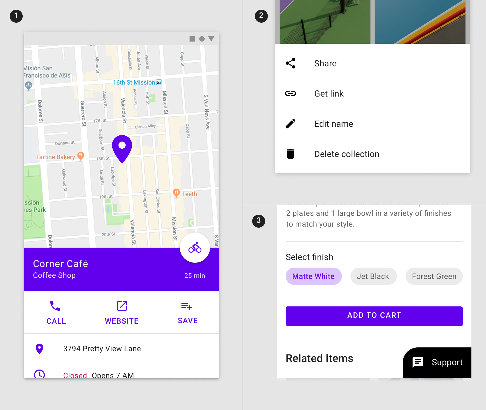
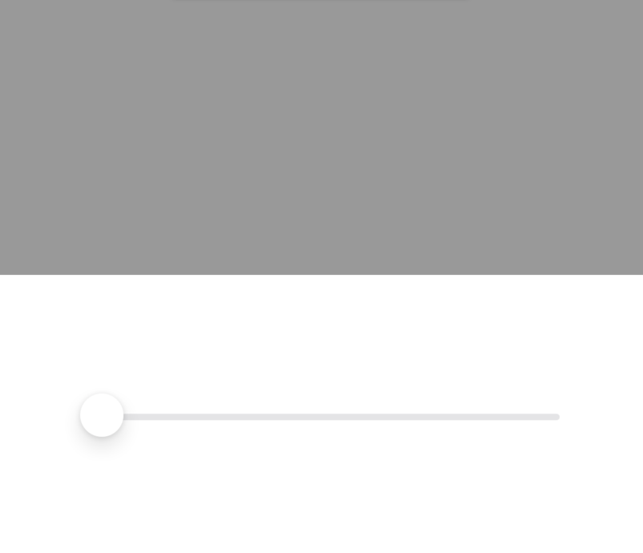

<!--docs:
title: "Sheets: bottom"
layout: detail
section: components
excerpt: "Bottom sheets slide up from the bottom of the screen to reveal more content."
iconId: animation
path: /catalog/bottom-sheet/
api_doc_root: true
-->

# Sheets: bottom

[Bottom sheets](https://material.io/components/sheets-bottom) are surfaces containing supplementary content that are anchored to the bottom of the screen.


**Contents**

* [Using bottom sheets](#using-bottom-sheets)
* [Standard bottom sheet](#standard-bottom-sheet)
* [Modal bottom sheet](#modal-bottom-sheet)
* [Expanding bottom sheet](#expanding-bottom-sheet)

- - -

## Using bottom sheets

Bottom sheets are supplementary surfaces primarily used on mobile. 

### Installing

In order to install with [Cocoapods](https://guides.cocoapods.org/using/getting-started.html), first add the component to your `Podfile`:

```bash
pod 'MaterialComponents/BottomSheet'
```

Then run the installer:

```bash
pod install
```

From there, import the relevant target or file.

<!--<div class="material-code-render" markdown="1">-->

#### Swift
```swift
import MaterialComponents.MaterialBottomSheet
```

#### Objective-C
```objc
#import "MaterialBottomSheet.h"
```
<!--</div>-->

### Making bottom sheets accessible

As a user of the bottom sheet component, it is up to you to determine that its contents are accessible. The bottom sheet ccomponent does not have any specific APIs for managing the accessibility of a bottom sheet's contents. `MDCBottomSheetController` does, however, have such APIs for the scrim:

* `isScrimAccessibilityElement`
* `scrimAccessibilityLabel`
* `scrimAccessibilityHint`
* `scrimAccessibilityTraits`

We recommend giving all of these properties appropriate values for your use case.
 
**Types**

There are three types suitable for different use cases:
1. Standard bottom sheets display content that complements the screen’s primary content and remain visible while users interact with the primary content
1. [Modal bottom sheets](#modal-bottom-sheet) are an alternative to inline menus or simple dialogs on mobile and provide room for additional items, longer descriptions, and iconography, and must be dismissed in order to interact with the underlying content
1. [Expanding bottom sheets](#expanding-bottom-sheet) provide a small, collapsed surface that can be expanded by the user to access a key feature or task to offer the persistent access of a standard sheet with the space and focus of a modal sheet.



_**Note:** Standard bottom sheets aren't supported on iOS. This is because the iOS bottom sheet implementation makes use of custom view controller transitions, which do not allow interaction with the presenting view controller, even when the presented view controller does not take up the whole screen._

## Modal bottom sheet

Modal bottom sheets present a set of choices while blocking interaction with the rest of the screen. They are an alternative to inline menus and simple dialogs on mobile, providing additional room for content, iconography, and actions.

Modal bottom sheets are used in mobile apps only.

### Modal bottom sheet examples

#### Basic modal sheet example

Use `MDCBottomSheetController` and its accompanying presentation controller class, `MDCBottomSheetPresentationController`, to achieve a modal bottom sheet on iOS. 

* [`MDCBottomSheetController`GitHub source](https://github.com/material-components/material-components-ios/blob/develop/components/BottomSheet/src/MDCBottomSheetController.h)
* [`MDCBottomSheetPresentationController` GitHub source](https://github.com/material-components/material-components-ios/blob/develop/components/BottomSheet/src/MDCBottomSheetPresentationController.h)



Something like the above example can be achieved using the code below.

<!--<div class="material-code-render" markdown="1">-->
#### Swift
```swift
// View controller the bottom sheet will hold
let viewController: ViewController = ViewController()
// Initialize the bottom sheet with the view controller just created
let bottomSheet: MDCBottomSheetController = MDCBottomSheetController(contentViewController: viewController)
// At this point perform any customizations, like adding a slider, for example.
// Present the bottom sheet
present(bottomSheet, animated: true, completion: nil)
```

#### Objective-C
```objc
// View controller the bottom sheet will hold
ViewController *viewController = [[ViewController alloc] init];
// Initialize the bottom sheet with the view controller just created
MDCBottomSheetController *bottomSheet = [[MDCBottomSheetController alloc] initWithContentViewController:viewController];
// At this point perform any customizations, like adding a slider, for example.
// Present the bottom sheet
[self presentViewController:bottomSheet animated:true completion:nil];
```
<!--</div>-->

#### Behavioral customizations

You can also choose to have your bottom sheet not be dismissable when dragged downwards by using the `dismissOnDraggingDownSheet` property on `MDCBottomSheetController`.

<!--<div class="material-code-render" markdown="1">-->
#### Swift
```swift
let viewController: ViewController = ViewController()
let bottomSheet: MDCBottomSheetController = MDCBottomSheetController(contentViewController: viewController)

bottomSheet.dismissOnDraggingDownSheet = false

present(bottomSheet, animated: true, completion: nil)
```

#### Objective-C
```objc
ViewController *viewController = [[ViewController alloc] init];
MDCBottomSheetController *bottomSheet = [[MDCBottomSheetController alloc] initWithContentViewController:viewController];

bottomSheet.dismissOnDraggingDownSheet = NO;

[self presentViewController:bottomSheet animated:true completion:nil];
```
<!--</div>-->

### Anatomy and key properties

The following shows the anatomy of a modal bottom sheet:


1. Sheet
2. Contents
3. Scrim

_**Note: A bottom sheet similar to the one shown above is easily attainable with the [ActionSheet](https://github.com/material-components/material-components-ios/tree/develop/components/ActionSheet) component, which makes use of `MDCBottomSheetPresentationController`.**_

#### Sheet properties

&nbsp;                | **Attribute**             | **Related methods**                                    | **Default value**
----------------------| --------------------------| ------------------------------------------------------ | -----------------
**Sheet height**      | `preferredSheetHeight`          | `-[MDCBottomSheetPresentationController setPreferredSheetHeight:]` <br/> `-[MDCBottomSheetPresentationController preferredSheetHeight]` | N/A
**Elevation**             | `elevation`          | `-[MDCBottomSheetPresentationController setElevation:]` <br/> `-[MDCBottomSheetPresentationController elevation]`| 16

#### Contents properties

&nbsp;                | **Attribute**             | **Related methods**                                    | **Default value**
----------------------| --------------------------| ------------------------------------------------------ | -----------------
**Contents**      | `contentViewController`       | `-[MDCBottomSheetController initWithContentViewController:]` <br/> `-[MDCBottomSheetController contentViewController]` | N/A
**Elevation**             | `elevation`          | `-[MDCBottomSheetPresentationController setElevation:]` <br/> `-[MDCBottomSheetPresentationController elevation]`| 16
**Title text**             | `title`          | `-[MDCActionSheetComtroller setTitle:]` <br/> `-[MDCActionSheetComtroller title]` | `nil`
**Message text**             | `message`          | `-[MDCActionSheetComtroller setMessage:]` <br/> `-[MDCActionSheetComtroller message]` | `nil`
**Title font**             | `titleFont`          | `-[MDCActionSheetComtroller setTitleFont:]` <br/> `-[MDCActionSheetComtroller titleFont]` | `nil`
**Message font**             | `messageFont`          | `-[MDCActionSheetComtroller setMessageFont:]` <br/> `-[MDCActionSheetComtroller messageFont]` | `nil`
**Action font**             | `actionFont`          | `-[MDCActionSheetComtroller setActionFont:]` <br/> `-[MDCActionSheetComtroller actionFont]` | `nil`
**Ripple color**             | `rippleColor`          | `-[MDCActionSheetComtroller setRippleColor:]` <br/> `-[MDCActionSheetComtroller rippleColor]` | `nil`
**Background color**             | `backgroundColor`          | `-[MDCActionSheetComtroller -setBackgroundColor:]` <br/> `-[MDCActionSheetComtroller backgroundColor]` | `nil`
**Title text color**             | `titleTextColor`          | `-[MDCActionSheetComtroller -setTitleTextColor:]` <br/> `-[MDCActionSheetComtroller titleTextColor]` | `nil`
**Message text color**             | `messageTextColor`          | `-[MDCActionSheetComtroller -setMessageTextColor:]` <br/> `-[MDCActionSheetComtroller messageTextColor]` | `nil`
**Action text color**             | `actionTextColor`          | `-[MDCActionSheetComtroller -setActionTextColor:]` <br/> `-[MDCActionSheetComtroller actionTextColor]` | `nil`
**Action tint color**             | `actionTintColor`          | `-[MDCActionSheetComtroller -setActionTintColor:]` <br/> `-[MDCActionSheetComtroller actionTintColor]` | `nil`

#### Scrim properties

&nbsp;                | **Attribute**             | **Related methods**                                    | **Default value**
----------------------| --------------------------| ------------------------------------------------------ | -----------------
**Color**      | `scrimColor`          | `-[MDCBottomSheetPresentationController setScrimColor:]` <br/> `-[MDCBottomSheetPresentationController scrimColor]` | White at 40% opacity

## Expanding bottom sheet

An expanding bottom sheet is a surface anchored to the bottom of the screen that users can expand to access a feature or task. It can be used for:

* **Persistently displaying a cross-app feature**, such as a shopping cart
* **Collecting and acting on user selections** from a set of items, such as photos in a gallery
* **Supporting tasks**, such as chat and comments
* **Indirect navigation between items**, such as videos in a playlist

Expanding bottom sheets are recommended for use on mobile and tablet.

### Expanding bottom sheet example

To generate an expanding bottom sheet on iOS, set the `trackingScrollView` property on your `MDCBottomSheetController`. If the `contentSize` of the scroll view has a large enough height the bottom sheet will expand to the top.

<!--<div class="material-code-render" markdown="1">-->
#### Swift
```swift
bottomSheet.trackingScrollView = scrollView
```

#### Objective-C
```objc
bottomSheet.trackingScrollView = self.scrollView;
```
<!--</div>-->
