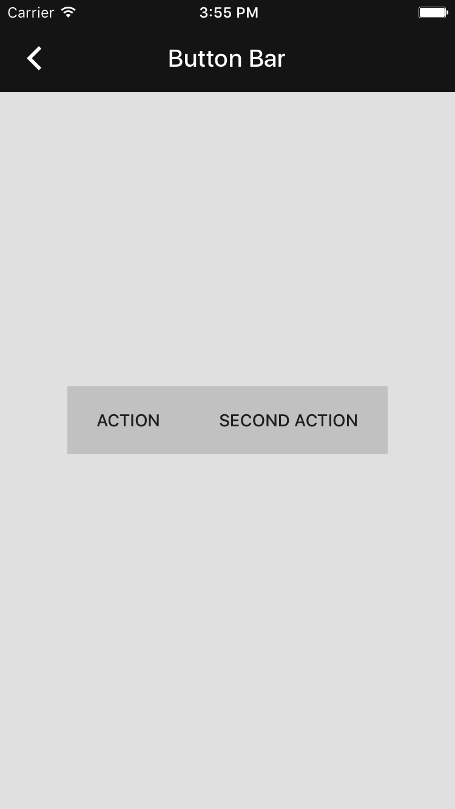

<!-- This file was auto-generated using ./scripts/generate_readme ButtonBar -->

# Button bar

[](https://github.com/material-components/material-components-ios/issues?q=is%3Aopen+is%3Aissue+label%3Atype%3ABug+label%3A%5BButtonBar%5D)

<div class="article__asset article__asset--screenshot">
  
</div>

The Button Bar is a view that represents a list of UIBarButtonItems as horizontally aligned buttons.

## Design & API documentation

<ul class="icon-list">
  <li class="icon-list-item icon-list-item--spec"><a href="https://material.io/go/design-app-bar-top">Material Design guidelines: App bars: top</a></li>
</ul>

## Related components

<ul class="icon-list">
  <li class="icon-list-item icon-list-item--link"><a href="../NavigationBar">NavigationBar</a></li>
</ul>

## Table of contents

- [Overview](#overview)
- [Installation](#installation)
  - [Installation with CocoaPods](#installation-with-cocoapods)
  - [Importing](#importing)
- [Usage](#usage)
  - [Typical use](#typical-use)
  - [Supported UIBarButtonItem properties](#supported-uibarbuttonitem-properties)
- [Extensions](#extensions)
  - [Color Theming](#color-theming)
  - [Typography Theming](#typography-theming)

- - -

## Overview

A Button Bar is similar in concept to a UIToolbar, but Button Bars are **not** a drop-in API
replacement for UIToolbar. Button Bars are slightly more versatile in that one might use a Button
Bar to create a Toolbar or a Navigation Bar (left/right button bars).

Button Bar supports a subset of UIBarButtonItem's properties. Learn more by reading the section on
[UIBarButtonItem properties](#uibarbuttonitem-properties).

## Installation

<!-- Extracted from docs/../../../docs/component-installation.md -->

### Installation with CocoaPods

Add the following to your `Podfile`:

```bash
pod 'MaterialComponents/ButtonBar'
```
<!--{: .code-renderer.code-renderer--install }-->

Then, run the following command:

```bash
pod install
```

### Importing

To import the component:

<!--<div class="material-code-render" markdown="1">-->
#### Swift
```swift
import MaterialComponents.MaterialButtonBar
```

#### Objective-C

```objc
#import "MaterialButtonBar.h"
```
<!--</div>-->


## Usage

<!-- Extracted from docs/typical-use.md -->

### Typical use

<!--<div class="material-code-render" markdown="1">-->
#### Swift
```swift
let buttonBar = MDCButtonBar()

let actionItem = UIBarButtonItem(
  title: "<# title #>",
  style: .done, // ignored
  target: self,
  action: "<# selector #>"
)

buttonBar.items = [actionItem]

let size = buttonBar.sizeThatFits(self.view.bounds.size)
buttonBar.frame = CGRect(x: <# x #>, y: <# y #>, width: size.width, height: size.height)
self.view.addSubview(buttonBar)
```

#### Objective-C

```objc
MDCButtonBar *buttonBar = [[MDCButtonBar alloc] init];

UIBarButtonItem *actionItem =
    [[UIBarButtonItem alloc] initWithTitle:@"<# title #>"
                                     style:UIBarButtonItemStyleDone // ignored
                                    target:self
                                    action:@selector(<# selector #>)];

buttonBar.items = @[ actionItem ];

CGSize size = [buttonBar sizeThatFits:self.view.bounds.size];
CGPoint origin = CGPointZero;
buttonBar.frame = CGRectMake(origin.x, origin.y, size.width, size.height);
[self.view addSubview:buttonBar];

```
<!--</div>-->

<!-- Extracted from docs/supported-uibarbuttonitem-properties.md -->

### Supported UIBarButtonItem properties

The following properties are taken into consideration when `items` is set and the corresponding
buttons are created.

Changes made to properties marked (observed) will be reflected in the corresponding buttons.

- `title` (observed)
- `image` (observed)
- `enabled` (observed)
- `width`
- `target`
- `action`
- `titleTextAttributesForState:`

TODO(featherless): File bugs to observe the rest of the properties.

Note: in order to make Button Bar reflect changes to not-observed properties you must clear the
MDCButtonBar instance's `items` property and reset it, like so:

<!--<div class="material-code-render" markdown="1">-->
#### Swift
```swift
actionItem.target = <some other target>

let items = buttonBar.items
buttonBar.items = nil
buttonBar.items = items
```

#### Objective-C

```objc
actionItem.target = <some other target>;

NSArray *items = buttonBar.items;
buttonBar.items = nil;
buttonBar.items = items;
```
<!--</div>-->


## Extensions

<!-- Extracted from docs/color-theming.md -->

### Color Theming

You can theme a button bar with your app's color scheme using the ColorThemer extension.

You must first add the Color Themer extension to your project:

```bash
pod 'MaterialComponents/ButtonBar+ColorThemer'
```

<!--<div class="material-code-render" markdown="1">-->
#### Swift
```swift
// Step 1: Import the ColorThemer extension
import MaterialComponents.MaterialButtonBar_ColorThemer

// Step 2: Create or get a color scheme
let colorScheme = MDCSemanticColorScheme()

// Step 3: Apply the color scheme to your component
MDCButtonBarColorThemer.applySemanticColorScheme(colorScheme, to:buttonBar)
```

#### Objective-C

```objc
// Step 1: Import the ColorThemer extension
#import "MaterialButtonBar+ColorThemer.h"

// Step 2: Create or get a color scheme
id<MDCColorScheming> colorScheme = [[MDCSemanticColorScheme alloc] initWithDefaults:MDCColorSchemeDefaultsMaterial201804];

// Step 3: Apply the color scheme to your component
[MDCButtonBarColorThemer applySemanticColorScheme:colorScheme
     toButtonBar:buttonBar];
```
<!--</div>-->

<!-- Extracted from docs/typography-theming.md -->

### Typography Theming

You can theme a button bar with your app's typography scheme using the TypographyThemer extension.

You must first add the Typography Themer extension to your project:

```bash
pod 'MaterialComponents/ButtonBar+TypographyThemer'
```

<!--<div class="material-code-render" markdown="1">-->
#### Swift
```swift
// Step 1: Import the TypographyThemer extension
import MaterialComponents.MaterialButtonBar_TypographyThemer

// Step 2: Create or get a typography scheme
let typographyScheme = MDCTypographyScheme()

// Step 3: Apply the typography scheme to your component
MDCButtonBarTypographyThemer.applyTypographyScheme(typographyScheme, to: buttonBar)
```

#### Objective-C

```objc
// Step 1: Import the TypographyThemer extension
#import "MaterialButtonBar+TypographyThemer.h"

// Step 2: Create or get a typography scheme
id<MDCTypographyScheming> typographyScheme = [[MDCTypographyScheme alloc] init];

// Step 3: Apply the typography scheme to your component
[MDCButtonBarTypographyThemer applyTypographyScheme:colorScheme
     toButtonBar:buttonBar];
```
<!--</div>-->

