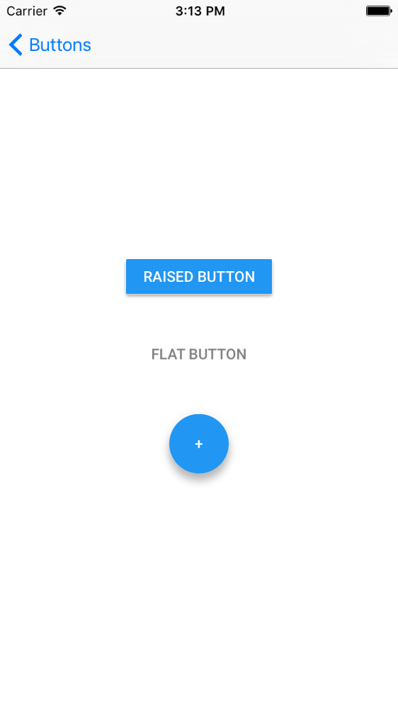

# Buttons

<!--{: .ios-screenshot .right }-->

Buttons is a collection of material buttons, including a flat button, a raised button and a floating
action button.
<!--{: .intro }-->

### Material Design Specifications

<ul class="icon-list">
  <li class="icon-link"><a href="http://www.google.com/design/spec/components/buttons.html">Buttons</a></li>
</ul>

### API Documentation

<ul class="icon-list">
  <li class="icon-link"><a href="/apidocs/Buttons/Classes/MDCButton.html">MDCButton</a></li>
  <li class="icon-link"><a href="/apidocs/Buttons/Classes/MDCFlatButton.html">MDCFlatButton</a></li>
  <li class="icon-link"><a href="/apidocs/Buttons/Classes/MDCFloatingButton.html">MDCFloatingButton</a></li>
  <li class="icon-link"><a href="/apidocs/Buttons/Classes/MDCRaisedButton.html">MDCRaisedButton</a></li>
</ul>

- - -

## Button Types

### Flat Button
The _flat button_ does not have its own background color and does not raise when touched. Use a flat
button in most situations requiring a button.

### Raised Button
The _raised button_ has its own background color. It floats above its parent slightly, and raises
briefly when touched. A raised button should be used when a flat button would get lost among other
UI elements on the screen.

### Floating Action Button
The _floating action_ button is circular, floats a considerable amount above its parent, has its own
background color, and also raises briefly when touched. Only use a floating action button for the
main action of a screen.

- - -

## Installation

### Requirements

- Xcode 7.0 or higher.
- iOS SDK version 7.0 or higher.

### Installation with CocoaPods

To add the Buttons component to your Xcode project using CocoaPods, add the following to your PodFile:

~~~ bash
$ pod 'MaterialComponents/Buttons'
~~~

Then, run the following command:

~~~ bash
$ pod install
~~~

- - -

## Usage

### Ink splash animation
All buttons display animated ink splashes when the user interacts with the button.

### Background color
For non-flat buttons, the background color is determined from the enabled, disabled-light, and
disabled-dark background color properties. Flat buttons have a transparent background.

### Disabled state
When disabled, material buttons take on a specific semi-transparent appearance which depends on
whether the button is on a light background or a dark background.

### Title and title color
Set the title color of the button to have an accessible contrast ratio with the button's background
color. The caller is responsible for setting (and updating, if necessary) the button's
`underlyingColor` property for flat buttons.

### Touch exclusivity and simultaneous UI interaction
All buttons set the `exclusiveTouch` property to YES by default, which prevents users from
simultaneously interacting with a button and other UI elements.

- - -

## Examples

### Create a Flat Button

<!--
-->
#### Objective-C

~~~ objc
MDCFlatButton *flatButton = [MDCFlatButton new];
[flatButton setTitle:@"Tap Me" forState:UIControlStateNormal];
[flatButton setCustomTitleColor:[UIColor grayColor]];
[flatButton sizeToFit];
[flatButton addTarget:self
               action:@selector(tap:)
     forControlEvents:UIControlEventTouchUpInside];
[self.view addSubview:flatButton];
~~~

#### Swift
~~~ swift
let flatButton = MDCFlatButton()
flatButton.customTitleColor = UIColor.grayColor()
flatButton.setTitle("Tap me", forState: .Normal)
flatButton.sizeToFit()
flatButton.addTarget(self, action: "tap:", forControlEvents: .TouchUpInside)
self.view.addSubview(flatButton)
~~~
<!--
-->

### Create a Raised Button

Create a Raised button and change its default elevation.
The default elevation for _raised buttons_ in resting state is 2 dp.

<!--
-->
#### Objective-C

~~~ objc
MDCRaisedButton *raisedButton = [MDCRaisedButton new];
// See https://www.google.com/design/spec/what-is-material/elevation-shadows.html
[raisedButton setElevation:4.0f forState:UIControlStateNormal];
[raisedButton setTitle:@"Tap Me Too" forState:UIControlStateNormal];
[raisedButton sizeToFit];
[raisedButton addTarget:self action:@selector(didTap:) forControlEvents:UIControlEventTouchUpInside];
[self.view addSubview:raisedButton];
~~~

#### Swift
~~~ swift
let raisedButton = MDCRaisedButton()
// See https://www.google.com/design/spec/what-is-material/elevation-shadows.html
raisedButton.setElevation(4, forState: .Normal)
raisedButton.setTitle("Tap Me Too", forState: .Normal)
raisedButton.sizeToFit()
raisedButton.addTarget(self, action: "tap:", forControlEvents: .TouchUpInside)
self.view.addSubview(raisedButton)
~~~

<!--
-->

### Create a Floating Action Button

<!--
-->
#### Objective-C

~~~ objc
MDCFloatingButton *floatingButton = [MDCFloatingButton new];
[floatingButton setTitle:@"+" forState:UIControlStateNormal];
[floatingButton sizeToFit];
[floatingButton addTarget:self
                   action:@selector(didTap:)
         forControlEvents:UIControlEventTouchUpInside];
[self.view addSubview:floatingButton];
~~~

#### Swift

~~~ swift
let floatingButton = MDCFloatingButton()
floatingButton.setTitle("+", forState: .Normal)
floatingButton.sizeToFit()
floatingButton.addTarget(self, action: "tap:", forControlEvents: .TouchUpInside)
self.view.addSubview(floatingButton)
~~~

<!--
-->

