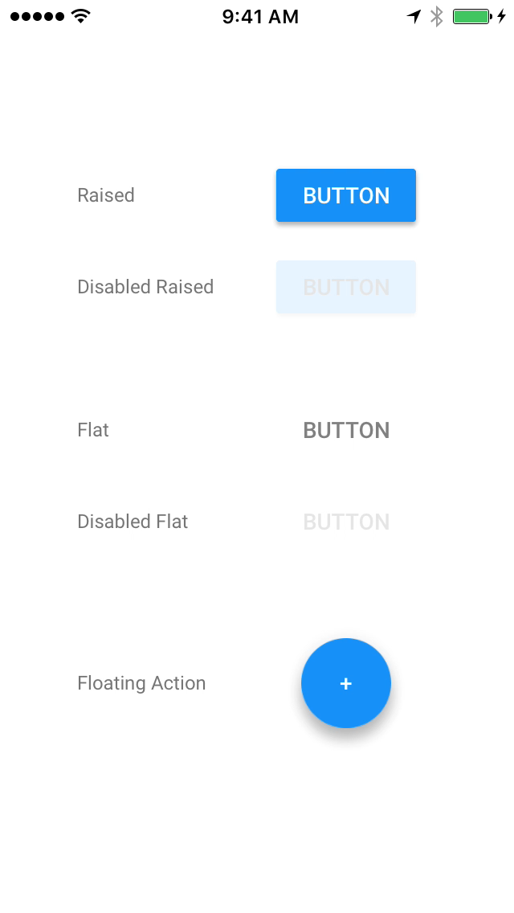

<!--docs:
title: "Buttons"
layout: detail
section: components
excerpt: "Buttons is a collection of Material Design buttons, including a flat button, a raised button and a floating action button."
iconId: button
path: /catalog/buttons/
api_doc_root: true
-->

# Buttons

<div class="article__asset article__asset--screenshot">
  
</div>

Buttons is a collection of Material Design buttons, including a flat button, a raised button and a
floating action button.

## Design & API Documentation

<ul class="icon-list">
  <li class="icon-list-item icon-list-item--spec"><a href="https://material.io/guidelines/components/buttons.html">Material Design guidelines: Buttons</a></li>
  <li class="icon-list-item icon-list-item--link"><a href="https://material.io/components/ios/catalog/buttons/api-docs/Classes/MDCButton.html">API: MDCButton</a></li>
  <li class="icon-list-item icon-list-item--link"><a href="https://material.io/components/ios/catalog/buttons/api-docs/Classes/MDCFlatButton.html">API: MDCFlatButton</a></li>
  <li class="icon-list-item icon-list-item--link"><a href="https://material.io/components/ios/catalog/buttons/api-docs/Classes/MDCFloatingButton.html">API: MDCFloatingButton</a></li>
</ul>

- - -

## Button Types

### Flat Button
The _flat button_ does not have its own background color and does not raise when touched. Use a flat
button in most situations requiring a button.

### Raised Button
The _raised button_ has its own background color. It floats above its parent slightly, and raises
briefly when touched. A raised button should be used when a flat button would get lost among other
UI elements on the screen.

### Floating Action Button
The _floating action_ button is circular, floats a considerable amount above its parent, has its own
background color, and also raises briefly when touched. Only use a floating action button for the
main action of a screen.

Flat button, raised button and floating action buttons all inherit from the same MDCButton class.
You should not directly instantiate an MDCButton object.

- - -

## Installation

### Requirements

- Xcode 8.3.3 or higher.
- iOS SDK version 8.0 or higher.

### Installation with CocoaPods

To add this component to your Xcode project using CocoaPods, add the following to your `Podfile`:

```
pod 'MaterialComponents/Buttons'
```
<!--{: .code-renderer.code-renderer--install }-->

To add this component along with its themer and other related extensions, please add the following instead:
``` bash
pod 'MaterialComponents/Buttons+Extensions'
```

Then, run the following command:

``` bash
pod install
```

- - -


## Usage

### Importing

Before using a Button, you'll need to import the button you want to use:

<!--<div class="material-code-render" markdown="1">-->
#### Swift
``` swift
import MaterialComponents
```

#### Objective-C

``` objc
#import "MaterialButtons.h"
```
<!--</div>-->

### Ink splash animation
All buttons display animated ink splashes when the user interacts with the button.

### Background color
For non-flat buttons, the background color is determined from the UIControlState. Changing the
background color can be accomplished by calling `-setBackgroundColor:forState:`. Flat buttons have a
transparent background.

### Disabled state
When disabled, Material buttons take on a specific semi-transparent appearance which depends on
whether the button is on a light background or a dark background.

### Title and title color
Set the title color of the button to have an accessible contrast ratio with the button's background
color. The caller is responsible for setting (and updating, if necessary) the button's
`underlyingColor` property for flat buttons.

### Touch exclusivity and simultaneous UI interaction
All buttons set the `exclusiveTouch` property to YES by default, which prevents users from
simultaneously interacting with a button and other UI elements.

- - -


## Examples

### Create a Flat Button

<!--<div class="material-code-render" markdown="1">-->
#### Swift
``` swift
let flatButton = MDCFlatButton()
flatButton.customTitleColor = UIColor.gray
flatButton.setTitle("Tap me", for: .normal)
flatButton.sizeToFit()
flatButton.addTarget(self, action: #selector(tap), for: .touchUpInside)
self.view.addSubview(flatButton)
```

#### Objective-C

``` objc
MDCFlatButton *flatButton = [[MDCFlatButton alloc] init];
[flatButton setTitle:@"Tap Me" forState:UIControlStateNormal];
[flatButton setCustomTitleColor:[UIColor grayColor]];
[flatButton sizeToFit];
[flatButton addTarget:self
               action:@selector(tap:)
     forControlEvents:UIControlEventTouchUpInside];
[self.view addSubview:flatButton];
```
<!--</div>-->


### Create a Raised Button

Create a Raised button and change its default elevation.
The default elevation for _raised buttons_ in resting state is 2 dp.

<!--<div class="material-code-render" markdown="1">-->
#### Swift
``` swift
let raisedButton = MDCRaisedButton()
// See https://material.io/guidelines/what-is-material/elevation-shadows.html

raisedButton.setElevation(4, for: .normal)
raisedButton.setTitle("Tap Me Too", for: .normal)
raisedButton.sizeToFit()
raisedButton.addTarget(self, action: #selector(tap), for: .touchUpInside)
self.view.addSubview(raisedButton)
```

#### Objective-C

``` objc
MDCRaisedButton *raisedButton = [[MDCRaisedButton alloc] init];
// See https://material.io/guidelines/what-is-material/elevation-shadows.html

[raisedButton setElevation:4.0f forState:UIControlStateNormal];
[raisedButton setTitle:@"Tap Me Too" forState:UIControlStateNormal];
[raisedButton sizeToFit];
[raisedButton addTarget:self action:@selector(didTap:) forControlEvents:UIControlEventTouchUpInside];
[self.view addSubview:raisedButton];
```
<!--</div>-->


### Create a Floating Action Button

<!--<div class="material-code-render" markdown="1">-->
#### Swift

``` swift
let floatingButton = MDCFloatingButton()
floatingButton.setTitle("+", for: .normal)
floatingButton.sizeToFit()
floatingButton.addTarget(self, action: #selector(tap), for: .touchUpInside)
self.view.addSubview(floatingButton)
```

#### Objective-C

``` objc
MDCFloatingButton *floatingButton = [[MDCFloatingButton alloc] init];
[floatingButton setTitle:@"+" forState:UIControlStateNormal];
[floatingButton sizeToFit];
[floatingButton addTarget:self
                   action:@selector(didTap:)
         forControlEvents:UIControlEventTouchUpInside];
[self.view addSubview:floatingButton];
```
<!--</div>-->


### Configuring a Floating Action Button
The floating action button can be configured with a combination of `shape` and `mode`. The 
`.default` shape is a 56-point circle containing a single image or short title. The `.mini` shape
is a smaller, 40-point circle.  The `.normal` mode is a circle containing an image or short title.
The `.expanded` mode is a "pill shape" and should include both an image and a single-word title. The
`.expanded` mode should only be used in the largest layouts. For example, an iPad in full screen.

While in the `.expanded` mode, a floating button can position its `imageView` to either the leading
or trailing side of the title by setting the `imageLocation` property.

Because of the combination of shapes and modes available to the floating action button, some
UIButton property setters have been made unavailable and replaced with methods to set them for a 
specific mode and shape combination.  Although the `shape` value of a floating button cannot change,
supporting UIAppearance requires providing the `shape` as an argument. Getters for these values are
not available, and the normal getter will return the current value of the property.

* `-setContentEdgeInsets` is replaced with `-setContentEdgeInsets:forShape:inMode:`
* `-setHitAreaInsets` is replaced with `-setHitAreaInsets:forShape:inMode:`
* `-setMinimumSize` is replaced with `-setMinimumSize:forShape:inMode:`
* `-setMaximumSize` is replaced with `-setMaximumSize:forShape:inMode:`
