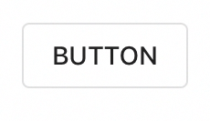

<!--docs:
title: "Buttons"
layout: detail
section: components
excerpt: "Material design buttons allow users to take actions, and make choices, with a single tap."
iconId: button
path: /catalog/buttons/
api_doc_root: true
-->

<!-- This file was auto-generated using ./scripts/generate_readme Buttons -->

# Buttons

[](https://github.com/material-components/material-components-ios/issues?q=is%3Aopen+is%3Aissue+label%3Atype%3ABug+label%3A%5BButtons%5D)

Material design buttons allow users to take actions, and make choices, with a single tap. There are
many distinct button styles including text buttons, contained buttons, and floating action buttons.

   

## Design & API documentation

<ul class="icon-list">
  <li class="icon-list-item icon-list-item--spec"><a href="https://material.io/go/design-buttons">Material Design guidelines: Buttons</a></li>
  <li class="icon-list-item icon-list-item--link">Class: <a href="https://material.io/components/ios/catalog/buttons/api-docs/Classes.html#/c:objc(cs)MDCRaisedButton">MDCRaisedButton</a></li>
  <li class="icon-list-item icon-list-item--link">Class: <a href="https://material.io/components/ios/catalog/buttons/api-docs/Classes/MDCButton.html">MDCButton</a></li>
  <li class="icon-list-item icon-list-item--link">Class: <a href="https://material.io/components/ios/catalog/buttons/api-docs/Classes/MDCFlatButton.html">MDCFlatButton</a></li>
  <li class="icon-list-item icon-list-item--link">Class: <a href="https://material.io/components/ios/catalog/buttons/api-docs/Classes/MDCFloatingButton.html">MDCFloatingButton</a></li>
  <li class="icon-list-item icon-list-item--link">Enumeration: <a href="https://material.io/components/ios/catalog/buttons/api-docs/Enums.html">Enumerations</a></li>
  <li class="icon-list-item icon-list-item--link">Enumeration: <a href="https://material.io/components/ios/catalog/buttons/api-docs/Enums/MDCFloatingButtonImageLocation.html">MDCFloatingButtonImageLocation</a></li>
  <li class="icon-list-item icon-list-item--link">Enumeration: <a href="https://material.io/components/ios/catalog/buttons/api-docs/Enums/MDCFloatingButtonMode.html">MDCFloatingButtonMode</a></li>
  <li class="icon-list-item icon-list-item--link">Enumeration: <a href="https://material.io/components/ios/catalog/buttons/api-docs/Enums/MDCFloatingButtonShape.html">MDCFloatingButtonShape</a></li>
</ul>

## Table of contents

- [Overview](#overview)
- [Installation](#installation)
  - [Installation with CocoaPods](#installation-with-cocoapods)
  - [Importing](#importing)
- [Usage](#usage)
  - [Typical use](#typical-use)
  - [Typical use: floating action buttons](#typical-use-floating-action-buttons)
  - [Customizing elevation](#customizing-elevation)
  - [Customizing floating action buttons](#customizing-floating-action-buttons)
  - [Interface Builder](#interface-builder)
- [Extensions](#extensions)
  - [Theming](#theming)
  - [How to theme an MDCButton](#how-to-theme-an-mdcbutton)
  - [How to theme an MDCFloatingButton](#how-to-theme-an-mdcfloatingbutton)
- [Accessibility](#accessibility)
  - [Set `-accessibilityLabel`](#set-`-accessibilitylabel`)
  - [Minimum touch size](#minimum-touch-size)
- [Unsupported](#unsupported)
  - [How to theme a button using a themer](#how-to-theme-a-button-using-a-themer)
  - [Color Theming](#color-theming)
  - [Typography Theming](#typography-theming)
  - [Shape Theming](#shape-theming)

- - -

## Overview

`MDCButton` is a highly-configurable UIButton implementation that provides support for shadow
elevation, Material Design ripples, and other stateful design APIs.

## Installation

<!-- Extracted from docs/../../../docs/component-installation.md -->

### Installation with CocoaPods

Add the following to your `Podfile`:

```bash
pod 'MaterialComponents/Buttons'
```
<!--{: .code-renderer.code-renderer--install }-->

Then, run the following command:

```bash
pod install
```

### Importing

To import the component:

<!--<div class="material-code-render" markdown="1">-->
#### Swift
```swift
import MaterialComponents.MaterialButtons
```

#### Objective-C

```objc
#import "MaterialButtons.h"
```
<!--</div>-->


## Usage

<!-- Extracted from docs/typical-use.md -->

### Typical use

`MDCButton` is a subclass of UIButton, but with more options for customizing the button's style and
behavior. To initialize an MDCButton, you must alloc/init an instance directly instead of using
`buttonWithType:`, which has been marked unavailable.

<!--<div class="material-code-render" markdown="1">-->
#### Swift
```swift
let button = MDCButton()
```

#### Objective-C

```objc
MDCButton *button = [[MDCButton alloc] init];
```
<!--</div>-->

See the
[MDCButton API docs](https://material.io/develop/ios/components/buttons/api-docs/Classes/MDCButton.html)
for a complete list of features that MDCButton provides in addition to UIButton's features.

<!-- Extracted from docs/typical-use-floating-action-buttons.md -->

### Typical use: floating action buttons

MDCFloatingButton is a subclass of MDCButton that implements the Material Design floating action
button style and behavior. Floating action buttons should be provided with a templated image for
their normal state and then themed accordingly.

<!--<div class="material-code-render" markdown="1">-->
#### Swift

```swift
// Note: you'll need to provide your own image - the following is just an example.
let plusImage = UIImage(named: "plus").withRenderingMode(.alwaysTemplate)
let button = MDCFloatingButton()
button.setImage(plusImage, forState: .normal)
```

#### Objective-C

```objc
// Note: you'll need to provide your own image - the following is just an example.
UIImage *plusImage =
    [[UIImage imageNamed:@"plus"] imageWithRenderingMode:UIImageRenderingModeAlwaysTemplate];
MDCFloatingButton *button = [[MDCFloatingButton alloc] init];
[button setImage:plusImage forState:UIControlStateNormal];
```
<!--</div>-->

<!-- Extracted from docs/customizing-elevation.md -->

### Customizing elevation

The elevation of a button can be changed for a given control state using `setElevation:forState:`.

See the [Material Design shadow guidelines](https://material.io/guidelines/what-is-material/elevation-shadows.html) for a detailed
overview of different shadow elevations.

For example, to make a button elevate on tap like a floating action button:

<!--<div class="material-code-render" markdown="1">-->
#### Swift
```swift
button.setElevation(6, for: .normal)
button.setElevation(12, for: .highlighted)
```

#### Objective-C

```objc
[button setElevation:6 forState:UIControlStateNormal];
[button setElevation:12 forState:UIControlStateNormal];
```
<!--</div>-->

<!-- Extracted from docs/customizing-floating-action-buttons.md -->

### Customizing floating action buttons

A floating action button can be configured with a combination of `shape` and `mode`. The 
`.default` shape is a 56-point circle containing a single image or short title. The `.mini` shape
is a smaller, 40-point circle.  The `.normal` mode is a circle containing an image or short title.
The `.expanded` mode is a "pill shape" and should include both an image and a single-word title. The
`.expanded` mode should only be used in the largest layouts. For example, an iPad in full screen.

While in the `.expanded` mode, a floating button can position its `imageView` to either the leading
or trailing side of the title by setting the `imageLocation` property.

Because of the combination of shapes and modes available to the floating action button, some
UIButton property setters have been made unavailable and replaced with methods to set them for a 
specific mode and shape combination. Getters for these values are not available, and the normal
getter will return the current value of the property.

- `-setContentEdgeInsets` is replaced with `-setContentEdgeInsets:forShape:inMode:`
- `-setHitAreaInsets` is replaced with `-setHitAreaInsets:forShape:inMode:`
- `-setMinimumSize` is replaced with `-setMinimumSize:forShape:inMode:`
- `-setMaximumSize` is replaced with `-setMaximumSize:forShape:inMode:`

<!-- Extracted from docs/interface-builder.md -->

### Interface Builder

MDCButton and its subclasses can be used in Interface Builder, but the button type **must** be set
to "custom" in order for the button's highlight states to work as expected.


## Extensions

<!-- Extracted from docs/theming.md -->

### Theming

You can theme an MDCButton to match a
[Material Design button style](https://material.io/design/components/buttons.html) using theming
extensions. [Learn more about theming extensions](../../docs/theming.md).

### How to theme an MDCButton

First, import both Buttons and Buttons Theming and create an instance of MDCButton.

<!--<div class="material-code-render" markdown="1">-->
#### Swift
```swift
import MaterialComponents.MaterialButtons
import MaterialComponents.MaterialButtons_Theming

let button = MDCButton()
```

#### Objective-C

```objc
#import <MaterialComponents/MaterialButtons.h>
#import <MaterialComponentsBeta/MaterialButtons+Theming.h>

MDCButton *button = [[MDCButton alloc] init];
```
<!--</div>-->

You can then provide a container scheme instance to any of the MDCButton theming extensions.
[Learn more about container schemes](../../docs/theming.md).

[Material text button](https://material.io/design/components/buttons.html#text-button) theming:


<!--<div class="material-code-render" markdown="1">-->
#### Swift
```swift
button.applyTextTheme(withScheme: containerScheme)
```

#### Objective-C

```objc
[self.button applyTextThemeWithScheme:self.containerScheme];
```
<!--</div>-->

[Material outlined button](https://material.io/design/components/buttons.html#outlined-button)
theming:


<!--<div class="material-code-render" markdown="1">-->
#### Swift
```swift
button.applyOutlinedTheme(withScheme: containerScheme)
```

#### Objective-C

```objc
[self.button applyOutlinedThemeWithScheme:self.containerScheme];
```
<!--</div>-->

[Material contained button](https://material.io/design/components/buttons.html#contained-button)
theming:


<!--<div class="material-code-render" markdown="1">-->
#### Swift
```swift
button.applyContainedTheme(withScheme: containerScheme)
```

#### Objective-C

```objc
[self.button applyContainedThemeWithScheme:self.containerScheme];
```
<!--</div>-->

### How to theme an MDCFloatingButton

First, create a button and import the theming extension header for Buttons.

<!--<div class="material-code-render" markdown="1">-->
#### Swift
```swift
import MaterialComponents.MaterialButtons
import MaterialComponentsBeta.MaterialButtons_Theming

let floatingButton = MDCFloatingButton()
```

#### Objective-C

```objc
#import <MaterialComponents/MaterialButtons.h>
#import <MaterialComponentsBeta/MaterialButtons+Theming.h>

MDCFloatingButton *floatingButton = [[MDCFloatingButton alloc] init];
```
<!--</div>-->

[Material floating action button](https://material.io/design/components/buttons-floating-action-button.html)
theming:


<!--<div class="material-code-render" markdown="1">-->
#### Swift
```swift
floatingButton.applySecondaryTheme(withScheme: containerScheme)
```

#### Objective-C

```objc
[self.floatingButton applySecondaryThemeWithScheme: self.containerScheme];
```
<!--</div>-->

<!-- Extracted from docs/accessibility.md -->

## Accessibility

To help ensure your buttons are accessible to as many users as possible, please
be sure to review the following recommendations:

### Set `-accessibilityLabel`

Set an appropriate
[`accessibilityLabel`](https://developer.apple.com/documentation/uikit/uiaccessibilityelement/1619577-accessibilitylabel)
value if your button does not have a title. This is often the case with Floating
Action Button instances which typically only have an icon.

#### Objective-C

```objc
button.accessibilityLabel = @"Create";
```

#### Swift

```swift
button.accessibilityLabel = "Create"
```

### Minimum touch size

Make sure that your buttons have a minimum touch area. The Material spec
for buttons calls for buttons that have a [visual height of
36](https://material.io/design/components/buttons.html#specs)
and that [touch areas should be at least 48 points high and 48
wide](https://material.io/design/layout/spacing-methods.html#touch-click-targets).

#### Set the touch size

To keep a button's visual sizes small with larger touchable areas, set the
`hitAreaInsets` to a negative value. Be careful to maintain sufficient distance
between the button touch targets. This will allow your button to have [a large
enough touch
target](https://material.io/design/layout/spacing-methods.html#touch-click-targets)
while maintaining the desired visual appearance. For more see the [Touch and click
targets](https://material.io/design/layout/spacing-methods.html#touch-click-targets)
in the spec.

##### Objective-C

```objc
CGFloat verticalInset = MIN(0, -(48 - CGRectGetHeight(button.bounds)) / 2);
CGFloat horizontalInset = MIN(0, -(48 - CGRectGetWidth(button.bounds)) / 2);
button.hitAreaInsets = UIEdgeInsetsMake(verticalInset, horizontalInset, verticalInset, horizontalInset);
```

##### Swift

```swift
let buttonVerticalInset =
min(0, -(kMinimumAccessibleButtonSize.height - button.bounds.height) / 2);
let buttonHorizontalInset =
min(0, -(kMinimumAccessibleButtonSize.width - button.bounds.width) / 2);
button.hitAreaInsets =
UIEdgeInsetsMake(buttonVerticalInset, buttonHorizontalInset,
buttonVerticalInset, buttonHorizontalInset);
```

#### Set the minimum visual size of the button

Set your buttons to have a minimum size. [Material Buttons
guidelines](https://material.io/design/components/buttons.html#specs)
typically recommend [a minimum height of 36 points and a minimum width of 64
points](https://material.io/design/components/buttons.html#specs).

##### Objective-C

```objc
button.minimumSize = CGSizeMake(64, 36);
```

##### Swift

```swift
button.minimumSize = CGSize(width: 64, height: 48)
```

##### Exceptions

However there are
[some](https://material.io/design/components/buttons.html#toggle-button) clear
[exceptions](https://material.io/design/components/app-bars-bottom.html#specs)
for these rules. Please adjust your buttons sizes accordingly.

#### Using `accessibilityHint`

Apple rarely recommends using the `accessibilityHint` because the label should
already be clear enough to indicate what will happen. Before you consider
setting an `-accessibilityHint` consider if you need it or if the rest of your
UI could be adjusted to make it more contextually clear.

A well-crafted, thoughtful user interface can remove the need for
`accessibilityHint` in most situations. Examples for a selection dialog to
choose one or more days of the week for a repeating calendar event:

<ul class="icon-list">
  <li class="icon-list-item icon-list-item">  (Good) The dialog includes a header above the list of days reading, "Event</li>
repeats weekly on the following day(s)." The list items do not need
`accessibilityHint` values.
  <li class="icon-list-item icon-list-item">  (Bad) The dialog has no header above the list of days. Each list item</li>
(representing a day of the week) has the `accessibilityHint` value, "Toggles
this day."


## Unsupported

<!-- Extracted from docs/theming-with-themers.md -->

### How to theme a button using a themer

Note: This documentation refers to legacy APIs that will eventually be deprecated. Please consider
reading the updated [theming documentation](docs/theming.md) instead.

You can theme an MDCButton to match one of the Material Design button styles using your app's
schemes in the ButtonThemer extension.

You must first add the ButtonThemer extension to your project:

```bash
pod 'MaterialComponents/Buttons+ButtonThemer'
```

You can then import the extension and create an `MDCButtonScheme` instance. A button scheme defines
the design parameters that you can use to theme your buttons.

<!--<div class="material-code-render" markdown="1">-->
#### Swift
```swift
// Step 1: Import the ButtonThemer extension
import MaterialComponents.MaterialButtons_ButtonThemer

// Step 2: Create or get a button scheme
let buttonScheme = MDCButtonScheme()

// Step 3: Apply the button scheme to your component using the desired button style
```

#### Objective-C

```objc
// Step 1: Import the ButtonThemer extension
#import "MaterialButtons+ButtonThemer.h"

// Step 2: Create or get a button scheme
MDCButtonScheme *buttonScheme = [[MDCButtonScheme alloc] init];

// Step 3: Apply the button scheme to your component using the desired button style
```
<!--</div>-->

#### Text buttons


To theme a button as a Material Design text button, use `MDCTextButtonThemer`.

<!--<div class="material-code-render" markdown="1">-->
#### Swift
```swift
MDCTextButtonThemer.applyScheme(buttonScheme, to: button)
```

#### Objective-C

```objc
[MDCTextButtonThemer applyScheme:buttonScheme toButton:button];
```
<!--</div>-->

#### Outlined buttons


To theme a button as a Material Design outlined button, use `MDCOutlinedButtonThemer`
with an `MDCButton`.

<!--<div class="material-code-render" markdown="1">-->
#### Swift
```swift
MDCOutlinedButtonThemer.applyScheme(buttonScheme, to: button)
```

#### Objective-C

```objc
[MDCOutlinedButtonThemer applyScheme:buttonScheme toButton:button];
```
<!--</div>-->

#### Contained buttons


To theme a button as a Material Design contained button, use `MDCContainedButtonThemer`.

<!--<div class="material-code-render" markdown="1">-->
#### Swift
```swift
MDCContainedButtonThemer.applyScheme(buttonScheme, to: button)
```

#### Objective-C

```objc
[MDCContainedButtonThemer applyScheme:buttonScheme toButton:button];
```
<!--</div>-->

#### Floating action buttons


To theme a button as a Material Design floating action button, use `MDCFloatingActionButtonThemer`
with an `MDCFloatingButton`.

<!--<div class="material-code-render" markdown="1">-->
#### Swift
```swift
MDCFloatingActionButtonThemer.applyScheme(buttonScheme, to: button)
```

#### Objective-C

```objc
[MDCFloatingActionButtonThemer applyScheme:buttonScheme toButton:button];
```
<!--</div>-->

<!-- Extracted from docs/color-theming.md -->

### Color Theming

Note: This documentation refers to legacy APIs that will eventually be deprecated. Please consider
reading the updated [theming documentation](docs/theming.md) instead.

You can theme buttons with your app's color scheme using the ColorThemer extension.

You must first add the Color Themer extension to your project:

```bash
pod 'MaterialComponents/Buttons+ColorThemer'
```

<!--<div class="material-code-render" markdown="1">-->
#### Swift
```swift
// Step 1: Import the ColorThemer extension
import MaterialComponents.MaterialButtons_ColorThemer

// Step 2: Create or get a color scheme
let colorScheme = MDCSemanticColorScheme()

// Step 3: Apply the color scheme to your component using the desired button style
MDCContainedButtonColorThemer.applySemanticColorScheme(colorScheme, to: component)
MDCFloatingButtonColorThemer.applySemanticColorScheme(colorScheme, to: component)
MDCTextButtonColorThemer.applySemanticColorScheme(colorScheme, to: component)
```

#### Objective-C

```objc
// Step 1: Import the ColorThemer extension
#import "MaterialButtons+ColorThemer.h"

// Step 2: Create or get a color scheme
id<MDCColorScheming> colorScheme = [[MDCSemanticColorScheme alloc] initWithDefaults:MDCColorSchemeDefaultsMaterial201804];

// Step 3: Apply the color scheme to your component using the desired button style
[MDCContainedButtonColorThemer applySemanticColorScheme:colorScheme
     toButton:component];
[MDCFloatingButtonColorThemer applySemanticColorScheme:colorScheme
     toButton:component];
[MDCTextButtonColorThemer applySemanticColorScheme:colorScheme
     toButton:component];
```
<!--</div>-->

<!-- Extracted from docs/typography-theming.md -->

### Typography Theming

Note: This documentation refers to legacy APIs that will eventually be deprecated. Please consider
reading the updated [theming documentation](docs/theming.md) instead.

You can theme buttons with your app's typography scheme using the TypographyThemer extension.

You must first add the Typography Themer extension to your project:

```bash
pod 'MaterialComponents/Buttons+TypographyThemer'
```

<!--<div class="material-code-render" markdown="1">-->
#### Swift
```swift
// Step 1: Import the TypographyThemer extension
import MaterialComponents.MaterialButtons_TypographyThemer

// Step 2: Create or get a typography scheme
let typographyScheme = MDCTypographyScheme()

// Step 3: Apply the typography scheme to your component
MDCButtonTypographyThemer.applyTypographyScheme(typographyScheme, to: component)
```

#### Objective-C

```objc
// Step 1: Import the TypographyThemer extension
#import "MaterialButtons+TypographyThemer.h"

// Step 2: Create or get a typography scheme
id<MDCTypographyScheming> typographyScheme = [[MDCTypographyScheme alloc] init];

// Step 3: Apply the typography scheme to your component
[MDCButtonTypographyThemer applyTypographyScheme:colorScheme
     toButton:component];
```
<!--</div>-->

<!-- Extracted from docs/shape-theming.md -->

### Shape Theming

Note: This documentation refers to legacy APIs that will eventually be deprecated. Please consider
reading the updated [theming documentation](docs/theming.md) instead.

You can theme buttons with your app's shape scheme using the ShapeThemer extension.

You must first add the ShapeThemer extension to your project:

```bash
pod 'MaterialComponents/Buttons+ShapeThemer'
```

<!--<div class="material-code-render" markdown="1">-->
#### Swift
```swift
// Step 1: Import the ShapeThemer extension
import MaterialComponents.MaterialButtons_ShapeThemer

// Step 2: Create or get a shape scheme
let shapeScheme = MDCShapeScheme()

// Step 3: Apply the shape scheme to your component
MDCButtonShapeThemer.applyShapeScheme(shapeScheme, to: component)
MDCFloatingButtonShapeThemer.applyShapeScheme(shapeScheme, to: component)
```

#### Objective-C

```objc
// Step 1: Import the ShapeThemer extension
#import "MaterialButtons+ShapeThemer.h"

// Step 2: Create or get a shape scheme
id<MDCShapeScheming> shapeScheme = [[MDCShapeScheme alloc] init];

// Step 3: Apply the shape scheme to your component
[MDCButtonShapeThemer applyShapeScheme:shapeScheme
     toButton:component];
[MDCFloatingButtonShapeThemer applyShapeScheme:shapeScheme
     toButton:component];
```
<!--</div>-->

