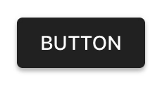

# Buttons

<!-- badges -->

Material design buttons allow users to take actions, and make choices, with a single tap. There are
many distinct button styles including text buttons, contained buttons, and floating action buttons.

   

<!-- design-and-api -->

<!-- toc -->

- - -

## Overview

`MDCButton` is a highly-configurable UIButton implementation that provides support for shadow
elevation, Material Design ripples, and other stateful design APIs.

## Installation

- [Typical installation](../../../docs/component-installation.md)

## Usage

- [Typical use](typical-use.md)
- [Typical use: floating action buttons](typical-use-floating-action-buttons.md)
- [Customizing elevation](customizing-elevation.md)
- [Customizing floating action buttons](customizing-floating-action-buttons.md)
- [Interface Builder](interface-builder.md)

## Extensions

- [Theming](theming.md)
- [Accessibility](accessibility.md)

## Unsupported

- [How to theme a button using a themer](theming-with-themers.md)
- [Color Theming](color-theming.md)
- [Typography Theming](typography-theming.md)
- [Shape Theming](shape-theming.md)
