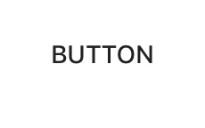

# Buttons

<!-- badges -->

Material design buttons allow users to take actions, and make choices, with a single tap. There are
many distinct button styles including text buttons, contained buttons, and floating action buttons.

   

<!-- design-and-api -->

<!-- toc -->

- - -

## Overview

`MDCButton` is a highly-configurable UIButton implementation that provides support for shadow
elevation, Material Design ripples, and other stateful design APIs.

## Installation

- [Typical installation](../../../docs/component-installation.md)

## Usage

- [Typical use: themed buttons](typical-use-themed-buttons.md)
- [Typical use: floating action buttons](typical-use-floating-action-buttons.md)
- [Customizing elevation](customizing-elevation.md)
- [Customizing floating action buttons](customizing-floating-action-buttons.md)
- [Interface Builder](interface-builder.md)

## Extensions

- [Theming](theming.md)
- [Color Theming](color-theming.md)
- [Typography Theming](typography-theming.md)


## Accessibility

To help ensure your buttons are accessible to as many users as possible, please be sure to review
the following recommendations:

### Set `-accessibilityLabel`
Set an appropriate
[`accessibilityLabel`](https://developer.apple.com/documentation/uikit/uiaccessibilityelement/1619577-accessibilitylabel)
value if your button does not have a title. This is often the case with `MDCFloatingButton`
instances which typically only have an icon.
```
button.accessibilityLabel = @"Create";
```

### Minimum touch size

#### Set the frame
Set your buttons to have a minium size. [Material Touch guidelines](https://material.io/design/layout/spacing-methods.html#touch-click-targets) typically recommend a height and width of 48 points.
```
button.minimumSize = CGSizeMake(48, 48);
```

#### Set the touch size (alternative)

An alternate approach is to set the `hitAreaInsets` to a negative value to make the touch target
larger than the visual appearance of the button. When you do this you should be careful to make sure
you maintain an 8-point distance between the button touch targets. This will allow your button to
have [a large enough touch
target](https://material.io/design/layout/spacing-methods.html#touch-click-targets) while
maintaining the desired visual appearance.

```
  CGFloat verticalInset = MIN(0, -(48 - button.frame.size.height) / 2);
  button .hitAreaInsets = UIEdgeInsetsMake(verticalInset, 0, verticalInset, 0);

```
When you do this make sure to follow the rest of the layout guidence and pad buttons with the
recommended space.

