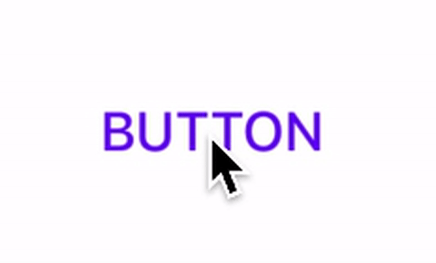
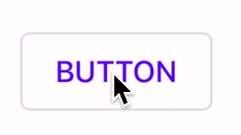
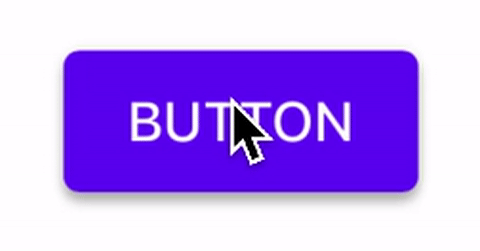
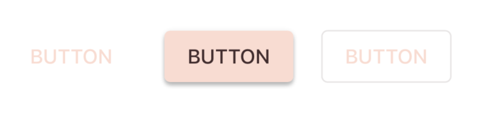

<!--docs:
title: Buttons
layout: detail
section: components
excerpt: "iOS Buttons"
iconId:
path: /catalog/buttons/
api_doc_root: true
-->

# Buttons

[Buttons](https://material.io/components/buttons/) allow users to take actions, and make choices, with a single tap.


## Contents

*   [Using buttons](#using-buttons)
*   [Text button](#text-button)
*   [Outlined button](#outlined-button)
*   [Contained button](#contained-button)
*   [Toggle button](#toggle-button)
*   [Theming](#theming)

## Using buttons

### Installing

In order to use Material buttons, first add the `Buttons` subspec to your `Podfile`:

```bash
pod MaterialComponents/Buttons
```
<!--{: .code-renderer.code-renderer--install }-->

Then, run the installer:

```bash
pod install
```

After that, import the relevant target or file and initialize your button.

<!--<div class="material-code-render" markdown="1">-->
#### Swift
```swift
import MaterialComponents.MaterialButtons

let button = MDCButton()
```

#### Objective-C

```objc
#import "MaterialButtons.h"

MDCButton *button = [[MDCButton alloc] init];
```
<!--</div>-->

### Making Buttons accessible

To help ensure your buttons are accessible to as many users as possible, please
be sure to review the following recommendations:

#### Set `-accessibilityLabel`

Set an appropriate
[`accessibilityLabel`](https://developer.apple.com/documentation/uikit/uiaccessibilityelement/1619577-accessibilitylabel)
value if your button does not have a title. This is often the case with Floating
Action Button instances which typically only have an icon.

<!--<div class="material-code-render" markdown="1">-->
#### Swift
```swift
button.accessibilityLabel = "Create"
```

#### Objective-C
```objc
button.accessibilityLabel = @"Create";
```
<!--</div>-->

#### Minimum touch size

Make sure that your buttons have a minimum touch area. The Material spec
for buttons calls for buttons that have a [visual height of
36](https://material.io/design/components/buttons.html#specs)
and that [touch areas should be at least 48 points high and 48
wide](https://material.io/design/layout/spacing-methods.html#touch-click-targets).

#### Set the touch size

To keep a button's visual sizes small with larger touchable areas, set the
`hitAreaInsets` to a negative value. Be careful to maintain sufficient distance
between the button touch targets. This will allow your button to have [a large
enough touch
target](https://material.io/design/layout/spacing-methods.html#touch-click-targets)
while maintaining the desired visual appearance. For more see the [Touch and click
targets](https://material.io/design/layout/spacing-methods.html#touch-click-targets)
in the spec.

<!--<div class="material-code-render" markdown="1">-->
#### Swift
```swift
let buttonVerticalInset =
min(0, -(kMinimumAccessibleButtonSize.height - button.bounds.height) / 2);
let buttonHorizontalInset =
min(0, -(kMinimumAccessibleButtonSize.width - button.bounds.width) / 2);
button.hitAreaInsets =
UIEdgeInsetsMake(buttonVerticalInset, buttonHorizontalInset,
buttonVerticalInset, buttonHorizontalInset);
```

#### Objective-C
```objc
CGFloat verticalInset = MIN(0, -(48 - CGRectGetHeight(button.bounds)) / 2);
CGFloat horizontalInset = MIN(0, -(48 - CGRectGetWidth(button.bounds)) / 2);
button.hitAreaInsets = UIEdgeInsetsMake(verticalInset, horizontalInset, verticalInset, horizontalInset);
```
<!--</div>-->

#### Set the minimum visual size of the button

Set your buttons to have a minimum size. Though there are some exceptions, [Material Buttons
guidelines](https://material.io/design/components/buttons.html#specs)
typically recommend [a minimum height of 36 points and a minimum width of 64
points](https://material.io/design/components/buttons.html#specs).

<!--<div class="material-code-render" markdown="1">-->
#### Swift
```swift
button.minimumSize = CGSize(width: 64, height: 48)
```

#### Objective-C
```objc
button.minimumSize = CGSizeMake(64, 36);
```
<!--</div>-->

#### Using `accessibilityHint`

Apple rarely recommends using the `accessibilityHint` because the label should
already be clear enough to indicate what will happen. Before you consider
setting an `-accessibilityHint` consider if you need it or if the rest of your
UI could be adjusted to make it more contextually clear.

A well-crafted, thoughtful user interface can remove the need for
`accessibilityHint` in most situations. Examples for a selection dialog to
choose one or more days of the week for a repeating calendar event:

- (Good) The dialog includes a header above the list of days reading, "Event
repeats weekly on the following day(s)." The list items do not need
`accessibilityHint` values.
- (Bad) The dialog has no header above the list of days. Each list item
(representing a day of the week) has the `accessibilityHint` value, "Toggles
this day."

## Types

There are four types of buttons:

1. [Text button](#text-button)
2. [Outlined button](#outlined-button)
3. [Contained button](#contained-button)
4. [Toggle button](#toggle-button) (*not supported in iOS*)


All Material buttons are implemented by `MDCButton`, a subclass of [`UIButton`](https://developer.apple.com/documentation/uikit/uibutton).
* [GitHub source](https://github.com/material-components/material-components-ios/blob/develop/components/Buttons/src/MDCButton.h)

## Text button



[Text buttons](https://material.io/components/buttons/#text-button) are typically used for less-pronounced actions, including those located in dialogs and cards. In cards, text buttons help maintain an emphasis on card content.

### Text button example

To use a text button use the text button theming method on the `MDCButton` theming extension. For more information on theming extensions see the [Theming section](#theming). 

<!--<div class="material-code-render" markdown="1">-->
#### Objective-C
```objc
[self.button applyTextThemeWithScheme:self.containerScheme];
```

#### Swift

```swift
button.applyTextTheme(withScheme: containerScheme)
```
<!--</div>-->

### Anatomy and key properties

A text button has a text label, a transparent container and an optional icon.


1. Text label
1. Container
1. Icon

#### Text label attributes

&nbsp;         | Attribute                | Related method(s)                 | Default value
-------------- | ------------------------ | --------------------------------- | -------------
**Text label** | `titleLabel` | `setTitle:forState:`<br/>`titleForState:` | `nil`
**Color**      | `titleLabel.textColor` | `setTitleColor:forState:`<br/>`titleColorForState:` | Primary color
**Typography** | `titleLabel.font` | `setFont:` and `font` on `titleLabel` | Button

#### Container attributes

&nbsp;           | Attribute             | Related method(s)                                                            | Default value
---------------- | --------------------- | ---------------------------------------------------------------------------- | -------------
**Color**        | `backgroundColor`  | `setBackgroundColor:forState:`<br/>`backgroundColorForState`<br/> | `UIColor.clearColor`
**Stroke color** |  | `setBorderColor:forState:`<br/>`borderColorForState:` | `nil`
**Stroke width** |  | `setBorderWidth:forState:`<br/>`borderWidthForState:` | `0`
**Ripple color** | `inkColor`   | `setInkColor`<br/>`inkColor` | Primary color at 12% opacity

#### Icon attributes

&nbsp;                                          | Attribute         | Related method(s)                                         | Default value
----------------------------------------------- | ----------------- | --------------------------------------------------------- | -------------
**Icon**                                        | `imageView`        | `setImage:forState:`<br/>`imageForState:` | `nil`
**Color**                                       | `imageView.tintColor` | `setImageViewTintColor:forState:`<br/>`imageViewTintColorForState:` | `nil`

## Outlined button



[Outlined buttons](https://material.io/components/buttons/#outlined-button) are medium-emphasis buttons. They contain actions that are important, but aren’t the primary action in an app.

### Outlined button example

To achieve an outlined button use the outlined button theming method on the `MDCButton` theming extension. To access the theming extension see the [Theming section](#theming). 

<!--<div class="material-code-render" markdown="1">-->
#### Objective-C
```objc
[self.button applyOutlinedThemeWithScheme:self.containerScheme];
```

#### Swift

```swift
button.applyOutlinedTheme(withScheme: containerScheme)
```
<!--</div>-->

### Anatomy and Key properties

An outlined button has a text label, a container, and an optional icon.


1. Text label
1. Container
1. Icon

#### Text label attributes

&nbsp;         | Attribute                | Related method(s)                 | Default value
-------------- | ------------------------ | --------------------------------- | -------------
**Text label** | `titleLabel` | `setTitle:forState:`<br/>`titleForState:` | `nil`
**Color**      | `titleLabel.textColor` | `setTitleColor:forState:`<br/>`titleColorForState:` | Primary color
**Typography** | `titleLabel.font` | `setFont:` and `font` on `titleLabel` | Button

#### Container attributes

&nbsp;           | Attribute             | Related method(s)                                                            | Default value
---------------- | --------------------- | ---------------------------------------------------------------------------- | -------------
**Color**        | `backgroundColor`  | `setBackgroundColor:forState:`<br/>`backgroundColorForState`<br/> | `UIColor.clearColor`
**Stroke color** |  | `setBorderColor:forState:`<br/>`borderColorForState:` | On surface color at 12% opacity
**Stroke width** |  | `setBorderWidth:forState:`<br/>`borderWidthForState:` | 1
**Ripple color** | `inkColor`   | `setInkColor`<br/>`inkColor` | Primary color at 12% opacity

#### Icon attributes

&nbsp;                                          | Attribute         | Related method(s)                                         | Default value
----------------------------------------------- | ----------------- | --------------------------------------------------------- | -------------
**Icon**                                        | `imageView`        | `setImage:forState:`<br/>`imageForState:` | `nil`
**Color**                                       | `imageView.tintColor` | `setImageViewTintColor:forState:`<br/>`imageViewTintColorForState:` | `nil`

## Contained button



[Contained buttons](https://material.io/components/buttons/#contained-button) are high-emphasis, distinguished by their use of elevation and fill. They contain actions that are primary to your app.

### Contained button example

Contained buttons are implemented by `MDCButton`. To achieve a contained button use the contained button theming method on the `MDCButton` theming extension. To access the theming extension see the [Theming section](#theming).

<!--<div class="material-code-render" markdown="1">-->
#### Objective-C
```objc
[self.button applyContainedThemeWithScheme:self.containerScheme];
```

#### Swift

```swift
button.applyContainedTheme(withScheme: containerScheme)
```
<!--</div>-->

### Anatomy and Key properties

A contained button has a text label, a container, and an optional icon.


1. Text label
1. Container
1. Icon

#### Text label attributes

&nbsp;         | Attribute                | Related method(s)                 | Default value
-------------- | ------------------------ | --------------------------------- | -------------
**Text label** | `titleLabel` | `setTitle:forState:`<br/>`titleForState:` | `nil`
**Color**      | `titleLabel.textColor` | `setTitleColor:forState:`<br/>`titleColorForState:` | On primary color
**Typography** | `titleLabel.font` | `setFont:` and `font` on `titleLabel` | Button

#### Container attributes

&nbsp;           | Attribute             | Related method(s)                                                            | Default value
---------------- | --------------------- | ---------------------------------------------------------------------------- | -------------
**Color**        | `backgroundColor`  | `setBackgroundColor:forState:`<br/>`backgroundColorForState`<br/> | Primary color
**Stroke color** |  | `setBorderColor:forState:`<br/>`borderColorForState:` | `nil`
**Stroke width** |  | `setBorderWidth:forState:`<br/>`borderWidthForState:` | `nil`
**Ripple color** | `inkColor`   | `setInkColor`<br/>`inkColor` | On primary color at 12% opacity

#### Icon attributes

&nbsp;                                          | Attribute         | Related method(s)                                         | Default value
----------------------------------------------- | ----------------- | --------------------------------------------------------- | -------------
**Icon**                                        | `imageView`        | `setImage:forState:`<br/>`imageForState:` | `nil`
**Color**                                       | `imageView.tintColor` | `setImageViewTintColor:forState:`<br/>`imageViewTintColorForState:` | `nil`

## Toggle button

[Toggle buttons](https://material.io/components/buttons/#toggle-button) can be used to select from a group of choices. They are not supported on iOS.

## Theming

You can theme an `MDCButton` to match any of the Material Button styles using theming
extensions. [Learn more about theming extensions](../../../docs/theming.md). Below is a screenshot of Material Buttons with the Material Design Shrine theme:



### Buttons theming example

To make use of the theming methods shown in the examples above install the Buttons theming extensions with Cocoapods. First, add the following line to your `Podfile`:

```bash
pod MaterialComponents/Buttons+Theming
```

<!--{: .code-renderer.code-renderer--install }-->

Then Run the installer:

```bash
pod install
```

Next, import the Buttons theming target and initialize a button.

<!--<div class="material-code-render" markdown="1">-->
#### Swift
```swift
import MaterialComponents.MaterialButtons
import MaterialComponents.MaterialButtons_Theming

let button = MDCButton()
```

#### Objective-C
```objc
#import "MaterialButtons.h"
#import "MaterialButtons+Theming.h"

MDCButton *button = [[MDCButton alloc] init];
```

<!--</div>-->

From there, use the theming methods from the examples to achieve your preferred button style.
