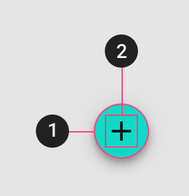
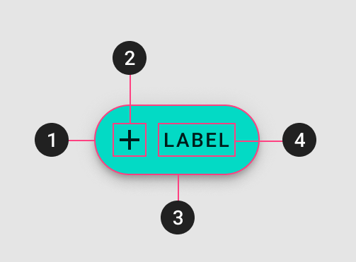

<!--docs:
title: "Buttons: floating action buttons"
layout: detail
section: components
excerpt: "A floating action button (FAB) represents the primary action of a screen"
iconId: 
path: /catalog/fabs/
api_doc_root: true
-->

# Buttons: floating action buttons

A floating action button (FAB) represents the primary action of a screen.

There are three types of FABS:

1. [Regular FABs](#regular-fabs)
2. [Mini FABs](#mini-fabs)
3. [Extended FABs](#extended-fabs)

<!--Get an image of a floating action button-->

# Using FABs

A FAB performs the primary, or most common, action on a screen. It appears in front of all screen content, typically as a circular shape with an icon in its center. 

FABs are implemented by `MDCFloatingButton`, a subclass of [MDCButton](https://material.io/develop/ios/components/buttons/api-docs/Classes/MDCButton.html).
* [API documentation](https://material.io/develop/ios/components/buttons/api-docs/Classes/MDCFloatingButton.html)
* [GitHub source](https://github.com/material-components/material-components-ios/blob/develop/components/Buttons/src/MDCFloatingButton.h)

Only use a FAB if it is the most suitable way to present a screen’s primary action.

FABs should be provided with a templated image for their normal state and then themed accordingly.

### Installing FABs

Because MDCFloatingButton is a subclass of [MDCButton](buttons.md), the steps for installing it are the same.

In order to use `MDCFloatingButton`, first add Buttons to your `Podfile`.

```bash
pod MaterialComponents/Buttons
```
<!--{: .code-renderer.code-renderer--install }-->

Then, run the installer.

```bash
pod install
```

After that, import the Buttons and initialize an MDCFloatingButton using `alloc`/`init`.

<!--<div class="material-code-render" markdown="1">-->
#### Swift
```swift
import MaterialComponents.MaterialButtons
import MaterialComponents.MaterialButtons_Theming

let fab = MDCFloatingButton()
```

#### Objective-C
```objc
#import "MaterialButtons.h"
#import <MaterialComponents/MaterialButtons+Theming.h>

MDCFloatingButton *fab = [[MDCFloatingButton alloc] init];
```
<!--</div>-->

### Making FABs accessible
 
To help make your FABs usable to as many users as possible, apply the following:

* Set an appropriate [`accessibilityLabel`](https://developer.apple.com/documentation/uikit/uiaccessibilityelement/1619577-accessibilitylabel) value if your button does not have a title or only has an icon:

<!--<div class="material-code-render" markdown="1">-->
#### Swift
```swift
floatingButton.accessibilityLabel = "Create"
```

#### Objective-C
```objc
floatingButton.accessibilityLabel = @"Create";
```
<!--</div>-->

* Set the minimum [visual height to
36 and miniumum visual width to 64](https://material.io/design/components/buttons.html#specs)

<!--<div class="material-code-render" markdown="1">-->
#### Swift
```swift
floatingButton.minimumSize = CGSize(width: 64, height: 48)
```

#### Objective-C
```objc
floatingButton.minimumSize = CGSizeMake(64, 36);
```
<!--</div>-->


* Set the [touch areas to at least 44 points high and 44
wide](https://material.io/design/layout/spacing-methods.html#touch-click-targets).
    To minimize FAB's visual size while allowing for larger [touchable areas](https://material.io/design/layout/spacing-methods.html#touch-click-targets), set the `hitAreaInsets` to a negative value. Maintain sufficient distance between the FAB touch targets. For more see the [Touch and click
targets](https://material.io/design/layout/spacing-methods.html#touch-click-targets)
in the spec.

<!--<div class="material-code-render" markdown="1">-->
#### Swift
```swift
let buttonVerticalInset =
min(0, -(kMinimumAccessibleButtonSize.height - button.bounds.height) / 2);
let buttonHorizontalInset =
min(0, -(kMinimumAccessibleButtonSize.width - button.bounds.width) / 2);
floatingButton.hitAreaInsets =
UIEdgeInsetsMake(buttonVerticalInset, buttonHorizontalInset,
buttonVerticalInset, buttonHorizontalInset);
```

#### Objective-C
```objc
CGFloat verticalInset = MIN(0, -(48 - CGRectGetHeight(fab.bounds)) / 2);
CGFloat horizontalInset = MIN(0, -(48 - CGRectGetWidth(fab.bounds)) / 2);
floatingButton.hitAreaInsets = UIEdgeInsetsMake(verticalInset, horizontalInset, verticalInset, horizontalInset);
```
<!--</div>-->

_**Note** There are [some](https://material.io/design/components/buttons.html#toggle-button) clear [exceptions](https://material.io/design/components/app-bars-bottom.html#specs) for these rules. Please adjust your buttons sizes accordingly._

* **Optional** Set an appropriate `accessibilityHint`

Apple rarely recommends using the `accessibilityHint` because the label should
already be clear enough to indicate what will happen. Before you consider
setting an `-accessibilityHint` consider if you need it or if the rest of your
UI could be adjusted to make it more contextually clear.

A well-crafted, thoughtful user interface can remove the need for
`accessibilityHint` in most situations. Examples for a selection dialog to
choose one or more days of the week for a repeating calendar event:

*   (Good) The dialog includes a header above the list of days reading, "Event
repeats weekly on the following day(s)." The list items do not need
`accessibilityHint` values.
*   (Bad) The dialog has no header above the list of days. Each list item
(representing a day of the week) has the `accessibilityHint` value, "Toggles
this day."

## Regular FABs


Regular FABs are FABs that are not expanded and are a regular size.

### Regular FABs example

To create a regular FAB use the `+floatingButtonWithShape:` constructor with a value of `MDCFloatingButtonShapeDefault` and make sure the `mode` property is set to `MDCFloatingButtonModeNormal`.

For more information on theming FABs see the [Theming section](#theming). 

<!--<div class="material-code-render" markdown="1">-->
#### Swift
```swift
let fab = MDCFloatingButton(shape: `default`)
```

#### Objective-C
```objc
MDCFloatingButton *fab =
    [MDCFloatingButton floatingButtonWithShape:MDCFloatingButtonShapeDefault];
```
<!--</div>-->

### Anatomy and key properties


A regular FAB has a container and an icon.

1. Container
1. Icon

#### Container attributes

&nbsp;           | Attribute             | Related method(s)                                                            | Default value
---------------- | --------------------- | ---------------------------------------------------------------------------- | -------------
**Color**        | `backgroundColor`  | `setBackgroundColor:forState:`<br/>`backgroundColorForState`<br/> | blue 500 from this [Theming doc](https://material.io/go/design-color-theming#color-color-palette).
**Stroke color** |  | `setBorderColor:forState:`<br/>`borderColorForState:` | `nil`
**Stroke width** |  | `setBorderWidth:forState:`<br/>`borderWidthForState:` | `0`
**Ripple color** | `inkColor`   | `setInkColor`<br/>`inkColor` | White at 20% opacity

#### Icon attributes

&nbsp;                                          | Attribute         | Related method(s)                                         | Default value
----------------------------------------------- | ----------------- | --------------------------------------------------------- | -------------
**Icon**                                        | `imageView`        | `setImage:forState:`<br/>`imageForState:` | `nil`
**Color**                                       | `imageView.tintColor` | `setImageViewTintColor:forState:`<br/>`imageViewTintColorForState:` | `nil`

## Mini FABs


A mini FAB should be used on smaller screens.

Mini FABs can also be used to create visual continuity with other screen elements.

### Mini FABs example

To create a mini FAB use the `+floatingButtonWithShape:` constructor with a value of `MDCFloatingButtonShapeMini` and make sure the `mode` property is set to `MDCFloatingButtonModeNormal`.

For more information on theming FABs see the [Theming section](#theming). 

<!--<div class="material-code-render" markdown="1">-->
#### Objective-C
```objc
MDCFloatingButton *fab =
    [MDCFloatingButton floatingButtonWithShape:MDCFloatingButtonShapeMini];
```

#### Swift
```swift
let fab = MDCFloatingButton(shape: mini)
```
<!--</div>-->

### Anatomy and key properties



A mini FAB has a container and an icon.

1. Container
1. Icon

#### Container attributes

&nbsp;           | Attribute             | Related method(s)                                                            | Default value
---------------- | --------------------- | ---------------------------------------------------------------------------- | -------------
**Color**        | `backgroundColor`  | `setBackgroundColor:forState:`<br/>`backgroundColorForState`<br/> | blue 500 from this [Theming doc](https://material.io/go/design-color-theming#color-color-palette).
**Stroke color** |  | `setBorderColor:forState:`<br/>`borderColorForState:` | `nil`
**Stroke width** |  | `setBorderWidth:forState:`<br/>`borderWidthForState:` | `0`
**Ripple color** | `inkColor`   | `setInkColor`<br/>`inkColor` | White at 20% opacity

#### Icon attributes

&nbsp;                                          | Attribute         | Related method(s)                                         | Default value
----------------------------------------------- | ----------------- | --------------------------------------------------------- | -------------
**Icon**                                        | `imageView`        | `setImage:forState:`<br/>`imageForState:` | `nil`
**Color**                                       | `imageView.tintColor` | `setImageViewTintColor:forState:`<br/>`imageViewTintColorForState:` | `nil`

## Extended FABs


The extended FAB is wider, and it includes a text label.

### Extended FABs example


To create an extended FAB use the `+floatingButtonWithShape:` constructor with a value of `MDCFloatingButtonShapeDefault` and make sure the `mode` property is set to `MDCFloatingButtonModeExpanded`.

For more information on theming FABs see the [Theming section](#theming). 

<!--<div class="material-code-render" markdown="1">-->
#### Objective-C
```objc
MDCFloatingButton *fab =
    [MDCFloatingButton floatingButtonWithShape:MDCFloatingButtonShapeDefault];
fab.mode = MDCFloatingButtonModeExpanded;
```

#### Swift
```swift
let fab = MDCFloatingButton(shape: .default)
fab.mode = .expanded
```
<!--</div>-->

### Anatomy and key properties



An extended FAB has a text label, a transparent container and an optional icon.

1. Container
1. Icon
1. Text label

#### Container attributes

&nbsp;           | Attribute             | Related method(s)                                                            | Default value
---------------- | --------------------- | ---------------------------------------------------------------------------- | -------------
**Color**        | `backgroundColor`  | `setBackgroundColor:forState:`<br/>`backgroundColorForState`<br/> | blue 500 from this [Theming doc](https://material.io/go/design-color-theming#color-color-palette).
**Stroke color** |  | `setBorderColor:forState:`<br/>`borderColorForState:` | `nil`
**Stroke width** |  | `setBorderWidth:forState:`<br/>`borderWidthForState:` | `0`
**Ripple color** | `inkColor`   | `setInkColor`<br/>`inkColor` | White at 20% opacity

#### Icon attributes

&nbsp;                                          | Attribute         | Related method(s)                                         | Default value
----------------------------------------------- | ----------------- | --------------------------------------------------------- | -------------
**Icon**                                        | `imageView`        | `setImage:forState:`<br/>`imageForState:` | `nil`
**Color**                                       | `imageView.tintColor` | `setImageViewTintColor:forState:`<br/>`imageViewTintColorForState:` | `nil`

#### Text label attributes

&nbsp;         | Attribute                | Related method(s)                 | Default value
-------------- | ------------------------ | --------------------------------- | -------------
**Text label** | `titleLabel` | `setTitle:forState:`<br/>`titleForState:` | `nil`
**Color**      | `titleLabel.textColor` | `setTitleColor:forState:`<br/>`titleColorForState:` | `UIColor.blackColor`
**Typography** | `titleLabel.font` | `setFont:` and `font` on `titleLabel` | Button

## Theming

You can theme an MDCFloatingButton to have a secondary theme using the MDCFloatingButton theming
extension. [Learn more about theming extensions and container schemes](../../../docs/theming.md). Below is a screenshot of Material FABs with the Material Design Shrine theme:


### FAB theming example

To make use of the theming methods shown in the examples above install the Buttons theming extensions with Cocoapods. First, add the following line to your `Podfile`.

```bash
pod MaterialComponents/Buttons+Theming
```

<!--{: .code-renderer.code-renderer--install }-->

Then Run the installer.

```bash
pod install
```

Next, import the Buttons theming target.

<!--<div class="material-code-render" markdown="1">-->
#### Swift
```swift
import MaterialComponents.MaterialButtons
import MaterialComponents.MaterialButtons_Theming
```

#### Objective-C
```objc
#import "MaterialButtons.h"
#import <MaterialComponents/MaterialButtons+Theming.h>
```
<!--</div>-->

From there, pass a container scheme into the following theming method on an MDCFloatingButton instance.

<!--<div class="material-code-render" markdown="1">-->
#### Swift
```swift
let fab = MDCFloatingButton(shape: `default`)
fab.applySecondaryThemeWith(withScheme:containerScheme)
```

#### Objective-C
```objc
MDCFloatingButton *fab =
    [MDCFloatingButton floatingButtonWithShape:MDCFloatingButtonShapeMini];
[fab applySecondaryThemeWithScheme:self.containerScheme];
```
<!--</div>-->
