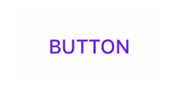
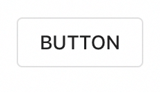
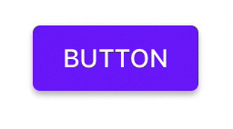
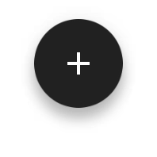

### Theming

You can theme an MDCButton to match a
[Material Design button style](https://material.io/design/components/buttons.html) using theming
extensions. [Learn more about theming extensions](../../../docs/theming.md).

### How to theme an MDCButton

First, import both Buttons and Buttons Theming and create an instance of MDCButton.

<!--<div class="material-code-render" markdown="1">-->
#### Swift
```swift
import MaterialComponents.MaterialButtons
import MaterialComponents.MaterialButtons_Theming

let button = MDCButton()
```

#### Objective-C

```objc
#import <MaterialComponents/MaterialButtons.h>
#import <MaterialComponentsBeta/MaterialButtons+Theming.h>

MDCButton *button = [[MDCButton alloc] init];
```
<!--</div>-->

You can then provide a container scheme instance to any of the MDCButton theming extensions.
[Learn more about container schemes](../../../docs/theming.md).

[Material text button](https://material.io/design/components/buttons.html#text-button) theming:



<!--<div class="material-code-render" markdown="1">-->
#### Swift
```swift
button.applyTextTheme(withScheme: containerScheme)
```

#### Objective-C

```objc
[self.button applyTextThemeWithScheme:self.containerScheme];
```
<!--</div>-->

[Material outlined button](https://material.io/design/components/buttons.html#outlined-button)
theming:



<!--<div class="material-code-render" markdown="1">-->
#### Swift
```swift
button.applyOutlinedTheme(withScheme: containerScheme)
```

#### Objective-C

```objc
[self.button applyOutlinedThemeWithScheme:self.containerScheme];
```
<!--</div>-->

[Material contained button](https://material.io/design/components/buttons.html#contained-button)
theming:



<!--<div class="material-code-render" markdown="1">-->
#### Swift
```swift
button.applyContainedTheme(withScheme: containerScheme)
```

#### Objective-C

```objc
[self.button applyContainedThemeWithScheme:self.containerScheme];
```
<!--</div>-->

### How to theme an MDCFloatingButton

First, create a button and import the theming extension header for Buttons.

<!--<div class="material-code-render" markdown="1">-->
#### Swift
```swift
import MaterialComponents.MaterialButtons
import MaterialComponentsBeta.MaterialButtons_Theming

let floatingButton = MDCFloatingButton()
```

#### Objective-C

```objc
#import <MaterialComponents/MaterialButtons.h>
#import <MaterialComponentsBeta/MaterialButtons+Theming.h>

MDCFloatingButton *floatingButton = [[MDCFloatingButton alloc] init];
```
<!--</div>-->

[Material floating action button](https://material.io/design/components/buttons-floating-action-button.html)
theming:



<!--<div class="material-code-render" markdown="1">-->
#### Swift
```swift
floatingButton.applySecondaryTheme(withScheme: containerScheme)
```

#### Objective-C

```objc
[self.floatingButton applySecondaryThemeWithScheme: self.containerScheme];
```
<!--</div>-->
