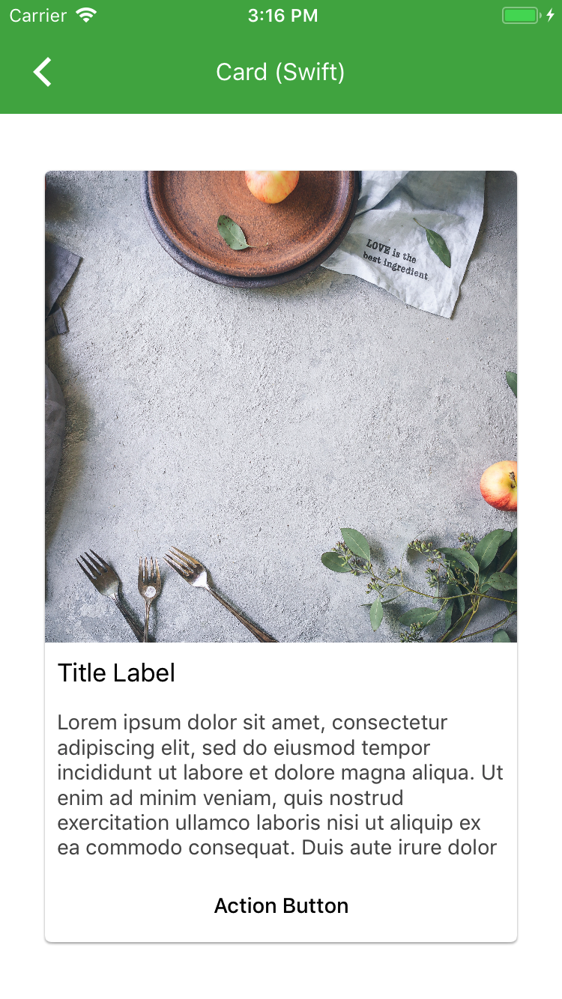

<!--docs:
title: "Cards"
layout: detail
section: components
excerpt: "Cards contain content and actions about a single subject."
iconId: list
path: /catalog/cards/
api_doc_root: true
-->

<!-- This file was auto-generated using ./scripts/generate_readme Cards -->

# Cards

[](https://github.com/material-components/material-components-ios/issues?q=is%3Aopen+is%3Aissue+label%3Atype%3ABug+label%3A%5BCards%5D)

Cards contain content and actions about a single subject. They can be used standalone, or as part
of a list. Cards are meant to be interactive, and aren't meant to be be used solely for style
purposes.

<div class="article__asset article__asset--screenshot">
  
</div>

## Design & API documentation

<ul class="icon-list">
  <li class="icon-list-item icon-list-item--spec"><a href="https://material.io/go/design-cards">Material Design guidelines: Cards</a></li>
  <li class="icon-list-item icon-list-item--link">Class: <a href="https://material.io/components/ios/catalog/cards/api-docs/Classes/MDCCard.html">MDCCard</a></li>
  <li class="icon-list-item icon-list-item--link">Class: <a href="https://material.io/components/ios/catalog/cards/api-docs/Classes/MDCCardCollectionCell.html">MDCCardCollectionCell</a></li>
  <li class="icon-list-item icon-list-item--link">Enumeration: <a href="https://material.io/components/ios/catalog/cards/api-docs/Enums.html">Enumerations</a></li>
  <li class="icon-list-item icon-list-item--link">Enumeration: <a href="https://material.io/components/ios/catalog/cards/api-docs/Enums/MDCCardCellHorizontalImageAlignment.html">MDCCardCellHorizontalImageAlignment</a></li>
  <li class="icon-list-item icon-list-item--link">Enumeration: <a href="https://material.io/components/ios/catalog/cards/api-docs/Enums/MDCCardCellState.html">MDCCardCellState</a></li>
  <li class="icon-list-item icon-list-item--link">Enumeration: <a href="https://material.io/components/ios/catalog/cards/api-docs/Enums/MDCCardCellVerticalImageAlignment.html">MDCCardCellVerticalImageAlignment</a></li>
</ul>

## Table of contents

- [Overview](#overview)
  - [Cards Classes](#cards-classes)
- [Installation](#installation)
  - [Installation with CocoaPods](#installation-with-cocoapods)
  - [Importing](#importing)
- [Usage](#usage)
  - [Typical use: as a view](#typical-use-as-a-view)
  - [Typical use: in a collection view](#typical-use-in-a-collection-view)
- [Extensions](#extensions)
  - [Theming](#theming)
- [Accessibility](#accessibility)
  - [Card Accessibility](#card-accessibility)

- - -

## Overview

Cards provides two different versions, `MDCCard` inheriting from `UIControl` and `MDCCardCollectionCell` inheriting from `UICollectionViewCell`.

A card's state determines its visual styling.

When treated as a `UIControl` (`MDCCard`), it has a default styling (`UIControlStateNormal`), and a highlighted styling (`UIControlStateHighlighted`) when interacted with.

When treated as a `UICollectionViewCell` (`MDCCardCollectionCell`), it has a default styling (`MDCCardCellStateNormal`), a highlighted styling (`MDCCardCellStateHighlighted`), and lastly a selected styling (`MDCCardCellStateSelected`).

Customization to the card is exposed via its API either in `MDCCard` or `MDCCardCollectionCell`. Currently the card consists of these customizations:

- The border width for a specific state
- The border color for a specific state
- The shadow elevation for a specific state
- The shadow color for a specific state
- The corner radius for the card

(`MDCCardCollectionCell` customization only):

- Changing the image that appears in the Selected state.
- Changing the image tint color that appears in the Selected state.

An `MDCCard` can be added and used as you would add any `UIView` or `UIControl`, if manually in code, or through Interface Builder.

An `MDCCardCollectionCell` can be added, used, and reused as a `UICollectionViewCell`, if manually in code, or through Interface Builder.

### Cards Classes

#### MDCCard

`MDCCard` subclasses `UIControl` and provides a simple class for developers to subclass and create custom cards with ink, shadows, corner radius, and stroke matching the Material spec.

`MDCCard` uses the `highlighted` property that is built-in in `UIControl` and the `UIControlState` to move between states.

#### MDCCardCollectionCell

`MDCCardCollectionCell` subclasses `UICollectionViewCell` and provides a simple collection view cell for developers to use in their collections with ink, shadows, corner radius, and stroke matching the Material spec.

`MDCCardCollectionCell` uses the `selected` property that is built-in in `UICollectionViewCell` and has its own `MDCCardCellState` to keep track of the current state it is in.

## Installation

<!-- Extracted from docs/../../../docs/component-installation.md -->

### Installation with CocoaPods

Add the following to your `Podfile`:

```bash
pod 'MaterialComponents/Cards'
```
<!--{: .code-renderer.code-renderer--install }-->

Then, run the following command:

```bash
pod install
```

### Importing

To import the component:

<!--<div class="material-code-render" markdown="1">-->
#### Swift
```swift
import MaterialComponents.MaterialCards
```

#### Objective-C

```objc
#import "MaterialCards.h"
```
<!--</div>-->


## Usage

<!-- Extracted from docs/typical-use-view.md -->

### Typical use: as a view

`MDCCard` can be used like a regular UIView.

<!--<div class="material-code-render" markdown="1">-->
#### Swift

```swift
let card = MDCCard()

// Create, position, and add content views:
let imageView = UIImageView()
card.addSubview(imageView)
```

#### Objective-C

```objc
MDCCard *card = [[MDCCard alloc] init];

// Create, position, and add content views:
UIImageView *imageView = [[UIImageView alloc] init];
[card addSubview:imageView];
```
<!--</div>-->

<!-- Extracted from docs/typical-use-collections.md -->

### Typical use: in a collection view

Use `MDCCardCollectionCell` as a base class for your custom collection view cell

<!--<div class="material-code-render" markdown="1">-->
#### Swift

```swift
collectionView.register(MDCCardCollectionCell.self, forCellWithReuseIdentifier: "Cell")

func collectionView(_ collectionView: UICollectionView,
                    cellForItemAt indexPath: IndexPath) -> UICollectionViewCell {
  let cell = collectionView.dequeueReusableCell(withReuseIdentifier: "Cell",
                                                for: indexPath) as! MDCCardCollectionCell
  // If you wanted to have the card show the selected state when tapped
  // then you need to turn isSelectable to true, otherwise the default is false.
  cell.isSelectable = true
  
  cell.selectedImageTintColor = .blue
  cell.cornerRadius = 8
  cell.setShadowElevation(6, for: .selected)
  cell.setShadowColor(UIColor.black, for: .highlighted)
  return cell
}
```

#### Objective-C

```objc
[self.collectionView registerClass:[MDCCardCollectionCell class]
        forCellWithReuseIdentifier:@"Cell"];

- (UICollectionViewCell *)collectionView:(UICollectionView *)collectionView
                  cellForItemAtIndexPath:(NSIndexPath *)indexPath {
  MDCCardCollectionCell *cell =
  [collectionView dequeueReusableCellWithReuseIdentifier:@"Cell"
                                            forIndexPath:indexPath];
  // If you wanted to have the card show the selected state when tapped
  // then you need to turn selectable to true, otherwise the default is false.
  [cell setSelectable:YES];
  
  [cell setSelectedImageTintColor:[UIColor blueColor]];
  [cell setCornerRadius:8];
  [cell setShadowElevation:6 forState:MDCCardCellStateSelected];
  [cell setShadowColor:[UIColor blackColor] forState:MDCCardCellStateHighlighted];
}
```
<!--</div>-->


## Extensions

<!-- Extracted from docs/theming.md -->

### Theming

 `MDCCard` supports Material Theming using a Container Scheme.
There are two variants for Material Theming of a MDCCard and MDCCardCollectionCell, which are the default theme
and the outlined theme.

 <!--<div class="material-code-render" markdown="1">-->

#### Swift

```swift
// Import the Cards Theming Extensions module
import MaterialComponents.MaterialCards_MaterialTheming
 ...
 // Create or use your app's Container Scheme
let containerScheme = MDCContainerScheme()
 // Theme the card with either default theme
card.applyTheme(withScheme: containerScheme)
 // Or outlined theme
card.applyOutlinedTheme(withScheme: containerScheme)
```

#### Objective-C

```objc
// Import the Cards Theming Extensions header
#import <MaterialComponents/MaterialCards+MaterialTheming.h>
 ...
 // Create or use your app's Container Scheme
MDCContainerScheme *containerScheme = [[MDCContainerScheme alloc] init];
 // Theme the card with either default theme
[self.card applyThemeWithScheme:containerScheme];
 // Or outlined theme
[self.card applyOutlinedThemeWithScheme:containerScheme];
```

<!--</div>-->


## Accessibility

<!-- Extracted from docs/accessibility.md -->

### Card Accessibility

To help ensure your cards are accessible to as many users as possible, please be sure to review the following 
recommendations:

#### Accessibility for Cards in a Collection

Since assistive technologies visit all cards in a collection in a sequential order, it is often 
easier to distinguish between elements that belong to different cards by aggregating all the 
card's information so the card is read as a single sentence.  
This can be done by setting an appropriate 
[`accessibilityLabel`](https://developer.apple.com/documentation/uikit/uiaccessibilityelement/1619577-accessibilitylabel) 
for the card. Additionally, set the card's 
[`isAccessibilityElement`](https://developer.apple.com/documentation/objectivec/nsobject/1615141-isaccessibilityelement) 
to true. Cards are a container element and setting isAccessibiltyElement for a container 
turns off individually selecting its subelements.

##### Swift
```swift
  card.isAccessibilityElement = true
  card.accessibilityLabel = "Location \(userLocation.name) is popular with users " +
    "who enjoy \(userLocation.popularActivityMatchingUserProfile(userProfile))"
```

##### Objective-C
```objc
  card.isAccessibilityElement = YES;
  card.accessibilityLabel = [NSString 
    stringWithFormat:@"Location %@ is popular with users who enjoy %@",  
    userLocation.name, 
    userLocation.popularActivityMatchingUserProfile(userProfile)];
```

#### Accessibility for Single Cards

Nested elements in MDCCards are available to assistive technologies without additional 
customization, however additional setup may be needed to accommodate special scenarios, 
such as:

#### Accessibility for Single Cards: Images 
Images that have additional context beyond text that is already presented on the card.  
For example, news article images can benefit from an 
[`accessibilityLabel`](https://developer.apple.com/documentation/uikit/uiaccessibilityelement/1619577-accessibilitylabel) 
describing their content.

##### Swift
```swift
  articleImageView.isAccessibilityElement = true
  articleImageView.accessibilityLabel = "Event or scene description"
```

##### Objective-C
```objc
  articleImageView.isAccessibilityElement = YES;
  articleImageView.accessibilityLabel = @"Event or scene description";
```

#### Accessibility for Single Cards: Star Rating
Star or rating images should have an 
[`accessibilityLabel`](https://developer.apple.com/documentation/uikit/uiaccessibilityelement/1619577-accessibilitylabel) 
describing its purpuse and an 
[`accessibilityValue`](https://developer.apple.com/documentation/uikit/uiaccessibilityelement/1619583-accessibilityvalue) 
describing the rating value.

##### Swift
```swift
  ratingView.isAccessibilityElement = true
  ratingView.accessibilityLabel = "Average customer rating, out of " + 
    "\(MDCProductRating.maximumValue) stars"
  ratingView.accessibilityValue = (String)product.averageRating
```

##### Objective-C
```objc
  ratingView.isAccessibilityElement = YES;
  ratingView.accessibilityLabel = [NSString stringWithFormat:@"Average customer" +
    " rating, out of %d stars", MDCProductRating.maximumValue];
  ratingView.accessibilityValue = @(product.averageRating).stringValue;
```

#### Accessibility for Single Cards: Reordering elements
Primary content or actions that appear lower on the screen will be read last by assistive 
technologies, sometimes after longer or non-primary content. To change the order, or group 
elements together, you can make the card an accessibility container by adopting the 
[`UIAccessibilityContainer`](https://developer.apple.com/documentation/uikit/accessibility/uiaccessibilitycontainer) 
protocol. Grouping and order is controlled by creating as many 
[`UIAccessibilityElement`](https://developer.apple.com/documentation/uikit/uiaccessibilityelement) 
elements as needed, and returning them in the desired order. 
