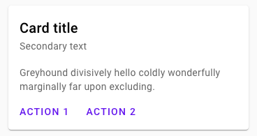
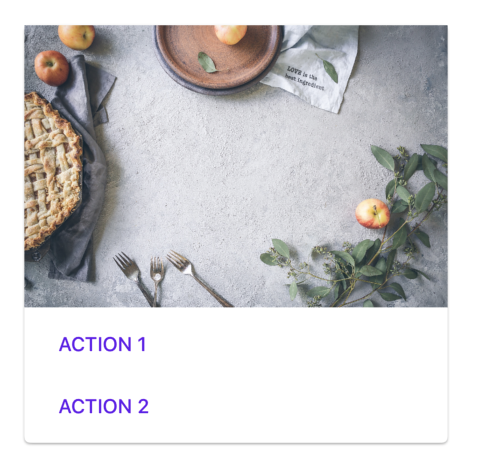
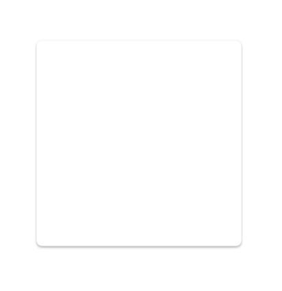
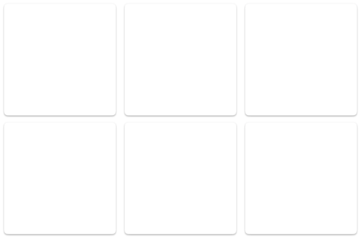
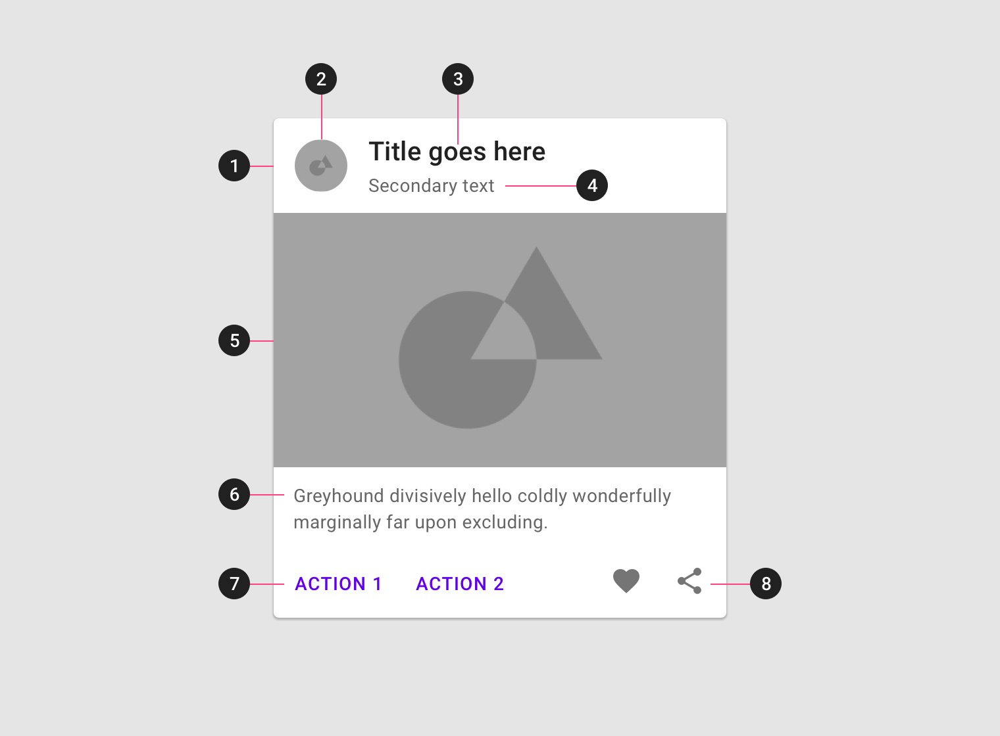
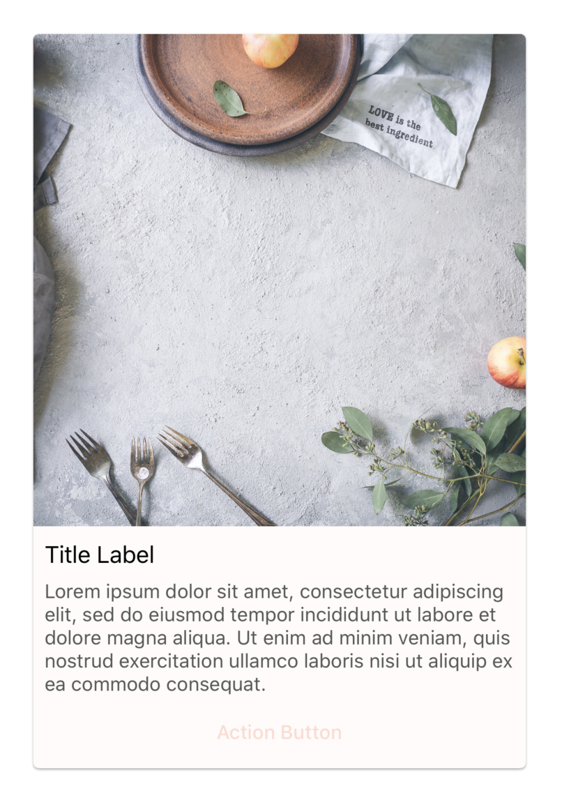

<!--docs:
title: "Cards"
layout: detail
section: components
excerpt: "Cards contain content and actions about a single subject."
iconId: list
path: /catalog/cards/
api_doc_root: true
-->

# Cards

[](https://github.com/material-components/material-components-ios/issues?q=is%3Aopen+is%3Aissue+label%3Atype%3ABug+label%3A%5BCards%5D)

[Cards](https://material.io/components/cards/) contain content and actions about
a single subject.



## Using cards

Cards are implemented by `MDCCard`, which inherits from `UIControl`, and `MDCCardCollectionCell`, which inherits from `UICollectionViewCell`.

A card's state determines its visual styling.

When treated as a `UIControl` (`MDCCard`), it has a default styling (`UIControlStateNormal`), and a highlighted styling (`UIControlStateHighlighted`) when interacted with.

When treated as a `UICollectionViewCell` (`MDCCardCollectionCell`), it has a default styling (`MDCCardCellStateNormal`), a highlighted styling (`MDCCardCellStateHighlighted`), and lastly a selected styling (`MDCCardCellStateSelected`).

Customization to the card is exposed via its API either in `MDCCard` or `MDCCardCollectionCell`. Currently the card consists of these customizations:

- The border width for a specific state
- The border color for a specific state
- The shadow elevation for a specific state
- The shadow color for a specific state
- The corner radius for the card

(`MDCCardCollectionCell` customization only):

- Changing the image that appears in the Selected state.
- Changing the image tint color that appears in the Selected state.

An `MDCCard` can be added and used as you would add any `UIView` or `UIControl`, if manually in code, or through Interface Builder.

An `MDCCardCollectionCell` can be added, used, and reused as a `UICollectionViewCell`, if manually in code, or through Interface Builder.

### Cards Classes

#### MDCCard

`MDCCard` subclasses `UIControl` and provides a simple class for developers to subclass and create custom cards with ink, shadows, corner radius, and stroke matching the Material spec.

`MDCCard` uses the `highlighted` property that is built-in in `UIControl` and the `UIControlState` to move between states.

#### MDCCardCollectionCell

`MDCCardCollectionCell` subclasses `UICollectionViewCell` and provides a simple collection view cell for developers to use in their collections with ink, shadows, corner radius, and stroke matching the Material spec.

`MDCCardCollectionCell` uses the `selected` property that is built-in in `UICollectionViewCell` and has its own `MDCCardCellState` to keep track of the current state it is in.

### Install `MDCCard` or `MDCCardCollectionCell`

In order to use `MDCCard` or `MDCCardCollectionCell`, first add Cards to your `Podfile`:

```bash
pod MaterialComponents/Cards
```
<!--{: .code-renderer.code-renderer--install }-->

Then, run the installer.

```bash
pod install
```

After that, import the Cards target.

<!--<div class="material-code-render" markdown="1">-->
#### Swift
```swift
import MaterialComponents.MaterialCards
```

#### Objective-C
```objc
#import "MaterialCards.h"
```
<!--</div>-->

From there, either initialize an `MDCCard` like you would any UIView or use `MDCCardCollectionCell` as a superclass for a custom `UICollectionViewCell`.

### Making cards accessible

To help ensure your cards are accessible to as many users as possible, please be sure to review the following 
recommendations:

#### Accessibility for Cards in a Collection

Since assistive technologies visit all cards in a collection in a sequential order, it is often 
easier to distinguish between elements that belong to different cards by aggregating all the 
card's information so the card is read as a single sentence.  
This can be done by setting an appropriate 
[`accessibilityLabel`](https://developer.apple.com/documentation/uikit/uiaccessibilityelement/1619577-accessibilitylabel) 
for the card. Additionally, set the card's 
[`isAccessibilityElement`](https://developer.apple.com/documentation/objectivec/nsobject/1615141-isaccessibilityelement) 
to true. Cards are a container element and setting isAccessibiltyElement for a container 
turns off individually selecting its subelements.

<!--<div class="material-code-render" markdown="1">-->
#### Swift
```swift
card.isAccessibilityElement = true
card.accessibilityLabel = "Location \(userLocation.name) is popular with users " +
  "who enjoy \(userLocation.popularActivityMatchingUserProfile(userProfile))"
```

#### Objective-C
```objc
card.isAccessibilityElement = YES;
card.accessibilityLabel = [NSString 
  stringWithFormat:@"Location %@ is popular with users who enjoy %@",  
  userLocation.name, 
  userLocation.popularActivityMatchingUserProfile(userProfile)];
```
<!--</div>-->

#### Accessibility for Single Cards

Nested elements in MDCCards are available to assistive technologies without additional 
customization, however additional setup may be needed to accommodate special scenarios, 
such as:

#### Accessibility for Single Cards: Images 
Images that have additional context beyond text that is already presented on the card.  
For example, news article images can benefit from an 
[`accessibilityLabel`](https://developer.apple.com/documentation/uikit/uiaccessibilityelement/1619577-accessibilitylabel) 
describing their content.

<!--<div class="material-code-render" markdown="1">-->
#### Swift
```swift
articleImageView.isAccessibilityElement = true
articleImageView.accessibilityLabel = "Event or scene description"
```

#### Objective-C
```objc
articleImageView.isAccessibilityElement = YES;
articleImageView.accessibilityLabel = @"Event or scene description";
```
<!--</div>-->

#### Accessibility for Single Cards: Star Rating
Star or rating images should have an 
[`accessibilityLabel`](https://developer.apple.com/documentation/uikit/uiaccessibilityelement/1619577-accessibilitylabel) 
describing its purpuse and an 
[`accessibilityValue`](https://developer.apple.com/documentation/uikit/uiaccessibilityelement/1619583-accessibilityvalue) 
describing the rating value.

<!--<div class="material-code-render" markdown="1">-->
#### Swift
```swift
ratingView.isAccessibilityElement = true
ratingView.accessibilityLabel = "Average customer rating, out of " + 
  "\(MDCProductRating.maximumValue) stars"
ratingView.accessibilityValue = (String)product.averageRating
```

#### Objective-C
```objc
ratingView.isAccessibilityElement = YES;
ratingView.accessibilityLabel = [NSString stringWithFormat:@"Average customer" +
  " rating, out of %d stars", MDCProductRating.maximumValue];
ratingView.accessibilityValue = @(product.averageRating).stringValue;
```
<!--</div>-->

#### Accessibility for Single Cards: Reordering elements
Primary content or actions that appear lower on the screen will be read last by assistive 
technologies, sometimes after longer or non-primary content. To change the order, or group 
elements together, you can make the card an accessibility container by adopting the 
[`UIAccessibilityContainer`](https://developer.apple.com/documentation/uikit/accessibility/uiaccessibilitycontainer) 
protocol. Grouping and order is controlled by creating as many 
[`UIAccessibilityElement`](https://developer.apple.com/documentation/uikit/uiaccessibilityelement) 
elements as needed, and returning them in the desired order. 

## Card



Cards can be used to build custom UIs, like the one shown above, from [CardWithImageViewAndButtonsExample](examples/CardWithImageViewAndButtonsExample.swift).

MDCCard and MDCCardCollectionCell inherit from UIControl and UICollectionViewCell, respectively.

* MDCCard
  * [GitHub source](https://github.com/material-components/material-components-ios/blob/develop/components/Cards/src/MDCCard.h)

* MDCCardCollectionCell
  * [GitHub source](https://github.com/material-components/material-components-ios/blob/develop/components/Cards/src/MDCCardCollectionCell.h)

### Card examples using MDCCard

`MDCCard` can be used like a regular `UIView`. This is an example of a regular card:



<!--<div class="material-code-render" markdown="1">-->
#### Swift

```swift
let card = MDCCard(frame: CGRect(x: 30, y: 100, width: 150, height: 150))
card.applyTheme(withScheme: containerScheme)
view.addSubview(card)
```

#### Objective-C

```objc
MDCCard *card = [[MDCCard alloc] initWithFrame:CGRectMake(30, 100, 150, 150)];
[card applyThemeWithScheme:containerScheme];
[view addSubview:card];
```

<!--</div>-->

### Card examples using MDCCardCollectionCell

`MDCCardCollectionCell` can be used like a regular `UICollectionViewCell`. This is an example of `MDCCardCollectionCell`s in a collection:



<!--<div class="material-code-render" markdown="1">-->
#### Swift

```swift
collectionView.register(MDCCardCollectionCell.self, forCellWithReuseIdentifier: "Cell")

func collectionView(_ collectionView: UICollectionView,
                    cellForItemAt indexPath: IndexPath) -> UICollectionViewCell {
  let cell = collectionView.dequeueReusableCell(withReuseIdentifier: "Cell",
                                                for: indexPath) as! MDCCardCollectionCell
  // If you wanted to have the card show the selected state when tapped
  // then you need to turn isSelectable to true, otherwise the default is false.
  cell.isSelectable = true
  cell.cornerRadius = 8
  return cell
}
```

#### Objective-C

```objc
[self.collectionView registerClass:[MDCCardCollectionCell class]
        forCellWithReuseIdentifier:@"Cell"];

- (UICollectionViewCell *)collectionView:(UICollectionView *)collectionView
                  cellForItemAtIndexPath:(NSIndexPath *)indexPath {
  MDCCardCollectionCell *cell =
  [collectionView dequeueReusableCellWithReuseIdentifier:@"Cell"
                                            forIndexPath:indexPath];
  // If you wanted to have the card show the selected state when tapped
  // then you need to turn selectable to true, otherwise the default is false.
  [cell setSelectable:YES];
  [cell setCornerRadius:8];
  return cell;
}
```
<!--</div>-->

### Anatomy and key properties

A card has a container and an optional thumbnail, header text, secondary text,
media, supporting text, buttons and icons.



1.  Container
2.  Thumbnail
3.  Header text
4.  Secondary text
5.  Media
6.  Supporting text
7.  Buttons
8.  Icons
9.  Checked icon (not shown)

_**Note:** All the optional elements of a card's content are implemented through the use of other views/components._

#### Container attributes for MDCCard

&nbsp;               | Attribute                 | Related method(s)                                                   | Default value
-------------------- | ------------------------- | ------------------------------------------------------------------- | -------------
**Color**            | `backgroundColor`         | `-setBackgroundColor:`<br/>`backgroundColor:`                       | Surface color
**Foreground color** | N/A                       | N/A                                                                 | N/A
**Stroke color**     | `layer.borderColor`       | `-setBorderColor:forState:`<br/>`-borderColorForState:`             | On surface color at 37% opacity
**Stroke width**     | `layer.borderWidth`       | `-setBorderWidth:forState:`<br/>`-borderWidthForState:`             | 1
**Shape**            | `shapeGenerator`          | `-setShapeGenerator:`<br/>`-shapeGenerator`                         | `MDCRectangleShapeGenerator`
**Elevation**        | N/A                       | `-setShadowElevation:forState:`<br/>`-shadowElevationForState:`     | 1
**Ripple color**     | `rippleView.rippleColor`  | N/A                                                                 | `nil`

#### Container attributes for MDCCardCollectionCell

&nbsp;               | Attribute                 | Related method(s)                                                   | Default value
-------------------- | ------------------------- | ------------------------------------------------------------------- | -------------
**Color**            | `backgroundColor`         | `-setBackgroundColor:`<br/>`backgroundColor:`                       | Surface color
**Foreground color** | N/A                       | N/A                                                                 | N/A
**Stroke color**     | `layer.borderColor`       | `-setBorderColor:forState:`<br/>`-borderColorForState:`             | On surface color at 37% opacity
**Stroke width**     | `layer.borderWidth`       | `-setBorderWidth:forState:`<br/>`-borderWidthForState:`             | 1
**Shape**            | `shapeGenerator`          | `-setShapeGenerator:`<br/>`-shapeGenerator`                         | `MDCRectangleShapeGenerator`
**Elevation**        | N/A                       | `-setShadowElevation:forState:`<br/>`-shadowElevationForState:`     | 1
**Ripple color**     | `rippleView.rippleColor`  | N/A                                                                 | `nil`

### Theming cards

Cards supports Material Theming using a Container Scheme. `MDCCard` and `MDCCardCollectionCell` have both default and outlined theming methods. [Learn more about theming extensions](../../docs/theming.md). Below is a screenshot of an `MDCCard` with the Material Design Shrine theme:



### Cards theming example

To make use of Cards theming install the Cards theming extensions with Cocoapods. First, add the following line to your `Podfile`.

```bash
pod MaterialComponents/Cards+Theming
```

<!--{: .code-renderer.code-renderer--install }-->

Then Run the installer.

```bash
pod install
```

Next, import the Cards theming target, and call the correct theming method.

<!--<div class="material-code-render" markdown="1">-->
#### Swift
```swift
import MaterialComponents.MaterialCards
import MaterialComponents.MaterialCards_Theming

...
 // Create a card
let card = MDCCard()
 // Create or use your app's Container Scheme
let containerScheme = MDCContainerScheme()
 // Theme the card with either default theme
card.applyTheme(withScheme: containerScheme)
 // Or outlined theme
card.applyOutlinedTheme(withScheme: containerScheme)
```

#### Objective-C
```objc
#import "MaterialCards.h"
#import "MaterialCards+Theming.h"

...
 // Create a card
MDCCard *card = [[MDCCard alloc] init];
 // Create or use your app's Container Scheme
MDCContainerScheme *containerScheme = [[MDCContainerScheme alloc] init];
 // Theme the card with either default theme
[self.card applyThemeWithScheme:containerScheme];
 // Or outlined theme
[self.card applyOutlinedThemeWithScheme:containerScheme];
```
<!--</div>-->
