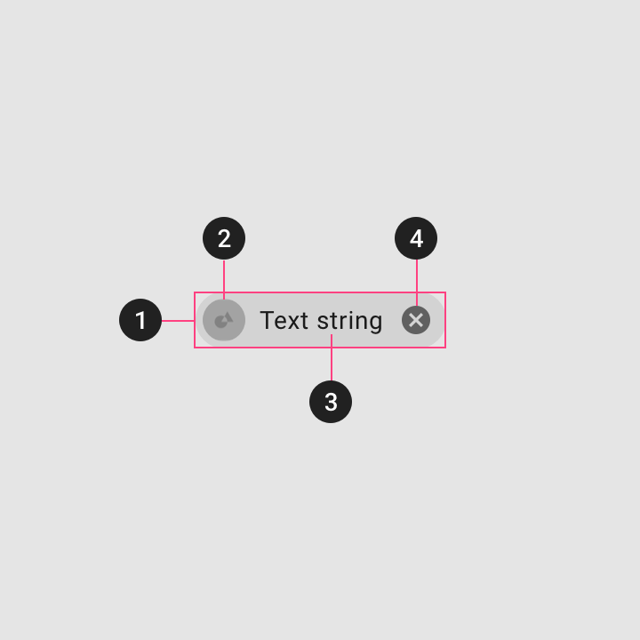
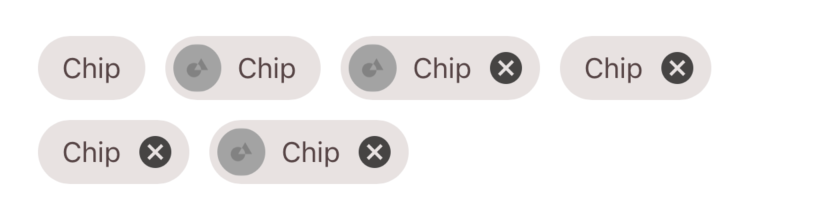

<!--docs:
title: "Chips"
layout: detail
section: components
excerpt: "Chips are compact elements that represent an input, attribute, or action."
iconId: chip
path: /catalog/chips/
api_doc_root: true
-->

<!-- This file was auto-generated using ./scripts/generate_readme Chips -->

# Chips

[](https://github.com/material-components/material-components-ios/issues?q=is%3Aopen+is%3Aissue+label%3Atype%3ABug+label%3A%5BChips%5D)

[Chips](https://material.io/components/chips) are compact elements that represent an input, attribute, or action. They allow users to enter information, make selections, filter content, or trigger actions. While buttons are expected to appear consistently and with familiar calls to action, chips should appear dynamically as a group of multiple interactive elements.


**Contents**

* [Using chips](#using-chips)
* [Input chip](#input-chip)
* [Choice chip](#choice-chip)
* [Filter chip](#filter-chip)
* [Action chip](#action-chip)
* [Theming](#theming)

- - -

## Using chips

### Installing

To use chips in your app first add the following to your `Podfile`:

```bash
pod 'MaterialComponents/Chips'
```
<!--{: .code-renderer.code-renderer--install }-->

Then, run the following command:

```bash
pod install
```

From there, import the relevant target or file.

<!--<div class="material-code-render" markdown="1">-->
#### Swift
```swift
import MaterialComponents.MaterialChips
```

#### Objective-C

```objc
#import "MaterialChips.h"
```
<!--</div>-->

### Making chips accessible

Always verify that your chips meet minimum touch requirements, as defined by either Apple's Human Interface Guidelines or Material. Material recommends a 44x44 minimum touch target.

Remember to set any relevant `accessibilityLabels` or `accessibilityTraits`, especially if you are not satisfied with default system-assigned values.

## Types

There are four types of chips:

1. [Input (text entry)](#input-chip)
1. [Choice](#choice-chip)
1. [Filter](#filter-chip)
1. [Action](#action-chip)


It is possible to create each type of chip by instantiating a single `MDCChipView` and adidng it to your view controller just like any other `UIView`.

<!--<div class="material-code-render" markdown="1">-->
#### Swift
```swift
let chipView = MDCChipView()
chipView.titleLabel.text = "Tap me"
chipView.setTitleColor(UIColor.red, for: .selected)
chipView.sizeToFit()
chipView.addTarget(self, action: #selector(tap), for: .touchUpInside)
self.view.addSubview(chipView)
```

#### Objective-C

```objc
MDCChipView *chipView = [[MDCChipView alloc] init];
chipView.titleLabel.text = @"Tap me";
[chipView setTitleColor:[UIColor redColor] forState:UIControlStateSelected];
[chipView sizeToFit];
[chipView addTarget:self
               action:@selector(tap:)
     forControlEvents:UIControlEventTouchUpInside];
[self.view addSubview:chipView];
```
<!--</div>-->

`MDCChipView` allows for customization of the following:

### Ink ripple animation

Chips display animated ink splashes when the user presses the chip. Note that if you have a background color set for the `highlighted` state the ink animation will occur on top of that color.

### Stateful properties

Like `UIButton`, `MDCChipView` provides many state-dependant accessors. These methods allow you to set the background color, title
color, border style, and elevation, both for individual states and combinations of states. If no value is set for a given state, the `normal` value will used.

### Selected Image View

Setting the image for the `selectedImageView` is optional but can help clarify that a chip is selected. This image will only appear when the chip is selected. If you have an
image set on the standard `imageView`, then the `selectedImageView` will appear on top of it. Otherwise
you'll need to resize the chip to show the selected image. See the Filter chip example to see this
in action.

### Padding

There are 4 `padding` properties that determine a chip's layout: one for each of the chip's
subviews (`imageView` and `selectedImageView` share one padding property), and one which wraps all
the others (`contentPadding`). This is useful so that you can set each of the padding properties to
ensure your chips look correct whether or not they have an image and/or accessory view. The chip
uses these property to determine `intrinsicContentSize` and `sizeThatFits`.

### Adjusting chip sizes after changing the label

If the label of a chip in a collection view can be changed dynamically (e.g. in reaction to a user's
tap), then you may notice that the chip's frame does not automatically update to accomodate the new
size of the chip's label. To force your chip to update its layout when this happens you can invoke
`invalidateIntrinsicContentSize` on the chip view. For example:

<!--<div class="material-code-render" markdown="1">-->
#### Swift
```swift
chipView.invalidateIntrinsicContentSize()
```

#### Objective-C
```objc
[chipView invalidateIntrinsicContentSize];
```
<!--</div>-->

## Input chip

Input chips represent a complex piece of information in compact form, such as an entity (person, place, or thing) or text. They enable user input and verify that input by converting text into chips.

We currently provide an implementation of Input Chips called `MDCChipField`.

```objc
MDCChipField *chipField = [[MDCChipField alloc] init];
chipField.delegate = self;
chipField.textField.placeholderLabel.text = @"This is a chip field.";
chipField.showChipsDeleteButton = true
[chipField sizeToFit];
[self.view addSubview:chipField];
```
<!--</div>-->

## Choice chip

Choice chips allow selection of a single chip from a set of options.

Choice chips clearly delineate and display options in a compact area. They are a good alternative to toggle buttons, radio buttons, and single select menus.

It is easiest to create choice Chips using a `UICollectionView`:

  - Use `MDCChipCollectionViewFlowLayout` as the `UICollectionView` layout:
  <!--<div class="material-code-render" markdown="1">-->
  ```objc
  MDCChipCollectionViewFlowLayout *layout = [[MDCChipCollectionViewFlowLayout alloc] init];
  _collectionView = [[UICollectionView alloc] initWithFrame:CGRectZero collectionViewLayout:layout];
  ```
  <!--</div>-->

  - Leave the default `UICollectionView` selection setting (single selection).
  - Use `MDCChipCollectionViewCell` as `UICollectionView` cells. (`MDCChipCollectionViewCell` manages the state of the chip based on selection state of `UICollectionView` automatically)

  <!--<div class="material-code-render" markdown="1">-->
   ```objc
  - (void)loadView {
    [super loadView];
    …
    [_collectionView registerClass:[MDCChipCollectionViewCell class]
        forCellWithReuseIdentifier:@"identifier"];
    ...
   }

  - (__kindof UICollectionViewCell *)collectionView:(UICollectionView *)collectionView
                             cellForItemAtIndexPath:(NSIndexPath *)indexPath {
    MDCChipCollectionViewCell *cell =
        [collectionView dequeueReusableCellWithReuseIdentifier:@"identifier" forIndexPath:indexPath];
    MDCChipView *chipView = cell.chipView;
    // configure the chipView
     return cell;
  }
  ```
  <!--</div>-->

- Use `UICollectionViewDelegate` methods `collectionView:didSelectItemAtIndexPath:` for reacting to new choices.

- Use `UICollectionView` `selectItemAtIndexPath:animated:scrollPosition:` method to edit choice selection programmatically.

## Filter chip

Filter chips use tags or descriptive words to filter content.

Filter chips clearly delineate and display options in a compact area. They are a good alternative to toggle buttons or checkboxes.

It is easiest to create filter Chips using a `UICollectionView`:

 - Use `MDCChipCollectionViewFlowLayout` as the `UICollectionView` layout:
 <!--<div class="material-code-render" markdown="1">-->
 ```objc
 MDCChipCollectionViewFlowLayout *layout = [[MDCChipCollectionViewFlowLayout alloc] init];
  _collectionView = [[UICollectionView alloc] initWithFrame:CGRectZero collectionViewLayout:layout];
 ```
 <!--</div>-->
 
 - Allow multi cell selection in the `UICollectionView`:
  <!--<div class="material-code-render" markdown="1">-->
  ```objc
  collectionView.allowsMultipleSelection = YES; 
  ```
  <!--</div>-->
 - Use `MDCChipCollectionViewCell` as `UICollectionView` cells. (`MDCChipCollectionViewCell` manages the state of the chip based on selection state of `UICollectionView` automatically)

  <!--<div class="material-code-render" markdown="1">-->
   ```objc
  - (void)loadView {
    [super loadView];
    …
    [_collectionView registerClass:[MDCChipCollectionViewCell class]
        forCellWithReuseIdentifier:@"identifier"];
    ...
   }

  - (__kindof UICollectionViewCell *)collectionView:(UICollectionView *)collectionView
                             cellForItemAtIndexPath:(NSIndexPath *)indexPath {
    MDCChipCollectionViewCell *cell =
        [collectionView dequeueReusableCellWithReuseIdentifier:@"identifier" forIndexPath:indexPath];
    MDCChipView *chipView = cell.chipView;
    // configure the chipView
     return cell;
  }
  ```
  <!--</div>-->

- Use `UICollectionViewDelegate` methods `collectionView:didSelectItemAtIndexPath:` and `collectionView:didDeselectItemAtIndexPath:` for reacting to filter changes.

- Use `UICollectionView` `deselectItemAtIndexPath:animated:` and `selectItemAtIndexPath:animated:scrollPosition:` methods to edit filter selection in code.

## Action chip

Action chips offer actions related to primary content. They should appear dynamically and contextually in a UI.

An alternative to action chips are buttons, which should appear persistently and consistently.

It is easiest to create action Chips using a `UICollectionView`:

 - Use `MDCChipCollectionViewFlowLayout` as the `UICollectionView` layout:
 <!--<div class="material-code-render" markdown="1">-->
 ```objc
 MDCChipCollectionViewFlowLayout *layout = [[MDCChipCollectionViewFlowLayout alloc] init];
  _collectionView = [[UICollectionView alloc] initWithFrame:CGRectZero collectionViewLayout:layout];
 ```
 <!--</div>-->
 
 - Leave the default `UICollectionView` selection setting (single selection).
 - Use `MDCChipCollectionViewCell` as `UICollectionView` cells. (`MDCChipCollectionViewCell` manages the state of the chip based on selection state of `UICollectionView` automatically)

  <!--<div class="material-code-render" markdown="1">-->
   ```objc
  - (void)loadView {
    [super loadView];
    …
    [_collectionView registerClass:[MDCChipCollectionViewCell class]
        forCellWithReuseIdentifier:@"identifier"];
    ...
   }

  - (__kindof UICollectionViewCell *)collectionView:(UICollectionView *)collectionView
                             cellForItemAtIndexPath:(NSIndexPath *)indexPath {
    MDCChipCollectionViewCell *cell =
        [collectionView dequeueReusableCellWithReuseIdentifier:@"identifier" forIndexPath:indexPath];
    MDCChipView *chipView = cell.chipView;
    // configure the chipView
     return cell;
  }
  ```
  <!--</div>-->

- Make sure that `MDCChipCollectionViewCell` does not stay in selected state

 <!--<div class="material-code-render" markdown="1">-->
   ```objc
 - (void)collectionView:(UICollectionView *)collectionView didSelectItemAtIndexPath:(NSIndexPath *)indexPath {
    // For action chips, we never want the chip to stay in selected state.
    // Other possible apporaches would be relying on theming or Customizing collectionViewCell
    // selected state.
    [collectionView deselectItemAtIndexPath:indexPath animated:NO];
    // Trigger the action
  }
  ```
  <!--</div>-->

- Use `UICollectionViewDelegate` method `collectionView:didSelectItemAtIndexPath:` to Trigger the action.

### Anatomy and key properties

The following is an anatomy diagram of a chip:



1.  Container
1.  Thumbnail (optional)
1.  Text
1.  Remove icon (optional)

#### Container attributes

&nbsp;               | Attribute                        | Related method(s)                               | Default value
-------------------- | -------------------------------- | ------------------------------- | -------------
**Color**            | N/A                              | `-setBackgroundColor:forState:`<br/>`-backgroundColorForState:`  | On surface color at 12% opacity
**Ripple color**     | N/A                              | `-setRippleColor:forState:`<br/>`-rippleColorForState:`  | White at 14% opacity
**Stroke width**     | N/A                              | `-setBorderWidth:forState:`<br/>`-borderWidthForState:`  | 0
**Stroke color**     | N/A                              | `-setBorderColor:forState:`<br/>`-borderColorForState:`  | `nil`
**Min height**       | `minimumSize`                    | N/A                                                      | `{ 0, 32 }`
**Padding**          | `contentPadding` | N/A | `{ 4, 4, 4, 4 }` 
**Min touch target** | `centerVisibleArea`, `visibleAreaInsets` | N/A                          | `NO`, `{ 0, 0, 0, 0 }`

#### Thumbnail attributes

**Chip icon**

&nbsp;         | Attribute                                       | Related method(s)                                                     | Default value
-------------- | ----------------------------------------------- | --------------------------------------------------------------------- | -------------
**Icon**       | `imageView`, `selectedImageView`                | N/A                                                                   | `nil`
**Padding**    | `imagePadding`, `accessoryPadding` | N/A | `{ 0, 0, 0, 0 }`, `{ 0, 0, 0, 0 }`

#### Text attributes

&nbsp;         | Attribute                                       | Related method(s)                                                           | Default value
-------------- | ----------------------------------------------- | --------------------------------------------------------------------------- | -------------
**Text label** | `titleLabel`                                    | N/A                   | N/A
**Color**       | N/A                              | `-setTitleColor:forState:`<br/>`-titleColorForState:`  | On surface color at 87% opacity
**Typography** | `titleFont`                        | N/A | Body 2
**Padding**    | `titlePadding` | N/A       | `{ 3, 8, 4, 8 }`

## Theming

`MDCChipView` supports Material Theming using a Container Scheme. To install the `MDCChipView` theming extension, first add the following line to your `Podfile`:

```bash
pod MaterialComponents/Chips+Theming
```

<!--{: .code-renderer.code-renderer--install }-->

Then run the installer:

```bash
pod install
```

There are two theming variants for `MDCChipView`: the default theme and the outlined theme.

Below is a Chip collection with the Shrine outlined theme applied to it.



<!--<div class="material-code-render" markdown="1">-->

#### Swift

```swift
// Import the Chips Theming Extensions module
import MaterialComponents.MaterialChips_MaterialTheming
 ...
 // Create or use your app's Container Scheme
let containerScheme = MDCContainerScheme()
 // Theme the chip with either default theme
chip.applyTheme(withScheme: containerScheme)
 // Or outlined theme
chip.applyOutlinedTheme(withScheme: containerScheme)
```

#### Objective-C

```objc
// Import the Tabs Theming Extensions header
#import <MaterialComponents/MaterialChips+MaterialTheming.h>
 ...
 // Create or use your app's Container Scheme
MDCContainerScheme *containerScheme = [[MDCContainerScheme alloc] init];
 // Theme the chip with either default theme
[self.chip applyThemeWithScheme:containerScheme];
 // Or outlined theme
[self.chip applyOutlinedThemeWithScheme:containerScheme];
```

<!--</div>-->
