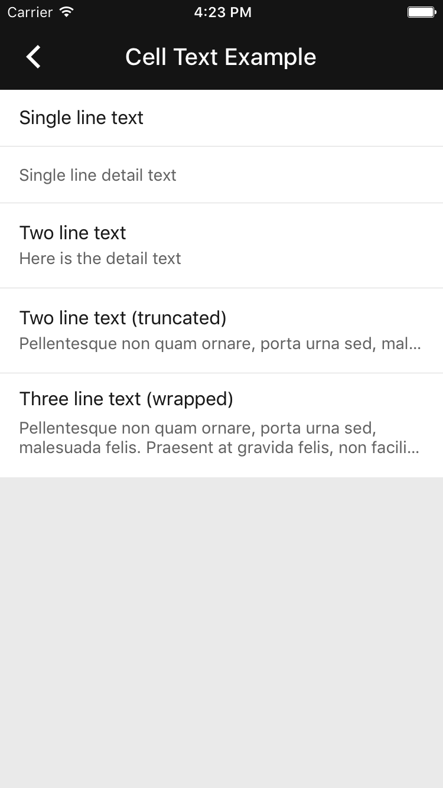

# Collection Cells

**Notice**: This component will be deprecated over the next few months in favor of the
[Cards](../Cards) and [List](../List) components. See our
[public tracker](https://www.pivotaltracker.com/epic/show/3938766) for more details on timing and
the deprecation plan.

---

  

Collection view cell classes that adhere to Material Design layout and styling.

## Design & API Documentation

<ul class="icon-list">
  <li class="icon-list-item icon-list-item--spec"><a href="https://material.io/go/design-lists#lists-specs">Material Design guidelines: Collection List Specs</a></li>
  <li class="icon-list-item icon-list-item--link"><a href="https://material.io/components/ios/catalog/collections/collection-cells/api-docs/Classes/MDCCollectionViewCell.html">API: MDCCollectionViewCell</a></li>
  <li class="icon-list-item icon-list-item--link"><a href="https://material.io/components/ios/catalog/collections/collection-cells/api-docs/Classes/MDCCollectionViewTextCell.html">API: MDCCollectionViewTextCell</a></li>
</ul>

- - -

## Installation

## Usage

Please see the [Collections](../Collections/) component for more information about using Collection
Cells. We do not presently support using Collection Cells as a standalone component.
