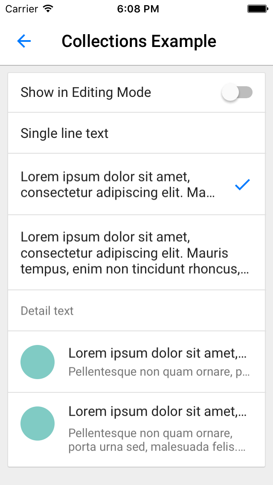

# Collection Cells

<!--{: .ios-screenshot .right }-->

Collection view cell classes that adhere to Material design layout and styling.
<!--{: .intro :}-->

### Material Design Specifications

<ul class="icon-list">
  <li class="icon-link"><a href="https://www.google.com/design/spec/components/lists.html#lists-specs">Collection List Specs</a></li>
</ul>

### API Documentation

<ul class="icon-list">
  <li class="icon-link"><a href="/components/CollectionCells/apidocs/Classes/MDCCollectionViewCell.html">MDCCollectionViewCell</a></li>
  <li class="icon-link"><a href="/components/CollectionCells/apidocs/Classes/MDCCollectionViewTextCell.html">MDCCollectionViewTextCell</a></li>
</ul>

- - -

## Installation

### Requirements

- Xcode 7.0 or higher.
- iOS SDK version 7.0 or higher.

### Installation with CocoaPods

To add this component to your Xcode project using CocoaPods, add the following to your `Podfile`:

~~~
pod 'MaterialComponents/CollectionCells'
~~~

Then, run the following command:

~~~ bash
$ pod install
~~~

- - -

## Usage

### Importing

Before using Collection Cells, you'll need to import it:

<!--
-->
#### Objective-C
~~~ objc
#import "MaterialCollectionCells.h"
~~~

#### Swift
~~~ swift
import MaterialComponents.MaterialCollectionCells
~~~
<!--
-->
