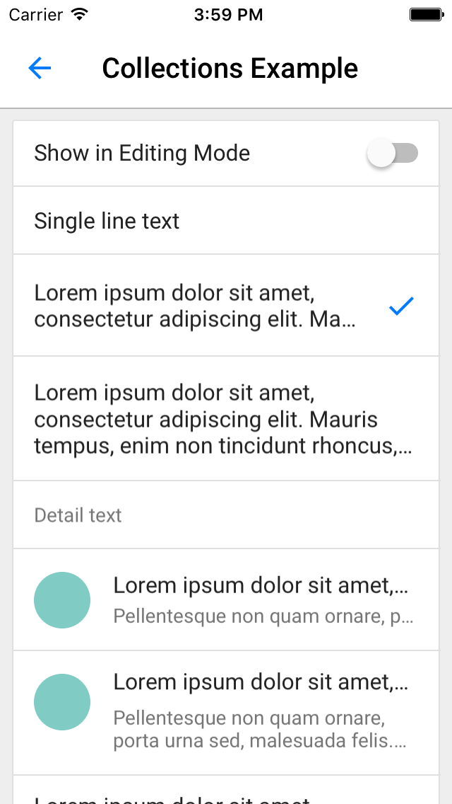

# Collections

<!--{: .ios-screenshot .right }-->

Collection view classes that adhere to Material design layout and styling.
<!--{: .intro :}-->

### Material Design Specifications

<ul class="icon-list">
  <li class="icon-link"><a href="https://www.google.com/design/spec/components/lists.html#lists-specs">Collection List Specs</a></li>
</ul>

### API Documentation

<ul class="icon-list">
  <li class="icon-link"><a href="/components/Collections/apidocs/Classes/MDCCollectionViewController.html">MDCCollectionViewController</a></li>
  <li class="icon-link"><a href="/components/Collections/apidocs/Protocols/MDCCollectionViewEditing.html">MDCCollectionViewEditing</a></li>
  <li class="icon-link"><a href="/components/Collections/apidocs/Protocols/MDCCollectionViewEditingDelegate.html">MDCCollectionViewEditingDelegate</a></li>
  <li class="icon-link"><a href="/components/Collections/apidocs/Classes/MDCCollectionViewFlowLayout.html">MDCCollectionViewFlowLayout</a></li>
  <li class="icon-link"><a href="/components/Collections/apidocs/Protocols/MDCCollectionViewStyling.html">MDCCollectionViewStyling</a></li>
  <li class="icon-link"><a href="/components/Collections/apidocs/Protocols/MDCCollectionViewStylingDelegate.html">MDCCollectionViewStylingDelegate</a></li>
</ul>

- - -

## Installation

### Requirements

- Xcode 7.0 or higher.
- iOS SDK version 7.0 or higher.

### Installation with CocoaPods

To add this component to your Xcode project using CocoaPods, add the following to your `Podfile`:

~~~
pod 'MaterialComponents/Collections'
~~~

Then, run the following command:

~~~ bash
$ pod install
~~~

- - -

## Usage

### Importing

Before using Collections, you'll need to import it:

<!--
-->
#### Objective-C
~~~ objc
#import "MaterialCollections.h"
~~~

#### Swift
~~~ swift
import MaterialComponents.MaterialCollections
~~~
<!--
-->

### Use `MDCCollectionViewController` as a view controller

The following four steps will allow you to get a basic example of a `MDCCollectionViewController`
subclass up and running.

Step 1: **Subclass `MDCCollectionViewController` in your view controller interface**.

<!--
-->
#### Objective-C
~~~ objc
#import "MaterialCollections.h"

@interface MyCollectionsExample : MDCCollectionViewController
@end
~~~

#### Swift
~~~ swift
import MaterialComponents.MaterialCollections

class MyCollectionsExample: MDCCollectionViewController {
}
~~~
<!--
-->

Step 2: **Setup your data**.

<!--
-->
#### Objective-C
~~~ objc
colors = @[ @"red", @"blue", @"green", @"black", @"yellow", @"purple" ];
~~~

#### Swift
~~~ swift
let colors = [ "red", "blue", "green", "black", "yellow", "purple" ]
~~~
<!--
-->

Step 3: **Register a cell class**.

<!--
-->
#### Objective-C
~~~ objc
[self.collectionView registerClass:[MDCCollectionViewTextCell class]
        forCellWithReuseIdentifier:kReusableIdentifierItem];
~~~

#### Swift
~~~ swift
self.collectionView?.registerClass(MDCCollectionViewTextCell.self,
                                   forCellWithReuseIdentifier: reusableIdentifierItem)
~~~
<!--
-->

Step 4: **Override `UICollectionViewDataSource` protocol required methods**.

<!--
-->
#### Objective-C
~~~ objc
- (NSInteger)collectionView:(UICollectionView *)collectionView
     numberOfItemsInSection:(NSInteger)section {
  return colors.count;
}

- (UICollectionViewCell *)collectionView:(UICollectionView *)collectionView
                  cellForItemAtIndexPath:(NSIndexPath *)indexPath {
  MDCCollectionViewTextCell *cell =
      [collectionView dequeueReusableCellWithReuseIdentifier:kReusableIdentifierItem
                                                forIndexPath:indexPath];
  cell.textLabel.text = colors[indexPath.item];
  return cell;
}
~~~

#### Swift
~~~ swift
override func collectionView(collectionView: UICollectionView,
                             numberOfItemsInSection section: Int) -> Int {
  return colors.count
}

override func collectionView(collectionView: UICollectionView,
                             cellForItemAtIndexPath indexPath: NSIndexPath) -> UICollectionViewCell {
  var cell = collectionView.dequeueReusableCellWithReuseIdentifier(reusableIdentifierItem,
                                                                   forIndexPath: indexPath)
  if let cell = cell as? MDCCollectionViewTextCell {
    cell.textLabel?.text = colors[indexPath.item]
  }

  return cell
}
~~~
<!--
-->

- - -

### Styling the collection view

The collection view controller provides a `styler` property that conforms to the
`MDCCollectionViewStyling` protocol. By using this property, styling can be easily set for the
collection view items/sections. In addition, by overriding `MDCCollectionViewStyleDelegate`
protocol methods in a collection view controller subclass, specific cells/sections can be styled
differently.

### Cell Styles

The styler allows setting the cell style as Default, Grouped, or Card Style. Choose to
either set the styler `cellStyle` property directly, or use the protocol method
`collectionView:cellStyleForSection:` to style per section.

<!--
-->
#### Objective-C
~~~ objc
// Set for entire collection view.
self.styler.cellStyle = MDCCollectionViewCellStyleCard;

// Or set for specific sections.
- (MDCCollectionViewCellStyle)collectionView:(UICollectionView *)collectionView
                         cellStyleForSection:(NSInteger)section {
  if (section == 2) {
    return MDCCollectionViewCellStyleCard;
  }
  return MDCCollectionViewCellStyleGrouped;
}
~~~

#### Swift
~~~ swift
// Set for entire collection view.
self.styler.cellStyle = .Card

// Or set for specific sections.
override func collectionView(collectionView: UICollectionView,
                             cellStyleForSection section: Int) -> MDCCollectionViewCellStyle {
  if section == 2 {
    return .Card
  }
  return .Grouped
}
~~~
<!--
-->

### Cell Height

The styling delegate protocol can be used to override the default cell height of `48.0f`.

<!--
-->
#### Objective-C
~~~ objc
- (CGFloat)collectionView:(UICollectionView *)collectionView
    cellHeightAtIndexPath:(NSIndexPath *)indexPath {
  if (indexPath.item == 0) {
    return 80.0f;
  }
  return 48.0f;
}
~~~

#### Swift
~~~ swift
override func collectionView(collectionView: UICollectionView,
                             cellHeightAtIndexPath indexPath: NSIndexPath) -> CGFloat {
  if indexPath.item == 0 {
    return 80.0
  }
  return 48.0
}
~~~
<!--
-->

### Cell Layout

The styler allows setting the cell layout as List, Grid, or Custom.

<!--
-->
#### Objective-C
~~~ objc
// Set as list layout.
self.styler.cellLayoutType = MDCCollectionViewCellLayoutTypeList;

// Or set as grid layout.
self.styler.cellLayoutType = MDCCollectionViewCellLayoutTypeGrid;
self.styler.gridPadding = 8;
self.styler.gridColumnCount = 2;
~~~

#### Swift
~~~ swift
// Set as list layout.
self.styler.cellLayoutType = .List

// Or set as grid layout.
self.styler.cellLayoutType = .Grid
self.styler.gridPadding = 8
self.styler.gridColumnCount = 2
~~~
<!--
-->

### Cell Separators

The styler allows customizing cell separators for the entire collection view. Individual
cell customization is also available by using an `MDCCollectionViewCell` cell or a subclass of it.
Learn more by reading the section on [Cell Separators](../CollectionCells/#cell-separators) in the
[CollectionCells](../CollectionCells) component.

<!--
-->
#### Objective-C
~~~ objc
// Set separator color.
self.styler.separatorColor = [UIColor redColor];

// Set separator insets.
self.styler.separatorInset = UIEdgeInsetsMake(0, 16, 0, 16);

// Set separator line height.
self.styler.separatorLineHeight = 1.0f;

// Whether to hide separators.
self.styler.shouldHideSeparators = NO;
~~~

#### Swift
~~~ swift
// Set separator color.
self.styler.separatorColor = UIColor.redColor()

// Set separator insets.
self.styler.separatorInset = UIEdgeInsetsMake(0, 16, 0, 16)

// Set separator line height.
self.styler.separatorLineHeight = 1.0

// Whether to hide separators.
self.styler.shouldHideSeparators = false
~~~
<!--
-->
