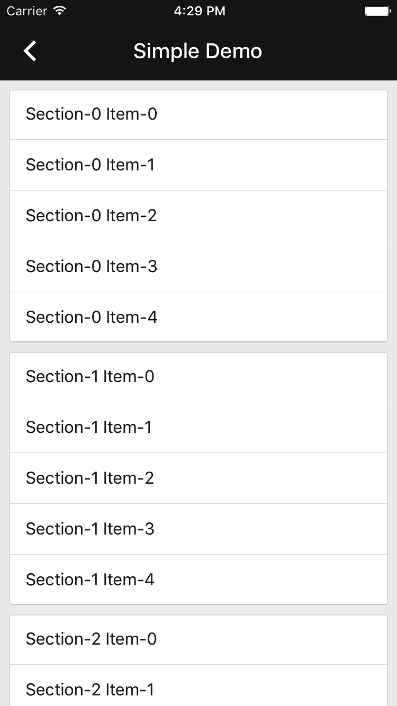

# Collections

**Notice**: This component will be deprecated over the next few months in favor of the
[Cards](../Cards) and [List](../List) components. See our
[public tracker](https://www.pivotaltracker.com/epic/show/3938766) for more details on timing and
the deprecation plan.

---

<div class="article__asset article__asset--screenshot">
  
</div>

Collection view classes that adhere to Material Design layout and styling.

## Design & API Documentation

<ul class="icon-list">
  <li class="icon-list-item icon-list-item--spec"><a href="https://material.io/go/design-lists#lists-specs">Material Design guidelines: Collection List Specs</a></li>
  <li class="icon-list-item icon-list-item--link"><a href="https://material.io/components/ios/catalog/collections/api-docs/Classes/MDCCollectionViewController.html">API: MDCCollectionViewController</a></li>
  <li class="icon-list-item icon-list-item--link"><a href="https://material.io/components/ios/catalog/collections/api-docs/Protocols/MDCCollectionViewEditing.html">API: MDCCollectionViewEditing</a></li>
  <li class="icon-list-item icon-list-item--link"><a href="https://material.io/components/ios/catalog/collections/api-docs/Protocols/MDCCollectionViewEditingDelegate.html">API: MDCCollectionViewEditingDelegate</a></li>
  <li class="icon-list-item icon-list-item--link"><a href="https://material.io/components/ios/catalog/collections/api-docs/Protocols/MDCCollectionViewStyling.html">API: MDCCollectionViewStyling</a></li>
  <li class="icon-list-item icon-list-item--link"><a href="https://material.io/components/ios/catalog/collections/api-docs/Protocols/MDCCollectionViewStylingDelegate.html">API: MDCCollectionViewStylingDelegate</a></li>
</ul>

- - -

## Installation

### Installation with CocoaPods

To add this component to your Xcode project using CocoaPods, add the following to your `Podfile`:

```
pod 'MaterialComponents/Collections'
```
<!--{: .code-renderer.code-renderer--install }-->

Then, run the following command:

```bash
pod install
```

- - -

## Overview

The Collections component consists of a set of collection view related classes that adhere to
Material Design layout and styling. Typically you will subclass the `MDCCollectionViewController`,
which in turn subclasses `UICollectionViewController`. This controller provides the collection view
used as its content.

In addition, `MDCCollectionViewController` also provides two key properties used to style and
interact with the collection view. Firstly, the `styler` property, which conforms to the
`MDCCollectionViewStyling` protocol, provides methods and properties to change the styling of the
collection view. The default `styler` values will provide a look and feel consistent with Material
Design principles, however it is also customizable. Secondly, the `editor` property, which conforms
to the `MDCCollectionViewEditing` protocol, allows putting the collection view into various editing
modes. Some of the available editing interactions are swipe-to-dismiss sections and/or index paths,
multi-select rows for deletion, and reordering of rows.

The `MDCCollectionViewController` conforms to both the `MDCCollectionViewStylingDelegate` and
`MDCCollectionViewEditingDelegate` protocols which provide a mechanism for your subclasses to
set styling and editing properties both at index paths as well as for the entire collection view.
By implementing the editing delegate methods, you may receive notifications of editing state changes
allowing your data to stay in sync with any edits.

## Table of Contents
- [Importing](#importing)
- [Use `MDCCollectionViewController` as a view controller](#use-mdccollectionviewcontroller-as-a-view-controller)
- [Provide own UICollectionView](#provide-own-uicollectionview)
- [Styling the collection view](styling/)
- [Editing the collection view](editing/)

- - -

## Usage

### Importing

Before using Collections, you'll need to import it:

<!--<div class="material-code-render" markdown="1">-->
#### Swift
```swift
import MaterialComponents.MaterialCollections
```

#### Objective-C
```objc
#import "MaterialCollections.h"
```
<!--</div>-->

### Use `MDCCollectionViewController` as a view controller

The following four steps will allow you to get a basic example of a `MDCCollectionViewController`
subclass up and running.

Step 1: **Subclass `MDCCollectionViewController` in your view controller interface**.

<!--<div class="material-code-render" markdown="1">-->
#### Swift
```swift
import MaterialComponents.MaterialCollections

class MyCollectionsExample: MDCCollectionViewController {
}
```

#### Objective-C
```objc
#import "MaterialCollections.h"

@interface MyCollectionsExample : MDCCollectionViewController
@end
```
<!--</div>-->

Step 2: **Setup your data**.

<!--<div class="material-code-render" markdown="1">-->
#### Swift
```swift
let colors = [ "red", "blue", "green", "black", "yellow", "purple" ]
```

#### Objective-C
```objc
NSArray *colors = @[ @"red", @"blue", @"green", @"black", @"yellow", @"purple" ];
```
<!--</div>-->

Step 3: **Register a cell class**.

<!--<div class="material-code-render" markdown="1">-->
#### Swift
```swift
self.collectionView?.register(MDCCollectionViewTextCell.self,
                              forCellWithReuseIdentifier: reusableIdentifierItem)
```

#### Objective-C
```objc
[self.collectionView registerClass:[MDCCollectionViewTextCell class]
        forCellWithReuseIdentifier:kReusableIdentifierItem];
```
<!--</div>-->

Step 4: **Override `UICollectionViewDataSource` protocol required methods**.

<!--<div class="material-code-render" markdown="1">-->
#### Swift
```swift
override func collectionView(_ collectionView: UICollectionView,
                             numberOfItemsInSection section: Int) -> Int {
  return colors.count
}

override func collectionView(_ collectionView: UICollectionView, cellForItemAt indexPath: IndexPath) -> UICollectionViewCell {

  var cell = collectionView.dequeueReusableCell(withReuseIdentifier: reusableIdentifierItem, for: indexPath)
  if let cell = cell as? MDCCollectionViewTextCell {
    cell.textLabel?.text = colors[indexPath.item]
  }

  return cell

}
```

#### Objective-C
```objc
- (NSInteger)collectionView:(UICollectionView *)collectionView
     numberOfItemsInSection:(NSInteger)section {
  return colors.count;
}

- (UICollectionViewCell *)collectionView:(UICollectionView *)collectionView
                  cellForItemAtIndexPath:(NSIndexPath *)indexPath {
  MDCCollectionViewTextCell *cell =
      [collectionView dequeueReusableCellWithReuseIdentifier:kReusableIdentifierItem
                                                forIndexPath:indexPath];
  cell.textLabel.text = colors[indexPath.item];
  return cell;
}
```
<!--</div>-->

### Provide own UICollectionView

It is possible to use the `MDCCollectionViewController` class while providing your own
`UICollectionView` subclass. That provided collection view may still receive styling and editing
capabilities that the `MDCCollectionViewController` class provides.

<!--<div class="material-code-render" markdown="1">-->
#### Swift
```swift
override func viewDidLoad() {
  super.viewDidLoad()

  // Here we are setting a custom collection view.
  self.collectionView = CustomCollectionView(frame: (self.collectionView?.frame)!,
                                             collectionViewLayout: (self.collectionViewLayout))
  ...
}
```

#### Objective-C
```objc
- (void)viewDidLoad {
  [super viewDidLoad];

  // Here we are setting a custom collection view.
  self.collectionView = [[CustomCollectionView alloc] initWithFrame:self.collectionView.frame
                                               collectionViewLayout:self.collectionViewLayout];
  ...
}
```
<!--</div>-->


- - -

## Related Components

<ul class="icon-list">
  <li class="icon-list-item icon-list-item--components"><a href="../CollectionCells">Collection Cells</a></li>
  <li class="icon-list-item icon-list-item--components"><a href="../CollectionLayoutAttributes">Collection Layout Attributes</a></li>
</ul>

