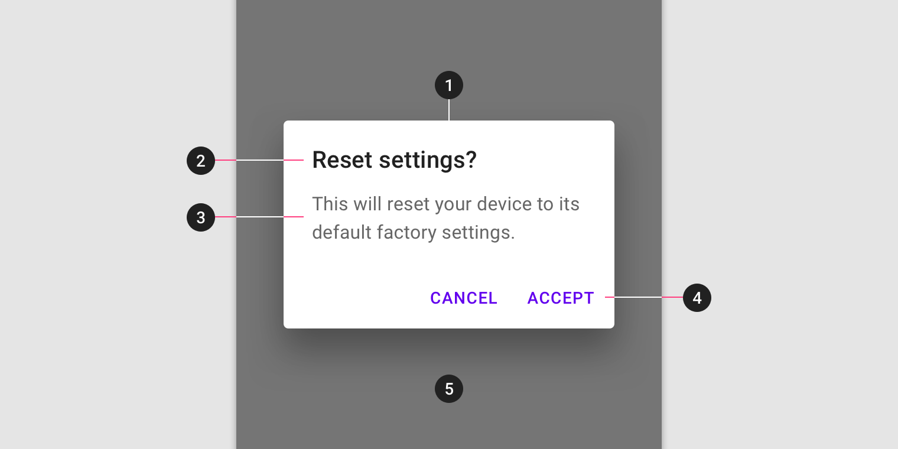
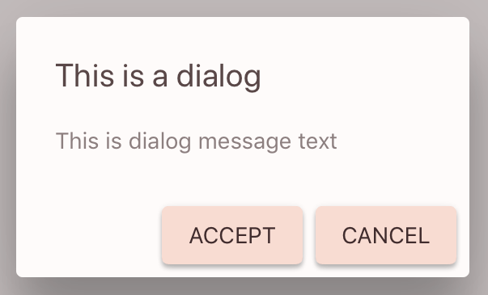

<!--docs:
title: "Dialogs"
layout: detail
section: components
excerpt: "Dialogs inform users about a task and can contain critical information, require decisions, or involve multiple tasks."
iconId: dialog
path: /catalog/dialogs/
api_doc_root: true
-->

<!-- This file was auto-generated using ./scripts/generate_readme Dialogs -->

# Dialogs

[](https://github.com/material-components/material-components-ios/issues?q=is%3Aopen+is%3Aissue+label%3Atype%3ABug+label%3A%5BDialogs%5D)

Dialogs inform users about a task and can contain critical information, require decisions, or
involve multiple tasks.


## Contents

* [Using dialogs](#using-dialogs)
* [Alert dialog](#alert-dialog)
* [Theming](#theming)

- - -

## Using dialogs

### Installing

In order to use Dialogs with [Cocoapods](https://guides.cocoapods.org/using/getting-started.html) first add the `Dialogs` subspec to your `Podfile`:

```bash
pod MaterialComponents/Dialogs
```
<!--{: .code-renderer.code-renderer--install }-->

Then, run the installer:

```bash
pod install
```

After that, import the relevant target or file.

<!--<div class="material-code-render" markdown="1">-->
#### Swift
```swift
import MaterialComponents.MaterialDialogs
```

#### Objective-C
```objc
#import "MaterialDialogs.h"
```
<!--</div>-->

### Dialogs classes

Dialogs on iOS consist of three classes:

1. `MDCAlertController` provides a basic alert interface with support for things like title text, message text, and optional accessory views.
1. `MDCDialogTransitionController` is involved in the presentation of dialogs. It conforms to `UIViewControllerAnimatedTransitioning` and `UIViewControllerTransitioningDelegate`, and vends the presentation controllers to be used in presentation and dismissal transitions. It can be used in the presentation of `MDCAlertController`s as well as custom dialog view controller classes.
1. `MDCDialogPresentationController` is the `UIPresentationController` subclass provided by `MDCDialogTransitionController`.

### Making dialogs accessible

### `MDCDialogPresentationController` Accessibility

As `MDCDialogPresentationController` is responsible for the presentation of your
custom view controllers, it does not implement any accessibility
functionality itself.

#### `-accessibilityPerformEscape` Behavior

Ensure that the accessibility escape gesture in VoiceOver works by implementing 
the `-performAccessibilityEscape` method in your custom dialog view controller class.

```
- (BOOL)accessibilityPerformEscape {
  [self.presentingViewController dismissViewControllerAnimated:YES completion:nil];
  return YES;
}
```

## Types

There are four types of dialogs:

1. [Alert](#alert-dialog)
1. Simple
1. Confirmation
1. Full-screen


## Alert dialog

The alert style is the only style supported on iOS. Consider using the [ActionSheet](https://github.com/material-components/material-components-ios/blob/develop/components/ActionSheet/README.md) component in situations where one of the unsupported dialog types would have been appropriate.

To present either an `MDCAlertController` or a custom dialog view controller, set its `modalPresentationStyle`
property to `UIModalPresentationCustom` and its `transitioningDelegate` property to an
instance of `MDCDialogTransitionController`. Then, present the view controller from the
root controller.

### `MDCAlertController` example

The sample code below shows how to use the Dialogs component to present an 
`MDCAlertController`. For a more in-depth example, see the
[`DialogsTypicalUseExampleViewController`](examples/DialogsTypicalUseExampleViewController.m).

<!--<div class="material-code-render" markdown="1">-->
#### Swift

```swift
// Present a modal alert
let alertController = MDCAlertController(title: "Title string", message: "Message string")
let action = MDCAlertAction(title:"OK") { (action) in print("OK") }
alertController.addAction(action)

present(alertController, animated:true, completion:...)
```

#### Objective-C

```objc
// Present a modal alert
MDCAlertController *alertController =
[MDCAlertController alertControllerWithTitle:@"Title string"
                                     message:@"Message string"];

MDCAlertAction *alertAction =
    [MDCAlertAction actionWithTitle:@"OK"
                            handler:^(MDCAlertAction *action) {
       NSLog(@"OK");
    }];

[alertController addAction:alertAction];

[self presentViewController:alertController animated:YES completion:...];
```
<!--</div>-->

### Custom alert dialog example

The sample code below shows how to present a custom dialog.
For a more in-depth example, see the [`DialogsCustomShadowExampleViewController`](examples/DialogsCustomShadowExampleViewController.swift).

<!--<div class="material-code-render" markdown="1">-->
#### Swift

```swift
// The following is called from the presenting view controller and has the
// following variable defined to keep a reference to the transition
// controller.
strong var dialogTransitionController: MDCDialogTransitionController

// To present the dialog myDialogViewController
dialogTransitionController = MDCDialogTransitionController()
myDialogViewController.modalPresentationStyle = .custom
myDialogViewController.transitioningDelegate = dialogTransitionController

present(myDialogViewController, animated: true, completion:...)
```

#### Objective-C

```objc
// self is the presenting view controller and which has the following property
// defined to keep a reference to the transition controller.
@property(nonatomic) MDCDialogTransitionController *dialogTransitionController;

// To present the dialog myDialogViewController
self.dialogTransitionController = [[MDCDialogTransitionController alloc] init];
myDialogViewController.modalPresentationStyle = UIModalPresentationCustom;
myDialogViewController.transitioningDelegate = self.dialogTransitionController;
[self presentViewController:myDialogViewController animated:YES completion:...];

```
<!--</div>-->

### Anatomy and key properties

The following is an anatomy diagram of a Material dialog:



1.  Container
1.  Title (optional)
1.  Content
1.  Buttons (optional)
1.  Scrim

#### Container attributes

&nbsp;                              | **Attribute**                                            | **Related methods**                                    | **Default value**
----------------------------------- | -------------------------------------------------------- | ------------------------------------------------------ | -----------------
**Color**                           | `view.backgroundColor`                                        | `-setBackgroundColor:` <br/> `-backgroundColor`   | Surface color
**Shape**                           | `cornerRadius`                                           | `-setCornerRadius:` <br/> `-cornerRadius`              | 4

#### Title attributes

&nbsp;         | **Attribute**            | **Related methods**              | **Default value**
-------------- | ------------------------ | -------------------------------- | -----------------
**Text label** | `title`                  | `-setTitle:`<br/>`-title`        | `nil`
**Text color** | `titleColor`             | `-setTitleColor:`<br/>`-titleColor` | `nil`
**Typography** | `titleFont`              | `-setTitleFont:`<br/> `-titleFont` | Headline 6

#### Content attributes

&nbsp;         | **Attribute**            | **Related methods** | **Default value**
-------------- | ------------------------ | ------------------- | -----------------
**Text**       | `message`                  | `-setMessage:`<br/>`-message` | `nil`
**Text color** | `messageColor`             | `-setMessageColor:`<br/>`-messageColor` | `nil`
**Typography** | `messageFont`              | `-setMessageFont:` <br/> `-messageFont` | Body 1

## Theming



You can theme a Material dialog using a container scheme and a theming extension. To achieve something like the
Shrine theming above first add the `Dialogs+Theming` extension to your project by adding the following line to your  `Podfile`:

```bash
pod 'MaterialComponents/Dialogs+Theming'
```
<!--{: .code-renderer.code-renderer--install }-->

Then run the installer:

```bash
pod install
```

Then import the theming extension and create an `MDCContainerScheme` instance. A container scheme defines the design parameters that you can use to theme your dialogs. Finally, call the appropriate method on the theming extension.

<!--<div class="material-code-render" markdown="1">-->
#### Swift
```swift
// Step 1: Import the Dialog theming extension and container scheme
import MaterialComponents.MaterialDialogs_Theming
import MaterialComponents.MaterialContainerScheme

// Step 2: Create or get a container scheme
let containerScheme = MDCContainerScheme()

// Step 3: Apply the container scheme to your component using the desired alert style
alertController.applyTheme(withScheme: containerScheme)
```

#### Objective-C

```objc
// Step 1: Import the Dialog theming extension and container scheme
#import "MaterialDialogs+Theming.h"
#import "MaterialContainerScheme.h"

// Step 2: Create or get a container scheme
MDCContainerScheme *containerScheme = [[MDCContainerScheme alloc] init];

// Step 3: Apply the container scheme to your component using the desired alert style
[alertController applyThemeWithScheme:containerScheme];
```
<!--</div>-->

### Theming Actions

`MDCAlertController` actions have emphasis values which affect how the dialog's buttons will be themed.
`.high`, `.medium`, and `.low` emphasis are supported.

<!--<div class="material-code-render" markdown="1">-->
#### Swift
```swift
  // Create or reuse a Container scheme
  let scheme = MDCContainerScheme()

  // Create an Alert dialog
  let alert = MDCAlertController(title: "Button Theming", message: "Add item to cart?")

  // Add actions with emphases that will generate buttons with the desired appearance. 
  // An example of a high and a medium emphasis actions:
  alert.addAction(MDCAlertAction(title:"Add Item", emphasis: .high, handler: handler))
  alert.addAction(MDCAlertAction(title:"Cancel", emphasis: .high, handler: handler))

  // Make sure to apply theming after all actions are added, so they are themed too!
  alert.applyTheme(withScheme: scheme)

  // Present the alert
  present(alertController, animated:true, completion:nil)
```

#### Objective-C

```objc
  // Create or reuse a Container scheme
  MDCContainerScheme *scheme = [[MDCContainerScheme alloc] init];

  // Create an Alert dialog
  MDCAlertController *alert = 
      [MDCAlertController alertControllerWithTitle:@"Button Theming" message:@"Add item to cart?"];

  // Add actions with different emphasis, creating buttons with different themes.
  MDCAlertAction *primaryAction = [MDCAlertAction actionWithTitle:@"Add Item"
                                                          emphasis:MDCActionEmphasisHigh
                                                           handler:handler];
  [alert addAction:primaryAction];

  MDCAlertAction *cancelAction = [MDCAlertAction actionWithTitle:@"Cancel"
                                                         emphasis:MDCActionEmphasisMedium
                                                          handler:handler];
  [alert addAction:cancelAction];

  // Make sure to apply theming after all actions are added, so they are themed too!
  [alert applyThemeWithScheme:scheme];

  // Present the alert
  [self presentViewController:alert animated:YES completion:...];
```
<!--</div>-->

