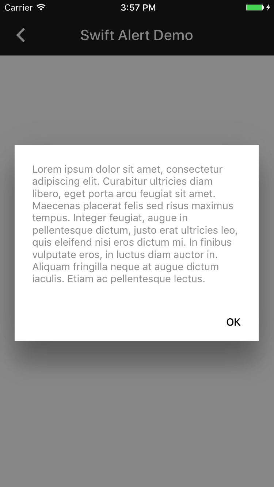

<!--docs:
title: "Dialogs"
layout: detail
section: components
excerpt: "The Dialogs component implements the Material Design specifications for modal presentations."
iconId: dialog
path: /catalog/dialogs/
api_doc_root: true
-->

<!-- This file was auto-generated using ./scripts/generate_readme Dialogs -->

# Dialogs

<div class="article__asset article__asset--screenshot">
  
</div>

Dialogs provides both a presentation controller for displaying a modal dialog and an alert
controller that will display a simple modal alert.

## Design & API documentation

<ul class="icon-list">
  <li class="icon-list-item icon-list-item--spec"><a href="https://material.io/go/design-dialogs">Material Design guidelines: Dialogs</a></li>
</ul>

## Table of contents

- [Overview](#overview)
  - [Presentation and transition controller](#presentation-and-transition-controller)
  - [Alert controller](#alert-controller)
- [Installation](#installation)
  - [Installation with CocoaPods](#installation-with-cocoapods)
  - [Importing](#importing)
- [Usage](#usage)
  - [Typical use: modal dialog](#typical-use-modal-dialog)
  - [Typical use: alert](#typical-use-alert)
- [Extensions](#extensions)
  - [Color Theming](#color-theming)
  - [Typography Theming](#typography-theming)

- - -

## Overview

To display a modal using MaterialDialogs you set two properties on the view controller to be
presented. Set modalPresentationStyle to UIModalPresentationCustom and set
transitioningDelegate to and instance of MDCDialogTransitionController. Then you present the
view controller from the root controller to display it as a modal dialog.

### Presentation and transition controller

Presenting dialogs utilizes two classes: MDCDialogPresentationController and
MDCDialogTransitionController. These allow the presentation of view controllers in a material
specificed manner. MDCDialogPresentationController is a subclass of UIPresentationController
that observes the presented view controller for preferred content size.
MDCDialogTransitionController implements UIViewControllerAnimatedTransitioning and
UIViewControllerTransitioningDelegate to vend the presentation controller during the transition.

### Alert controller

MDCAlertController provides a simple interface for developers to present a modal dialog
according to the Material spec.

## Installation

<!-- Extracted from docs/../../../docs/component-installation.md -->

### Installation with CocoaPods

Add the following to your `Podfile`:

```bash
pod 'MaterialComponents/Dialogs'
```
<!--{: .code-renderer.code-renderer--install }-->

Then, run the following command:

```bash
pod install
```

### Importing

To import the component:

<!--<div class="material-code-render" markdown="1">-->
#### Swift
```swift
import MaterialComponents.MaterialDialogs
```

#### Objective-C

```objc
#import "MaterialDialogs.h"
```
<!--</div>-->


## Usage

<!-- Extracted from docs/typical-use-modal-dialog.md -->

### Typical use: modal dialog

<!--<div class="material-code-render" markdown="1">-->
#### Swift

```swift
// The following is called from the presenting view controller and has the
// following variable defined to keep a reference to the transition
// controller.
strong var dialogTransitionController: MDCDialogTransitionController

// To present the dialog myDialogViewController
dialogTransitionController = MDCDialogTransitionController()
myDialogViewController.modalPresentationStyle = .custom
myDialogViewController.transitioningDelegate = dialogTransitionController

present(myDialogViewController, animated: true, completion:...)
```

#### Objective-C

```objc
// self is the presenting view controller and which has the following property
// defined to keep a reference to the transition controller.
@property(nonatomic) MDCDialogTransitionController *dialogTransitionController;

// To present the dialog myDialogViewController
self.dialogTransitionController = [[MDCDialogTransitionController alloc] init];
myDialogViewController.modalPresentationStyle = UIModalPresentationCustom;
myDialogViewController.transitioningDelegate = self.dialogTransitionController;
[self presentViewController:myDialogViewController animated:YES completion:...];

```
<!--</div>-->

<!-- Extracted from docs/typical-use-alert.md -->

### Typical use: alert

<!--<div class="material-code-render" markdown="1">-->
#### Swift

```swift
// Present a modal alert
let alertController = MDCAlertController(title: titleString, message: messageString)
let action = MDCAlertAction(title:"OK") { (action) in print("OK") }
alertController.addAction(action)

present(alertController, animated:true, completion:...)
```

#### Objective-C

```objc
// Present a modal alert
MDCAlertController *alertController =
[MDCAlertController alertControllerWithTitle:titleString
                                     message:messageString];

MDCAlertAction *alertAction =
    [MDCAlertAction actionWithTitle:@"OK"
                            handler:^(MDCAlertAction *action) {
       NSLog(@"OK");
    }];

[alertController addAction:alertAction];

[self presentViewController:alertController animated:YES completion:...];
```
<!--</div>-->


## Extensions

<!-- Extracted from docs/color-theming.md -->

### Color Theming

You can theme a dialog with your app's color scheme using the ColorThemer extension.

You must first add the Color Themer extension to your project:

```bash
pod 'MaterialComponents/Dialogs+ColorThemer'
```

<!--<div class="material-code-render" markdown="1">-->
#### Swift
```swift
// Step 1: Import the ColorThemer extension
import MaterialComponents.MaterialDialogs_ColorThemer

// Step 2: Create or get a color scheme
let colorScheme = MDCSemanticColorScheme()

// Step 3: Apply the color scheme to your component
MDCAlertColorThemer.applySemanticColorScheme(colorScheme, to: component)
```

#### Objective-C

```objc
// Step 1: Import the ColorThemer extension
#import "MaterialDialogs+ColorThemer.h"

// Step 2: Create or get a color scheme
id<MDCColorScheming> colorScheme = [[MDCSemanticColorScheme alloc] init];

// Step 3: Apply the color scheme to your component
[MDCAlertColorThemer applySemanticColorScheme:colorScheme
     toAlertController:component];
```
<!--</div>-->

<!-- Extracted from docs/typography-theming.md -->

### Typography Theming

You can theme a dialog with your app's typography scheme using the TypographyThemer extension.

You must first add the Typography Themer extension to your project:

```bash
pod 'MaterialComponents/Dialogs+TypographyThemer'
```

<!--<div class="material-code-render" markdown="1">-->
#### Swift
```swift
// Step 1: Import the TypographyThemer extension
import MaterialComponents.MaterialDialogs_TypographyThemer

// Step 2: Create or get a typography scheme
let typographyScheme = MDCTypographyScheme()

// Step 3: Apply the typography scheme to your component
MDCAlertTypographyThemer.applyTypographyScheme(typographyScheme, to: component)
```

#### Objective-C

```objc
// Step 1: Import the TypographyThemer extension
#import "MaterialDialogs+TypographyThemer.h"

// Step 2: Create or get a typography scheme
id<MDCTypographyScheming> typographyScheme = [[MDCTypographyScheme alloc] init];

// Step 3: Apply the typography scheme to your component
[MDCAlertTypographyThemer applyTypographyScheme:colorScheme
     toAlertController:component];
```
<!--</div>-->

