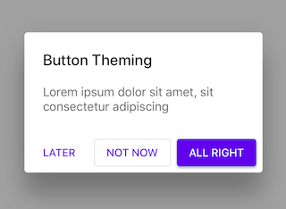

<!--docs:
title: "Dialogs"
layout: detail
section: components
excerpt: "Dialogs inform users about a task and can contain critical information, require decisions, or involve multiple tasks."
iconId: dialog
path: /catalog/dialogs/
api_doc_root: true
-->

<!-- This file was auto-generated using ./scripts/generate_readme Dialogs -->

# Dialogs

[](https://github.com/material-components/material-components-ios/issues?q=is%3Aopen+is%3Aissue+label%3Atype%3ABug+label%3A%5BDialogs%5D)

Dialogs inform users about a task and can contain critical information, require decisions, or
involve multiple tasks.

<div class="article__asset article__asset--screenshot">
  
</div>

## Design & API documentation

<ul class="icon-list">
  <li class="icon-list-item icon-list-item--spec"><a href="https://material.io/go/design-dialogs">Material Design guidelines: Dialogs</a></li>
  <li class="icon-list-item icon-list-item--link">Class: <a href="https://material.io/components/ios/catalog/dialogs/api-docs/Classes.html#/c:objc(cs)MDCDialogTransitionController">MDCDialogTransitionController</a></li>
  <li class="icon-list-item icon-list-item--link">Class: <a href="https://material.io/components/ios/catalog/dialogs/api-docs/Classes/MDCAlertAction.html">MDCAlertAction</a></li>
  <li class="icon-list-item icon-list-item--link">Class: <a href="https://material.io/components/ios/catalog/dialogs/api-docs/Classes/MDCAlertController.html">MDCAlertController</a></li>
  <li class="icon-list-item icon-list-item--link">Class: <a href="https://material.io/components/ios/catalog/dialogs/api-docs/Classes/MDCAlertControllerView.html">MDCAlertControllerView</a></li>
  <li class="icon-list-item icon-list-item--link">Class: <a href="https://material.io/components/ios/catalog/dialogs/api-docs/Classes/MDCDialogPresentationController.html">MDCDialogPresentationController</a></li>
</ul>

## Table of contents

- [Overview](#overview)
  - [Presentation and transition controller](#presentation-and-transition-controller)
  - [Alert controller](#alert-controller)
- [Installation](#installation)
  - [Installation with CocoaPods](#installation-with-cocoapods)
  - [Importing](#importing)
- [Usage](#usage)
  - [Typical use: modal dialog](#typical-use-modal-dialog)
  - [Typical use: alert](#typical-use-alert)
- [Extensions](#extensions)
  - [Theming](#theming)
  - [Action Theming](#action-theming)
- [Accessibility](#accessibility)
  - [MDCPresentationController Accessibility](#mdcpresentationcontroller-accessibility)

- - -

## Overview

To display a modal using MaterialDialogs you set two properties on the view controller to be
presented. Set modalPresentationStyle to UIModalPresentationCustom and set
transitioningDelegate to and instance of MDCDialogTransitionController. Then you present the
view controller from the root controller to display it as a modal dialog.

### Presentation and transition controller

Presenting dialogs uses two classes: MDCDialogPresentationController and
MDCDialogTransitionController. These allow the presentation of view controllers in a material
specificed manner. MDCDialogPresentationController is a subclass of UIPresentationController
that observes the presented view controller for preferred content size.
MDCDialogTransitionController implements UIViewControllerAnimatedTransitioning and
UIViewControllerTransitioningDelegate to vend the presentation controller during the transition.

### Alert controller

MDCAlertController provides a simple interface for developers to present a modal dialog
according to the Material spec.

## Installation

<!-- Extracted from docs/../../../docs/component-installation.md -->

### Installation with CocoaPods

Add the following to your `Podfile`:

```bash
pod 'MaterialComponents/Dialogs'
```
<!--{: .code-renderer.code-renderer--install }-->

Then, run the following command:

```bash
pod install
```

### Importing

To import the component:

<!--<div class="material-code-render" markdown="1">-->
#### Swift
```swift
import MaterialComponents.MaterialDialogs
```

#### Objective-C

```objc
#import "MaterialDialogs.h"
```
<!--</div>-->


## Usage

<!-- Extracted from docs/typical-use-modal-dialog.md -->

### Typical use: modal dialog
Your UIViewController presented using Material presentation and transition controllers:

<!--<div class="material-code-render" markdown="1">-->
#### Swift

```swift
// The following is called from the presenting view controller and has the
// following variable defined to keep a reference to the transition
// controller.
strong var dialogTransitionController: MDCDialogTransitionController

// To present the dialog myDialogViewController
dialogTransitionController = MDCDialogTransitionController()
myDialogViewController.modalPresentationStyle = .custom
myDialogViewController.transitioningDelegate = dialogTransitionController

// Material theming of presentation controller (see full syntax below)
myDialogViewController.mdc_dialogPresentationController.applyTheme(withScheme: scheme)

present(myDialogViewController, animated: true, completion:...)
```

#### Objective-C

```objc
// self is the presenting view controller which has the following property
// defined to keep a reference to the transition controller.
@property(nonatomic) MDCDialogTransitionController *dialogTransitionController;

// Prepare to present the dialog myDialogViewController
self.dialogTransitionController = [[MDCDialogTransitionController alloc] init];
myDialogViewController.modalPresentationStyle = UIModalPresentationCustom;
myDialogViewController.transitioningDelegate = self.dialogTransitionController;

// Material theming of presentation controller (see full syntax below)
[myDialogViewController.mdc_dialogPresentationController applyThemeWithScheme: scheme];

[self presentViewController:myDialogViewController animated:YES completion:...];

```
<!--</div>-->

<!-- Extracted from docs/typical-use-alert.md -->

### Typical use: alert
A Material alert presented using Material presentation and transition controllers:

<!--<div class="material-code-render" markdown="1">-->
#### Swift

```swift
// Present a modal alert
let alertController = MDCAlertController(title: titleString, message: messageString)
let action = MDCAlertAction(title:"OK") { (action) in print("OK") }
alertController.addAction(action)

// Material theming of the alert controller (see full syntax below)
alertController.applyTheme(withScheme: scheme)

present(alertController, animated:true, completion:...)
```

#### Objective-C

```objc
// Present a modal alert
MDCAlertController *alertController =
[MDCAlertController alertControllerWithTitle:titleString
                                     message:messageString];

MDCAlertAction *alertAction =
    [MDCAlertAction actionWithTitle:@"OK"
                            handler:^(MDCAlertAction *action) {
       NSLog(@"OK");
    }];

[alertController addAction:alertAction];

// Material theming of the alert controller (see full syntax below)
[alertController applyThemeWithScheme: scheme];

[self presentViewController:alertController animated:YES completion:...];
```
<!--</div>-->


## Extensions

<!-- Extracted from docs/theming.md -->

### Theming

You can theme an MDCDialog to match the Material Design Dialog using your app's schemes in the DialogThemer
extension.

Make sure the Dialog's Theming extension is added to your project:

```bash
pod 'MaterialComponents/Dialogs+Theming'
```

You can then import the extension and create an `MDCAlertControllerThemer` instance. A dialog scheme defines
the design parameters that you can use to theme your dialogs.

<!--<div class="material-code-render" markdown="1">-->
#### Swift
```swift
// Step 1: Import the DialogThemer extension
import MaterialComponents.MaterialDialogs_DialogThemer

// Step 2: Create or get a Material container scheme
let scheme = MDCContainerScheme()

// Step 3 (optional): Customize the default theme by providing custom color or typography schemes:
scheme.colorScheme = myColorScheme
scheme.typographyScheme = myTypographyScheme

// Step 4: Use Material alert themer to theme your MDCAlertController instance
alertController.applyTheme(withScheme: scheme)

// Step 4: Alternatively, Use Material dialog presentation themer to theme your UIViewController instance:
myDialogViewController.mdc_dialogPresentationController.applyTheme(withScheme: scheme)
```

#### Objective-C

```objc
// Step 1: Import the DialogThemer extension
#import "MaterialDialogs+DialogThemer.h"

// Step 2: Create or get a Material container scheme
MDCContainerScheme *scheme = [[MDCContainerScheme alloc] init];

// Step 3 (optional): Customize the default theme by providing custom color or typography schemes:
scheme.colorScheme = myColorScheme
scheme.typographyScheme = myTypographyScheme

// Step 4: Use the Material alert themer to theme an MDCAlertController instance
[alertController applyThemeWithScheme:scheme];

// Step 4: Alternatively, Use Material dialog presentation themer to theme your UIViewController instance:
[myDialogViewController.mdc_dialogPresentationController applyThemeWithScheme: scheme];

```
<!--</div>-->

<!-- Extracted from docs/action-theming.md -->

### Action Theming

Actions in MDCAlertController have emphasis which afects their theming.
High emphasis actions generate contained buttons, medium emphasis actions generate outlined buttons and low emphasis actions generate text buttons.

<div class="article__asset article__asset--screenshot">
  
</div>

<!--<div class="material-code-render" markdown="1">-->
#### Swift
```swift
  let alert = MDCAlertController(title: "Button Theming",
                                 message: "Lorem ipsum dolor sit amet, sit consectetur adipiscing")

  // Adding three actions with different emphasis, creating buttons with different themes.
  alert.addAction(MDCAlertAction(title:"All Right", emphasis: .high, handler: handler))
  alert.addAction(MDCAlertAction(title:"Not Now", emphasis: .medium, handler: handler))
  alert.addAction(MDCAlertAction(title:"Later", emphasis: .low, handler: handler))

  // Make sure to call the themer after all actions are added, so they are themed too!
  let scheme = MDCContainerScheme()
  alert.applyTheme(withScheme: scheme)

  present(alertController, animated:true, completion:...)
```

#### Objective-C

```objc
  MDCAlertController *alert = 
      [MDCAlertController alertControllerWithTitle:@"Button Theming" message: @"Lorem ipsum..."];

  // Adding three actions with different emphasis, creating buttons with different themes.
  MDCAlertAction *primaryAaction = [MDCAlertAction actionWithTitle:@"All Right"
                                                          emphasis:MDCActionEmphasisHigh
                                                           handler:handler];
  [alert addAction:primaryAaction];

  MDCAlertAction *cancelAaction = [MDCAlertAction actionWithTitle:@"Not Now"
                                                         emphasis:MDCActionEmphasisMedium
                                                          handler:handler];
  [alert addAction:cancelAaction];

  // Make sure to call the themer after all actions are added, so they are themed too!
  MDCContainerScheme *scheme = [[MDCContainerScheme alloc] init];
  [alert applyThemeWithScheme:scheme];

  [self presentViewController:alert animated:YES completion:...];
```
<!--</div>-->


## Accessibility

<!-- Extracted from docs/accessibility.md -->

### MDCPresentationController Accessibility

As MDCPresentationController is responsible for the presentation of your
custom view controllers, it does not implement any accessibility
functionality itself.

#### `-accessibilityPerformEscape` Behavior

If you intend your presented view controller to dismiss when a user
in VoiceOver mode has performed the escape gesture the view controller
should implement the accessibilityPerformEscape method.

```
- (BOOL)accessibilityPerformEscape {
  [self.presentingViewController dismissViewControllerAnimated:YES completion:NULL];
  return YES;
}
```

