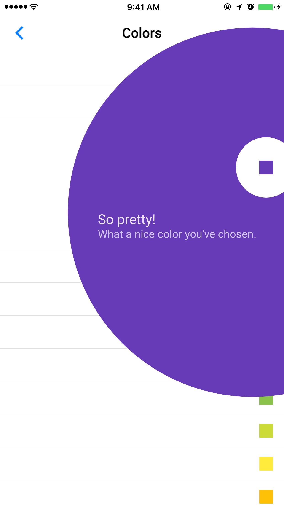

<!--docs:
title: "Feature highlight"
layout: detail
section: components
excerpt: "Feature highlight highlights a part of the screen in order to introduce users to new features and functionality."
iconId: feature_highlight
path: /catalog/feature-highlights/
api_doc_root: true
-->

<!-- This file was auto-generated using ./scripts/generate_readme FeatureHighlight -->

# Feature highlight

[](https://github.com/material-components/material-components-ios/issues?q=is%3Aopen+is%3Aissue+label%3Atype%3ABug+label%3A%5BFeatureHighlight%5D)

<div class="article__asset article__asset--screenshot">
  
</div>

The Feature Highlight component is a way to visually highlight a part of the screen in order to introduce users to new features and functionality.

## Design & API documentation

<ul class="icon-list">
  <li class="icon-list-item icon-list-item--link">Class: <a href="https://material.io/components/ios/catalog/feature-highlights/api-docs/Classes/MDCFeatureHighlightView.html">MDCFeatureHighlightView</a></li>
  <li class="icon-list-item icon-list-item--link">Class: <a href="https://material.io/components/ios/catalog/feature-highlights/api-docs/Classes/MDCFeatureHighlightViewController.html">MDCFeatureHighlightViewController</a></li>
</ul>

## Table of contents

- [Installation](#installation)
  - [Installation with CocoaPods](#installation-with-cocoapods)
  - [Importing](#importing)
- [Usage](#usage)
  - [Typical use: highlight a view](#typical-use-highlight-a-view)
- [Extensions](#extensions)
  - [Color Theming](#color-theming)
  - [Typography Theming](#typography-theming)

- - -

## Installation

<!-- Extracted from docs/../../../docs/component-installation.md -->

### Installation with CocoaPods

Add the following to your `Podfile`:

```bash
pod 'MaterialComponents/FeatureHighlight'
```
<!--{: .code-renderer.code-renderer--install }-->

Then, run the following command:

```bash
pod install
```

### Importing

To import the component:

<!--<div class="material-code-render" markdown="1">-->
#### Swift
```swift
import MaterialComponents.MaterialFeatureHighlight
```

#### Objective-C

```objc
#import "MaterialFeatureHighlight.h"
```
<!--</div>-->


## Usage

<!-- Extracted from docs/typical-use-highlight-a-view.md -->

### Typical use: highlight a view

<!--<div class="material-code-render" markdown="1">-->
#### Swift
```swift
let completion = {(accepted: Bool) in
  // perform analytics here
  // and record whether the highlight was accepted
}

let highlightController = MDCFeatureHighlightViewController(highlightedView: viewToHighlight,
                                                            completion: completion)
highlightController.titleText = "Just how you want it"
highlightController.bodyText = "Tap the menu button to switch accounts, change settings & more."
highlightController.outerHighlightColor =
  UIColor.blue.withAlphaComponent(kMDCFeatureHighlightOuterHighlightAlpha)
present(highlightController, animated: true, completion:nil)
```

#### Objective-C
```objc
MDCFeatureHighlightCompletion completion = ^(BOOL accepted) {
  // perform analytics here
  // and record whether the highlight was accepted
};

MDCFeatureHighlightViewController *highlightController =
[[MDCFeatureHighlightViewController alloc] initWithHighlightedView:viewToHighlight
                                                        completion:completion];
highlightController.titleText = @"Just how you want it";
highlightController.bodyText = @"Tap the menu button to switch accounts, change settings & more.";
highlightController.outerHighlightColor =
    [[UIColor blueColor] colorWithAlphaComponent:kMDCFeatureHighlightOuterHighlightAlpha];
[self presentViewController:highlightController animated:YES completion:nil];
```
<!--</div>-->

Often when highlighting a view you will want to display a different view to the one you are highlighting. For example, flipping the primary and secondary colors in the presented version.

<!--<div class="material-code-render" markdown="1">-->
#### Swift
```swift
let displayedButton = UIButton(type: .system)
displayedButton.setTitle(highlightedButton.title(for: .normal), for: .normal)
displayedButton.setTitleColor(highlightedButton.backgroundColor, for: .normal)
displayedButton.backgroundColor = highlightedButton.titleColor(for: .normal)

let highlightController = MDCFeatureHighlightViewController(highlightedView: highlightedButton, andShow: displayedButton, completion: completion)
```

#### Objective-C
```objc
UIButton *displayedButton = [UIButton buttonWithType:UIButtonTypeSystem];
[displayedButton setTitle:[highlightedButton titleForState:UIControlStateNormal]
                 forState:UIControlStateNormal];
[displayedButton setTitleColor:highlightedButton.backgroundColor forState:UIControlStateNormal];
displayedButton.backgroundColor = [highlightedButton titleColorForState:UIControlStateNormal];
MDCFeatureHighlightViewController *highlightController =
[[MDCFeatureHighlightViewController alloc] initWithHighlightedView:highlightedButton
                                                       andShowView:displayedButton
                                                        completion:completion];
```
<!--</div>-->


## Extensions

<!-- Extracted from docs/color-theming.md -->

### Color Theming

You can theme feature highlight with your app's color scheme using the ColorThemer extension.

You must first add the Color Themer extension to your project:

```bash
pod 'MaterialComponents/FeatureHighlight+ColorThemer'
```

<!--<div class="material-code-render" markdown="1">-->
#### Swift
```swift
// Step 1: Import the ColorThemer extension
import MaterialComponents.MaterialFeatureHighlight_ColorThemer

// Step 2: Create or get a color scheme
let colorScheme = MDCSemanticColorScheme()

// Step 3: Apply the color scheme to your component
MDCFeatureHighlightColorThemer.applySemanticColorScheme(colorScheme, to: component)
```

#### Objective-C

```objc
// Step 1: Import the ColorThemer extension
#import "MaterialFeatureHighlight+ColorThemer.h"

// Step 2: Create or get a color scheme
id<MDCColorScheming> colorScheme = [[MDCSemanticColorScheme alloc] initWithDefaults:MDCColorSchemeDefaultsMaterial201804];

// Step 3: Apply the color scheme to your component
[MDCFeatureHighlightColorThemer applySemanticColorScheme:colorScheme
     toFeatureHighlightViewController:component];
```
<!--</div>-->

<!-- Extracted from docs/typography-theming.md -->

### Typography Theming

You can theme feature highlight with your app's typography scheme using the TypographyThemer extension.

You must first add the Typography Themer extension to your project:

```bash
pod 'MaterialComponents/FeatureHighlight+TypographyThemer'
```

<!--<div class="material-code-render" markdown="1">-->
#### Swift
```swift
// Step 1: Import the TypographyThemer extension
import MaterialComponents.MaterialFeatureHighlight_TypographyThemer

// Step 2: Create or get a typography scheme
let typographyScheme = MDCTypographyScheme()

// Step 3: Apply the typography scheme to your component
MDCFeatureHighlightTypographyThemer.applyTypographyScheme(typographyScheme, to: component)
```

#### Objective-C

```objc
// Step 1: Import the TypographyThemer extension
#import "MaterialFeatureHighlight+TypographyThemer.h"

// Step 2: Create or get a typography scheme
id<MDCTypographyScheming> typographyScheme = [[MDCTypographyScheme alloc] init];

// Step 3: Apply the typography scheme to your component
[MDCFeatureHighlightTypographyThemer applyTypographyScheme:colorScheme
     toFeatureHighlightViewController:component];
```
<!--</div>-->

