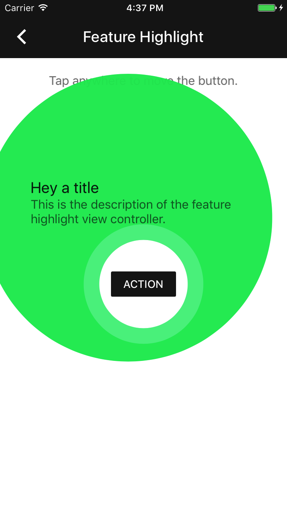

<!--docs:
title: "Feature Highlight"
layout: detail
section: components
excerpt: "Feature Highlight highlights a part of the screen in order to introduce users to new features and functionality."
iconId: feature_highlight
path: /catalog/feature-highlights/
-->

# Feature Highlight

<div class="article__asset article__asset--screenshot">
  
</div>

The Feature Highlight component is a way to visually highlight a part of the screen in order to introduce users to new features and functionality.

## Design & API Documentation

<ul class="icon-list">
  <li class="icon-list-item icon-list-item--spec"><a href="https://material.io/guidelines/growth-communications/feature-discovery.html">Feature Discovery</a></li>
</ul>

- - -

## Installation

### Requirements

- Xcode 7.0 or higher.
- iOS SDK version 7.0 or higher.

### Installation with CocoaPods

To add this component to your Xcode project using CocoaPods, add the following to your `Podfile`:

```
pod 'MaterialComponents/FeatureHighlight'
```

Then, run the following command:

``` bash
pod install
```

- - -

## Usage

### Importing

Before using Feature Highlight, you'll need to import it:

<!--<div class="material-code-render" markdown="1">-->
#### Swift
``` swift
import MaterialComponents.MaterialFeatureHighlight
```

#### Objective-C
``` objc
#import "MaterialFeatureHighlight.h"
```
<!--</div>-->

### Highlighting a view

<!--<div class="material-code-render" markdown="1">-->
#### Swift
``` swift
let completion = {(accepted: Bool) in
  // perform analytics here
  // and record whether the highlight was accepted
}

let highlightController = MDCFeatureHighlightViewController(highlightedView: viewToHighlight,
                                                            completion: completion)
highlightController.titleText = "Just how you want it"
highlightController.bodyText = "Tap the menu button to switch accounts, change settings & more."
highlightController.outerHighlightColor =
  UIColor.blue.withAlphaComponent(kMDCFeatureHighlightOuterHighlightAlpha)
present(highlightController, animated: true, completion:nil)
```

#### Objective-C
``` objc
MDCFeatureHighlightCompletion completion = ^(BOOL accepted) {
  // perform analytics here
  // and record whether the highlight was accepted
};

MDCFeatureHighlightViewController *highlightController =
[[MDCFeatureHighlightViewController alloc] initWithHighlightedView:viewToHighlight
                                                        completion:completion];
highlightController.titleText = @"Just how you want it";
highlightController.bodyText = @"Tap the menu button to switch accounts, change settings & more.";
highlightController.outerHighlightColor =
    [[UIColor blueColor] colorWithAlphaComponent:kMDCFeatureHighlightOuterHighlightAlpha];
[self presentViewController:highlightController animated:YES completion:nil];
```
<!--</div>-->

Often when highlighting a view you will want to display a different view to the one you are highlighting. For example, flipping the primary and secondary colors in the presented version.

<!--<div class="material-code-render" markdown="1">-->
#### Swift
``` swift
let displayedButton = UIButton(type: .system)
displayedButton.setTitle(highlightedButton.title(for: .normal), for: .normal)
displayedButton.setTitleColor(highlightedButton.backgroundColor, for: .normal)
displayedButton.backgroundColor = highlightedButton.titleColor(for: .normal)

let highlightController = MDCFeatureHighlightViewController(highlightedView: highlightedButton, andShow: displayedButton, completion: completion)
```

#### Objective-C
``` objc
UIButton *displayedButton = [UIButton buttonWithType:UIButtonTypeSystem];
[displayedButton setTitle:[highlightedButton titleForState:UIControlStateNormal]
                 forState:UIControlStateNormal];
[displayedButton setTitleColor:highlightedButton.backgroundColor forState:UIControlStateNormal];
displayedButton.backgroundColor = [highlightedButton titleColorForState:UIControlStateNormal];
MDCFeatureHighlightViewController *highlightController =
[[MDCFeatureHighlightViewController alloc] initWithHighlightedView:highlightedButton
                                                       andShowView:displayedButton
                                                        completion:completion];
```
<!--</div>-->
