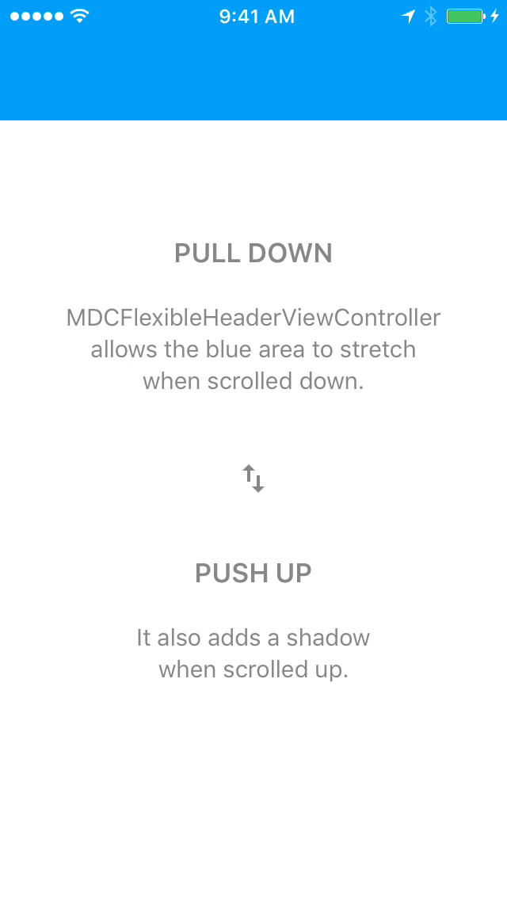

# Flexible Header

  <video src="docs/assets/flexible_header.mp4" autoplay loop></video>
  

The Flexible Header is a container view whose height and vertical offset react to
UIScrollViewDelegate events.
<!--{: .intro }-->

### Material Design Specifications

<ul class="icon-list">
  <li class="icon-link"><a href="https://www.google.com/design/spec/patterns/scrolling-techniques.html">Scrolling Techniques</a></li>
</ul>

### API Documentation

<ul class="icon-list">
  <li class="icon-link"><a href="https://material-ext.appspot.com/mdc-ios-preview/components/FlexibleHeader/apidocs/Classes/MDCFlexibleHeaderContainerViewController.html">MDCFlexibleHeaderContainerViewController</a></li>
  <li class="icon-link"><a href="https://material-ext.appspot.com/mdc-ios-preview/components/FlexibleHeader/apidocs/Classes/MDCFlexibleHeaderView.html">MDCFlexibleHeaderView</a></li>
  <li class="icon-link"><a href="https://material-ext.appspot.com/mdc-ios-preview/components/FlexibleHeader/apidocs/Classes/MDCFlexibleHeaderViewController.html">MDCFlexibleHeaderViewController</a></li>
  <li class="icon-link"><a href="https://material-ext.appspot.com/mdc-ios-preview/components/FlexibleHeader/apidocs/Protocols/MDCFlexibleHeaderViewDelegate.html">MDCFlexibleHeaderViewDelegate</a></li>
  <li class="icon-link"><a href="https://material-ext.appspot.com/mdc-ios-preview/components/FlexibleHeader/apidocs/Protocols/MDCFlexibleHeaderViewLayoutDelegate.html">MDCFlexibleHeaderViewLayoutDelegate</a></li>
</ul>

- - -

## Installation

### Requirements

- Xcode 7.0 or higher.
- iOS SDK version 7.0 or higher.

### Installation with CocoaPods

To add this component to your Xcode project using CocoaPods, add the following to your `Podfile`:

~~~
pod 'MaterialComponents/FlexibleHeader'
~~~

Then, run the following command:

~~~ bash
pod install
~~~

- - -

## Overview

The Flexible Header is a simple container view designed to live at the top of a view controller and
react to scroll view events. Flexible Headers are intended to be created and owned by each view
controller that requires one. This is an intentional deviation from the one-UINavigationBar design
of UINavigationController, and we discuss the merits and drawbacks of this approach below.

The heart of Flexible Header is MDCFlexibleHeaderView. MDCFlexibleHeaderView is a container view,
meaning you are expected to register your own subviews to it. MDCFlexibleHeaderView simply manages
its "frame", you are responsible for everything within the bounds.

MDCFlexibleHeaderViewController is the ideal way to create and manage the lifetime of a
MDCFlexibleHeaderView instance. Adding this view controller as a child of your view controller
ensures that the Flexible Header is able to react to device orientation and view appearance events.
This document generally assumes that you are familiar with
[UIViewController containment](https://developer.apple.com/library/ios/featuredarticles/ViewControllerPGforiPhoneOS/ImplementingaContainerViewController.html).

### Considerations

Requiring each view controller to own a Flexible Header instance has several technical advantages:

- Transitions between two view controllers can include the header in their motion considerations.
- Flexible Header customizations are scoped to the owner view controller.

It also has some technical disadvantages:

- There is a cost to registering and owning a Flexible Header instance when compared to
  UINavigationController and the free availability of UINavigationBar. Improvements to this
  are being discussed on [issue #268](https://github.com/material-components/material-components-ios/issues/268).

- - -

## Usage

### Importing

Before using Flexible Header, you'll need to import it:

<!--
-->
#### Objective-C

~~~ objc
#import "MaterialFlexibleHeader.h"
~~~

#### Swift
~~~ swift
import MaterialComponents
~~~
<!--
-->

### Add the Flexible Header to a view controller

Each view controller in your app that intends to manage its own Flexible Header will follow these
instructions. You'll typically add the Flexible Header to the same view controllers that you'd push
onto a UINavigationController, hiding the UINavigationController's `navigationBar` accordingly.

The result of following these steps will be that:

1. a Flexible Header is registered as a child view controller of your view controller, and that
2. you have access to a MDCFlexibleHeaderView instance via the `headerView` property on your
   MDCFlexibleHeaderViewController instance.

Step 1: **Create an instance of MDCFlexibleHeaderViewController**.

MDCFlexibleHeaderViewController is a UIViewController that manages the relationship of your view
controller to a MDCFlexibleHeaderView instance.

<!--
-->
#### Objective-C

~~~ objc
@implementation MyViewController {
  MDCFlexibleHeaderViewController *_headerViewController;
}

- (id)initWithNibName:(NSString *)nibNameOrNil bundle:(NSBundle *)nibBundleOrNil {
  self = [super initWithNibName:nibNameOrNil bundle:nibBundleOrNil];
  if (self) {
    _headerViewController = [MDCFlexibleHeaderViewController new];
    [self addChildViewController:_headerViewController];
  }
  return self;
}
~~~

#### Swift
~~~ swift
let headerViewController = MDCFlexibleHeaderViewController()

override init(nibName nibNameOrNil: String?, bundle nibBundleOrNil: NSBundle?) {
  super.init(nibName: nibNameOrNil, bundle: nibBundleOrNil)

  addChildViewController(headerViewController)
}

required init?(coder aDecoder: NSCoder) {
  super.init(coder: aDecoder)

  addChildViewController(headerViewController)
}
~~~
<!--
-->

Step 2: **Add the MDCFlexibleHeaderViewController's view to your view controller's view**.

Ideally you will do this after all views have been added to your controller's view in order to
ensure that the Flexible Header is in front of all other views.

<!--
-->
#### Objective-C

~~~ objc
- (void)viewDidLoad {
  [super viewDidLoad];

  _headerViewController.view.frame = self.view.bounds;
  [self.view addSubview:_headerViewController.view];
  [_headerViewController didMoveToParentViewController:self];
}
~~~

#### Swift
~~~ swift
override func viewDidLoad() {
  super.viewDidLoad()

  headerViewController.view.frame = view.bounds
  view.addSubview(headerViewController.view)
  headerViewController.didMoveToParentViewController(self)
}
~~~
<!--
-->

### Tracking a scroll view

The Flexible Header can be provided with tracking scroll view. This allows the Flexible Header to
expand, collapse, and shift off-screen in reaction to the tracking scroll view's delegate events.

> Important: When using a tracking scroll view you must forward the relevant UIScrollViewDelegate
> events to the Flexible Header.

Follow these steps to hook up a tracking scroll view:

Step 1: **Set the tracking scroll view**.

In your viewDidLoad, set the `trackingScrollView` property on the header view:

<!--
-->
#### Objective-C

~~~ objc
self.headerViewController.headerView.trackingScrollView = scrollView;
~~~

#### Swift
~~~ swift
headerViewController.headerView.trackingScrollView = scrollView
~~~
<!--
-->

`scrollView` might be a table view, collection view, or a plain UIScrollView.

Step 2: **Forward UIScrollViewDelegate events to the Header View**.

There are two ways to forward scroll events.

Option 1: if your controller does not need to respond to UIScrollViewDelegate events and you're
using either a plain UIScrollView or a UITableView you can set your MDCFlexibleHeaderViewController
instance as the scroll view's delegate.

<!--
-->
#### Objective-C

~~~ objc
scrollView.delegate = self.headerViewController;
~~~

#### Swift
~~~ swift
scrollView.delegate = headerViewController
~~~
<!--
-->

Option 2: implement the required UIScrollViewDelegate methods and forward them to the
MDCFlexibleHeaderView instance. This is the most flexible approach and will work with any
UIScrollView subclass.

<!--
-->
#### Objective-C

~~~ objc
#pragma mark - UIScrollViewDelegate

- (void)scrollViewDidScroll:(UIScrollView *)scrollView {
  if (scrollView == self.headerViewController.headerView.trackingScrollView) {
    [self.headerViewController.headerView trackingScrollViewDidScroll];
  }
}

- (void)scrollViewDidEndDecelerating:(UIScrollView *)scrollView {
  if (scrollView == self.headerViewController.headerView.trackingScrollView) {
    [self.headerViewController.headerView trackingScrollViewDidEndDecelerating];
  }
}

- (void)scrollViewDidEndDragging:(UIScrollView *)scrollView willDecelerate:(BOOL)decelerate {
  if (scrollView == self.headerViewController.headerView.trackingScrollView) {
    [self.headerViewController.headerView trackingScrollViewDidEndDraggingWillDecelerate:decelerate];
  }
}

- (void)scrollViewWillEndDragging:(UIScrollView *)scrollView
                     withVelocity:(CGPoint)velocity
              targetContentOffset:(inout CGPoint *)targetContentOffset {
  if (scrollView == self.headerViewController.headerView.trackingScrollView) {
    [self.headerViewController.headerView trackingScrollViewWillEndDraggingWithVelocity:velocity
                                                                    targetContentOffset:targetContentOffset];
  }
}
~~~

#### Swift
~~~ swift
// MARK: UIScrollViewDelegate

override func scrollViewDidScroll(scrollView: UIScrollView) {
  if scrollView == headerViewController.headerView.trackingScrollView {
    headerViewController.headerView.trackingScrollViewDidScroll()
  }
}

override func scrollViewDidEndDecelerating(scrollView: UIScrollView) {
  if scrollView == headerViewController.headerView.trackingScrollView {
    headerViewController.headerView.trackingScrollViewDidEndDecelerating()
  }
}

override func scrollViewDidEndDragging(scrollView: UIScrollView, willDecelerate decelerate: Bool) {
  let headerView = headerViewController.headerView
  if scrollView == headerView.trackingScrollView {
    headerView.trackingScrollViewDidEndDraggingWillDecelerate(decelerate)
  }
}

override func scrollViewWillEndDragging(scrollView: UIScrollView, withVelocity velocity: CGPoint, targetContentOffset: UnsafeMutablePointer<CGPoint>) {
  let headerView = headerViewController.headerView
  if scrollView == headerView.trackingScrollView {
    headerView.trackingScrollViewWillEndDraggingWithVelocity(velocity, targetContentOffset: targetContentOffset)
  }
}
~~~
<!--
-->

### Shifting a Flexible Header off-screen

A Flexible Header that tracks a scroll view will expand and contract its height in reaction to
scroll view events. A Flexible Header can also shift off-screen in reaction to scroll view events
by changing the Flexible Header's behavior.

<!--
-->
#### Objective-C
~~~ objc
headerViewController.headerView.behavior = MDCFlexibleHeaderShiftBehaviorEnabled;
~~~

#### Swift
~~~ swift
headerViewController.headerView.behavior = .Enabled
~~~
<!--
-->

> Important: when a Flexible Header shifts off-screen it **will not hide the content views**. Your
> content views are responsible for hiding themselves in reaction to the Flexible Header shifting
> off-screen. Read the section on [Reacting to frame changes](#reacting-to-frame-changes) for more
> information.

It is also possible to hide the status bar when shifting the Flexible Header off-screen. Enable this
behavior by setting the `EnabledWithStatusBar` behavior and implementing
`childViewControllerForStatusBarHidden` on the parent view controller.

<!--
-->
#### Objective-C
~~~ objc
headerViewController.headerView.behavior = MDCFlexibleHeaderShiftBehaviorEnabledWithStatusBar;

- (UIViewController *)childViewControllerForStatusBarHidden {
  return _headerViewController;
}
~~~

#### Swift
~~~ swift
headerViewController.headerView.behavior = .EnabledWithStatusBar

override func childViewControllerForStatusBarHidden() -> UIViewController? {
  return headerViewController
}
~~~
<!--
-->

### Reacting to frame changes

In order to react to Flexible Header frame changes you can set yourself as the
MDCFlexibleHeaderViewController instance's `layoutDelegate`.

<!--
-->
#### Objective-C
~~~ objc
// Conform to MDCFlexibleHeaderViewLayoutDelegate
@interface MyViewController () <MDCFlexibleHeaderViewLayoutDelegate>
@end

// Set yourself as the delegate.
headerViewController.layoutDelegate = self;

#pragma - MDCFlexibleHeaderViewLayoutDelegate

- (void)flexibleHeaderViewController:(MDCFlexibleHeaderViewController *)flexibleHeaderViewController
    flexibleHeaderViewFrameDidChange:(MDCFlexibleHeaderView *)flexibleHeaderView {
  // Called whenever the frame changes.
}

~~~

#### Swift
~~~ swift
class MyViewController: UIViewController, MDCFlexibleHeaderViewLayoutDelegate {

  // MARK: MDCFlexibleHeaderViewLayoutDelegate
  func flexibleHeaderViewController(flexibleHeaderViewController: MDCFlexibleHeaderViewController,
      flexibleHeaderViewFrameDidChange flexibleHeaderView: MDCFlexibleHeaderView) {
    // Called whenever the frame changes.
  }
}
~~~
<!--
-->

### Take care when subclassing

A subclass of your view controller may add additional views in their viewDidLoad, potentially
resulting in the header being covered by the new views. It is the responsibility of the subclass to
take the z-index into account:

<!--
-->
#### Objective-C

~~~ objc
[self.view insertSubview:myCustomView belowSubview:self.headerViewController.headerView];
~~~

#### Swift
~~~ swift
view.insertSubview(myCustomView, belowSubview: headerViewController.headerView)
~~~
<!--
-->

### Interacting with UINavigationController

Push a view controller with a Flexible Header onto UINavigationController and you may find that
the existing UINavigationBar is undesired. The most obvious example occurs when your Flexible Header
has its own navigation bar.

If this is the case then we recommend hiding the UINavigationController's `navigationBar` during
UIViewController appearance events: `viewWillAppear:` or `viewWillDisappear:`. Changing the
navigation bar's visibility during these events gives the highest likelihood of your navigation bar
animating in/out in a reasonable manner.

> Important: Hiding UINavigationController's navigationBar nullifies UINavigationController's swipe-
> to-go-back feature. To continue using this feature whilst hiding the navigationBar, read the
> section on [Enabling Swipe to Go Back With Hidden NavigationBar](#enabling-swipe-to-go-back-with-hidden-navigationbar).

<!--
-->
#### Objective-C
~~~ objc
- (void)viewWillAppear:(BOOL)animated {
  [super viewWillAppear:animated];

  [self.navigationController setNavigationBarHidden:YES animated:animated];
}
~~~

#### Swift
~~~ swift
override func viewWillAppear(animated: Bool) {
  super.viewWillAppear(animated)

  navigationController?.setNavigationBarHidden(true, animated: animated)
}
~~~
<!--
-->

Add the following to view controllers that don't have an app bar:

<!--
-->
#### Objective-C
~~~ objc
- (void)viewWillAppear:(BOOL)animated {
  [super viewWillAppear:animated];

  [self.navigationController setNavigationBarHidden:NO animated:animated];
}
~~~

#### Swift
~~~ swift
override func viewWillAppear(animated: Bool) {
  super.viewWillAppear(animated)

  navigationController?.setNavigationBarHidden(false, animated: animated)
}
~~~
<!--
-->

If all of your view controllers use the App Bar in a given UINavigationController then you can
simply hide the navigationBar when you create the navigation controller. **Don't forget to do this
at app restoration time!**

<!--
-->
#### Objective-C
~~~ objc
UINavigationController *navigationController = ...;
[navigationController setNavigationBarHidden:NO animated:NO];
~~~

#### Swift
~~~ swift
navigationController.setNavigationBarHidden(false, animated: false)
~~~
<!--
-->

### Enabling Swipe to Go Back With Hidden NavigationBar

When using MDCFlexibileHeaderController within a UINavigationController, setting the
UINavigationController's navigationBarHidden property to `YES` results in the loss of the
swipe-to-go-back feature associated with the controller.

To re-enable this feature whilst hiding the navigation controller's navigationBar we recommend
setting a pointer to the current interactivePopGestureRecognizer's delegate in the `viewWillAppear:`
method before setting the navigationBarHidden property to `YES`, setting the
interactivePopGestureRecognizer's delegate to `nil` while the MDCFlexibileHeaderController's parent
controller is actively on-screen in `viewDidAppear:`, then re-setting the
interactivePopGestureRecognizer's delegate to the held pointer in the `viewWillDisappear:` method.

<!--
-->
#### Objective-C
~~~ objc
@interface MyViewController ()

// Create pointer to hold active interactivePopGestureRecognizer delegate
@property(nonatomic, strong) id <UIGestureRecognizerDelegate> existingInteractivePopGestureRecognizerDelegate;

@end

@implementation

- (void)viewWillAppear:(BOOL)animated {
  [super viewWillAppear:animated];

  // Hold reference to current interactivePopGestureRecognizer delegate
  if (self.navigationController.interactivePopGestureRecognizer.delegate) {
      self.existingInteractivePopGestureRecognizerDelegate =
          self.navigationController.interactivePopGestureRecognizer.delegate;
  }
  [self.navigationController setNavigationBarHidden:YES animated:animated];
}

- (void)viewDidAppear:(BOOL)animated {
  [super viewDidAppear:animated];

  // Set interactivePopGestureRecognizer delegate to nil
  self.navigationController.interactivePopGestureRecognizer.delegate = nil;
}

- (void)viewWillDisappear:(BOOL)animated {
  [super viewWillDisappear:animated];

  // Return interactivePopGestureRecognizer delegate to previously held object
  if (self.existingInteractivePopGestureRecognizerDelegate) {
      self.navigationController.interactivePopGestureRecognizer.delegate =
          self.existingInteractivePopGestureRecognizerDelegate;
  }
}

@end

~~~

#### Swift
~~~ swift
// Create pointer to hold active interactivePopGestureRecognizer delegate
var existingInteractivePopGestureRecognizerDelegate : UIGestureRecognizerDelegate?

override func viewWillAppear(animated: Bool) {
  super.viewWillAppear(animated)

  // Hold reference to current interactivePopGestureRecognizer delegate
  if navigationController?.interactivePopGestureRecognizer?.delegate != nil {
      existingInteractivePopGestureRecognizerDelegate = navigationController?.interactivePopGestureRecognizer?.delegate!
  }
  navigationController?.setNavigationBarHidden(true, animated: animated)
}

override func viewDidAppear(animated: Bool) {
  super.viewDidAppear(animated)

  // Set interactivePopGestureRecognizer delegate to nil
  navigationController?.interactivePopGestureRecognizer?.delegate = nil
}

override func viewWillDisappear(animated: Bool) {
  super.viewWillDisappear(animated)

  // Return interactivePopGestureRecognizer delegate to previously held object
  if existingInteractivePopGestureRecognizerDelegate != nil {
      navigationController?.interactivePopGestureRecognizer?.delegate = existingInteractivePopGestureRecognizerDelegate!
  }
}
~~~
<!--
-->

### Status bar style

MDCHeaderViewController instances are able to recommend a status bar style by inspecting the
background color of the MDCFlexibleHeaderView. If you'd like to use this logic to automatically
update your status bar style, implement `childViewControllerForStatusBarStyle` in your app's view
controller.

<!--
-->
#### Objective-C
~~~ objc
- (UIViewController *)childViewControllerForStatusBarStyle {
  return self.headerViewController;
}
~~~

#### Swift
~~~ swift
override func childViewControllerForStatusBarStyle() -> UIViewController? {
  return headerViewController
}
~~~
<!--
-->

### Background images

This example shows how to add a custom background image view to a Flexible Header.

You can create and add a UIImageView subview to the Flexible Header view's content view:

<!--
-->
#### Objective-C
~~~ objc
UIImageView *imageView = ...;
imageView.frame = self.headerViewController.headerView.bounds;
imageView.autoresizingMask = UIViewAutoresizingFlexibleWidth | UIViewAutoresizingFlexibleHeight;
[self.headerViewController.headerView.contentView insertSubview:imageView atIndex:0];

imageView.contentMode = UIViewContentModeScaleAspectFill;
imageView.clipsToBounds = YES;
~~~

#### Swift
~~~ swift
let headerView = headerViewController!.headerView

let imageView = ...
imageView.frame = headerView.bounds
imageView.autoresizingMask = [.FlexibleWidth, .FlexibleHeight]
headerView.contentView.insertSubview(imageView, atIndex: 0)

imageView.contentMode = .ScaleAspectFill
imageView.clipsToBounds = true
~~~
<!--
-->

Notes:

- Add the image view to the header view's `contentView`, not the header view itself.
- Set the `contentMode` to "ScaleAspectFill" to ensure that the image always fills the available
  header space, even if the image is too small. This is usually preferred, but consider changing
  the contentMode if you want a different behavior.
- Enable `clipsToBounds` in order to ensure that your image view does not bleed past the bounds of
  the header view. The header view's `clipsToBounds` is disabled by default.

### Touch forwarding

The Flexible Header allows you to forward touch events to the tracking scroll view. This provides
the illusion that the Flexible Header is part of the tracking scroll view.

#### Starting touch forwarding

To start touch forwarding you must call `forwardTouchEventsForView:` with each view:

<!--
-->
#### Objective-C
~~~ objc
[headerView forwardTouchEventsForView:someContentView];
~~~

#### Swift
~~~ swift
headerView.forwardTouchEventsForView(someContentView)
~~~
<!--
-->

#### Stopping touch forwarding

To stop touch forwarding you must call `forwardTouchEventsForView:` with each view:

<!--
-->
#### Objective-C
~~~ objc
[headerView stopForwardingTouchEventsForView:someContentView];
~~~

#### Swift
~~~ swift
headerView.stopForwardingTouchEventsForView(someContentView)
~~~
<!--
-->

### When trackingScrollView is the parent view

While we do not recommend it, there are situations in which the trackingScrollView will be the
parent view of the Flexible Header's view. The most notable example is UITableViewController, whose
`view` **is** the UITableView instance, so there is no other view to register the tracking scroll
view to.

As you might expect, this situation causes the Flexible Header to scroll off-screen with the scroll
view regardless of the Flexible Header's scrolling behavior. To counter this, the Flexible Header
sets its `transform` to an inversion of the current `contentOffset`. This gives the illusion of
the Flexible Header staying fixed in place, even though the underlying scroll view is scrolling.

In these situations the Flexible Header also ensures that it is always the front-most view. This is
to combat the UITableView displaying its divider lines in front of the Flexible Header.
