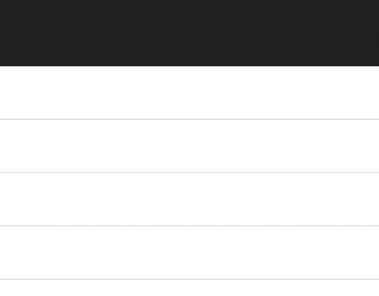

<!--docs:
title: "Flexible header"
layout: detail
section: components
excerpt: "The flexible header is a container view whose height and vertical offset react to UIScrollViewDelegate events."
iconId: header
path: /catalog/flexible-headers/
api_doc_root: true
-->

<!-- This file was auto-generated using ./scripts/generate_readme FlexibleHeader -->

# Flexible header

[](https://github.com/material-components/material-components-ios/issues?q=is%3Aopen+is%3Aissue+label%3Atype%3ABug+label%3A%5BFlexibleHeader%5D)

A flexible header is a container view whose height and vertical offset react to
UIScrollViewDelegate events.

<div class="article__asset article__asset--screenshot">
  
</div>

## Design & API documentation

<ul class="icon-list">
  <li class="icon-list-item icon-list-item--spec"><a href="https://material.io/go/design-app-bar-top">Material Design guidelines: App bars: top</a></li>
  <li class="icon-list-item icon-list-item--link">Class: <a href="https://material.io/components/ios/catalog/flexible-headers/api-docs/Classes/MDCFlexibleHeaderContainerViewController.html">MDCFlexibleHeaderContainerViewController</a></li>
  <li class="icon-list-item icon-list-item--link">Class: <a href="https://material.io/components/ios/catalog/flexible-headers/api-docs/Classes/MDCFlexibleHeaderView.html">MDCFlexibleHeaderView</a></li>
  <li class="icon-list-item icon-list-item--link">Class: <a href="https://material.io/components/ios/catalog/flexible-headers/api-docs/Classes/MDCFlexibleHeaderViewController.html">MDCFlexibleHeaderViewController</a></li>
  <li class="icon-list-item icon-list-item--link">Protocol: <a href="https://material.io/components/ios/catalog/flexible-headers/api-docs/Protocols/MDCFlexibleHeaderSafeAreaDelegate.html">MDCFlexibleHeaderSafeAreaDelegate</a></li>
  <li class="icon-list-item icon-list-item--link">Protocol: <a href="https://material.io/components/ios/catalog/flexible-headers/api-docs/Protocols/MDCFlexibleHeaderViewAnimationDelegate.html">MDCFlexibleHeaderViewAnimationDelegate</a></li>
  <li class="icon-list-item icon-list-item--link">Protocol: <a href="https://material.io/components/ios/catalog/flexible-headers/api-docs/Protocols/MDCFlexibleHeaderViewDelegate.html">MDCFlexibleHeaderViewDelegate</a></li>
  <li class="icon-list-item icon-list-item--link">Protocol: <a href="https://material.io/components/ios/catalog/flexible-headers/api-docs/Protocols/MDCFlexibleHeaderViewLayoutDelegate.html">MDCFlexibleHeaderViewLayoutDelegate</a></li>
  <li class="icon-list-item icon-list-item--link">Enumeration: <a href="https://material.io/components/ios/catalog/flexible-headers/api-docs/Enums.html">Enumerations</a></li>
  <li class="icon-list-item icon-list-item--link">Enumeration: <a href="https://material.io/components/ios/catalog/flexible-headers/api-docs/Enums/MDCFlexibleHeaderContentImportance.html">MDCFlexibleHeaderContentImportance</a></li>
  <li class="icon-list-item icon-list-item--link">Enumeration: <a href="https://material.io/components/ios/catalog/flexible-headers/api-docs/Enums/MDCFlexibleHeaderScrollPhase.html">MDCFlexibleHeaderScrollPhase</a></li>
  <li class="icon-list-item icon-list-item--link">Enumeration: <a href="https://material.io/components/ios/catalog/flexible-headers/api-docs/Enums/MDCFlexibleHeaderShiftBehavior.html">MDCFlexibleHeaderShiftBehavior</a></li>
</ul>

## Related components

<ul class="icon-list">
  <li class="icon-list-item icon-list-item--link"><a href="../AppBar">AppBar</a></li>
</ul>

## Table of contents

- [Overview](#overview)
  - [Considerations](#considerations)
- [Installation](#installation)
  - [Installation with CocoaPods](#installation-with-cocoapods)
  - [Importing](#importing)
- [Usage](#usage)
  - [Typical use: Add the flexible header to a view controller](#typical-use-add-the-flexible-header-to-a-view-controller)
  - [Typical use: Tracking a scroll view](#typical-use-tracking-a-scroll-view)
  - [Enabling observation of the tracking scroll view](#enabling-observation-of-the-tracking-scroll-view)
  - [Shifting a flexible header off-screen](#shifting-a-flexible-header-off-screen)
  - [Reacting to frame changes](#reacting-to-frame-changes)
  - [Utilizing Top Layout Guide on Parent View Controller](#utilizing-top-layout-guide-on-parent-view-controller)
  - [Subclassing considerations](#subclassing-considerations)
  - [Interacting with UINavigationController](#interacting-with-uinavigationcontroller)
  - [Enabling Swipe to Dismiss](#enabling-swipe-to-dismiss)
  - [Status bar style](#status-bar-style)
  - [Background images](#background-images)
  - [Touch forwarding](#touch-forwarding)
  - [Tracking a parent view](#tracking-a-parent-view)
  - [WKWebView considerations](#wkwebview-considerations)
- [Behavioral flags](#behavioral-flags)
  - [Recommended behavioral flags](#recommended-behavioral-flags)
  - [Removing safe area insets from the min/max heights](#removing-safe-area-insets-from-the-minmax-heights)
  - [Enabling top layout guide adjustment](#enabling-top-layout-guide-adjustment)
  - [Enabling inferred top safe area insets](#enabling-inferred-top-safe-area-insets)
- [Extensions](#extensions)
  - [Color Theming](#color-theming)
- [Migration guides](#migration-guides)
  - [Migration guide: minMaxHeightIncludesSafeArea](#migration-guide-minmaxheightincludessafearea)

- - -

## Overview

A flexible header is a simple container view designed to live at the top of a view controller and
react to scroll view events. Flexible headers are intended to be created and owned by each view
controller that requires one. This is an intentional deviation from the one-UINavigationBar design
of UINavigationController, and we discuss the merits and drawbacks of this approach below.

The heart of flexible header is MDCFlexibleHeaderView. MDCFlexibleHeaderView is a container view,
meaning you are expected to register your own subviews to it. MDCFlexibleHeaderView simply manages
its "frame", you are responsible for everything within the bounds.

MDCFlexibleHeaderViewController is the ideal way to create and manage the lifetime of a
MDCFlexibleHeaderView instance. Adding this view controller as a child of your view controller
ensures that the flexible header is able to react to device orientation and view appearance events.
This document generally assumes that you are familiar with
[UIViewController containment](https://developer.apple.com/library/ios/featuredarticles/ViewControllerPGforiPhoneOS/ImplementingaContainerViewController.html).

### Considerations

Requiring each view controller to own a flexible header instance has several technical advantages:

- Transitions between two view controllers can include the header in their motion considerations.
- Flexible header customizations are scoped to the owner view controller.

It also has some technical disadvantages:

- There is a cost to registering and owning a flexible header instance when compared to
  UINavigationController and the free availability of UINavigationBar. Improvements to this
  are being discussed on [issue #268](https://github.com/material-components/material-components-ios/issues/268).

## Installation

<!-- Extracted from docs/../../../docs/component-installation.md -->

### Installation with CocoaPods

Add the following to your `Podfile`:

```bash
pod 'MaterialComponents/FlexibleHeader'
```
<!--{: .code-renderer.code-renderer--install }-->

Then, run the following command:

```bash
pod install
```

### Importing

To import the component:

<!--<div class="material-code-render" markdown="1">-->
#### Swift
```swift
import MaterialComponents.MaterialFlexibleHeader
```

#### Objective-C

```objc
#import "MaterialFlexibleHeader.h"
```
<!--</div>-->


## Usage

<!-- Extracted from docs/typical-use.md -->

### Typical use: Add the flexible header to a view controller

Each view controller in your app that intends to manage its own flexible header will follow these
instructions. You'll typically add the flexible header to the same view controllers that you'd push
onto a UINavigationController, hiding the UINavigationController's `navigationBar` accordingly.

The result of following these steps will be that:

1. a flexible header is registered as a child view controller of your view controller, and that
2. you have access to a MDCFlexibleHeaderView instance via the `headerView` property on your
   MDCFlexibleHeaderViewController instance.

Step 1: **Create an instance of MDCFlexibleHeaderViewController**.

MDCFlexibleHeaderViewController is a UIViewController that manages the relationship of your view
controller to a MDCFlexibleHeaderView instance.

<!--<div class="material-code-render" markdown="1">-->
#### Swift
```swift
let headerViewController = MDCFlexibleHeaderViewController()

override init(nibName nibNameOrNil: String?, bundle nibBundleOrNil: Bundle?) {
  super.init(nibName: nibNameOrNil, bundle: nibBundleOrNil)

  addChildViewController(headerViewController)
}

required init?(coder aDecoder: NSCoder) {
  super.init(coder: aDecoder)

  addChildViewController(headerViewController)
}
```

#### Objective-C

```objc
@property(nonatomic) MDCFlexibleHeaderViewController *headerViewController;
...

- (id)initWithNibName:(NSString *)nibNameOrNil bundle:(NSBundle *)nibBundleOrNil {
  self = [super initWithNibName:nibNameOrNil bundle:nibBundleOrNil];
  if (self) {
    _headerViewController = [[MDCFlexibleHeaderViewController alloc] init];
    [self addChildViewController:_headerViewController];
  }
  return self;
}
```
<!--</div>-->

Step 2: **Add the MDCFlexibleHeaderViewController's view to your view controller's view**.

Ideally you will do this after all views have been added to your controller's view in order to
ensure that the flexible header is in front of all other views.

<!--<div class="material-code-render" markdown="1">-->
#### Swift
```swift
override func viewDidLoad() {
  super.viewDidLoad()

  headerViewController.view.frame = view.bounds
  view.addSubview(headerViewController.view)
  headerViewController.didMove(toParentViewController: self)
}
```

#### Objective-C

```objc
- (void)viewDidLoad {
  [super viewDidLoad];

  _headerViewController.view.frame = self.view.bounds;
  [self.view addSubview:_headerViewController.view];
  [_headerViewController didMoveToParentViewController:self];
}
```
<!--</div>-->

<!-- Extracted from docs/typical-use-tracking-a-scroll-view.md -->

### Typical use: Tracking a scroll view

The flexible header can be provided with tracking scroll view. This allows the flexible header to
expand, collapse, and shift off-screen in reaction to the tracking scroll view's delegate events.

> Important: When using a tracking scroll view you must forward the relevant UIScrollViewDelegate
> events to the flexible header.

Follow these steps to hook up a tracking scroll view:

Step 1: **Set the tracking scroll view**.

In your viewDidLoad, set the `trackingScrollView` property on the header view:

<!--<div class="material-code-render" markdown="1">-->
#### Swift
```swift
headerViewController.headerView.trackingScrollView = scrollView
```

#### Objective-C

```objc
self.headerViewController.headerView.trackingScrollView = scrollView;
```
<!--</div>-->

`scrollView` might be a table view, collection view, or a plain UIScrollView.

#### iOS 13 Collection Considerations

iOS 13 changed the behavior of the `contentInset` of a collection view by triggering a layout.
This may affect your app if you have not yet registered cells for reuse yet. Our recomendation is
to use view controller composition by making your collection view controller a child view
controller. If this is not possible then ensure the correct order of operations by registering cell
reuse identifiers before setting the Flexible Header's `trackingScrollView`.

Step 2: **Forward UIScrollViewDelegate events to the Header View**.

There are two ways to forward scroll events.

Option 1: if your controller does not need to respond to UIScrollViewDelegate events and you're
using either a plain UIScrollView or a UITableView you can set your MDCFlexibleHeaderViewController
instance as the scroll view's delegate.

<!--<div class="material-code-render" markdown="1">-->
#### Swift
```swift
scrollView.delegate = headerViewController
```

#### Objective-C

```objc
scrollView.delegate = self.headerViewController;
```
<!--</div>-->

Option 2: implement the required UIScrollViewDelegate methods and forward them to the
MDCFlexibleHeaderView instance. This is the most flexible approach and will work with any
UIScrollView subclass.

<!--<div class="material-code-render" markdown="1">-->
#### Swift
```swift
// MARK: UIScrollViewDelegate

override func scrollViewDidScroll(scrollView: UIScrollView) {
  if scrollView == headerViewController.headerView.trackingScrollView {
    headerViewController.headerView.trackingScrollViewDidScroll()
  }
}

override func scrollViewDidEndDecelerating(scrollView: UIScrollView) {
  if scrollView == headerViewController.headerView.trackingScrollView {
    headerViewController.headerView.trackingScrollViewDidEndDecelerating()
  }
}

override func scrollViewDidEndDragging(scrollView: UIScrollView, willDecelerate decelerate: Bool) {
  let headerView = headerViewController.headerView
  if scrollView == headerView.trackingScrollView {
    headerView.trackingScrollViewDidEndDraggingWillDecelerate(decelerate)
  }
}

override func scrollViewWillEndDragging(scrollView: UIScrollView, withVelocity velocity: CGPoint, targetContentOffset: UnsafeMutablePointer<CGPoint>) {
  let headerView = headerViewController.headerView
  if scrollView == headerView.trackingScrollView {
    headerView.trackingScrollViewWillEndDraggingWithVelocity(velocity, targetContentOffset: targetContentOffset)
  }
}
```

#### Objective-C

```objc
#pragma mark - UIScrollViewDelegate

- (void)scrollViewDidScroll:(UIScrollView *)scrollView {
  if (scrollView == self.headerViewController.headerView.trackingScrollView) {
    [self.headerViewController.headerView trackingScrollViewDidScroll];
  }
}

- (void)scrollViewDidEndDecelerating:(UIScrollView *)scrollView {
  if (scrollView == self.headerViewController.headerView.trackingScrollView) {
    [self.headerViewController.headerView trackingScrollViewDidEndDecelerating];
  }
}

- (void)scrollViewDidEndDragging:(UIScrollView *)scrollView willDecelerate:(BOOL)decelerate {
  if (scrollView == self.headerViewController.headerView.trackingScrollView) {
    [self.headerViewController.headerView trackingScrollViewDidEndDraggingWillDecelerate:decelerate];
  }
}

- (void)scrollViewWillEndDragging:(UIScrollView *)scrollView
                     withVelocity:(CGPoint)velocity
              targetContentOffset:(inout CGPoint *)targetContentOffset {
  if (scrollView == self.headerViewController.headerView.trackingScrollView) {
    [self.headerViewController.headerView trackingScrollViewWillEndDraggingWithVelocity:velocity
                                                                    targetContentOffset:targetContentOffset];
  }
}
```
<!--</div>-->

<!-- Extracted from docs/typical-use-scroll-view-observation.md -->

### Enabling observation of the tracking scroll view

If you do not require the flexible header's shift behavior, then you can avoid having to manually
forward UIScrollViewDelegate events to the flexible header by enabling
`observesTrackingScrollViewScrollEvents` on the flexible header view. Observing the tracking
scroll view allows the flexible header to over-extend, if enabled, and allows the header's shadow to
show and hide itself as the content is scrolled.

**Note:** if you support pre-iOS 11 then you will also need to explicitly clear your tracking scroll
view in your deinit/dealloc method.

<!--<div class="material-code-render" markdown="1">-->
#### Swift
```swift
flexibleHeaderViewController.headerView.observesTrackingScrollViewScrollEvents = true

deinit {
  // Required for pre-iOS 11 devices because we've enabled observesTrackingScrollViewScrollEvents.
  appBarViewController.headerView.trackingScrollView = nil
}
```

#### Objective-C

```objc
flexibleHeaderViewController.headerView.observesTrackingScrollViewScrollEvents = YES;

- (void)dealloc {
  // Required for pre-iOS 11 devices because we've enabled observesTrackingScrollViewScrollEvents.
  self.appBarViewController.headerView.trackingScrollView = nil;
}
```
<!--</div>-->

**Note:** if `observesTrackingScrollViewScrollEvents` is enabled then you can neither enable shift
behavior nor manually forward scroll view delegate events to the flexible header.

<!-- Extracted from docs/shift-behavior.md -->

### Shifting a flexible header off-screen

A flexible header that tracks a scroll view will expand and contract its height in reaction to
scroll view events. A flexible header can also shift off-screen in reaction to scroll view events
by changing the flexible header's behavior.

<!--<div class="material-code-render" markdown="1">-->
#### Swift
```swift
headerViewController.headerView.shiftBehavior = .enabled
```

#### Objective-C
```objc
headerViewController.headerView.shiftBehavior = MDCFlexibleHeaderShiftBehaviorEnabled;
```
<!--</div>-->

> Important: when a flexible header shifts off-screen it **will not hide the content views**. Your
> content views are responsible for hiding themselves in reaction to the flexible header shifting
> off-screen. Read the section on [Reacting to frame changes](#reacting-to-frame-changes) for more
> information.

It is also possible to hide the status bar when shifting the flexible header off-screen. Enable this
behavior by setting the `enabledWithStatusBar` behavior and implementing
`childViewControllerForStatusBarHidden` on the parent view controller.

<!--<div class="material-code-render" markdown="1">-->
#### Swift
```swift
headerViewController.headerView.shiftBehavior = .enabledWithStatusBar

override func childViewControllerForStatusBarHidden() -> UIViewController? {
  return headerViewController
}
```

#### Objective-C
```objc
headerViewController.headerView.shiftBehavior = MDCFlexibleHeaderShiftBehaviorEnabledWithStatusBar;

- (UIViewController *)childViewControllerForStatusBarHidden {
  return _headerViewController;
}
```
<!--</div>-->

If you would like to be able to show and hide your flexible header similar to how UINavigationBar
allows the navigation bar to be shown and hidden, you can use the `hideable` shift behavior. This
behavior will allow you to toggle visibility of the header using the `shiftHeaderOffScreenAnimated:`
and `shiftHeaderOnScreenAnimated:` APIs only; the user will not be able to drag the header either on
or off-screen.

<!--<div class="material-code-render" markdown="1">-->
#### Swift
```swift
headerViewController.headerView.shiftBehavior = .hideable

// You can now toggle visibility of the header view using the following invocations:
headerViewController.headerView.shiftHeaderOffScreen(animated: true)
headerViewController.headerView.shiftHeaderOnScreen(animated: true)

override func childViewControllerForStatusBarHidden() -> UIViewController? {
  return headerViewController
}
```

#### Objective-C
```objc
headerViewController.headerView.shiftBehavior = MDCFlexibleHeaderShiftBehaviorHideable;

// You can now toggle visibility of the header view using the following invocations:
[headerViewController.headerView shiftHeaderOffScreenAnimated:YES];
[headerViewController.headerView shiftHeaderOnScreenAnimated:YES];

- (UIViewController *)childViewControllerForStatusBarHidden {
  return _headerViewController;
}
```
<!--</div>-->

<!-- Extracted from docs/reacting-to-frame-changes.md -->

### Reacting to frame changes

In order to react to flexible header frame changes you can set yourself as the
MDCFlexibleHeaderViewController instance's `layoutDelegate`.

<!--<div class="material-code-render" markdown="1">-->
#### Swift
```swift
extension MyViewController: MDCFlexibleHeaderViewLayoutDelegate {

  // MARK: MDCFlexibleHeaderViewLayoutDelegate
  func flexibleHeaderViewController(_: MDCFlexibleHeaderViewController,
      flexibleHeaderViewFrameDidChange flexibleHeaderView: MDCFlexibleHeaderView) {
    // Called whenever the frame changes.
  }
}
```

#### Objective-C
```objc
// Conform to MDCFlexibleHeaderViewLayoutDelegate
@interface MyViewController () <MDCFlexibleHeaderViewLayoutDelegate>
@end

// Set yourself as the delegate.
headerViewController.layoutDelegate = self;

#pragma - MDCFlexibleHeaderViewLayoutDelegate

- (void)flexibleHeaderViewController:(MDCFlexibleHeaderViewController *)flexibleHeaderViewController
    flexibleHeaderViewFrameDidChange:(MDCFlexibleHeaderView *)flexibleHeaderView {
  // Called whenever the frame changes.
}
```
<!--</div>-->

### Utilizing Top Layout Guide on Parent View Controller

When pairing  MDCFlexibleHeaderViewController with a view controller, it may be desirable to use
the paired view controller's `topLayoutGuide` to constrain additionals views. To constrain the
`topLayoutGuide` to the bottom point of the MDCFlexibleHeaderViewController, call
updateTopLayoutGuide on the flexible header view controller within the paired view controller's
viewWillLayoutSubviews method.

<!--<div class="material-code-render" markdown="1">-->
#### Swift

```swift
override func viewWillLayoutSubviews() {
    super.viewDidLayoutSubviews()
    headerViewController.updateTopLayoutGuide()
}
```

#### Objective-C

```objc
- (void)viewWillLayoutSubviews {
    [super viewWillLayoutSubviews];
    [self.headerViewController updateLayoutGuide];
}
```
<!--</div>-->

<!-- Extracted from docs/subclassing-considerations.md -->

### Subclassing considerations

A subclass of your view controller may add additional views in their viewDidLoad, potentially
resulting in the header being covered by the new views. It is the responsibility of the subclass to
take the z-index into account:

<!--<div class="material-code-render" markdown="1">-->
#### Swift
```swift
view.insertSubview(myCustomView, belowSubview: headerViewController.headerView)
```

#### Objective-C

```objc
[self.view insertSubview:myCustomView belowSubview:self.headerViewController.headerView];
```
<!--</div>-->

<!-- Extracted from docs/interacting-with-uinavigationcontroller.md -->

### Interacting with UINavigationController

Push a view controller with a flexible header onto UINavigationController and you may find that
the existing UINavigationBar is undesired. The most obvious example occurs when your flexible header
has its own navigation bar.

If this is the case then we recommend hiding the UINavigationController's `navigationBar` during
UIViewController appearance events: `viewWillAppear:` or `viewWillDisappear:`. Changing the
navigation bar's visibility during these events gives the highest likelihood of your navigation bar
animating in/out in a reasonable manner.

> Important: Hiding UINavigationController's navigationBar nullifies UINavigationController's swipe-
> to-go-back feature. To continue using this feature whilst hiding the navigationBar, read the
> section on [Enabling Swipe to Go Back With Hidden NavigationBar](#enabling-swipe-to-go-back-with-hidden-navigationbar).

<!--<div class="material-code-render" markdown="1">-->
#### Swift
```swift
override func viewWillAppear(animated: Bool) {
  super.viewWillAppear(animated)

  navigationController?.setNavigationBarHidden(true, animated: animated)
}
```

#### Objective-C
```objc
- (void)viewWillAppear:(BOOL)animated {
  [super viewWillAppear:animated];

  [self.navigationController setNavigationBarHidden:YES animated:animated];
}
```
<!--</div>-->

Add the following to view controllers that don't have an app bar:

<!--<div class="material-code-render" markdown="1">-->
#### Swift
```swift
override func viewWillAppear(animated: Bool) {
  super.viewWillAppear(animated)

  navigationController?.setNavigationBarHidden(false, animated: animated)
}
```

#### Objective-C
```objc
- (void)viewWillAppear:(BOOL)animated {
  [super viewWillAppear:animated];

  [self.navigationController setNavigationBarHidden:NO animated:animated];
}
```
<!--</div>-->

If all of your view controllers use the App Bar in a given UINavigationController then you can
simply hide the navigationBar when you create the navigation controller. **Don't forget to do this
at app restoration time!**

<!--<div class="material-code-render" markdown="1">-->
#### Swift
```swift
navigationController.setNavigationBarHidden(false, animated: false)
```

#### Objective-C
```objc
UINavigationController *navigationController = ...;
[navigationController setNavigationBarHidden:NO animated:NO];
```
<!--</div>-->

<!-- Extracted from docs/enabling-swipe-to-dismiss.md -->

### Enabling Swipe to Dismiss

When using MDCFlexibileHeaderController within a UINavigationController, setting the
UINavigationController's navigationBarHidden property to `YES` results in the loss of the
swipe-to-go-back feature associated with the controller.

To re-enable this feature whilst hiding the navigation controller's navigationBar we recommend
setting a pointer to the current interactivePopGestureRecognizer's delegate in the `viewWillAppear:`
method before setting the navigationBarHidden property to `YES`, setting the
interactivePopGestureRecognizer's delegate to `nil` while the MDCFlexibileHeaderController's parent
controller is actively on-screen in `viewDidAppear:`, then re-setting the
interactivePopGestureRecognizer's delegate to the held pointer in the `viewWillDisappear:` method.

<!--<div class="material-code-render" markdown="1">-->
#### Swift
```swift
// Create pointer to hold active interactivePopGestureRecognizer delegate
var existingInteractivePopGestureRecognizerDelegate: UIGestureRecognizerDelegate?

override func viewWillAppear(animated: Bool) {
  super.viewWillAppear(animated)

  // Hold reference to current interactivePopGestureRecognizer delegate
  if let delegate = navigationController?.interactivePopGestureRecognizer?.delegate {
      existingInteractivePopGestureRecognizerDelegate = delegate
  }
  navigationController?.setNavigationBarHidden(true, animated: animated)
}

override func viewDidAppear(animated: Bool) {
  super.viewDidAppear(animated)

  // Set interactivePopGestureRecognizer delegate to nil
  navigationController?.interactivePopGestureRecognizer?.delegate = nil
}

override func viewWillDisappear(animated: Bool) {
  super.viewWillDisappear(animated)

  // Return interactivePopGestureRecognizer delegate to previously held object
  if let delegate = existingInteractivePopGestureRecognizerDelegate {
      navigationController?.interactivePopGestureRecognizer?.delegate = delegate
  }
}
```

#### Objective-C
```objc
@interface MyViewController ()

// Create pointer to hold active interactivePopGestureRecognizer delegate
@property(nonatomic, strong) id <UIGestureRecognizerDelegate> existingInteractivePopGestureRecognizerDelegate;

@end

@implementation

- (void)viewWillAppear:(BOOL)animated {
  [super viewWillAppear:animated];

  // Hold reference to current interactivePopGestureRecognizer delegate
  if (self.navigationController.interactivePopGestureRecognizer.delegate) {
      self.existingInteractivePopGestureRecognizerDelegate =
          self.navigationController.interactivePopGestureRecognizer.delegate;
  }
  [self.navigationController setNavigationBarHidden:YES animated:animated];
}

- (void)viewDidAppear:(BOOL)animated {
  [super viewDidAppear:animated];

  // Set interactivePopGestureRecognizer delegate to nil
  self.navigationController.interactivePopGestureRecognizer.delegate = nil;
}

- (void)viewWillDisappear:(BOOL)animated {
  [super viewWillDisappear:animated];

  // Return interactivePopGestureRecognizer delegate to previously held object
  if (self.existingInteractivePopGestureRecognizerDelegate) {
      self.navigationController.interactivePopGestureRecognizer.delegate =
          self.existingInteractivePopGestureRecognizerDelegate;
  }
}

@end

```

<!--</div>-->

<!-- Extracted from docs/status-bar-style.md -->

### Status bar style

MDCHeaderViewController instances are able to recommend a status bar style by inspecting the
background color of the MDCFlexibleHeaderView. If you'd like to use this logic to automatically
update your status bar style, implement `childViewControllerForStatusBarStyle` in your app's view
controller.

<!--<div class="material-code-render" markdown="1">-->
#### Swift
```swift
override var childViewControllerForStatusBarStyle: UIViewController? {
  return headerViewController
}
```

#### Objective-C
```objc
- (UIViewController *)childViewControllerForStatusBarStyle {
  return self.headerViewController;
}
```
<!--</div>-->

<!-- Extracted from docs/background-images.md -->

### Background images

This example shows how to add a custom background image view to a flexible header.

You can create and add a UIImageView subview to the flexible header view's content view:

<!--<div class="material-code-render" markdown="1">-->
#### Swift
```swift
let headerView = headerViewController.headerView

let imageView = ...
imageView.frame = headerView.bounds
imageView.autoresizingMask = [.flexibleWidth, .flexibleHeight]
headerView.contentView.insertSubview(imageView, at: 0)

imageView.contentMode = .scaleAspectFill
imageView.clipsToBounds = true
```

#### Objective-C
```objc
UIImageView *imageView = ...;
imageView.frame = self.headerViewController.headerView.bounds;
imageView.autoresizingMask = UIViewAutoresizingFlexibleWidth | UIViewAutoresizingFlexibleHeight;
[self.headerViewController.headerView.contentView insertSubview:imageView atIndex:0];

imageView.contentMode = UIViewContentModeScaleAspectFill;
imageView.clipsToBounds = YES;
```
<!--</div>-->

Notes:

- Add the image view to the header view's `contentView`, not the header view itself.
- Set the `contentMode` to "ScaleAspectFill" to ensure that the image always fills the available
  header space, even if the image is too small. This is usually preferred, but consider changing
  the contentMode if you want a different behavior.
- Enable `clipsToBounds` in order to ensure that your image view does not bleed past the bounds of
  the header view. The header view's `clipsToBounds` is disabled by default.

<!-- Extracted from docs/touch-forwarding.md -->

### Touch forwarding

The flexible header allows you to forward touch events to the tracking scroll view. This provides
the illusion that the flexible header is part of the tracking scroll view.

#### Starting touch forwarding

To start touch forwarding you must call `forwardTouchEventsForView:` with each view:

<!--<div class="material-code-render" markdown="1">-->
#### Swift
```swift
headerView.forwardTouchEvents(for: someContentView)
```

#### Objective-C
```objc
[headerView forwardTouchEventsForView:someContentView];
```
<!--</div>-->

#### Stopping touch forwarding

To stop touch forwarding you must call `forwardTouchEventsForView:` with each view:

<!--<div class="material-code-render" markdown="1">-->
#### Swift
```swift
headerView.stopForwardingTouchEvents(for: someContentView)
```

#### Objective-C
```objc
[headerView stopForwardingTouchEventsForView:someContentView];
```
<!--</div>-->

<!-- Extracted from docs/tracking-a-parent-view.md -->

### Tracking a parent view

While we do not recommend it, there are situations in which the trackingScrollView will be the
parent view of the flexible header's view. The most notable example is UITableViewController, whose
`view` **is** the UITableView instance, so there is no other view to register the tracking scroll
view to.

As you might expect, this situation causes the flexible header to scroll off-screen with the scroll
view regardless of the flexible header's scrolling behavior. To counter this, the flexible header
sets its `transform` to an inversion of the current `contentOffset`. This gives the illusion of
the flexible header staying fixed in place, even though the underlying scroll view is scrolling.

In these situations the flexible header also ensures that it is always the front-most view. This is
to combat the UITableView displaying its divider lines in front of the flexible header.

<!-- Extracted from docs/wkwebview-considerations.md -->

### WKWebView considerations

When a WKWebView with content that is smaller than the screen is set as a tracking scroll view for
a flexible header, the WKWebView's scroll view may not correctly calculate its contentSize.height.
This bug manifests as a small web page that is scrollable when it shouldn't be and can most easily
be reproduced by loading a simple HTML string into a WKWebView with a single word in the body tag.

To fix this bug, at a minimum you must enable the new runtime behavior
`useAdditionalSafeAreaInsetsForWebKitScrollViews` and set a `topLayoutGuideViewController`. Doing so
will fix the bug on iOS 11 and up.

<!--<div class="material-code-render" markdown="1">-->
#### Swift
```swift
flexibleHeaderViewController.useAdditionalSafeAreaInsetsForWebKitScrollViews = true
flexibleHeaderViewController.topLayoutGuideViewController = contentViewController
```

#### Objective-C
```objc
flexibleHeaderViewController.useAdditionalSafeAreaInsetsForWebKitScrollViews = YES;
flexibleHeaderViewController.topLayoutGuideViewController = contentViewController;
```
<!--</div>-->

If you support any OS below iOS 11, you'll **also** need to adjust the frame of your WKWebView on
devices running these older operating systems so that the web view is aligned to the top layout
guide.

<!--<div class="material-code-render" markdown="1">-->
#### Swift
```swift
if #available(iOS 11.0, *) {
  // No need to do anything - additionalSafeAreaInsets will inset our content.
  webView.autoresizingMask = [.width | .height]
} else {
  // Fixes the WKWebView contentSize.height bug pre-iOS 11.
  webView.translatesAutoresizingMaskIntoConstraints = false
  NSLayoutConstraint.activate([
    NSLayoutConstraint(item: webView,
                       attribute: .top,
                       relatedBy: .equal,
                       toItem: topLayoutGuide,
                       attribute: .bottom,
                       multiplier: 1,
                       constant: 0),
    NSLayoutConstraint(item: webView,
                       attribute: .bottom,
                       relatedBy: .equal,
                       toItem: view,
                       attribute: .bottom,
                       multiplier: 1,
                       constant: 0),
    NSLayoutConstraint(item: webView,
                       attribute: .left,
                       relatedBy: .equal,
                       toItem: view,
                       attribute: .left,
                       multiplier: 1,
                       constant: 0),
    NSLayoutConstraint(item: webView,
                       attribute: .right,
                       relatedBy: .equal,
                       toItem: view,
                       attribute: .right,
                       multiplier: 1,
                       constant: 0),
  ])
}
```

#### Objective-C
```objc
#if defined(__IPHONE_11_0) && (__IPHONE_OS_VERSION_MAX_ALLOWED >= __IPHONE_11_0)
  if (@available(iOS 11.0, *)) {
    // No need to do anything - additionalSafeAreaInsets will inset our content.
    webView.autoresizingMask = (UIViewAutoresizingFlexibleWidth | UIViewAutoresizingFlexibleHeight);
  } else {
#endif
  // Fixes the WKWebView contentSize.height bug pre-iOS 11.
  webView.translatesAutoresizingMaskIntoConstraints = NO;
  [NSLayoutConstraint activateConstraints:
   @[[NSLayoutConstraint constraintWithItem:webView
                                  attribute:NSLayoutAttributeTop
                                  relatedBy:NSLayoutRelationEqual
                                     toItem:self.topLayoutGuide
                                  attribute:NSLayoutAttributeBottom
                                 multiplier:1.0
                                   constant:0],
     [NSLayoutConstraint constraintWithItem:webView
                                  attribute:NSLayoutAttributeBottom
                                  relatedBy:NSLayoutRelationEqual
                                     toItem:self.view
                                  attribute:NSLayoutAttributeBottom
                                 multiplier:1.0
                                   constant:0],
     [NSLayoutConstraint constraintWithItem:webView
                                  attribute:NSLayoutAttributeLeft
                                  relatedBy:NSLayoutRelationEqual
                                     toItem:self.view
                                  attribute:NSLayoutAttributeLeft
                                 multiplier:1.0
                                   constant:0],
     [NSLayoutConstraint constraintWithItem:webView
                                  attribute:NSLayoutAttributeRight
                                  relatedBy:NSLayoutRelationEqual
                                     toItem:self.view
                                  attribute:NSLayoutAttributeRight
                                 multiplier:1.0
                                   constant:0]
     ]];
#if defined(__IPHONE_11_0) && (__IPHONE_OS_VERSION_MAX_ALLOWED >= __IPHONE_11_0)
  }
#endif
```
<!--</div>-->


## Behavioral flags

A behavioral flag is a temporary API that is introduced to allow client teams to migrate from an old
behavior to a new one in a graceful fashion. Behavioral flags all go through the following life
cycle:

1. The flag is introduced. The default is chosen such that clients must opt in to the new behavior.
2. After some time, the default changes to the new behavior and the flag is marked as deprecated.
3. After some time, the flag is removed.

<!-- Extracted from docs/recommended-behavioral-flags.md -->

### Recommended behavioral flags

The flexible header component includes a variety of flags that affect the behavior of the
`MDCFlexibleHeaderViewController`. Many of these flags represent feature flags that we are using
to allow client teams to migrate from an old behavior to a new, usually less-buggy one.

You are encouraged to set all of the behavioral flags immediately after creating an instance of the
flexible header.

The minimal set of recommended flag values are:

<!--<div class="material-code-render" markdown="1">-->
#### Swift
```swift
// Enables support for iPad popovers and extensions.
// Automatically enables topLayoutGuideAdjustmentEnabled as well, but does not set a
// topLayoutGuideViewController.
flexibleHeaderViewController.inferTopSafeAreaInsetFromViewController = true

// Enables support for iPhone X safe area insets.
flexibleHeaderViewController.headerView.minMaxHeightIncludesSafeArea = false
```

#### Objective-C

```objc
// Enables support for iPad popovers and extensions.
// Automatically enables topLayoutGuideAdjustmentEnabled as well, but does not set a
// topLayoutGuideViewController.
flexibleHeaderViewController.inferTopSafeAreaInsetFromViewController = YES;

// Enables support for iPhone X safe area insets.
flexibleHeaderViewController.headerView.minMaxHeightIncludesSafeArea = NO;
```
<!--</div>-->

<!-- Extracted from docs/behavior-minmax-safearea.md -->

### Removing safe area insets from the min/max heights

The minimum and maximum height values of the flexible header view assume by default that the values
include the top safe area insets value. This assumption no longer holds true on devices with a
physical safe area inset and it never held true when flexible headers were shown in non full screen
settings (such as popovers on iPad).

This behavioral flag is enabled by default, but will eventually be disabled by default and the flag
will eventually be removed.

<!--<div class="material-code-render" markdown="1">-->
#### Swift
```swift
flexibleHeaderViewController.headerView.minMaxHeightIncludesSafeArea = false
```

#### Objective-C

```objc
flexibleHeaderViewController.headerView.minMaxHeightIncludesSafeArea = NO;
```
<!--</div>-->

<!-- Extracted from docs/behavior-top-layout-adjustment.md -->

### Enabling top layout guide adjustment

The `topLayoutGuideAdjustmentEnabled` behavior flag affects `topLayoutGuideViewController`.
Setting `topLayoutGuideAdjustmentEnabled` to YES enables the new behavior.

`topLayoutGuideAdjustmentEnabled` is disabled by default, but will eventually be enabled by default
and the flag will eventually be removed.

<!--<div class="material-code-render" markdown="1">-->
#### Swift
```swift
flexibleHeaderViewController.topLayoutGuideAdjustmentEnabled = true
```

#### Objective-C

```objc
flexibleHeaderViewController.topLayoutGuideAdjustmentEnabled = YES;
```
<!--</div>-->

<!-- Extracted from docs/behavior-inferred-top-safe-area-inset.md -->

### Enabling inferred top safe area insets

Prior to this behavioral flag, the flexible header always assumed that it was presented in a
full-screen capacity, meaning it would be placed directly behind the status bar or device bezel
(such as the iPhone X's notch). This assumption does not support extensions and iPad popovers.

Enabling the `inferTopSafeAreaInsetFromViewController` flag tells the flexible header to use its
view controller ancestry to extract a safe area inset from its context, instead of relying on
assumptions about placement of the header.

This behavioral flag is disabled by default, but will eventually be enabled by default and the flag
will eventually be removed.

<!--<div class="material-code-render" markdown="1">-->
#### Swift
```swift
flexibleHeaderViewController.inferTopSafeAreaInsetFromViewController = true
```

#### Objective-C

```objc
flexibleHeaderViewController.inferTopSafeAreaInsetFromViewController = YES;
```
<!--</div>-->

**Note:** if this flag is enabled and you've also provided a `topLayoutGuideViewController`, take
care that the `topLayoutGuideViewController` is not a direct ancestor of the flexible header or your
app **will** enter an infinite loop. As a general rule, your `topLayoutGuideViewController` should
be a sibling to the flexible header.


## Migration guides

<!-- Extracted from docs/migration-guide-minMaxHeightIncludesSafeArea.md -->

### Migration guide: minMaxHeightIncludesSafeArea

Deprecation schedule:

- October 16, 2018: minMaxHeightIncludesSafeArea will be disabled by default.
- October 23, 2018: minMaxHeightIncludesSafeArea will be marked deprecated.
- November 23, 2018: minMaxHeightIncludesSafeArea will be deleted.

`minMaxHeightIncludesSafeArea` is a behavioral flag on `MDCFlexibleHeaderView that must be disabled
to ensure iPhone X compatibility.

When this property is enabled (the legacy behavior), the `minimumHeight` and `maximumHeight` values
are expected to include the device's top safe area insets in their value. This means it is the
responsibility of the client to update these height values with the values of the top safe area
insets.

When you disable this property you are expected to set `minimumHeight` and `maximumHeight` to only
the height of the content that would be displayed below the top safe area insets.

We intend to eventually **disable** `minMaxHeightIncludesSafeArea` by default and remove the
property altogether. As such, you are encouraged to proactively disable this property now anywhere
that you use a FlexibleHeader.

Example usage:

<!--<div class="material-code-render" markdown="1">-->
#### Swift
```swift
headerViewController.headerView.minMaxHeightIncludesSafeArea = false
headerViewController.headerView.maximumHeight = 128
headerViewController.headerView.minimumHeight = 56
```

#### Objective-C
```objc
headerViewController.headerView.minMaxHeightIncludesSafeArea = NO;
headerViewController.headerView.maximumHeight = 128;
headerViewController.headerView.minimumHeight = 56;
```
<!--</div>-->

