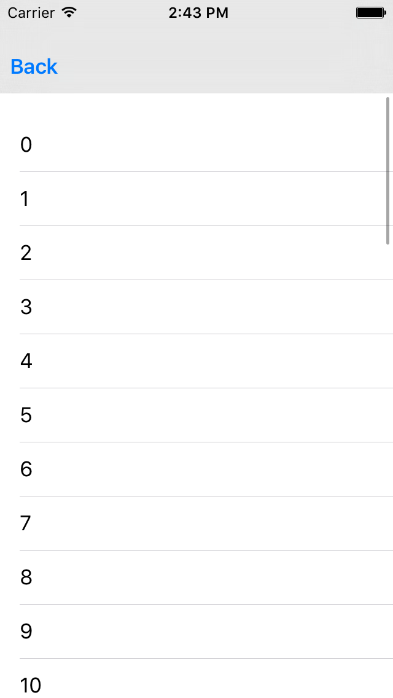

# Flexible Header

<!--{: .ios-screenshot .right }-->

The Flexible Header is a container view whose height and vertical offset react to
UIScrollViewDelegate events.
<!--{: .intro }-->

### Material Design Specifications

<ul class="icon-list">
  <li class="icon-link"><a href="https://www.google.com/design/spec/patterns/scrolling-techniques.html">Scrolling Techniques</a></li>
</ul>

### API Documentation

<ul class="icon-list">
  <li class="icon-link"><a href="/apidocs/FlexibleHeader/Classes/MDCFlexibleHeaderContainerViewController.html">MDCFlexibleHeaderContainerViewController</a></li>
  <li class="icon-link"><a href="/apidocs/FlexibleHeader/Classes/MDCFlexibleHeaderView.html">MDCFlexibleHeaderView</a></li>
  <li class="icon-link"><a href="/apidocs/FlexibleHeader/Classes/MDCFlexibleHeaderViewController.html">MDCFlexibleHeaderViewController</a></li>
  <li class="icon-link"><a href="/apidocs/FlexibleHeader/Protocols/MDCFlexibleHeaderViewDelegate.html">MDCFlexibleHeaderViewDelegate</a></li>
  <li class="icon-link"><a href="/apidocs/FlexibleHeader/Protocols/MDCFlexibleHeaderViewLayoutDelegate.html">MDCFlexibleHeaderViewLayoutDelegate</a></li>
</ul>

- - -

## Installation

### Requirements

- Xcode 7.0 or higher.
- iOS SDK version 7.0 or higher.

### Installation with CocoaPods

To add this component to your Xcode project using CocoaPods, add the following to your `Podfile`:

~~~ bash
$ pod 'MaterialComponents/FlexibleHeader'
~~~

Then, run the following command:

~~~ bash
$ pod install
~~~

- - -

## Usage

Classic UIKit applications use the UINavigationBar provided by a UINavigationController to display
navigation stack-related information, such as a title, left and right bar button items, and
optionally a custom title view. In this case there is a single UINavigationBar shared amongst all of
the UINavigationController's children.

The Flexible Header component deviates from this pattern: UIViewControllers arre expected to own
their own Flexible Header view instance.

This has several technical advantages:

- Allows transitions between two view controllers to own the navigation bar transition as well.
- Each view controller is distinctly responsible for its customizations of the Flexible Header.

It also has some technical disadvantages:

- View controllers that do not use features of the Flexible Header will find it a burden to
  implement the same scaffolding each time.

### Easing the common case

TODO(featherless): Discuss UINavigationControllerDelegate solution.
TODO(featherless): Discuss subclassing solution.
TODO(featherless): Discuss configurator API solution.

### What's inside

TODO(featherless): Discuss the three classes in this component, their relationship to one another,
and lead from this to the "Integration" section.

- - -

## Integration

### Step 1: Create an instance of a header view controller

~~~ objc
@implementation FlexibleHeaderTypicalUseViewController {
  MDCFlexibleHeaderViewController *_fhvc;
}

- (id)initWithNibName:(NSString *)nibNameOrNil bundle:(NSBundle *)nibBundleOrNil {
  self = [super initWithNibName:nibNameOrNil bundle:nibBundleOrNil];
  if (self) {
    _fhvc = [MDCFlexibleHeaderViewController new];
    [self addChildViewController:_fhvc];
  }
  return self;
}
~~~

### Step 2: Add the header view to your view controller's view

~~~ objc
- (void)viewDidLoad {
  [super viewDidLoad];

  _fhvc.view.frame = self.view.bounds;
  [self.view addSubview:_fhvc.view];
  [_fhvc didMoveToParentViewController:self];
}
~~~

#### A note on subclasses

A subclass of your view controller may add additional views in their viewDidLoad, potentially
resulting in the header being covered by the new views. It is the responsibility of the subclass to
take the z-index into account:

~~~ objc
[self.view insertSubview:myCustomView belowSubview:self.headerViewController.headerView];
~~~

### Step 3: Forward relevant UIViewController APIs

Setting childViewControllerForStatusBarHidden allows the Flexible Header to control the status bar
visibility in reaction to scroll events.

~~~ objc
- (UIViewController *)childViewControllerForStatusBarHidden {
  return _fhvc;
}
~~~

## Tracking a scroll view

In most situations you will want the header to track a UIScrollView's scrolling behavior. This
allows the header to expand, collapse, and shift off-screen.

To track a scroll view please follow these steps:

### Step 1: Set the tracking scroll view

In your viewDidLoad, set the `trackingScrollView` property on the header view:

~~~ objc
self.headerViewController.headerView.trackingScrollView = scrollView;
~~~

`scrollView` might be a table view, collection view, or a plain UIScrollView.

### Step 2: Forward scroll view delegate events to the header view

There are two ways to forward scroll events.

**Set headerViewController as the delegate**

You may use this approach if you do not need to implement any of the delegate's methods yourself
**and your scroll view is not a collection view**.

~~~ objc
scrollView.delegate = self.headerViewController;
~~~

**Forward the UIScrollViewDelegate methods to the header view**

If you need to implement any of the UIScrollViewDelegate methods yourself then you will need to
manually forward the following methods to the flexible header view.

~~~ objc
#pragma mark - UIScrollViewDelegate

- (void)scrollViewDidScroll:(UIScrollView *)scrollView {
  if (scrollView == self.headerViewController.headerView.trackingScrollView) {
    [self.headerViewController.headerView trackingScrollViewDidScroll];
  }
}

- (void)scrollViewDidEndDecelerating:(UIScrollView *)scrollView {
  if (scrollView == self.headerViewController.headerView.trackingScrollView) {
    [self.headerViewController.headerView trackingScrollViewDidEndDecelerating];
  }
}

- (void)scrollViewDidEndDragging:(UIScrollView *)scrollView willDecelerate:(BOOL)decelerate {
  if (scrollView == self.headerViewController.headerView.trackingScrollView) {
    [self.headerViewController.headerView trackingScrollViewDidEndDraggingWillDecelerate:decelerate];
  }
}

- (void)scrollViewWillEndDragging:(UIScrollView *)scrollView
                     withVelocity:(CGPoint)velocity
              targetContentOffset:(inout CGPoint *)targetContentOffset {
  if (scrollView == self.headerViewController.headerView.trackingScrollView) {
    [self.headerViewController.headerView trackingScrollViewWillEndDraggingWithVelocity:velocity
                                                                    targetContentOffset:targetContentOffset];
  }
}
~~~

### Step 3: Implement childViewControllerForStatusBarHidden

In order to affect the status bar's visibility you must query the header view controller.

~~~ objc
- (UIViewController *)childViewControllerForStatusBarHidden {
  return self.headerViewController;
}
~~~

### Interacting with UINavigationController

Push a view controller with a Flexible Header onto UINavigationController and you may find that
the existing UINavigationBar is undesired. The most obvious example occurs when your Flexible Header
has its own navigation bar.

If this is the case then we recommend hiding the UINavigationController's `navigationBar` during
UIViewController appearance events: `viewWillAppear:` or `viewWillDisappear:`. Changing the
navigation bar's visibility during these events gives the highest likelihood of your navigation bar
animating in/out in a reasonable manner.

<!--
-->
#### Objective-C
~~~ objc
- (void)viewWillAppear:(BOOL)animated {
  [super viewWillAppear:animated];

  [self.navigationController setNavigationBarHidden:YES animated:animated];
}
~~~

#### Swift
~~~ swift
override func viewWillAppear(animated: Bool) {
  super.viewWillAppear(animated)

  self.navigationController?.setNavigationBarHidden(true, animated: animated)
}
~~~
<!--
-->

Add the following to view controllers that don't have an app bar:

<!--
-->
#### Objective-C
~~~ objc
- (void)viewWillAppear:(BOOL)animated {
  [super viewWillAppear:animated];

  [self.navigationController setNavigationBarHidden:NO animated:animated];
}
~~~

#### Swift
~~~ swift
override func viewWillAppear(animated: Bool) {
  super.viewWillAppear(animated)

  self.navigationController?.setNavigationBarHidden(false, animated: animated)
}
~~~
<!--
-->

If all of your view controllers use the App Bar in a given UINavigationController then you can
simply hide the navigationBar when you create the navigation controller. **Don't forget to do this
at app restoration time!**

<!--
-->
#### Objective-C
~~~ objc
UINavigationController *navigationController = ...;
[navigationController setNavigationBarHidden:NO animated:NO];
~~~

#### Swift
~~~ swift
navigationController.setNavigationBarHidden(false, animated: false)
~~~
<!--
-->

### Status bar style

MDCHeaderViewController instances are able to recommend a status bar style by inspecting the
background color of the MDCFlexibleHeaderView. If you'd like to use this logic to automatically
update your status bar style, implement `childViewControllerForStatusBarStyle` in your app's view
controller.

<!--
-->
#### Objective-C
~~~ objc
- (UIViewController *)childViewControllerForStatusBarStyle {
  return self.headerViewController;
}
~~~

#### Swift
~~~ swift
override func childViewControllerForStatusBarStyle() -> UIViewController? {
  return self.headerViewController
}
~~~
<!--
-->

### Background images

This example shows how to add a custom background image view to a Flexible Header.

You can create and add a UIImageView subview to the Flexible Header view's content view:

<!--
-->
#### Objective-C
~~~ objc
UIImageView *imageView = ...;
imageView.frame = self.headerViewController.headerView.bounds;
imageView.autoresizingMask = UIViewAutoresizingFlexibleWidth | UIViewAutoresizingFlexibleHeight;
[self.headerViewController.headerView.contentView insertSubview:imageView atIndex:0];

imageView.contentMode = UIViewContentModeScaleAspectFill;
imageView.clipsToBounds = YES;
~~~

#### Swift
~~~ swift
let headerView = self.headerViewController!.headerView

let imageView = ...
imageView.frame = headerView.bounds
imageView.autoresizingMask = [.FlexibleWidth, .FlexibleHeight]
headerView.contentView.insertSubview(imageView, atIndex: 0)

imageView.contentMode = .ScaleAspectFill
imageView.clipsToBounds = true
~~~
<!--
-->

Notes:

- Add the image view to the header view's `contentView`, not the header view itself.
- Set the `contentMode` to "ScaleAspectFill" to ensure that the image always fills the available
  header space, even if the image is too small. This is usually preferred, but consider changing
  the contentMode if you want a different behavior.
- Enable `clipsToBounds` in order to ensure that your image view does not bleed past the bounds of
  the header view. The header view's `clipsToBounds` is disabled by default.

### Touch forwarding

The Flexible Header allows you to forward touch events to the tracking scroll view. This provides
the illusion that the Flexible Header is part of the tracking scroll view.

#### Starting touch forwarding

To start touch forwarding you must call `forwardTouchEventsForView:` with each view:

<!--
-->
#### Objective-C
~~~ objc
[headerView forwardTouchEventsForView:someContentView];
~~~

#### Swift
~~~ swift
headerView.forwardTouchEventsForView(someContentView)
~~~
<!--
-->

#### Stopping touch forwarding

To stop touch forwarding you must call `forwardTouchEventsForView:` with each view:

<!--
-->
#### Objective-C
~~~ objc
[headerView stopForwardingTouchEventsForView:someContentView];
~~~

#### Swift
~~~ swift
headerView.stopForwardingTouchEventsForView(someContentView)
~~~
<!--
-->
