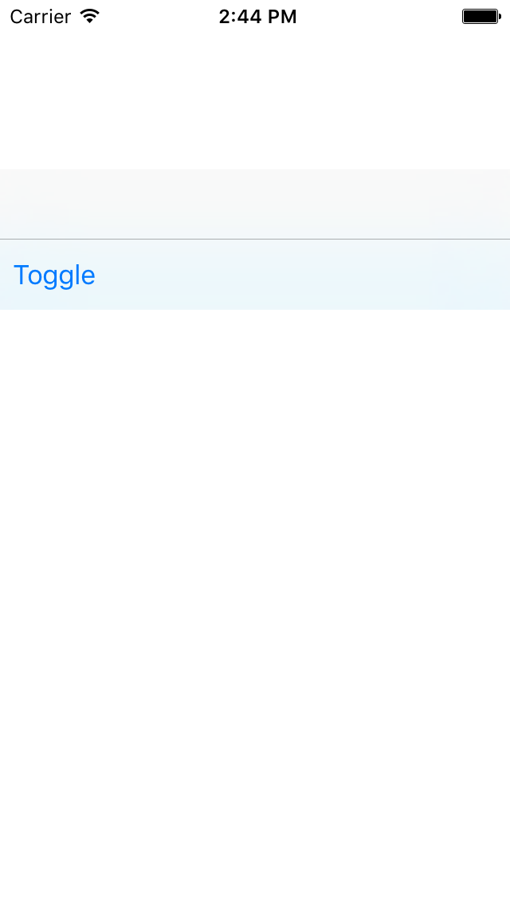

# Header Stack View

<!--{: .ios-screenshot .right }-->

The Header Stack View component is a view that coordinates the layout of two vertically-stacked
bar views.
<!--{: .intro }-->

### Material Design Specifications

<ul class="icon-list">
  <li class="icon-link"><a href="https://www.google.com/design/spec/layout/structure.html#structure-app-bar">App Bar</a></li>
</ul>

### API Documentation

<ul class="icon-list">
  <li class="icon-link"><a href="/apidocs/HeaderStackView/Classes/MDCHeaderStackView.html">MDCHeaderStackView</a></li>
</ul>

- - -

## Installation

### Requirements

- Xcode 7.0 or higher.
- iOS SDK version 7.0 or higher.

### Installation with CocoaPods

To add this component to your Xcode project using CocoaPods, add the following to your `Podfile`:

~~~ bash
pod 'MaterialComponents/HeaderStackView'
~~~

Then, run the following command:

~~~ bash
$ pod install
~~~

- - -

## Overview

This view's sole purpose is to facilitate the relative layout of two horizontal bars.

The top bar is typically a navigation bar. The bottom bar, when provided, is typically a tab bar.

- - -

## Usage

Header Stack View provides MDCHeaderStackView, which is a UIView subclass.

<!--
-->
#### Objective-C

~~~ objc
MDCHeaderStackView *headerStackView = [[MDCHeaderStackView alloc] init];
~~~

#### Swift
~~~ swift
~~~
<!--
-->

You may provide a top bar:

<!--
-->
#### Objective-C

~~~ objc
headerStackView.topBar = navigationBar;
~~~

#### Swift
~~~ swift
headerStackView.topBar = navigationBar
~~~
<!--
-->

You may provide a bottom bar:

<!--
-->
#### Objective-C

~~~ objc
headerStackView.bottomBar = tabBar;
~~~

#### Swift
~~~ swift
headerStackView.bottomBar = tabBar
~~~
<!--
-->
