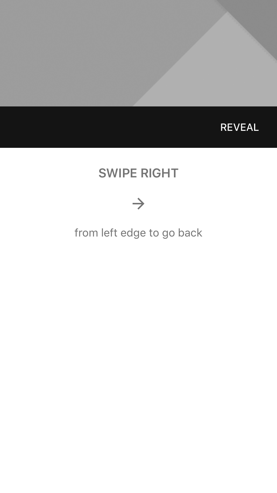

<!--docs:
title: "Header stack view"
layout: detail
section: components
excerpt: "The Header Stack View component is a view that coordinates the layout of two vertically stacked bar views."
iconId: header
path: /catalog/header-stack-view/
api_doc_root: true
-->

# Header stack view

The header stack view component is a view that coordinates the layout of two vertically stacked
bar views.



## Design & API Documentation

<ul class="icon-list">
  <li class="icon-list-item icon-list-item--spec"><a href="https://material.io/guidelines/layout/structure.html#structure-app-bar">Material Design guidelines: App Bar</a></li>
  <li class="icon-list-item icon-list-item--link"><a href="https://github.com/material-components/material-components-ios/blob/develop/components/HeaderStackView/src/MDCHeaderStackView.h">API: MDCHeaderStackView</a></li>
</ul>

- - -

## Installation

### Installation with CocoaPods

To add this component to your Xcode project using CocoaPods, add the following to your `Podfile`:

```bash
pod 'MaterialComponents/HeaderStackView'
```
<!--{: .code-renderer.code-renderer--install }-->

Then, run the following command:

```bash
pod install
```


- - -

## Overview

This view's sole purpose is to facilitate the relative layout of two horizontal bars. The bottom bar
will bottom align and be of fixed height. The top bar will stretch to fill the remaining space if
there is any.

The top bar is typically a navigation bar. The bottom bar, when provided, is typically a tab bar.


- - -

## Usage

### Importing

Before using header stack view, you'll need to import it:

<!--<div class="material-code-render" markdown="1">-->
#### Swift
```swift
import MaterialComponents.MaterialHeaderStackView
```

#### Objective-C

```objc
#import "MaterialHeaderStackView.h"
```
<!--</div>-->


Header stack view provides MDCHeaderStackView, which is a UIView subclass.

<!--<div class="material-code-render" markdown="1">-->
#### Swift
```swift
let headerStackView = MDCHeaderStackView()
```

#### Objective-C

```objc
MDCHeaderStackView *headerStackView = [[MDCHeaderStackView alloc] init];
```
<!--</div>-->

You may provide a top bar:

<!--<div class="material-code-render" markdown="1">-->
#### Swift
```swift
headerStackView.topBar = navigationBar
```

#### Objective-C

```objc
headerStackView.topBar = navigationBar;
```
<!--</div>-->

You may provide a bottom bar:

<!--<div class="material-code-render" markdown="1">-->
#### Swift
```swift
headerStackView.bottomBar = tabBar
```

#### Objective-C

```objc
headerStackView.bottomBar = tabBar;
```
<!--</div>-->
