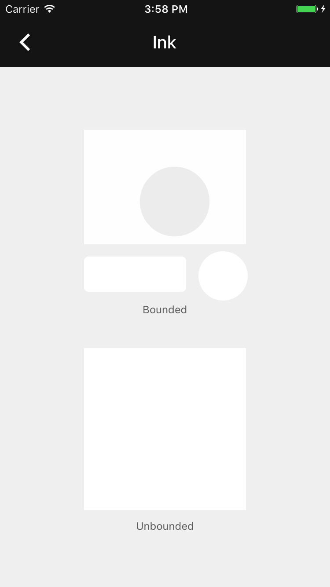

# Ink

<!---->

<!--
<video src="docs/assets/ink.mp4" autoplay loop></video>
-->

The Ink component provides a radial action in the form of a visual ripple of ink expanding
outward from the user's touch.
<!--{: .intro }-->

### Material Design Specifications

<ul class="icon-list">
  <li class="icon-link"><a href="https://www.google.com/design/spec/animation/responsive-interaction.html#responsive-interaction-radial-action">Radial Action</a></li>
</ul>

### API Documentation

<ul class="icon-list">
  <li class="icon-link"><a href="https://material-ext.appspot.com/mdc-ios-preview/components/Ink/apidocs/Classes/MDCInkTouchController.html">MDCInkTouchController</a></li>
  <li class="icon-link"><a href="https://material-ext.appspot.com/mdc-ios-preview/components/Ink/apidocs/Classes/MDCInkView.html">MDCInkView</a></li>
  <li class="icon-link"><a href="https://material-ext.appspot.com/mdc-ios-preview/components/Ink/apidocs/Protocols/MDCInkTouchControllerDelegate.html">MDCInkTouchControllerDelegate</a></li>
</ul>

- - -

## Installation

### Requirements

- Xcode 7.0 or higher.
- iOS SDK version 7.0 or higher.

### Installation with CocoaPods

To add this component to your Xcode project using CocoaPods, add the following to your `Podfile`:

~~~ bash
pod 'MaterialComponents/Ink'
~~~

Then, run the following command:

~~~ bash
pod install
~~~

- - -

## Usage

### Importing

Before using Ink, you'll need to import it:

<!--
-->
#### Objective-C

~~~ objc
#import "MaterialInk.h"
~~~

#### Swift
~~~ swift
import MaterialComponents
~~~

<!--
-->

The Ink component exposes two interfaces that you can use to add material-like
feedback to the user:

1. `MDCInkView` is a subclass of `UIView` that draws and animates ink ripples
and can be placed anywhere in your view hierarchy.
2. `MDCInkTouchController` bundles an `MDCInkView` instance with a
`UITapGestureRecognizer` instance to conveniently drive the ink ripples from the
user's touches.

### MDCInkTouchController

The simplest method of using ink in your views is to use a
`MDCInkTouchController`:

<!--
-->

#### Objective-C
~~~ objc
self.myButton = [UIButton buttonWithType:UIButtonTypeSystem];
[myButton setTitle:@"Tap me" forState:UIControlStateNormal];
self.inkTouchController =
    [[MDCInkTouchController alloc] initWithView:myButton];
[inkTouchController addInkView];
~~~

#### Swift
~~~ swift
myButton = UIButton(type: .System)
myButton.setTitle("Tap Me", forState: .Normal)
inkTouchController = MDCInkTouchController(view: myButton)
inkTouchController?.addInkView()
~~~

<!--
-->

The `MDCInkTouchControllerDelegate` gives you control over aspects of the
ink/touch relationship, such as how the ink view is created, where it is
inserted in view hierarchy, etc. For example, to temporarily disable ink
touches, the following code uses the delegate's
`inkTouchController:shouldProcessInkTouchesAtTouchLocation:` method:

<!--
-->

#### Objective-C
~~~ objc
@interface MyDelegate <MDCInkTouchControllerDelegate>
@end

@implementation MyDelegate

- (BOOL)inkTouchController:(MDCInkTouchController *)inkTouchController
    shouldProcessInkTouchesAtTouchLocation:(CGPoint)location {
  return [self checkIfWeShouldDisplayInk];
}

@end

...

self.myButton = [UIButton buttonWithType:UIButtonTypeSystem];
MyDelegate *myDelegate = [[MyDelegate] alloc] init];
self.inkTouchController =
    [[MDCInkTouchController alloc] initWithView:myButton];
self.inkTouchController.delegate = myDelegate;
[self.inkTouchController addInkView];

~~~

#### Swift
~~~ swift
class MyDelegate: NSObject, MDCInkTouchControllerDelegate {

  func inkTouchController(inkTouchController: MDCInkTouchController,
      shouldProcessInkTouchesAtTouchLocation location: CGPoint) -> Bool {
    // Determine if we want to display the ink
    return true
  }

}

...

myButton = UIButton(type: .System)
let myDelegate = MyDelegate()
inkTouchController = MDCInkTouchController(view: myButton)
inkTouchController?.delegate = myDelegate
inkTouchController?.addInkView()

~~~

<!--
-->

**NOTE:** The ink touch controller does not keep a strong reference to the view to which it is attaching the ink view.
An easy way to prevent the ink touch controller from being deallocated prematurely is to make it a property of a view controller (like in these examples.)

### MDCInkView

Alternatively, you can use MCDInkView directly to display ink ripples using your
own touch processing:

<!--
-->

#### Objective-C
~~~ objc
MyCustomView *myCustomView = [[MyCustomView alloc] initWithFrame:CGRectZero];
MDCInkView *inkView = [[MDCInkView alloc] init];
inkView.inkColor = [UIColor redColor];
[myCustomView addSubview:inkView];
...
[inkView spreadInkFromPoint:CGPointMake(100, 100) completion:NULL];
~~~

#### Swift
~~~ swift
let myCustomView = MyCustomView(frame: CGRectZero)
let inkView = MDCInkView()
inkView.inkColor = UIColor.redColor()
myCustomView.addSubview(inkView)
...
myCustomView.spreadInk(CGPoint(), completion:nil)
~~~

<!--
-->
