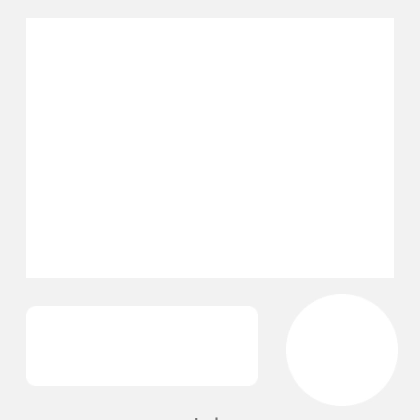

<!--docs:
title: "Ink"
layout: detail
section: components
excerpt: "The Ink component provides a radial action in the form of a visual ripple expanding outward from the user's touch."
iconId: ripple
path: /catalog/ink/
api_doc_root: true
-->

<!-- This file was auto-generated using ./scripts/generate_readme Ink -->

# Ink

[](https://github.com/material-components/material-components-ios/issues?q=is%3Aopen+is%3Aissue+label%3Atype%3ABug+label%3A%5BInk%5D)

The Ink component provides a radial action in the form of a visual ripple expanding outward from
the user's touch.



## Design & API documentation

<ul class="icon-list">
  <li class="icon-list-item icon-list-item--link">Class: <a href="https://material.io/components/ios/catalog/ink/api-docs/Classes/MDCInkGestureRecognizer.html">MDCInkGestureRecognizer</a></li>
  <li class="icon-list-item icon-list-item--link">Class: <a href="https://material.io/components/ios/catalog/ink/api-docs/Classes/MDCInkTouchController.html">MDCInkTouchController</a></li>
  <li class="icon-list-item icon-list-item--link">Class: <a href="https://material.io/components/ios/catalog/ink/api-docs/Classes/MDCInkView.html">MDCInkView</a></li>
  <li class="icon-list-item icon-list-item--link">Protocol: <a href="https://material.io/components/ios/catalog/ink/api-docs/Protocols/MDCInkTouchControllerDelegate.html">MDCInkTouchControllerDelegate</a></li>
  <li class="icon-list-item icon-list-item--link">Protocol: <a href="https://material.io/components/ios/catalog/ink/api-docs/Protocols/MDCInkViewDelegate.html">MDCInkViewDelegate</a></li>
  <li class="icon-list-item icon-list-item--link">Enumeration: <a href="https://material.io/components/ios/catalog/ink/api-docs/Enums.html">Enumerations</a></li>
  <li class="icon-list-item icon-list-item--link">Enumeration: <a href="https://material.io/components/ios/catalog/ink/api-docs/Enums/MDCInkStyle.html">MDCInkStyle</a></li>
</ul>

## Table of contents

- [Overview](#overview)
- [Installation](#installation)
  - [Installation with CocoaPods](#installation-with-cocoapods)
  - [Importing](#importing)
- [Usage](#usage)
  - [MDCInkTouchController](#mdcinktouchcontroller)
  - [MDCInkView](#mdcinkview)
- [Migration guides](#migration-guides)
  - [Migration guide: Ink to Ripple](#migration-guide-ink-to-ripple)

- - -

## Overview

Ink is a material design implementation of touch feedback.

## Installation

<!-- Extracted from docs/../../../docs/component-installation.md -->

### Installation with CocoaPods

Add the following to your `Podfile`:

```bash
pod 'MaterialComponents/Ink'
```
<!--{: .code-renderer.code-renderer--install }-->

Then, run the following command:

```bash
pod install
```

### Importing

To import the component:

<!--<div class="material-code-render" markdown="1">-->
#### Swift
```swift
import MaterialComponents.MaterialInk
```

#### Objective-C

```objc
#import "MaterialInk.h"
```
<!--</div>-->


## Usage

<!-- Extracted from docs/typical-use.md -->

The Ink component exposes two interfaces that you can use to add material-like
feedback to the user:

1. `MDCInkView` is a subclass of `UIView` that draws and animates ink ripples
and can be placed anywhere in your view hierarchy.
2. `MDCInkTouchController` bundles an `MDCInkView` instance with a
`UITapGestureRecognizer` instance to conveniently drive the ink ripples from the
user's touches.

### MDCInkTouchController

The simplest method of using ink in your views is to use a
`MDCInkTouchController`:

<!--<div class="material-code-render" markdown="1">-->
#### Swift
```swift
let myButton = UIButton(type: .system)
myButton.setTitle("Tap Me", for: .normal)
let inkTouchController = MDCInkTouchController(view: myButton)
inkTouchController.addInkView()
```

#### Objective-C
```objc
UIButton *myButton = [UIButton buttonWithType:UIButtonTypeSystem];
[myButton setTitle:@"Tap me" forState:UIControlStateNormal];
MDCInkTouchController *inkTouchController = [[MDCInkTouchController alloc] initWithView:myButton];
[inkTouchController addInkView];
```
<!--</div>-->


The `MDCInkTouchControllerDelegate` gives you control over aspects of the
ink/touch relationship, such as how the ink view is created, where it is
inserted in view hierarchy, etc. For example, to temporarily disable ink
touches, the following code uses the delegate's
`inkTouchController:shouldProcessInkTouchesAtTouchLocation:` method:

<!--<div class="material-code-render" markdown="1">-->

#### Swift
```swift
class MyDelegate: NSObject, MDCInkTouchControllerDelegate {

  func inkTouchController(_ inkTouchController: MDCInkTouchController, shouldProcessInkTouchesAtTouchLocation location: CGPoint) -> Bool {
    // Determine if we want to display the ink
    return true
  }

}

...

let myButton = UIButton(type: .system)
myButton.setTitle("Tap Me", for: .normal)

let myDelegate = MyDelegate()

let inkTouchController = MDCInkTouchController(view: myButton)
inkTouchController.delegate = myDelegate
inkTouchController.addInkView()

```

#### Objective-C
```objc
@interface MyDelegate: NSObject <MDCInkTouchControllerDelegate>
@end

@implementation MyDelegate

- (BOOL)inkTouchController:(MDCInkTouchController *)inkTouchController
    shouldProcessInkTouchesAtTouchLocation:(CGPoint)location {
  return YES;
}

@end

...

UIButton *myButton = [UIButton buttonWithType:UIButtonTypeSystem];
[myButton setTitle:@"Tap me" forState:UIControlStateNormal];
MyDelegate *myDelegate = [[MyDelegate alloc] init];
MDCInkTouchController *inkTouchController = [[MDCInkTouchController alloc] initWithView:myButton];
inkTouchController.delegate = myDelegate;
[inkTouchController addInkView];
```
<!--</div>-->

**NOTE:** The ink touch controller does not keep a strong reference to the view to which it is attaching the ink view.
An easy way to prevent the ink touch controller from being deallocated prematurely is to make it a property of a view controller (like in these examples.)

### MDCInkView

Alternatively, you can use MCDInkView directly to display ink ripples using your
own touch processing:

<!--<div class="material-code-render" markdown="1">-->
#### Swift
```swift
let myCustomView = MyCustomView(frame: CGRect.zero)
let inkView = MDCInkView()
inkView.inkColor = UIColor.red
myCustomView.addSubview(inkView)
...
// When the touches begin, there is one animation
inkView.startTouchBeganAnimation(at: touchPoint, completion: nil)
...
// When the touches end, there is another animation
inkView.startTouchEndedAnimation(at: touchPoint, completion: nil)
```

#### Objective-C
```objc
MyCustomView *myCustomView = [[MyCustomView alloc] initWithFrame:CGRectZero];
MDCInkView *inkView = [[MDCInkView alloc] init];
inkView.inkColor = [UIColor redColor];
[myCustomView addSubview:inkView];
...
// When the touches begin, there is one animation
[inkView startTouchBeganAnimationAtPoint:touchPoint completion:nil];
...
// When the touches end, there is another animation
[inkView startTouchEndedAnimationAtPoint:touchPoint completion:nil];
```
<!--</div>-->


## Migration guides

<!-- Extracted from docs/migration-guide-ink-to-ripple.md -->

### Migration guide: Ink to Ripple

Ink and Ripple provide similar APIs: a view (`MDCInkView`, `MDCRippleView`), and a touch controller (`MDCInkTouchController`, `MDCRippleTouchController`). 

While Ripple and Ink’s implementations slightly vary, the public APIs are nearly identical. Furthermore, Ripple’s API does not produce additional side effects and can be used interchangeably.

These two notions make the migration path from Ink to Ripple relatively simple.

For guidance, these are the current naming differences that you need to pay attention to when migrating:

**`MDCInkView` vs `MDCRippleView`:**

|`MDCInkView`|`MDCRippleView`|
|---|---|
|`animationDelegate`|`rippleViewDelegate`|
|`maxRippleRadius`|`maximumRadius`|
|`startTouchBeganAtPoint:animated:completion:`|`beginRippleTouchDownAtPoint:animated:completion:`|
|`startTouchEndAtPoint:animated:completion:`|`beginRippleTouchUpAnimated:completion:`|
|`inkAnimationDidStart:inkView`|`rippleTouchDownAnimationDidBegin:rippleView`|
|`inkAnimationDidEnd:inkView`|`rippleTouchUpAnimationDidEnd:rippleView`|
|`inkStyle`|`rippleStyle`|
|`inkColor`|`rippleColor`|
|`cancelAllAnimationsAnimated:`|`cancelAllRipplesAnimated:completion:`|

**`MDCInkTouchController` vs `MDCRippleTouchController`:**

|`MDCInkTouchController`|`MDCRippleTouchController`|
|---|---|
|`defaultInkView`|`rippleView`|
|`initWithView:` → `addInkView`|`init` → `addRippleToView:`\*|
|`view`|`view`|
|`delegate`|`delegate`|
|`gestureRecognizer`|`gestureRecognizer`|
|`inkTouchController:insertInkView:intoView:`|`rippleTouchController:insertRippleView:intoView:`|
|`inkTouchController:shouldProcessInkTouchesAtTouchLocation:`|`rippleTouchController:shouldProcessRippleTouchesAtTouchLocation:`|
|`inkTouchController:didProcessInkTouchesAtTouchLocation:`|`rippleTouchController:didProcessRippleTouchesAtTouchLocation:`|

*\*Ripple provides a more convenient API if the ink's initialized view is the view that the ink is then added to. All you need is to initialize the ripple with `initWithView:` and there is no need to use an equivalent `addInkView` afterwards.*

**Based on the above guidance, the overall strategy to migrate Ink to Ripple in each component is as follows:**

<ul class="icon-list">
  <li class="icon-list-item icon-list-item">Provide an enableRippleBehavior bool property to allow to opt-in to use Ripple instead of Ink (where the default to this property is NO).</li>
</ul>

Component Header:
```objc
/*
 This property determines if an @c <#INSERT CLASS NAME> should use the @c MDCRippleView behavior or not.
 By setting this property to @c YES, @c MDCRippleView is used to provide the user visual
 touch feedback, instead of the legacy @c MDCInkView.
 @note Defaults to @c NO.
 */
@property(nonatomic, assign) BOOL enableRippleBehavior;
```

Component Implementation Setter:
```objc
- (void)setEnableRippleBehavior:(BOOL)enableRippleBehavior {
  _enableRippleBehavior = enableRippleBehavior;

  if (enableRippleBehavior) {
    [self.inkView removeFromSuperview];
    self.rippleView.frame = self.bounds;
    [self insertSubview:self.rippleView belowSubview:X];
  } else {
    [self.rippleView removeFromSuperview];
    [self insertSubview:self.inkView belowSubview:X];
  }
}
```

<ul class="icon-list">
  <li class="icon-list-item icon-list-item">Add the RippleView/RippleTouchController APIs beside their InkView/InkTouchController counterparts.</li>
</ul>

<ul class="icon-list">
  <li class="icon-list-item icon-list-item">If the component itself has public APIs that use the term "Ink" like “InkStyle” or “InkColor”, the developer should add APIs to use the term “Ripple” instead. When Ink will eventually be deprecated, these APIs will be deprecated as part of that process. Another option instead of exposing specific Ripple APIs is to expose the `MDCRippleView` property in the public API.</li>
</ul>

