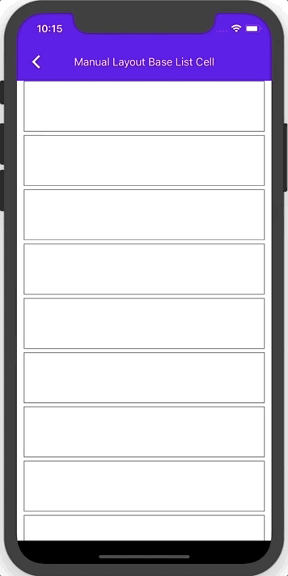

<!--docs:
title: "Lists"
layout: detail
section: components
excerpt: "Lists are continuous, vertical indexes of text or images."
iconId: <#icon_id#>
path: /catalog/list/
api_doc_root: true
-->

# Lists

[](https://github.com/material-components/material-components-ios/issues?q=is%3Aopen+is%3Aissue+label%3Atype%3ABug+label%3A%5BList%5D)

[Lists](https://material.io/components/lists/) are continuous, vertical indexes of text or images.

**Contents**

* [Using lists](#using-lists)
* [Single-line list](#single-line-list)
* [Two-line list](#two-line-list)
* [Three-line list](#three-line-list)
* [Theming lists](#theming)
* [Building your own list item](#building-your-own-list-item)

- - -

## Using lists

### Installing

In order to install lists with Cocoapods first add the List component subspec to your `Podfile`:

```bash
pod 'MaterialComponents/List'
```
<!--{: .code-renderer.code-renderer--install }-->

Then, run the following command:

```bash
pod install
```

From there, import the relevant target or file and use your list item like you would any other `UICollectionViewCell`.

<!--<div class="material-code-render" markdown="1">-->
#### Swift
```swift
import MaterialComponents.MaterialList
```

#### Objective-C

```objc
#import "MaterialList.h"
```
<!--</div>-->

### List classes

We currently offer two `UICollectionViewCell` subclasses that can be used to create Material Design lists: `MDCBaseCell` and `MDCSelfSizingStereoCell`.

#### `MDCBaseCell`

The `MDCBaseCell` is a list item in its simplest form, a `UICollectionViewCell` subclass with ripple and elevation. The `MDCBaseCell` provides a starting point to build anything demonstrated in the extensive [design guidelines](https://material.io/go/design-lists). To build a list using `MDCBaseCell` simply treat it like you would any other `UICollectionViewCell`.



#### `MDCSelfSizingStereoCell`

The `MDCSelfSizingStereoCell` is a subclass of `MDCBaseCell`. It exposes two image views (trailing and leading) and two labels (title and detail) that the user can configure however they like.


Because the list items we provide inherit from `UICollectionViewCell`, clients are not expected to instantiate them themselves. Rather, clients should register the cell classes with `UICollectionViews`, and then cast the cells to the correct class in their implementations of `-collectionView:cellForItemAtIndexPath:`.

<!--<div class="material-code-render" markdown="1">-->
#### Swift

```swift
// registering the cell
collectionView.register(MDCBaseCell.self, forCellWithReuseIdentifier: "baseCellIdentifier")

// casting the cell to the desired type within `-collectionView:cellForItemAtIndexPath:`
guard let cell = collectionView.cellForItem(at: indexPath) as? MDCBaseCell else { fatalError() }
```

#### Objective-C

```objc
// registering the cell
[self.collectionView registerClass:[MDCBaseCell class]
        forCellWithReuseIdentifier:@"BaseCellIdentifier"];

// casting the cell to the desired type within `-collectionView:cellForItemAtIndexPath:`
MDCBaseCell *cell =
    [collectionView dequeueReusableCellWithReuseIdentifier:@"BaseCellIdentifier"
                                              forIndexPath:indexPath];
```
<!--</div>-->

### Making lists accessible

#### Setting `-isAccessibilityElement`

We recommend setting `UICollectionViewCell`s (and `UITableViewCell`s) as `accessibilityElements`. That way, VoiceOver doesn't traverse the entire cell and articulate an overwhelming amount of accessibility information for each of its subviews.

<!--<div class="material-code-render" markdown="1">-->
#### Swift
```swift
cell.isAccessibilityElement = true
```

#### Objective-C

```objc
cell.isAccessibilityElement = YES;
```
<!--</div>-->

## List anatomy

The following is an anatomy diagram of a typical list that applies to single-line, two-line, and three-line lists:


This list item consists of the following attributes:
1. Leading image view
1. Title label and detail label
1. Trailing label

_**NOTE: `MDCSelfSizingStereoCell` currently only supports leading and trailing _image views_, so the trailing label would be represented by a `UIImageView`.**_

An instance of `MDCSelfSizingStereoCell` can be configured to be a single-line, two-line, or three-line list item. The features above map to the following propertieis and methods:

#### Container attributes

&nbsp;        | **Attribute**        | **Related methods**      | **Default value**
------------- | -------------------- | ------------------------ | -----------------
**Color**     | `rippleColor` | `-setRippleColor:` <br/> `-setRippleColor` | On surface color at 0.12 opacity
**Elevation** | `elevation`      | `-setElevation:` <br/> `-elevation` | 0

#### Icon attributes

&nbsp;               | **Attribute**                         | **Related methods**                                              | **Default value**
-------------------- | ------------------------------------- | ---------------------------------------------------------------- | -----------------
**Leading image**            | `leadingImageView`            | N/A  | N/A
**Trailing image**            | `trailingImageView`          | N/A  | N/A

#### Text label attributes

&nbsp;                    | **Attribute**                          | **Related methods**                                                 | **Default value**
------------------------- | -------------------------------------- | ------------------------------ | -----------------
**Title text**            |`titleLabel`                             | N/A                           | N/A
**Detail text**            |`titleLabel`                              | N/A                          | N/A

**Types**

There are three list types: 1\. [Single-line list](#single-line-list), 2\. [Two-line list](#two-line-list) 3\. [Three-line list](#three-line-list)


## Single-line list

Single-line list items contain a maximum of one line of text.

### Single-line list example


<!--<div class="material-code-render" markdown="1">-->
#### Swift

```swift
func collectionView(_ collectionView: UICollectionView,
                    cellForItemAt indexPath: IndexPath) -> UICollectionViewCell {
  guard cell = collectionView.dequeueReusableCell(
    withReuseIdentifier: kSelfSizingStereoCellIdentifier,
    for: indexPath)
    as? MDCCollectionViewTextCell
    else { return }
  cell.titleLabel.text = "This is a single-line list"
  return cell
}
```

#### Objective-C

```objc
- (UICollectionViewCell *)collectionView:(UICollectionView *)collectionView
                  cellForItemAtIndexPath:(NSIndexPath *)indexPath {
  MDCSelfSizingStereoCell *cell =
      (MDCSelfSizingStereoCell *)[collectionView dequeueReusableCellWithReuseIdentifier:kSelfSizingStereoCellIdentifier
                                                forIndexPath:indexPath];
  cell.titleLabel.text = @"This is a single-line list";
  return cell;
}
```
<!--</div>-->

## Two-line list

Two-line list items contain a maximum of two lines of text.

### Two-line list example


<!--<div class="material-code-render" markdown="1">-->
#### Swift

```swift
func collectionView(_ collectionView: UICollectionView,
                    cellForItemAt indexPath: IndexPath) -> UICollectionViewCell {
  guard cell = collectionView.dequeueReusableCell(
    withReuseIdentifier: kSelfSizingStereoCellIdentifier,
    for: indexPath)
    as? MDCCollectionViewTextCell
    else { return }
  cell.titleLabel.text = "This is a two-line list"
  cell.detailLabel.text = "This is secondary text that occupies one line."
  return cell
}
```

#### Objective-C

```objc
- (UICollectionViewCell *)collectionView:(UICollectionView *)collectionView
                  cellForItemAtIndexPath:(NSIndexPath *)indexPath {
  MDCSelfSizingStereoCell *cell =
      [collectionView dequeueReusableCellWithReuseIdentifier:kSelfSizingStereoCellIdentifier
                                                forIndexPath:indexPath];
  cell.titleLabel.text = @"This is a two-line list";
  cell.detailLabel.text = @"This is secondary text that occupies one line.";
  return cell;
}
```
<!--</div>-->

## Three-line list

Three-line list items contains a maximum of three lines of text.

### Three-line list example


<!--<div class="material-code-render" markdown="1">-->
#### Swift

```swift
func collectionView(_ collectionView: UICollectionView,
                    cellForItemAt indexPath: IndexPath) -> UICollectionViewCell {
  guard cell = collectionView.dequeueReusableCell(
    withReuseIdentifier: kSelfSizingStereoCellIdentifier,
    for: indexPath)
    as? MDCCollectionViewTextCell
    else { return }
  cell.titleLabel.text = "This is a three-line list"
  cell.detailLabel.text = "This is secondary text\nthat occupies two lines."
  return cell
}
```

#### Objective-C

```objc
- (UICollectionViewCell *)collectionView:(UICollectionView *)collectionView
                  cellForItemAtIndexPath:(NSIndexPath *)indexPath {
  MDCSelfSizingStereoCell *cell =
      [collectionView dequeueReusableCellWithReuseIdentifier:kSelfSizingStereoCellIdentifier
                                                forIndexPath:indexPath];
  cell.titleLabel.text = @"This is a three-line list";
  cell.detailLabel.text = @"This is secondary text\nthat occupies two lines.";
  return cell;
}
```
<!--</div>-->

## Theming

This is an example of a two-line list with Shrine theming:


To theme a list item in your own app, use the Material Theming extension. To do that, first add the
theming extension to your `Podfile`:

```bash
pod `MaterialComponents/List+Theming`
```

Then run the installer:

```bash
pod install
```

From there, call the theming method from your `UICollectionViewDelegate` code.

<!--<div class="material-code-render" markdown="1">-->
#### Swift

```swift
// Step 1: Import the theming extension
import MaterialComponents.MaterialList_Theming

// Step 2: Create a shared container scheme. A shared scheme should be created once in your app and
// shared with all components.
let containerScheme = MDCContainerScheme()

// Step 3: Apply the scheme to each cell - from within `collectionView(_:cellForItemAt:)`
cell.applyTheme(withScheme:containerScheme)
```

#### Objective-C

```objc
// Step 1: Import the theming extension
#import "MaterialList+Theming.h"

// Step 2: Create a shared container scheme. A shared scheme should be created once in your app and
// shared with all components.
id<MDCContainerScheming> containerScheme = [[MDCContainerScheme alloc] init];

// Step 3: Apply the scheme to each cell - from within `-collectionView:cellForItemAtIndexPath:`
[cell applyThemeWithScheme:containerScheme];
```
<!--</div>-->

## Building your own list item

<!-- Extracted from docs/create-your-own.md -->

The example files can be found <a href="examples/">here</a>


Our example consists of a custom `UICollectionViewController`: <a
href="examples/CollectionListCellExampleTypicalUse.m">examples/CollectionListCellExampleTypicalUse.m</a>
and also of a custom `UICollectionViewCell`: <a
href="examples/supplemental/CollectionViewListCell.m">examples/supplemental/CollectionViewListCell.m</a>.

The main focus will be on the custom cell as that's where all the logic goes
in, whereas the collection view and its controller are using mostly
boilerplate code of setting up a simple example and collection view.

### Layout

For our example we will have a layout consisting of a left aligned
`UIImageView`, a title text `UILabel` and a details text `UILabel`. The title
text will have a max of 1 line whereas the details text can be up to 3 lines.
It is important to note that neither the image nor the labels need to be set.
To see more of the spec guidelines for Lists please see here: <a
href="https://material.io/go/design-lists">https://material.io/go/design-lists</a>

To create our layout we used auto layout constraints that are all set up in
the `(void)setupConstraints` method in our custom cell. It is important to
make sure we set `translatesAutoresizingMaskIntoConstraints` to `NO` for all
the views we are applying constraints on.

### Ink ripple

Interactable Material components and specifically List Cells have an ink
ripple when tapped on. To add ink to your cells there are a few steps you need
to take:

1. Add an `MDCInkView` property to your custom cell.

1. Initialize `MDCInkView` on init and add it as a subview:

    <!--<div class="material-code-render" markdown="1">-->
    #### Swift

    ```swift
    let inkView = MDCInkView(frame: bounds)
    inkView.usesLegacyInkRipple = false
    addSubview(inkView)
    ```

    #### Objective-C

    ```objc
    _inkView = [[MDCInkView alloc] initWithFrame:self.bounds];
    _inkView.usesLegacyInkRipple = NO;
    [self addSubview:_inkView];
    ```
    <!--</div>-->

1. Initialize a `CGPoint` property in your cell (`CGPoint _lastTouch;`) to
indicate where the last tap was in the cell.

1. Override the `UIResponder`'s `touchesBegan` method in your cell to identify
and save where the touches were so we can then start the ripple animation from
that point:

    <!--<div class="material-code-render" markdown="1">-->
    #### Swift

    ```swift
    override func touchesBegan(_ touches: Set<UITouch>, with event: UIEvent?) {
      let touch = touches.first
      let location = touch?.location(in: self)
      lastTouch = location
    }
    ```

    #### Objective-C

    ```objc
    - (void)touchesBegan:(NSSet *)touches withEvent:(UIEvent *)event {
      UITouch *touch = [touches anyObject];
      CGPoint location = [touch locationInView:self];
      _lastTouch = location;

      [super touchesBegan:touches withEvent:event];
    }
    ```
    <!--</div>-->

1. Override the `setHighlighted` method for your cell and apply the start and
stop ripple animations:

    <!--<div class="material-code-render" markdown="1">-->
    #### Swift

    ```swift
    override var isHighlighted: Bool {
      set {
        super.isHighlighted = newValue
        if (newValue) {
          inkView.startTouchBeganAnimation(at: lastTouch, completion: nil)
        } else {
          inkView.startTouchEndedAnimation(at: lastTouch, completion: nil)
        }
      }
      // get...
    }
    ```

    #### Objective-C

    ```objc
    - (void)setHighlighted:(BOOL)highlighted {
      [super setHighlighted:highlighted];
      if (highlighted) {
        [_inkView startTouchBeganAnimationAtPoint:_lastTouch completion:nil];
      } else {
        [_inkView startTouchEndedAnimationAtPoint:_lastTouch completion:nil];
      }
    }
    ```
    <!--</div>-->

1. When the cell is reused we must make sure no outstanding ripple animations
stay on the cell so we need to clear the ink before:

    <!--<div class="material-code-render" markdown="1">-->
    #### Swift

    ```swift
    override func prepareForReuse() {
      inkView.cancelAllAnimations(animated: false)
      super.prepareForReuse()
    }
    ```

    #### Objective-C

    ```objc
    - (void)prepareForReuse {
      [_inkView cancelAllAnimationsAnimated:NO];
      [super prepareForReuse];
    }
    ```
    <!--</div>-->

    Now there is ink in our cells!

### Self sizing

In order to have cells self-size based on content and not rely on magic number
constants to decide how big they should be, we need to follow these steps:

1. Apply autolayout constraints of our added subviews relative to each other
and their superview (the cell's `contentView`).

    We need to make sure our constraints don't define static heights or widths but 
    rather constraints that are relative or our cell won't calculate itself based
    on the dynamically sized content. You can see how it is achieved in the
    `setupConstraints` method in our example. If you'll notice there are some
    constraints that are set up to be accessible throughout the file:

    <!--<div class="material-code-render" markdown="1">-->
    #### Swift
    ```swift
    var imageLeftPaddingConstraint: NSLayoutConstraint
    var imageRightPaddingConstraint: NSLayoutConstraint
    var imageWidthConstraint: NSLayoutConstraint
    ```

    #### Objective-C
    ```objc
    NSLayoutConstraint *_imageLeftPaddingConstraint;
    NSLayoutConstraint *_imageRightPaddingConstraint;
    NSLayoutConstraint *_imageWidthConstraint;
    ``` 
    <!--</div>-->

    This is in order to support the changing layout if an image is set or not.

1. Because our list cells need to fill the entire width of the collection
view, we want to expose the cell's width to be settable by the view controller
when the cell is set up. For that we expose a `setCellWidth` method that sets
the width constraint of the `contentView`:

    <!--<div class="material-code-render" markdown="1">-->
    #### Swift
    ```swift
    func set(cellWidth: CGFloat) {
      cellWidthConstraint.constant = cellWidth
      cellWidthConstraint.isActive = true
    }
    ```

    #### Objective-C
    ```objc
    - (void)setCellWidth:(CGFloat)width {
      _cellWidthConstraint.constant = width;
      _cellWidthConstraint.active = YES;
    }
    ```
    <!--</div>-->

    and then in the collection view's `cellForItemAtIndexPath` delegate method we
    set the width:

    <!--<div class="material-code-render" markdown="1">-->
    #### Swift
    ```swift
    var cellWidth = collectionView.bounds.width
    if #available(iOS 11.0, *) {
      cellWidth -= collectionView.adjustedContentInset.left + collectionView.adjustedContentInset.right
    }
    set(cellWidth: cellWidth)
    ```

    #### Objective-C
    ```objc
    CGFloat cellWidth = CGRectGetWidth(collectionView.bounds);
    if (@available(iOS 11.0, *)) {
      cellWidth -=
        (collectionView.adjustedContentInset.left + collectionView.adjustedContentInset.right);
    }
    [cell setCellWidth:cellWidth];
    ```
    <!--</div>-->

1. In our collection view's flow layout we must set an `estimatedItemSize` so
the collection view will defer the size calculations to its content.

    Note: It is better to set the size smaller rather than larger or constraints
    might break in runtime.

    <!--<div class="material-code-render" markdown="1">-->
    #### Swift
    ```swift
    flowLayout.estimatedItemSize = CGSize(width: kSmallArbitraryCellWidth, 
                                         height: kSmallestCellHeight)
    ```

    #### Objective-C
    ```objc
    _flowLayout.estimatedItemSize = CGSizeMake(kSmallArbitraryCellWidth, kSmallestCellHeight);
    ```
    <!--</div>-->

### Typography

For our example we use a typography scheme to apply the fonts to our cell's
`UILabel`s. Please see <a href="../schemes/Typography">Typography
Scheme</a> for more information.

### Dynamic Type

<a
href="https://developer.apple.com/ios/human-interface-guidelines/visual-design/typography/">Dynamic
Type</a> allows users to indicate a system-wide preferred text size. To
support it in our cells we need to follow these steps:

1. Set each of the label fonts to use the dynamically sized MDC fonts in their
set/update methods:

    <!--<div class="material-code-render" markdown="1">-->
    #### Swift
    ```swift
    func updateTitleFont() {
      if (_titleFont == nil) {
        _titleFont = defaultTitleFont
      }
      _titleLabel.font = 
          _titleFont.mdc_fontSized(forMaterialTextStyle: .subheadline, 
                                   scaledForDynamicType: mdc_adjustsFontForContentSizeCategory)
    }
    ```

    #### Objective-C
    ```objc
    - (void)updateTitleFont {
      if (!_titleFont) {
        _titleFont = defaultTitleFont();
      }
      _titleLabel.font =
        [_titleFont mdc_fontSizedForMaterialTextStyle:MDCFontTextStyleSubheadline
                                 scaledForDynamicType:_mdc_adjustsFontForContentSizeCategory];
      [self setNeedsLayout];
    }
    ```
    <!--</div>-->

1. Add an observer in the cell to check for the
`UIContentSizeCategoryDidChangeNotification` which tells us the a system-wide
text size has been changed.

    <!--<div class="material-code-render" markdown="1">-->
    #### Swift
    ```swift
    NotificationCenter.default.addObserver(self, 
                                           selector: #selector(contentSizeCategoryDidChange(notification:)), 
                                           name: UIContentSizeCategory.didChangeNotification, 
                                           object: nil)
    ```

    #### Objective-C
    ```objc
    [[NSNotificationCenter defaultCenter]
        addObserver:self
           selector:@selector(contentSizeCategoryDidChange:)
               name:UIContentSizeCategoryDidChangeNotification
             object:nil];
    ```
    <!--</div>-->


    In the selector update the font sizes to reflect the change:

    <!--<div class="material-code-render" markdown="1">-->
    #### Swift
    ```swift
    func contentSizeCategoryDidChange(_: NSNotification) {
      updateTitleFont()
      updateDetailsFont()
    }
    ```

    #### Objective-C
    ```objc
    - (void)contentSizeCategoryDidChange:(__unused NSNotification *)notification {
      [self updateTitleFont];
      [self updateDetailsFont];
    }
    ```
    <!--</div>-->

1. Add an observer also in the `UIViewController` so we can reload the
   collection view once there is a change:

    <!--<div class="material-code-render" markdown="1">-->
    #### Swift
    ```swift
    func contentSizeCategoryDidChange(_: NSNotification) {
      collectionView.reloadData()
    }
    ```

    #### Objective-C
    ```objc
    - (void)contentSizeCategoryDidChange:(__unused NSNotification *)notification {
      [self.collectionView reloadData];
    }
    ```
    <!--</div>-->

    ### iPhone X safe area support

    Our collection view needs to be aware of the safe areas when being presented
    on iPhone X. To do so need to set its `contentInsetAdjustmentBehavior` to be
    aware of the safe area:

    <!--<div class="material-code-render" markdown="1">-->
    #### Swift
    ```swift
    if #available(iOS 11.0, *) {
      collectionView.contentInsetAdjustmentBehavior = .always
    }
    ```

    #### Objective-C
    ```objc
    #if defined(__IPHONE_11_0) && (__IPHONE_OS_VERSION_MAX_ALLOWED >= __IPHONE_11_0)
    if (@available(iOS 11.0, *)) {
      self.collectionView.contentInsetAdjustmentBehavior = UIScrollViewContentInsetAdjustmentAlways;
    }
    #endif
    ```
    <!--</div>-->

    Lastly, as seen in the self-sizing section on step 2, when setting the width
    of the cell we need to set it to be the width of the collection view bounds
    minus the adjustedContentInset that now insets based on the safe area.

    ### Landscape support

    In your view controller you need to invalidate the layout of your collection
    view when there is an orientation change. Please see below for the desired
    code changes to achieve that:

    <!--<div class="material-code-render" markdown="1">-->
    #### Swift
    ```swift
    override func traitCollectionDidChange(_ previousTraitCollection: UITraitCollection?) {
      super.traitCollectionDidChange(previousTraitCollection)
      self.collectionView.collectionViewLayout.invalidateLayout()
      self.collectionView.reloadData()
    }

    override func viewWillTransition(to size: CGSize, with coordinator: UIViewControllerTransitionCoordinator) {
      super.viewWillTransition(to: size, with: coordinator)
      self.collectionView.collectionViewLayout.invalidateLayout()
      coordinator.animate(alongsideTransition: nil) { (_) in
        self.collectionView.collectionViewLayout.invalidateLayout()
      }
    }
    ```

    #### Objective-C
    ```objc
    - (void)traitCollectionDidChange:(UITraitCollection *)previousTraitCollection {
      [super traitCollectionDidChange:previousTraitCollection];
      [self.collectionView.collectionViewLayout invalidateLayout];
      [self.collectionView reloadData];
    }

    - (void)viewWillTransitionToSize:(CGSize)size
           withTransitionCoordinator:(id<UIViewControllerTransitionCoordinator>)coordinator {
      [super viewWillTransitionToSize:size withTransitionCoordinator:coordinator];

      [self.collectionView.collectionViewLayout invalidateLayout];

      [coordinator animateAlongsideTransition:nil completion:^(__unused id context) {
        [self.collectionView.collectionViewLayout invalidateLayout];
      }];
    }
    ```
    <!--</div>-->

### Right to left text support

To support right to left text we need to import `MDFInternationalization`:

<!--<div class="material-code-render" markdown="1">-->
#### Swift
```swift
import MDFInternationalization
```

#### Objective-C
```objc
#import <MDFInternationalization/MDFInternationalization.h>
```
<!--</div>-->

and for each of our cell's subviews me need to update the `autoResizingMask`:

<!--<div class="material-code-render" markdown="1">-->
#### Swift
```swift
_titleLabel.autoresizingMask =
  MDFTrailingMarginAutoresizingMaskForLayoutDirection(effectiveUserInterfaceLayoutDirection)
```

#### Objective-C
```objc
_titleLabel.autoresizingMask =
    MDFTrailingMarginAutoresizingMaskForLayoutDirection(self.effectiveUserInterfaceLayoutDirection);
``` 
<!--</div>-->
