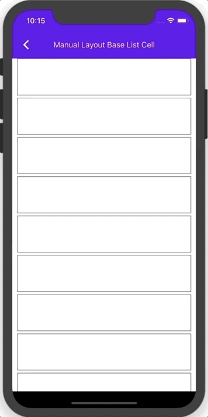

# List

<!-- badges -->

Material Design Lists are continuous groups of text and/or images. The [Material guidelines](https://material.io/go/design-lists) for Lists are extensive, and there is no class at this time for implementing any one of them, let alone all of them. However, we are starting to add classes that represent individual List Items. We currently offer two List Item Cells:

### MDCBaseCell

The MDCBaseCell is a List Item at its simplest--a basic UICollectionViewCell subclass with Material Ink Ripple and Elevation. The MDCBaseCell provides a starting point to build anything the guidelines provide. To build a List using the MDCBaseCell simply treat it like you would any other UICollectionViewCell.

Below is an example:

  

### MDCSelfSizingStereoCell

The MDCSelfSizingStereoCell is a subclass of MDCBaseCell. It exposes two image views (trailing and leading) and two labels (title and detail) that the user can configure however they like.

Below is an example:

  

<!-- design-and-api -->

<!-- toc -->

## Installation

- [Typical installation](../../../docs/component-installation.md)

## Usage

- [Typical use](typical-use.md)

- [Theming](theming.md)

- [Accessibility](accessibility.md)

## How to implement your own List Cell

- [How to implement your own List Cell](create-your-own.md)
