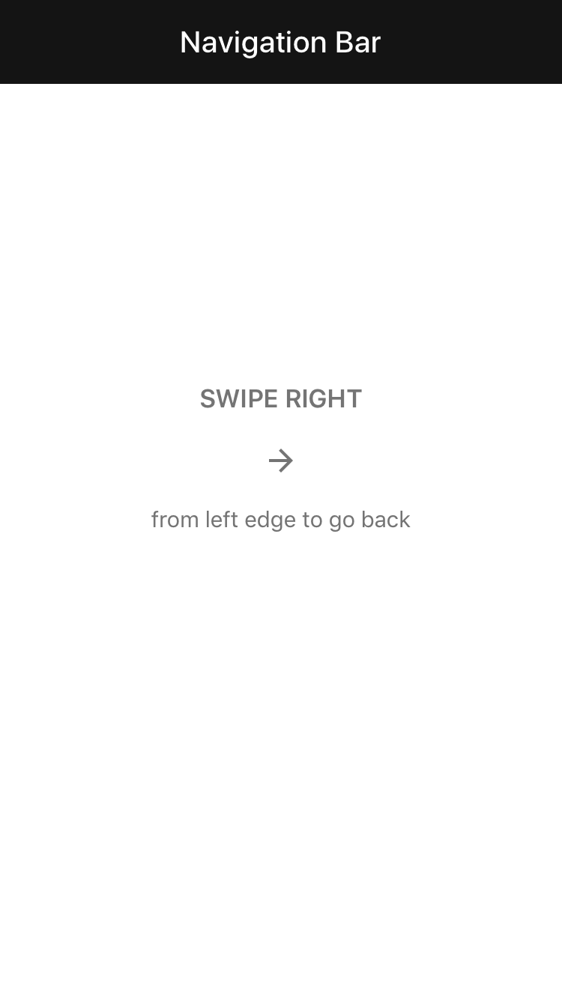

<!--docs:
title: "Navigation bar"
layout: detail
section: components
excerpt: "The navigation bar component is a view composed of a left and right Button Bar and either a title label or a custom title view."
iconId: toolbar
path: /catalog/app-bars/navigation-bars/
api_doc_root: true
-->

<!-- This file was auto-generated using ./scripts/generate_readme NavigationBar -->

# Navigation bar

[](https://github.com/material-components/material-components-ios/issues?q=is%3Aopen+is%3Aissue+label%3Atype%3ABug+label%3A%5BNavigationBar%5D)

A navigation bar is a view composed of leading and trailing buttons and either a title label or a
custom title view.

<div class="article__asset article__asset--screenshot">
  
</div>

## Design & API documentation

<ul class="icon-list">
  <li class="icon-list-item icon-list-item--spec"><a href="https://material.io/go/design-app-bar-top">Material Design guidelines: App bars: top</a></li>
  <li class="icon-list-item icon-list-item--link">Class: <a href="https://material.io/components/ios/catalog/app-bars/navigation-bars/api-docs/Classes/MDCNavigationBar.html">MDCNavigationBar</a></li>
  <li class="icon-list-item icon-list-item--link">Class: <a href="https://material.io/components/ios/catalog/app-bars/navigation-bars/api-docs/Classes/MDCNavigationBarTextColorAccessibilityMutator.html">MDCNavigationBarTextColorAccessibilityMutator</a></li>
  <li class="icon-list-item icon-list-item--link">Protocol: <a href="https://material.io/components/ios/catalog/app-bars/navigation-bars/api-docs/Protocols/MDCUINavigationItemObservables.html">MDCUINavigationItemObservables</a></li>
  <li class="icon-list-item icon-list-item--link">Enumeration: <a href="https://material.io/components/ios/catalog/app-bars/navigation-bars/api-docs/Enums.html">Enumerations</a></li>
  <li class="icon-list-item icon-list-item--link">Enumeration: <a href="https://material.io/components/ios/catalog/app-bars/navigation-bars/api-docs/Enums/MDCNavigationBarTitleAlignment.html">MDCNavigationBarTitleAlignment</a></li>
  <li class="icon-list-item icon-list-item--link">Enumeration: <a href="https://material.io/components/ios/catalog/app-bars/navigation-bars/api-docs/Enums/MDCNavigationBarTitleViewLayoutBehavior.html">MDCNavigationBarTitleViewLayoutBehavior</a></li>
</ul>

## Related components

<ul class="icon-list">
  <li class="icon-list-item icon-list-item--link"><a href="../AppBar">App bars: top</a></li>
  <li class="icon-list-item icon-list-item--link"><a href="../BottomAppBar">App bars: bottom</a></li>
</ul>

## Table of contents

- [Overview](#overview)
- [Installation](#installation)
  - [Installation with CocoaPods](#installation-with-cocoapods)
  - [Importing](#importing)
- [Usage](#usage)
  - [Observing UINavigationItem instances](#observing-uinavigationitem-instances)
- [Extensions](#extensions)
# [Color Theming](#color-theming)
# [Typography Theming](#typography-theming)

- - -

## Overview

Navigation bar is a drop-in replacement for UINavigationBar with a few notable exceptions:

- No navigationItem stack. Instances of MDCNavigationBar must be explicitly provided with a back
  button. TODO(featherless): Explain how to create a back button with navigation bar once
  https://github.com/material-components/material-components-ios/issues/340 lands.

The MDCNavigationBar class is a composition of two button bars and a title label or
title view. The left and right Button Bars are provided with the navigation item's corresponding bar
button items.

Read the button bar section on
[UIBarButtonItem properties](../ButtonBar/#uibarbuttonitem-properties) to learn more about
supported UIBarButtonItem properties.

Note: The UIBarButtonItem instances set on MDCNavigationBar cannot be used to specify the popover's
anchor point on UIPopoverPresentationController. The sourceView and sourceRect on
UIPopoverPresentationController should be used instead.
```objc
// Set a view controller to be popped over at the center of a target view.
aViewContoller.popoverPresentationController.sourceView = targetView;
aViewContoller.popoverPresentationController.sourceRect = CGRectMake(CGRectGetMidX(targetView.bounds)),CGRectGetMidY(targetView.bounds), 0, 0);
```

## Installation

<!-- Extracted from docs/../../../docs/component-installation.md -->

### Installation with CocoaPods

Add the following to your `Podfile`:

```bash
pod 'MaterialComponents/NavigationBar'
```
<!--{: .code-renderer.code-renderer--install }-->

Then, run the following command:

```bash
pod install
```

### Importing

To import the component:

<!--<div class="material-code-render" markdown="1">-->
#### Swift
```swift
import MaterialComponents.MaterialNavigationBar
```

#### Objective-C

```objc
#import "MaterialNavigationBar.h"
```
<!--</div>-->


## Usage

<!-- Extracted from docs/observing-navigationitem-instances.md -->

### Observing UINavigationItem instances

MDCNavigationBar can observe changes made to a navigation item property much like how a
UINavigationBar does. This feature is the recommended way to populate the navigation bar's
properties because it allows your view controllers to continue using `navigationItem` as expected,
with a few exceptions outlined below.

> If you intend to use UINavigationItem observation it is recommended that you do not directly set
> the navigation bar properties outlined in `MDCUINavigationItemObservables`. Instead, treat the
> observed `navigationItem` object as the single source of truth for your navigationBar's state.

#### Starting observation

To begin observing a UINavigationItem instance you must call `observeNavigationItem:`.

<!--<div class="material-code-render" markdown="1">-->
#### Swift
```swift
navigationBar.observe(navigationItem)
```

#### Objective-C
```objc
[navigationBar observeNavigationItem:self.navigationItem];
```
<!--</div>-->

#### Stopping observation

<!--<div class="material-code-render" markdown="1">-->
#### Swift
```swift
navigationBar.unobserveNavigationItem()
```

#### Objective-C
```objc
[navigationBar unobserveNavigationItem];
```
<!--</div>-->

#### Exceptions

All of the typical properties including UIViewController's `title` property will affect the
navigation bar as you'd expect, with the following exceptions:

- None of the `animated:` method varients are supported because they do not implement KVO events.
  Use of these methods will result in the navigation bar becoming out of sync with the
  navigationItem properties.
- `prompt` is not presently supported. https://github.com/material-components/material-components-ios/issues/230.


## Extensions

<!-- Extracted from docs/color-theming.md -->

# Color Theming

You can theme a navigation bar with your app's color scheme using the ColorThemer extension.

You must first add the Color Themer extension to your project:

```bash
pod 'MaterialComponents/NavigationBar+ColorThemer'
```

<!--<div class="material-code-render" markdown="1">-->
#### Swift
```swift
// Step 1: Import the ColorThemer extension
import MaterialComponents.MaterialNavigationBar_ColorThemer

// Step 2: Create or get a color scheme
let colorScheme = MDCSemanticColorScheme()

// Step 3: Apply the color scheme to your component
MDCNavigationBarColorThemer.applySemanticColorScheme(colorScheme, to: component)
```

#### Objective-C

```objc
// Step 1: Import the ColorThemer extension
#import "MaterialNavigationBar+ColorThemer.h"

// Step 2: Create or get a color scheme
id<MDCColorScheming> colorScheme = [[MDCSemanticColorScheme alloc] initWithDefaults:MDCColorSchemeDefaultsMaterial201804];

// Step 3: Apply the color scheme to your component
[MDCNavigationBarColorThemer applySemanticColorScheme:colorScheme
     toNavigationBar:component];
```
<!--</div>-->

<!-- Extracted from docs/typography-theming.md -->

# Typography Theming

You can theme a navigation bar with your app's typography scheme using the TypographyThemer extension.

You must first add the Typography Themer extension to your project:

```bash
pod 'MaterialComponents/NavigationBar+TypographyThemer'
```

<!--<div class="material-code-render" markdown="1">-->
#### Swift
```swift
// Step 1: Import the TypographyThemer extension
import MaterialComponents.MaterialNavigationBar_TypographyThemer

// Step 2: Create or get a typography scheme
let typographyScheme = MDCTypographyScheme()

// Step 3: Apply the typography scheme to your component
MDCNavigationBarTypographyThemer.applyTypographyScheme(typographyScheme, to: component)
```

#### Objective-C

```objc
// Step 1: Import the TypographyThemer extension
#import "MaterialNavigationBar+TypographyThemer.h"

// Step 2: Create or get a typography scheme
id<MDCTypographyScheming> typographyScheme = [[MDCTypographyScheme alloc] init];

// Step 3: Apply the typography scheme to your component
[MDCNavigationBarTypographyThemer applyTypographyScheme:colorScheme
     toNavigationBar:component];
```
<!--</div>-->

