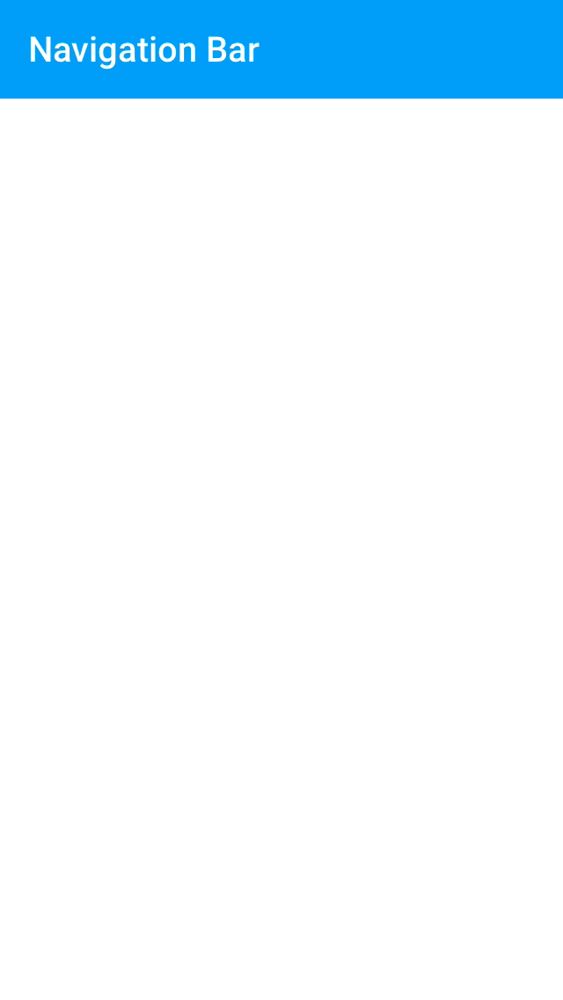

# Navigation Bar

  <video src="docs/assets/nav_bar.mp4" autoplay loop></video>
  

The Navigation Bar component is a view composed of a left and right Button Bar and either a title
label or a custom title view.
<!--{: .intro }-->

### Material Design Specifications

<ul class="icon-list">
  <li class="icon-link"><a href="http://www.google.com/design/spec/layout/structure.html">Layout Structure</a></li>
</ul>

### API Documentation

<ul class="icon-list">
  <li class="icon-link"><a href="apidocs/Classes/MDCNavigationBar.html">MDCNavigationBar</a></li>
  <li class="icon-link"><a href="apidocs/Protocols/MDCUINavigationItemObservables.html">MDCUINavigationItemObservables</a></li>
</ul>

- - -

## Installation

### Requirements

- Xcode 7.0 or higher.
- iOS SDK version 7.0 or higher.

### Installation with CocoaPods

To add this component to your Xcode project using CocoaPods, add the following to your `Podfile`:

~~~ bash
pod 'MaterialComponents/NavigationBar'
~~~

Then, run the following command:

~~~ bash
pod install
~~~

- - -

## Overview

Navigation Bar is a drop-in replacement for UINavigationBar with a few notable exceptions:

- No navigationItem stack. Instances of MDCNavigationBar must be explicitly provided with a back
  button. TODO(featherless): Explain how to create a back button with Navigation Bar once
  https://github.com/google/material-components-ios/issues/340 lands.

The MDCNavigationBar class is a composition of two [Button Bars](../ButtonBar) and a title label or
title view. The left and right Button Bars are provided with the navigation item's corresponding bar
button items.

Read the Button Bar section on
[UIBarButtonItem properties](../ButtonBar/#uibarbuttonitem-properties) to learn more about supported
UIBarButtonItem properties.

- - -

## Usage

### Importing

Before using Navigation Bar, you'll need to import it:

<!--
-->
#### Objective-C

~~~ objc
#import "MaterialNavgiationBar.h"
~~~

#### Swift
~~~ swift
import MaterialComponents
~~~
<!--
-->

### Observing UINavigationItem instances

MDCNavigationBar can observe changes made to a navigation item property much like how a
UINavigationBar does. This feature is the recommended way to populate the navigation bar's
properties because it allows your view controllers to continue using `navigationItem` as expected,
with a few exceptions outlined below.

> If you intend to use UINavigationItem observation it is recommended that you do not directly set
> the navigation bar properties outlined in `MDCUINavigationItemObservables`. Instead, treat the
> observed `navigationItem` object as the single source of truth for your navigationBar's state.

#### Starting observation

To begin observing a UINavigationItem instance you must call `observeNavigationItem:`.

<!--
-->
#### Objective-C
~~~ objc
[navigationBar observeNavigationItem:viewController.navigationItem];
~~~

#### Swift
~~~ swift
navigationBar.observeNavigationItem(viewController.navigationItem)
~~~
<!--
-->

#### Stopping observation

<!--
-->
#### Objective-C
~~~ objc
[navigationBar unobserveNavigationItem];
~~~

#### Swift
~~~ swift
navigationBar.unobserveNavigationItem()
~~~
<!--
-->

#### Exceptions

All of the typical properties including UIViewController's `title` property will affect the
Navigation Bar as you'd expect, with the following exceptions:

- None of the `animated:` method varients are supported because they do not implement KVO events.
  Use of these methods will result in the Navigation Bar becoming out of sync with the
  navigationItem properties.
- `prompt` is not presently supported. https://github.com/google/material-components-ios/issues/230.

TODO(featherless): Describe the most common integration steps.
