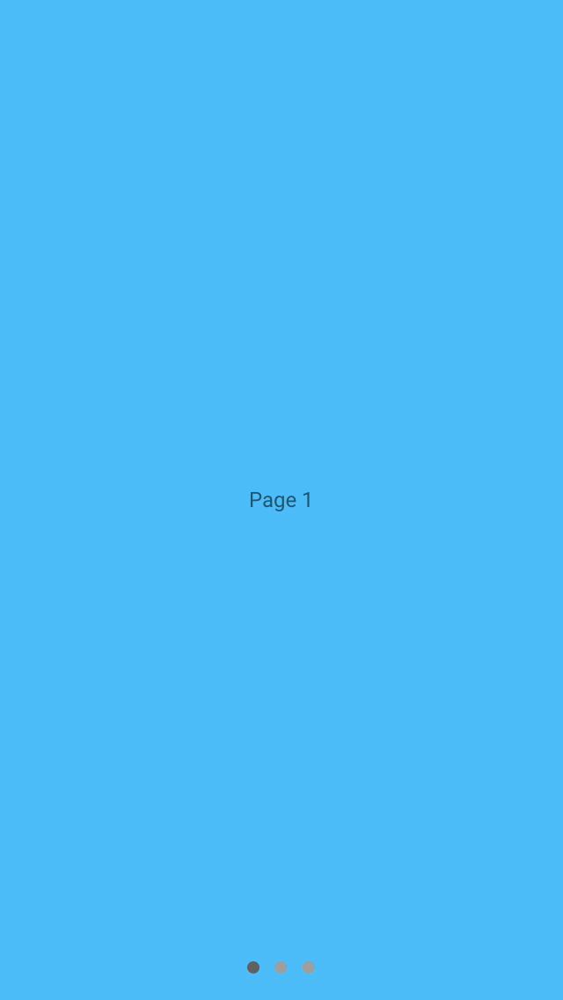

# Page Control

<!---->

<!--
<video src="docs/assets/page_control.mp4" autoplay loop></video>
-->

This control is designed to be a drop-in replacement for `UIPageControl`, with a user experience
influenced by material design specifications for animation and layout. The API methods are the
same as a `UIPageControl`, with the addition of a few key methods required to achieve the
desired animation of the control.
<!--{: .intro }-->

### API Documentation

<ul class="icon-list">
  <li class="icon-link"><a href="https://material-ext.appspot.com/mdc-ios-preview/components/PageControl/apidocs/Classes/MDCPageControl.html">MDCPageControl</a></li>
</ul>

- - -

## Installation

### Requirements

- Xcode 7.0 or higher
- iOS SDK version 7.0 or higher

### Installation with CocoaPods

To add this component to your Xcode project using CocoaPods, add the following to your `Podfile`:

~~~ bash
pod 'MaterialComponents/PageControl'
~~~

Then, run the following command:

~~~ bash
pod install
~~~

- - -

## Differences From UIPageControl

This page control provides an animation effect that keeps a page indicator in sync with the
scrolling of a designated scroll view. This is in contrast to a native `UIPageControl`, which
shows the current page indicator without any animated transitions between changes.

As the user scrolls, a track will be drawn with animation from the current indicator position
towards the next indicator position that is being scrolled towards. The current indicator will
float along this track and position itself based on the percent scrolled between the pages.
When the scroll view finishes scrolling, the track will disappear with animation towards the
final position of the new page.

#### Example Screenshots

<!--{: .ios-screenshot .right }-->
Page control showing current page in resting state.
<!--{: .clear-after }-->

<!--{: .ios-screenshot .right }-->
Page control showing animated track with current page indicator positioned along the track.
<!--{: .clear-after }-->

<!--{: .ios-screenshot .right }-->
Page control showing new current page.
<!--{: .clear-after }-->

- - -

## Usage

### Importing

Before using Page Control, you'll need to import it:

<!--
-->
#### Objective-C

~~~ objc
#import "MaterialPageControl.h"
~~~

#### Swift
~~~ swift
import MaterialComponents.MaterialPageControl
~~~
<!--
-->

Integrating the page control requires two steps. First, add a page control with companion scroll
view, and second, forward the scroll view delegate methods to the page control.

### Step 1: Add the page control to a view

Add the page control to a view and set the desired page control properties. This step is done
similarly to a native `UIPageControl`. In addition, provide a tap gesture handler for the control to
to fire off the `UIControlEventValueChanged` events in which the scroll view would typically be
notified of page changes.

<!--
-->
#### Objective-C

~~~ objc
@interface ViewController () <UIScrollViewDelegate>
@end

@implementation ViewController {
  UIScrollView *_scrollView;
  MDCPageControl *_pageControl;
}

- (void)viewDidLoad {
  [super viewDidLoad];

  // Scroll view configuration.
  _scrollView = [[UIScrollView alloc] initWithFrame:self.view.bounds];
  _scrollView.delegate = self;
  ...
  [self.view addSubview:_scrollView];

  // Page control configuration.
  _pageControl = [[MDCPageControl alloc] initWithFrame:myFrame];
  _pageControl.numberOfPages = 3;  // Should match page count of scrollView.
  [_pageControl addTarget:self
                   action:@selector(didChangePage:)
         forControlEvents:UIControlEventValueChanged];
  [self.view addSubview:_pageControl];
}

- (void)didChangePage:(MDCPageControl *)sender {
  // Transition scroll view to new page.
  CGPoint offset = _scrollView.contentOffset;
  offset.x = sender.currentPage * _scrollView.bounds.size.width;
  [_scrollView setContentOffset:offset animated:YES];
}
~~~

#### Swift

~~~ swift
class PageControlSwiftExampleViewController: UIViewController, UIScrollViewDelegate {

  let pageControl = MDCPageControl()
  let scrollView = UIScrollView()
  let pages = NSMutableArray()

  override func viewDidLoad() {
    super.viewDidLoad()

    scrollView.delegate = self
    view.addSubview(scrollView)

    pageControl.numberOfPages = pageColors.count

    let pageControlSize = pageControl.sizeThatFits(view.bounds.size)
    pageControl.frame = CGRectMake(0, view.bounds.height - pageControlSize.height, view.bounds.width, pageControlSize.height);
    pageControl.addTarget(self, action: "didChangePage:", forControlEvents: .ValueChanged)
    pageControl.autoresizingMask = [.FlexibleTopMargin, .FlexibleWidth];
    view.addSubview(pageControl)
  }

  func didChangePage(sender: MDCPageControl){
    var offset = scrollView.contentOffset
    offset.x = CGFloat(sender.currentPage) * scrollView.bounds.size.width;
    scrollView.setContentOffset(offset, animated: true)
  }

~~~
<!--
-->

### Step 2: Forwarding the required scroll view delegate methods

This page control is designed to be used in conjunction with a scroll view. To achieve the desired
page control animation effects, there are three scroll view delegate methods that must be forwarded
to the page control (`-scrollViewDidScroll`, `-scrollViewDidEndDecelerating`, and
`-scrollViewDidEndScrollingAnimation`). This allows the page control to keep in sync with the
scrolling movement of the designated scroll view.

<!--
-->
#### Objective-C

~~~ objc
- (void)scrollViewDidScroll:(UIScrollView *)scrollView {
  [_pageControl scrollViewDidScroll:scrollView];
}

- (void)scrollViewDidEndDecelerating:(UIScrollView *)scrollView {
  [_pageControl scrollViewDidEndDecelerating:scrollView];
}

- (void)scrollViewDidEndScrollingAnimation:(UIScrollView *)scrollView {
  [_pageControl scrollViewDidEndScrollingAnimation:scrollView];
}
~~~

#### Swift

~~~ swift
func scrollViewDidScroll(scrollView: UIScrollView) {
  pageControl.scrollViewDidScroll(scrollView)
}

func scrollViewDidEndDecelerating(scrollView: UIScrollView) {
  pageControl.scrollViewDidEndDecelerating(scrollView)
}

func scrollViewDidEndScrollingAnimation(scrollView: UIScrollView) {
  pageControl.scrollViewDidEndScrollingAnimation(scrollView)
}
~~~

<!--
-->
